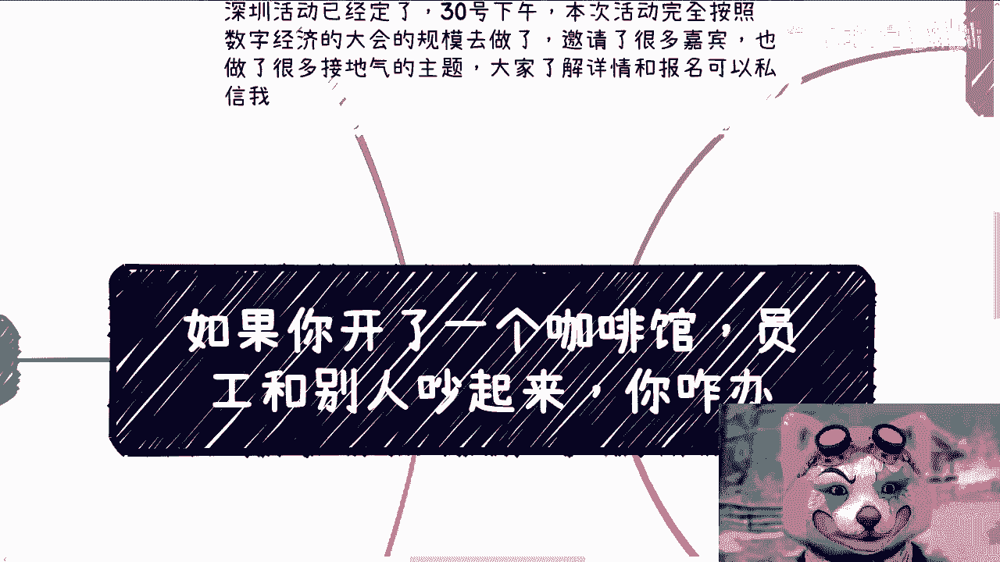
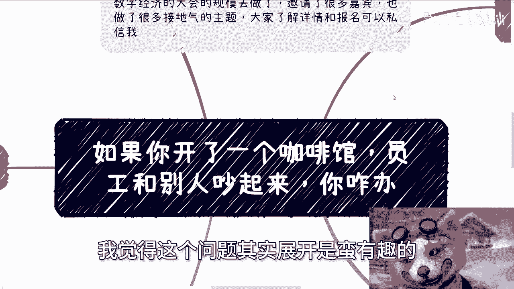
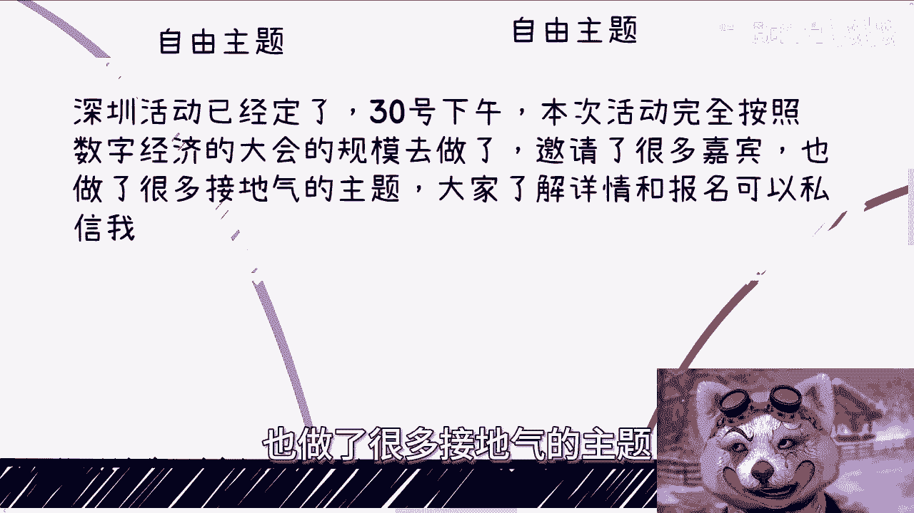
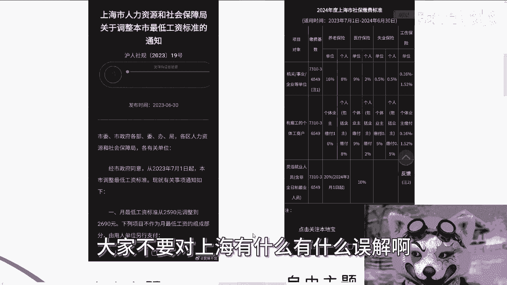
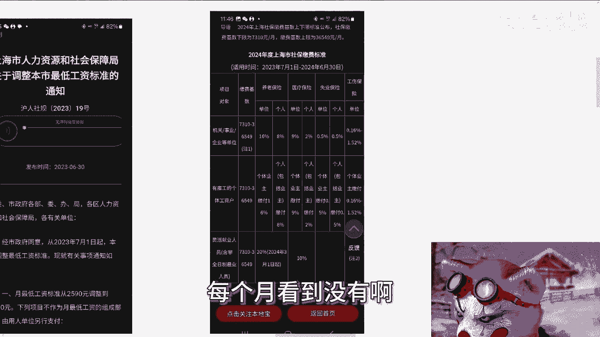
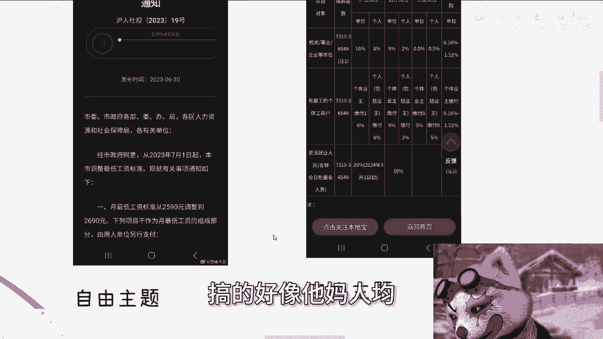
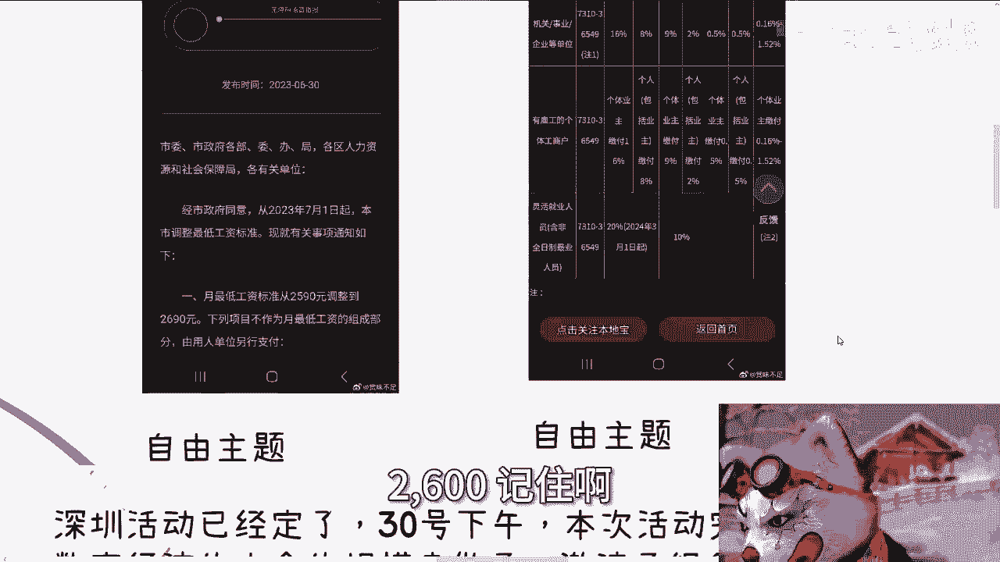
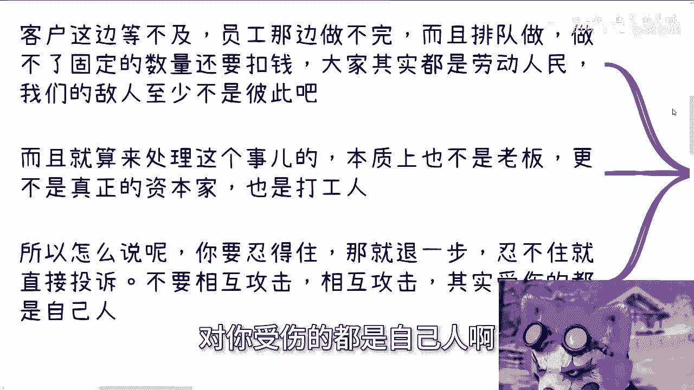
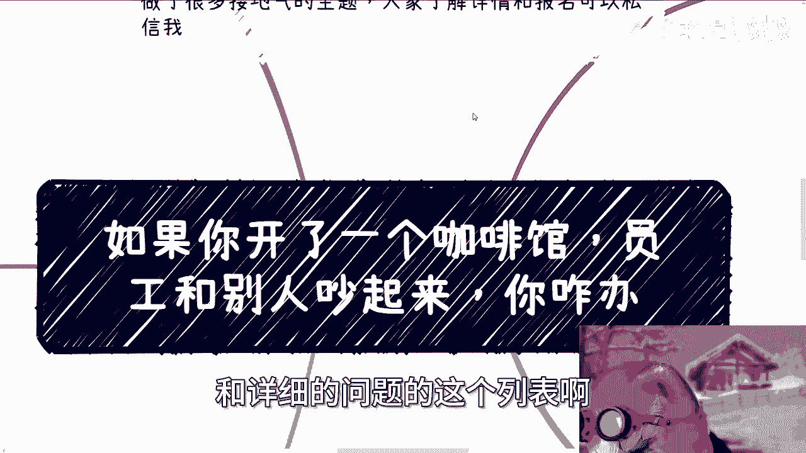

# 如果你开咖啡馆-员工和别人吵起来-你咋办---P1---赏味不足---BV1SM4m1m7DS_no

在本节课中，我们将探讨一个具体的管理场景：如果你经营的咖啡馆（或连锁品牌）发生员工与顾客争吵的事件，作为老板或管理者应如何处理。我们将深入分析其背后的管理本质、资本逻辑，并拆解几种常见的应对思路。

---

## 概述：事件的本质与背景

今天我们讨论的主题，与近期在上海发生的事件相关。其本质是，作为老板、资本家或管理者，应如何看待和处理此类员工与外部人员的冲突问题。这个问题的展开分析颇具意义。

深圳的活动已确定在30号下午举行。本次活动完全按照数字经济大会的规模筹备，邀请了许多嘉宾并设置了接地气的主题。

了解详情和报名请私信。由于今天谈及打工相关话题，首先澄清两个数据，以免产生误解。

以下是上海市的两项关键劳动数据：

*   **2023年最低工资标准**：根据上海市人力资源和社会保障局2023年6月30日发布的数据，自2023年7月起，上海市月最低工资标准为 **2690元**。制定最低标准意味着确实有人以此水平获得报酬。
*   **2024年社保缴费基数下限**：2024年上海市社保缴费的基数下限为 **7310元/月**。

请勿对上海的收入水平产生不切实际的误解。最低工资标准是2600元，请记住这个数字。

---

## 核心问题拆解与应对分析

关于此次咖啡馆事件，建议先观看完整视频以了解全貌。我的观点是双方各有责任。我们基于此事件，探讨几个核心点。

以下是围绕此事件的几种常见观点及分析：

1.  **作为老板应如何处理？**
2.  **员工不行就换掉**：这是当前许多人的想法，认为劳动力充足，可随时更换。
3.  **应实行按劳分配**：有人认为，如果采用底薪加按制作咖啡数量计算的劳动所得来分配利润，员工境遇会改善。
4.  **消费者的“上帝”心态**：部分消费者认为自身应享有至高无上的权利。

首先明确一个大前提：无论是消费者还是店员，大家都是普通百姓和劳动者，没有高低贵贱之分。互相轻视并无必要。

接下来，我将依据个人认知对以上几点进行分析。

---

### 第一点：按劳分配的不可行性 🔄

上一节我们列出了几种观点，本节中我们首先来分析最不可能实现的“按劳分配”。

从岗位设置看，底薪加提成通常只适用于销售岗位。但我们必须明白，理论与实践存在差距。

以销售为例：
*   **理论模型**：底薪5000元，每单提成10%。
*   **实践情况**：5000元需扣税；10%的提成可能因“客户是谁开发的”、“你在交易中具体负责哪些环节”等理由被削减。企业管理者或资本家会以各种理由（例如，后续的售前、技术支持、执行工作不是你完成的）告知你无法获得全额提成，最终你可能只拿到2%，并且会被拖延支付。

因此，咖啡师这类岗位永远不可能实现真正的按劳分配。原因在于，资本家与人类社会目前并未走上这条道路。

从资本家角度看，**分润**是合作伙伴或合伙人之间的概念，永远不会应用于员工。员工的本质是：**我给你一笔钱，你为我干活**。这就是根本差异。这也解释了为何我一直强调，打工是没有前途的，双方地位并不对等。

---

### 第二点：更换员工的成本与风险 📈

分析了分配制度后，我们来看看“换人”这个看似简单的解决方案。这通常是一种未经实践、轻描淡写的说法。

当前求职者众多是事实。但更换员工的成本极高：
1.  **技能与信任成本**：原有员工技能熟练，其品性你已大致了解，双方存在基于劳动关系的雇佣平衡。新员工需要重新培训技能，并需观察其品性。
2.  **内部风险**：新员工可能带来内部八卦、造谣，影响团队稳定性。
3.  **管理成本**：对资本家而言，员工本质上是“工具”。你需要的是一个省心的工具。更换工具本身并不能降低管理成本，能让管理者不更加操心已是万幸。

因此，更换员工的隐性成本其实非常高昂。

---

### 第三点：老板的冲突处理逻辑 💼

讨论了内部管理思路后，本节我们聚焦于事件本身：老板应如何处理此类冲突？

形式上，新闻报道中的处理方式可以多种多样。但作为一个老板，核心原则是：**能用钱解决的问题，就用钱解决，不要浪费时间**。这呼应了我开头“各打五十大板”的观点。

具体操作包含对内对外两方面：
*   **对内（对员工）**：沟通时表示“对这类顾客以后态度要好点”，同时暗示“店里有录像，如果确实是顾客不对，后续从奖金里补偿一点”。潜台词是：**千万别动手，千万别报警**。
*   **对外（对顾客）**：表达“管理不善”、“员工已开除”（顾客无从核实），并赠送积分、优惠券以平息事态。

为何如此处理？因为老板、管理者和资本家的时间非常宝贵。处理此类事件本身（即使是其他打工人员来处理）就是成本。如果每家门店天天处理这种纠纷，还如何运营、赚钱和发展？

---

### 第四点：认清共同的“敌人” 👥

基于以上分析，我们可以得出一个更宏观的结论。所以我一直强调，要明白我们的“敌人”是谁。

在这个场景中：顾客等得焦急，员工做不完且完不成固定数量还要被扣钱。**大家其实都是劳动人民**。我们的“敌人”至少不是彼此。

更进一步，最终来处理此事的人，往往也不是真正的老板或资本家，而是另一名“打工人”。既然如此，又何必相互攻击？

如果你是顾客，能忍则退一步；不能忍就直接投诉。无论是言语攻击还是肢体冲突，最终受伤的都是“自己人”。格局在于理解：大家其实都是打工人，虽有不愉快，但并非敌人。

我刚毕业时曾做过超市试吃员，要求两天煮掉20包水饺，否则扣钱。过程中遭遇过各种情况。这让我明白，接触普罗大众时会遇到许多恶意，但必须告诉自己：大家是自己人，我们需要这样的格局。

---

## 总结与活动预告 📝

本节课中，我们一起学习了如何从管理者视角剖析员工冲突事件：
1.  我们探讨了“按劳分配”在雇佣关系中的不现实性。
2.  我们分析了“更换员工”背后隐藏的高昂成本与风险。
3.  我们揭示了老板处理此类冲突的核心逻辑：**效率至上，金钱换时间**，对内对外平衡处理。
4.  我们最终升华到认清共同处境的观点：劳动者之间不应互为“敌人”，保持格局才能避免无谓的内耗。

深圳活动报名持续进行。如果你在职业规划、商业规划、股权期权、合同、项目计划书等方面需要建议，或希望获得更贴近地区与当下经济发展的规划，请整理好个人背景资料与具体问题列表，以便进行后续咨询。

---