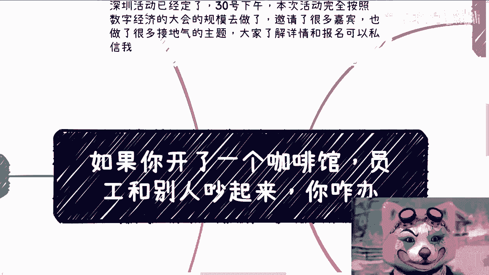
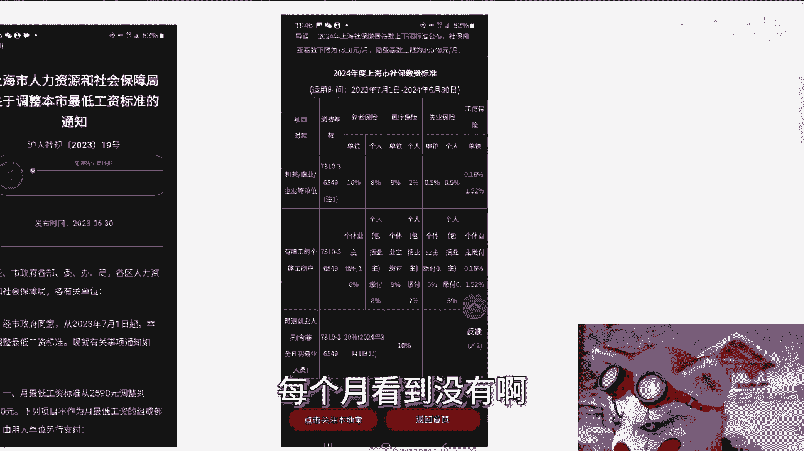
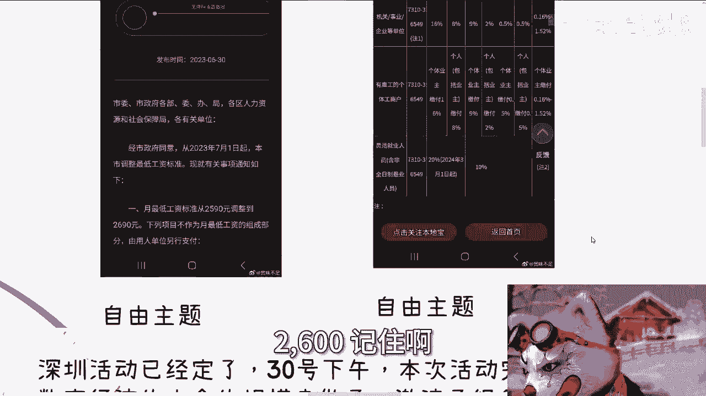
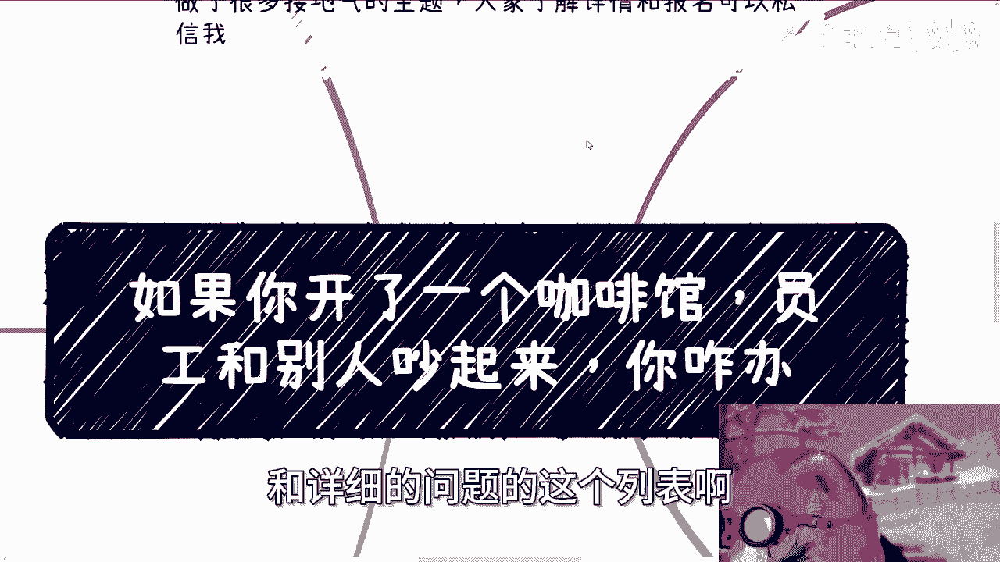

# 如果你开咖啡馆，员工和别人吵起来，你咋办 - P1 - 赏味不足 - BV1SM4m1m7DS

好今天我们来讲的这个主题呢，跟昨天上海这边发生的事还是很有关系的对吧，就我意思说我说如果你开了一个咖啡馆啊，或者你开了一个品牌的啊，连锁咖啡馆啊，如果员工跟别人吵起来，你怎么办。

那这个东西的本质是什么呢，本质就是如，就是说你如果作为一个老板或者一个资本家，或者一个管理者啊，你应该怎么看待这个问题啊，我觉得这个问题其实展开是蛮有趣的啊。

额首先是这样子的啊，就是深圳活动已经定了好吧，30号下午啊，然后本次活动完全按照，数字经济大会的这个规模去做了，然后邀请了很多嘉宾啊，也做了很多接地气的主题好吧。

然后大家了解详情和报名，你们可以私信我啊，然后呢，首先因为今天说到这个打工的这个事情嘛，所以有两个啊，我先给你们看一下啊，以免大家有什么误解啊，首先2023年6月30号啊，上海市人力社会资源保障部啊。

然后给出来的，上海市最低的这个工资标准是多少，是2690块钱啊，2690块钱，也就是两2023年的7月份啊，出的那么最低标准意味着什么，最低标准就意味着有人拿这个钱，所以他会定制最低标准啊。

否则定这个东西就没有意义啊，不要大家不要对上海有什么有什么误解啊。

那第二点啊，2024年上海交这个社保啊，缴费基本上的啊，这个基数上的下限公布为多少，是七千三百十块钱啊，每个月看到没有啊。

你们不要对上海就感感觉有什么有什么误解啊，啊搞得好像他妈人均他妈的什么56万啊。

搞的什么东西哎，最低标准2600啊，2600，记住啊。

好然后呢，第一啊好多人说了这么几个点啊，就关于这个咖啡馆啊，我们先不说这个这次这个事，这个次这个事呢你们要去了解呢，你们就去看完整的视频呃，看完呢反正我的观点是什么，就各打50大板啊。

你说有问题肯定有问题的，各有各的问题啊，那我们就就这个事情来讲啊，我们来说几个点，第一呢就是说如果你是老板，你会怎么处理这个事，第二呢就是说有的人跟我说，他说员工不行，让他滚啊，就是就是换再换。

就是啊人反正这么多啊，那么这个也是现在很多人的这个想法啊，然后第三遍，第三点呢就有的人跟我说啊，他说还是没有按劳分配啊，如果能够按照底薪加劳动所得额，也就是说做多少咖啡来分配利润的话。

那么这些人也会好过一点啊，那还有一点啊，我在这地方没写出来，就还有一点呢，就是说有些人就觉得就说我是我是消费者啊，我是上帝啊，我就应该怎么样怎么样怎么样啊，那首先我先说一个大前提啊。

就是不管你是消费者还是人家是这个呃，就是店里的这个员工啊，呃大家都是老百姓，大家也都是劳动人民啊，没有孰高孰低啊，不要搞得你是消费者，就只那个趾高气昂啊，或者怎么样，我觉得没什么必要啊。

这这种他妈就是啊，就这种就是说明明大家其实都是一样的，非要还要还要就看不起人家，那我觉得没什么意思啊，那么就刚刚那几个点呢，我按照我的认知来跟大家分析分析啊，首先第一啊我们先说说最不可能的就按劳分配。

因为从岗位上面来讲，说到底底薪加提成啊，很多人可能想到的只有一个就是销售，那么我们要明白一点啊，很多东西理论是理论，实践是实践，也就是说拿销售来讲啊，你比打个比方，比如说你底薪是5000块钱啊。

提成的话，每一单是10%，这叫什么，这叫理论，但实践是什么，实践就是事实上5000块钱是要给你扣掉税的，然后呢10%这件事情呢，可能要看你真实情况，比如说这个单子到底谁拉的。

然后呢你在这个里面到底做了什么，那很有可能这个单子的确是你拉的，但是后面呢售前啊，技术支持啊，执行啊等等都不是你，那么企企业管理者，资本家会用各种理由啊来跟你说啊，这个你拿不到10%啊，因为你在里面啊。

这个没干那个没干啊，那么最后你可能只能拿到2%，而且这2%还是给你拖的啊，那么当然这个也就是销售咖啡师这种东西，永远不可能按劳分配，为什么，因为资本家跟人类社会根本走不上这条道路啊，哦你就一个工作。

我就是给你一笔钱，你就给我干活，那如果按照你这个说法，那我一个文员啊，老板还要按照我每天处理文件数量给我提成啊，我比如说我我今天是是给人家进进这种水产的，那那你给我今天他妈的进多少鱼，给我提成，对不对。

就你告诉我哪个资本家会怎么做啊，然后从资本家角度来讲，分润是什么概念啊，分润就是合作伙伴哦，就是合伙人永远不可能放在员工身上，员工身上是不可能分润的，因为员工是什么概念，员工就是我给你一笔钱。

你给我干活，你给我往死里干，你爱干不干对吧，这就是本质上的差别，这就是我一直跟你们说的，我说我们我跟这跟你们签什么合同，什么关系都没有关系啊，所以我才跟你们讲，就说打工是没有前途的。

你你你永远是我为鱼肉，他为刀组对吧，那那你说什么东西呢啊，然后第三再来说说换人这个事啊，我跟你讲这又是个怎么说呢，就是一个叫什么，就是呃没有做过啊，但是呢就是轻飘飘的话啊，就就你这么说，你说对。

现在人是多啊，现在这外面的他妈的要来那个面试，要来工作人排队，是不是事实是，但问题是什么，换人的成本太高了，你想想看一个人你用了一段时间，他技能熟练，人品大概什么样子，你也清楚，相互的信任。

虽说可能不是太强，大家就是说劳务关系，劳动关系，劳动合同来做约束，但至少大家能保持一个雇佣的平衡吧，但你换个人要命来哎，技能又要培训人，又要重新观察这个人是不是人品好啊，是不是会给你别的员工。

带来一些这个各种八卦啊，是不是内部会来造谣啊，影响你整个稳定性啊，你都不知道这些，我这那那么那么你换一个人其实风险更高对吧，而且另外一点啊，换人是换人，但是你真的做老板了。

你就会明白工具怎么换都是一样的，就是我不是说这些人不好，就是咱客观的说啊，你作为一个资本家，你就会明白工具对你来讲都是一样的，是男是女，好看不好看，能用就行啊，你需要一个省心的工具。

当然并不会因为你换了工具而更省心你，你你你去换了，你就知道就是你今天换了一个打工人，他能够不让你更操心，你已经他妈磕头了，你懂吗，所以说其实换人的成本其实是很高的啊，那么第四有我们说的，你说怎么处理。

我跟你这么讲，当然形式上表面上就是我们说呃，新闻报道上面他怎么处理都行啊，但是你作为一个老板，核心是什么，就是要用钱来解决的问题，就用钱来解决，不要浪费时间啊，就如我一开始说的，各打50大板。

什么意思啊，意思就是说我和员工说啊，对这种顾客以后态度要好一点啊，他就是，但是呢还是客户啊，所以说店里呢都有录像啊，你有啥不开心的，或者说就是的确是客户是的话，那回头我们在奖金里面补你一点对吧。

但是像潜台词的意思就是什么呢，就是千万别动手，千万别报警，哎不要搞这些，有的没的嗯对吧，而且另外一方面当然对客户来讲，那说的就可以更多了，就说哎我们管理不善对吧，这妈这个员工是对吧嘛，已经开除了啊。

反正开不开除客户也不知道对吧啊，然后你客户消消气对吧，送点积分和优惠券也就过去了，对不对，你就各大50大板嘛，那那那还想怎么地呢对吧，为什么，因为老板和管理和，和那种资本家的时间是很宝贵的。

你今天这一个人出，就是你今天哪怕是一个打工人来处理这个事情，你也是一个成本在这里面啊，明天各个门店都这样子，这么垫，一天天处理啊，事儿还做不做钱还赚不赚钱，还发不发展，就每天都能处理这些破事儿，对不对。

这才是差别啊啊然后第五，所以啊我才一直跟你们讲啊，我们要明白我们的敌人是谁，就讲到今天都不明白哦，就是客户这边等不及，员工那边做不完，而且排队做，做不了固定的数量，还要扣钱，大家其实都是劳动人民。

对不对啊，我们的敌人至少不是我们自己吧，是谁我先不说，那至少不是彼此吧对吧，而且就算来处理这个事，本质上也不是老板处理，更不是真正的资本家，也是打工人来处理，那何苦呢对吧，所以你其实在我看来。

我觉得你如果是个客户，你能忍得了，那就退一步忍不了，你就直接投诉，你就不要相互攻击对吧，不要去，就是说真的什么物理攻击你，你你无论是就是说言语上的攻击，还是说真的出手打人，对你受伤的都是自己人啊。

何必呢，对不对，我就这么跟你们讲，我我刚毕业的时候，我大概有大半年的时间找不到工作，我去给那个超市里面做过那种试吃员对吧，我记得很清楚，他要求的是我两天要煮掉20包，就那种水饺对吧，煮不掉，煮不掉。

我就扣我钱对吧，然后这过程当中什么人都有啊，真的什么人都有啊，就有时候你烧的不好吃的啊，有时候你烧的生的啊，有时候你什么服务态度不好的，反正什么人都有啊，那你能怎么办呢，对不对。

就是就是你一旦接触了整个中，就是整个的这个普罗大众老百姓，你就会明白恶意是非常多的，而且是非常多的，但你能怎么办呢，对吧，你要不停的告诉你自己，就是大家其实都是打工人，大家其实都是自己人对吧，虽然很多。

但是我们他不是我们的敌人，我们也不是他的敌人，你得有这个格局啊，对不对啊，好吧行啊，那就这么着吧，然后那个呃30号好吧，这个活动报名继续报，然后呃职业规划，商业规划，股权期权分红分润啊，合同啊。

然后包括什么项目计划书，白皮书啊，包括就是呃你们手上有什么牌，你们没有什么牌啊，你们希望能够跟我的沟通啊，能够给你们带来一些更接近于这个地区，或者接近于当下经济发展的，一些规划跟建议的话。

那么你们就整理好个人的背景跟资料啊，然后呃和问和详细的问题的这个列表啊。

然后我们再来呃走咨询。