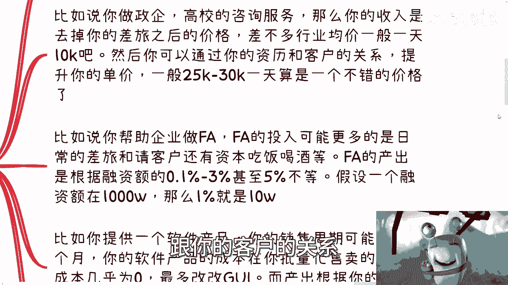
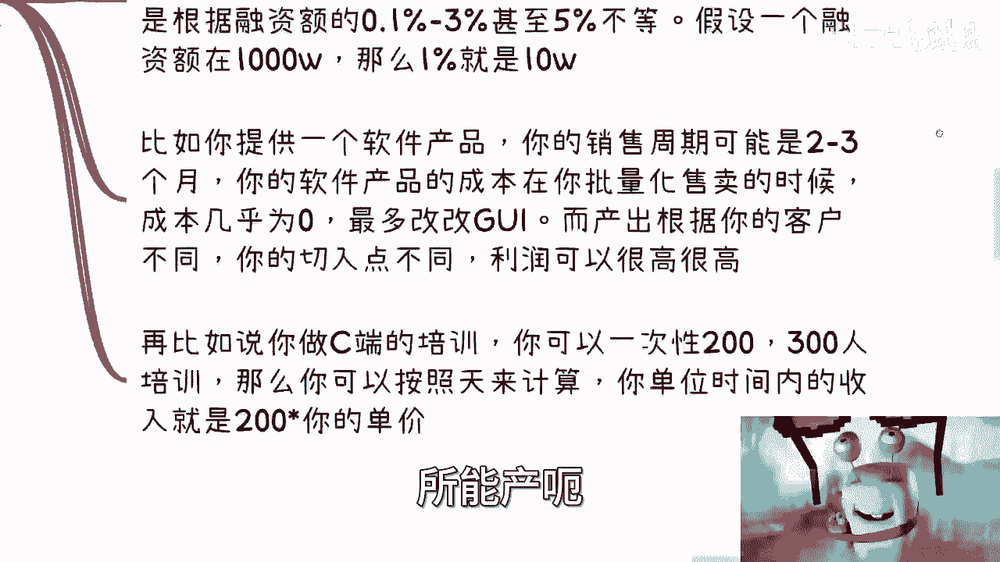

# 课程名称：商业核心思维 - 第1课：无限提升单位时间赚钱性价比 💰

在本节课中，我们将要学习商业思维中最核心的一个概念：**单位时间赚钱性价比**。我们将深入探讨其定义、重要性、计算方法以及如何通过具体策略无限提升它。

---

上一期我们讨论了赚钱的基本概念。本节中，我们来看看如何衡量和提升赚钱的效率，即“单位时间赚钱性价比”。

**单位时间内赚到的钱**，是衡量你商业价值和社会地位的核心指标。它侧面反映了你的认知水平和资源关系。没有这个基础，其他都无从谈起。

## 1. 什么是单位时间赚钱性价比？ ⏳

单位时间赚钱性价比，指的是在**可量化的一个业务周期内**，你所获得的**利润**。这个周期可以是分钟、小时、天或周。

其核心公式可以表示为：
**单位时间利润 = 单次业务利润 / 完成该业务所需的时间**

这个指标关注的是**利润**，而非流水。我们的核心目标就是**无限提升这个公式的数值**。

## 2. 为何打工难以提升此性价比？ 🚫

以下是打工模式在此框架下的几个根本缺陷：

*   **缺乏掌控力**：打工者对业务和工作没有自主权。
*   **提升速度缓慢**：单位时间收入（如时薪）无法通过自主手段快速提升，通常只能依赖缓慢的年度调薪。
*   **无法批量复制**：个人的时间和精力无法被复制，收入存在明确上限。
*   **抗风险能力弱**：依赖单一雇主，且大部分岗位经验与社会实际商业运作脱节。

因此，打工赚取的主要是辛苦钱，难以实现单位时间赚钱性价比的飞跃。

## 3. 如何计算与举例说明 🧮

理解了概念，我们通过几个例子来看看如何具体计算。

*   **政企咨询服务**：
    *   **投入**：你的时间（如一天）。
    *   **产出**：服务费（例如新人均价1万元/天）。
    *   **提升方法**：通过积累资历、包装自己、维护客户关系来提升客单价（例如可达2.5-3万元/天）。**资历和关系是你可以主动积累和优化的变量**。

*   **财务顾问（FA）服务**：
    *   **投入**：日常差旅、宴请、维护关系的时间与金钱成本。
    *   **产出**：按融资额的一定比例（如1%-5%）抽取佣金。融资1000万，按1%计算即10万元利润。
    *   **核心**：**单位时间（整个服务周期）的最终利润**。

*   **软件产品销售**：
    *   **投入**：初期开发成本。**一旦完成，批量复制的边际成本几乎为零**。
    *   **产出**：销售收入。利润可来自产品售价、政府补贴、配套培训等多个切入点组合。
    *   **优势**：销售周期（如3个月）内的总利润，在成本固定的情况下，销量越大，单位时间利润越高。

*   **C端培训**：
    *   **投入**：嘉宾成本、场地成本、你的时间成本。
    *   **产出**：学员学费总和。
    *   **计算**：单位时间（一天）利润 = （学员人数 × 单价） - 当日总成本。通过扩大招生规模（如从30人到300人）来提升。

## 4. 无限提升性价比的三大路径 🚀

提升单位时间赚钱性价比，本质上离不开以下三种路径：

*   **路径一：提升单个客单价**
    寻找并进入高利润的合规领域。关键在于**抹平信息差**，了解哪些领域存在高利润空间，并建立相应的渠道和关系。

*   **路径二：批量复制与规模化**
    如果你的业务模式可以标准化，那么就可以在单位时间内横向拓展。例如，你的一项业务每小时利润为2000元，若能同时并行处理20项相同业务，那么单位时间利润就变成了4万元。

*   **路径三：进入高利润行业**
    几乎所有行业都存在高利润环节，需要你去发现和切入。这通常不是通过常规打工或简单分销就能接触到的，需要一步步积累和向上突破。

## 5. 关键前提：打破信息差与长期积累 🔑

要实现以上路径，最大的门槛是**信息差**。传统教育与商业认知往往是两条平行线。

打破信息差没有捷径，需要：
1.  **案例积累**：不断实践，积累成功和失败的经验。
2.  **人脉积累**：结识更多合作伙伴，进入不同的圈子。
3.  **机缘与选择**：商业成功需要努力，也需要一定的机遇。同时，选择适合自己的赛道（“高举高打”或“小而美”）至关重要。在每个细分圈层做到头部，本身就是强大的背书。

## 6. 评估业务的两个核心问题 ❓

当你评估任何商业想法时，只需追问两个核心问题：

1.  **投入产出比是否清晰可量化？**
    你的时间、金钱投入与最终利润必须有清晰的估算逻辑。无法量化的业务近似赌博。
2.  **能否线性提升规模？**
    业务是否支持通过增加资源（人力、资金）来成倍地扩大产出？即是否具备**可复制性**。

如果以上两个答案都是否定的，那么该业务可能只适合赚快钱或投机，难以持续发展，也无法支撑你长期的社会地位构建。

---

**本节课总结**：

本节课我们一起学习了商业思维的核心——**单位时间赚钱性价比**。我们明确了它的定义，指出了打工模式的局限性，并通过实例学习了如何计算。更重要的是，我们探讨了提升它的三大路径：**提单价、扩规模、找高利**。所有这一切的基础，在于打破**信息差**，并通过持续的**案例与人脉积累**来实现。最后，我们掌握了用**可量化性**和**可复制性**两个标准来评估任何商业想法的有效性。记住，可持续的商业成功，依赖于你单位时间内创造价值能力的不断提升。