# 如果你要改变，必须做的就是无限提升单位时间内赚钱的性价比 - P1 - 赏味不足 - BV18C4y1j7jY

好大家好，上一期我们讲了赚钱对吧，那这一期呢是核心中的核心呃，单位时间啊，之前也有很多人问我，那我们今天就来好好说一下，这个单位时间的问题啊，首先我先说前两天的那个评论啊，说我前后矛盾呃。

我重新说一下啊，没什么矛不矛盾的啊，我只是把我知道的那些黑的白的告诉大家啊，但并不代表我会去做，或者我认可，因为我认不认可无所谓啊，我只是告诉你们，你们每个人都有你们的选择，大家怎么选都可以对吧。

那退1万步来讲，就算我说不能做，也没人会听啊，对不对，那那这有啥矛盾矛盾的呢，我只是告诉你们我会做什么事情，但是呢这不妨碍我会跟你们讲，世界上有哪些东西，对不对，这是第一点，第二点啊，在我看来。

你可以没有钱，比如说你全部捐了对吧，或者说你就是吃光用光对啊，上海话叫做秋光永光扒光对吧啊，没问题，这个呢是你自己的选择，但你最大的价值点在于，你单位时间内能够赚到多少钱啊，我这么跟你讲。

你一旦进了商业，你一旦要未来拥有社会地位或者政治，甚至政治地位，你的单位时间内赚到的钱，是非常核心的一个一个要素，这也侧面的代表了你的关系和认知，你知道吗，没有这个东西，你就别的就不用想了。

也别再来跟我说什么，哎呀我就我就通过学历对吧，通过留学滚吧啊，没有这种可能性的啊，不是咱都成年人，别这么幼稚啊，第一啊一直说单位时间内赚钱性价比啊。

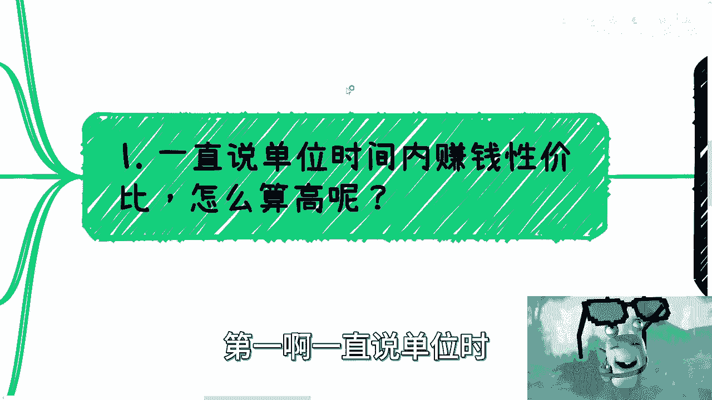

那我们来说一下怎么算高吧，好其实很多人咨询我的时候。

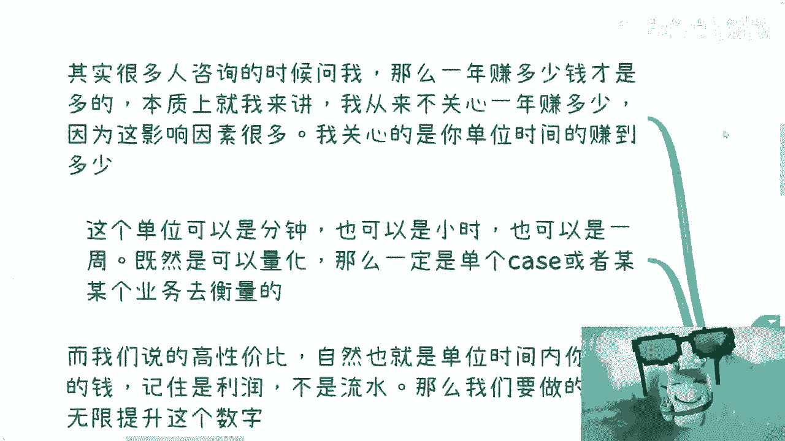

也问过他，说一年赚多少钱才算是多的啊。

本质上呢就我来讲呢，我觉得我不太关心一年赚多少钱，因为这没有意义，为什么，因为你影响一年赚多少钱的因素太多了对吧，你说有可能整个行情好跟整个行情不好，也有可能说这个行业好，这个行业不好对吧，就都有可能。

当然我不是说啊行业好，你就赚到很多很多行业好，行业不好，你就一分钱赚不到，不会的，你单位时间内一定，如果说你单位时间内有能力赚到钱的话，那么我可以告诉你们，就是呃行业好的时候呢，你可能能赚很多。

行业不好呢，你也能赚啊，只不过没有这么多而已啊。

那么这个单位时间呢可以是分钟，也可以是小时，也可以是一周啊，但是这个前提是什么，就是所谓单位时间，就是说它一定是可以量化的啊，那么这个量化一定是你某一个case，或者某一个业务的整个周期时间来衡量的。

对吧啊，那么而我们说所谓高性价比，高性价比是什么意思，就自然就说单位时间内，你能赚到的钱有多少对吧，或者说有多多，那么这个地方呢你要记住这个是利润啊，不是说流水。

那么我们要做的就是无限无限提升这个数字啊，当然很多人说打工也算对吧，那我告诉你，打工本身的属性就已经不在这个范围内了。

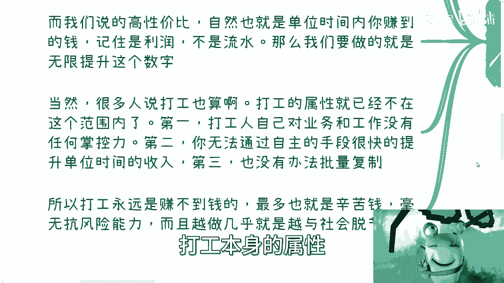

为什么第一打工人自己对业务跟工作，他是没有任何掌控力的啊，第二天让你滚就是滚的啊，第二你无法通过自主的手段，很快的提升单位时间的收入，比如说你现在一个小时收入是500对吧。

那你告诉我你有什么很快的手段没有，你最多也就是一个半年一年啊，去提个薪资，那不好意思，这这种速度你提到什么时候去啊，第三你也没办法批量化的复制，所以说本身打工这件事情就是赚不到钱的啊，最多就是辛苦钱。

毫无抗风险能力，而且越做大部分啊。

我不能一棒子打死啊，但是大部分的岗位，几乎就是越做越与社会脱节的啊。

嗯反正你们就我就这么说吧，但凡有点年纪的人都明白啊。

你作为年轻人，你们要是信就信不信拉，倒反正你们早晚都会信啊，那么为何我们来说第一点啊，那么何为单位时间内赚到的钱啊。

我们来举个例子，比如说你跟我一样啊。

你说你做一些政企高效的咨询服务，那么我们打个比方啊，你的收入是去掉你的差旅货的价格差不多，我觉得行业对于大部分新人来讲啊，他的均价一般在一天10万，一天1万块钱左右左右，上下浮动2000块钱啊。

然后呢你可以通过你的资历跟你的客户的关系。

提升你的单价，所以说你看啊这个地方你的资历跟客户关系，你是可以有自主权的啊。

就是我跟你们说的，你们可以包装啊对吧，你们可以去去去有本事的自己去搞关系对吧，那这个就是看你们本事了，比如这个又不是什么应试教育，你说哦我做一年就提升两也一两千块钱，做了两年提升4000块钱。

如果你有这种思想，那我跟你讲你就别做了好，那么一般来讲呢，2万5到3万块钱一天算是一个不错的价格，而且我觉得大部分可能在呃如果行业好的话，或者在风口上的话，基本上我觉得做个两三年，你也能达到这个价格啊。

那么比如说你帮助企业做FA，那么我告诉你们，FA的这个投入，可能更多的是在日常的差旅以及宴请啊，就所谓请客户或者请资本吃饭喝酒啊，送礼都可以啊，那么FA的产出呢是根据融资额啊，一般我这边只能给一个。

我只能给个通用的数字啊，一般是根据融资额的0。1%到3%，甚至5%不等啊，给踹的，那么假设这个融资额在1000万对吧，那么1%就10万块钱，当然你该交税交税该怎么样怎么样，对不对啊。

那么这个也就是你单位时间内所能产。

所能得到的这个报酬啊，那么比如你提提供一个软件产品啊，你的销售周期可能是两到三个月，也有可能3~4个月，无所谓啊，我们无所谓啊，你的软件产品的成本在你批量化售卖的时候，成本几乎为零了。

因为软件这个东西本身就是一个只有第一次，你要付出成本的东西，后面几乎都是零，只要你不做定制化，而且我觉得大部分聪明人，他不会去做定制化的哦，呃最多就是改改GUI而产出，根据你的客户不同。

你的切入点不同，利润可以很高很高，什么意思呢，就是说你今天可以赚的是采购的价格，你今天也可以赚的是采购，再加上补贴的价格，你也可以这个赚的是采购。

在家补贴，在家培训的价格，这就看你想怎么赚啊，那么再比如说你做C端的培训，你可以一次性两三百人啊对吧，当然你要是现在做，你说二三十人，但是未来你说我有本事了对吧，我翅膀硬了，我一次性两三百人。

那也可以啊，你也可以按天来算啊，你单位时间内收入就是200乘以单价，或300乘以单价，去掉你的。

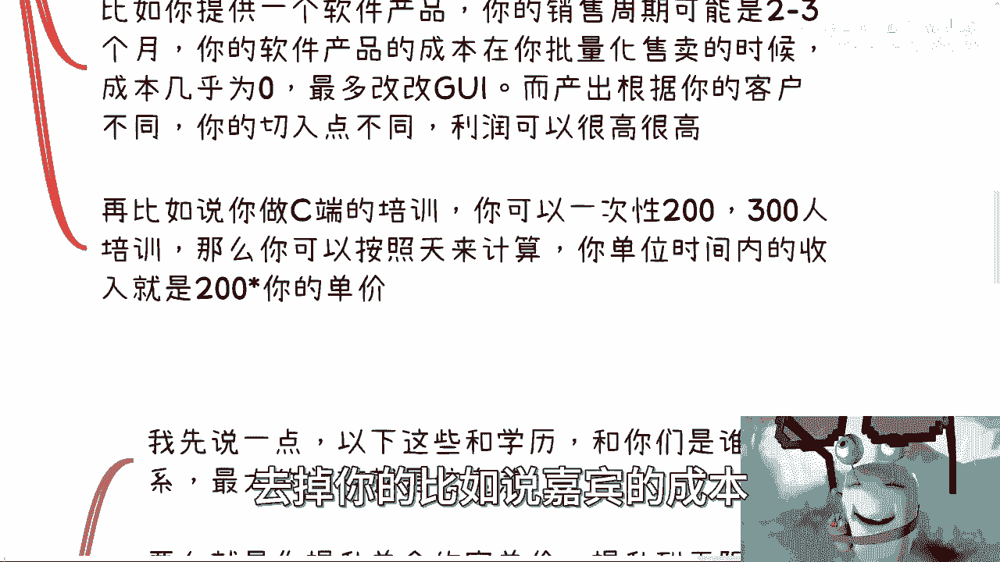

比如说嘉宾的成本，去掉你的场地的成本，那不就是你的利润，对不对。

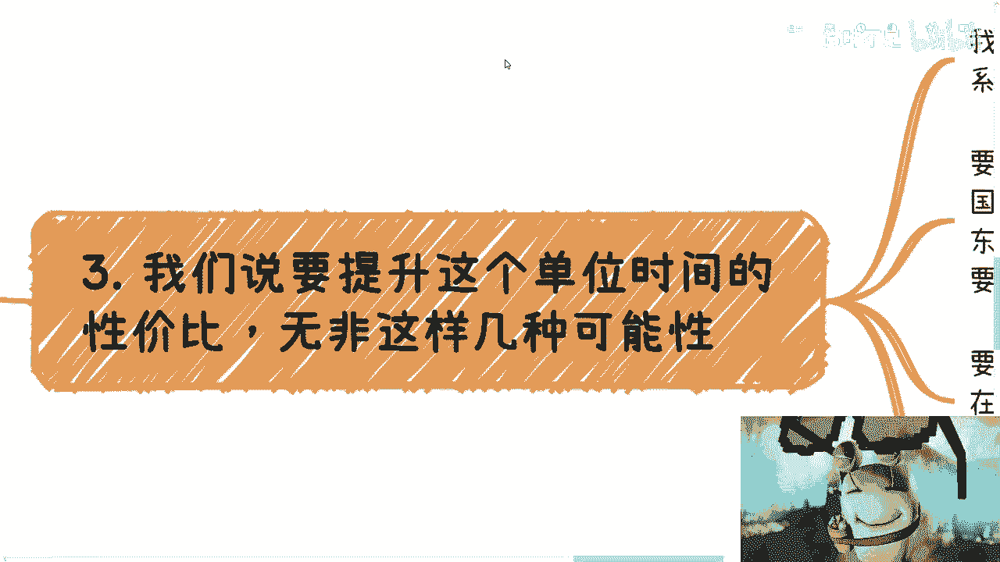

那这叫单位时间啊，那么第二点我们要说无限提升这个单位的时间，性价比无非这么几种可能性啊。

你看啊，我先说第一点，以下这些东西跟学历跟你们是谁没有关系啊。

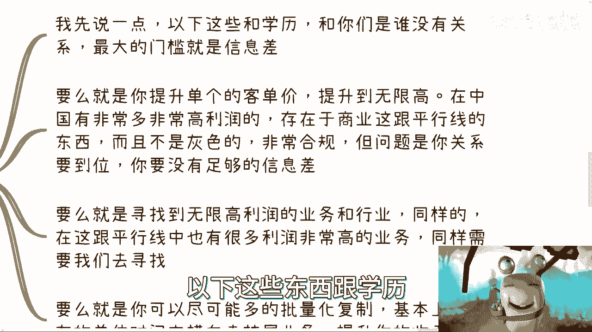

最大的门槛只有一个东西，就是信息差，就像我跟你，我跟所有人都说的。

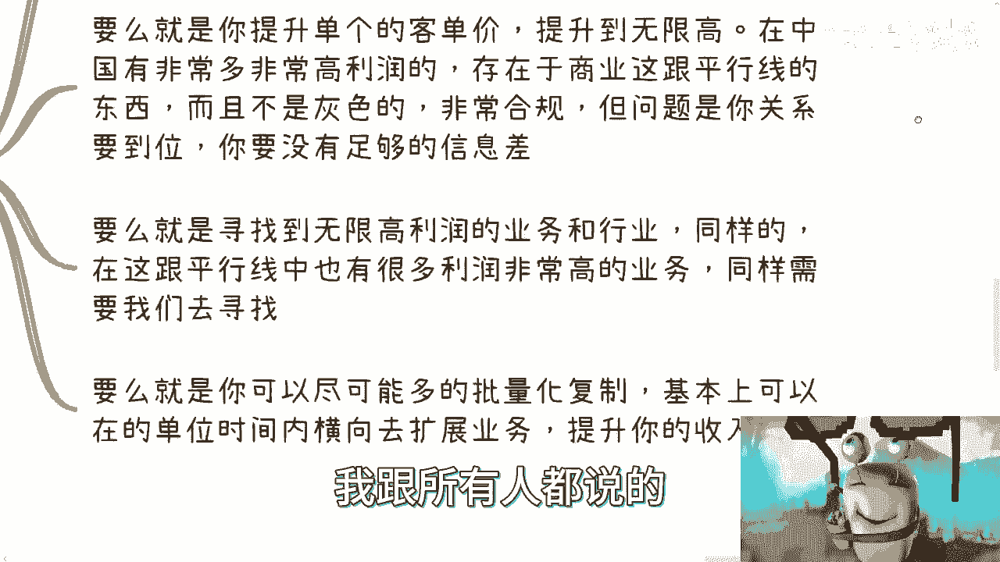

就是你们9年制义务教育，再加上高等教育，一路走过来，哪怕读到博士，你们对商业认知度就是零，那两根就是平行线没有交集的，我不管你们多大，也不管你们多大，你多大，磁力一样的，该不懂的就是不懂的。

很有可能你们到七八十岁还是不懂，那怎么办，对不对啊，那么第一要么就是说提升，提升你的单个的客单价提升到无限高，在中国有非常多高利润的啊，存在于商业这根平行线上面的东西，而且不是灰色的。

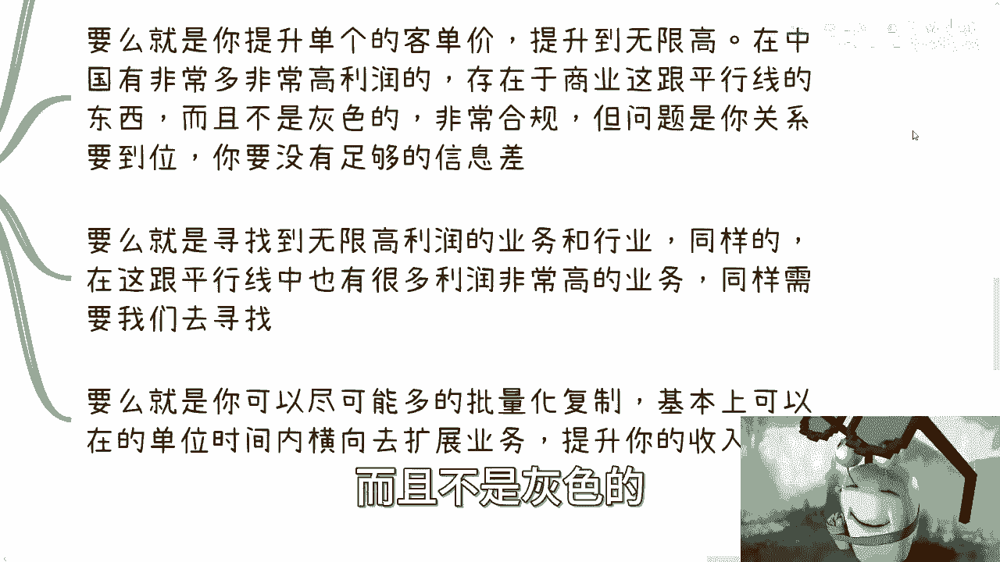

非常合规，但问题是你官销到位啊，而且你要你要没有足够的信息差。

你明白吧，你要把这个信息差抹平，这就看你本事了对吧，那这是第一点，要么就是寻找到无限高利润的行业跟业务，而同样的我觉得无限高利润在任何行业都有，只不过大家要找到啊，这不是你们打工或者日常什么什么。

我帮忙分销，分销什么，做做活动就能找到的，很难了，就是你要明白我为什么跟你们说，做活动是因为台阶是要一步一步上的对吧，就好像你今天做要做LV1，你你比如说你要进入LV100对吧，那你总会在LV开始走啊。

那怎么办呢，你不从一级开始走，你想跨，那我早就说了。

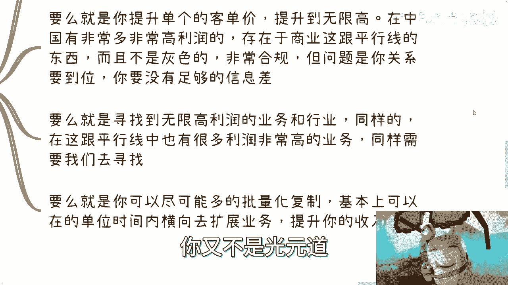

又不是富二代，你跨个屁，对不对啊，那么这第二点，第三点要么就是你可以尽可能多的批量化复制，基本上就是说可以在单位时间内，横向的去拓展复制，比如说你一个小时可以赚2000块钱。

然后呢你的东西可以完全批量化复制，你说我可以直接一个小时20个线程，就20个这种业务并行，那就不是2000了。

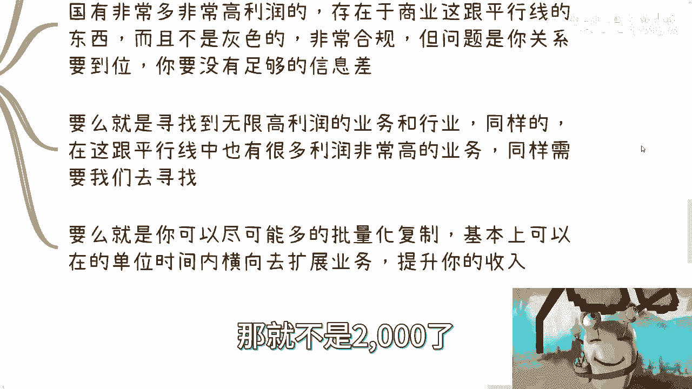

4万对不对，那可以啊，没问题啊，这也叫单位时间内提升你的性价比嘛。

啊那么第三点打破信息差呢，你是需要铺垫和积累的。

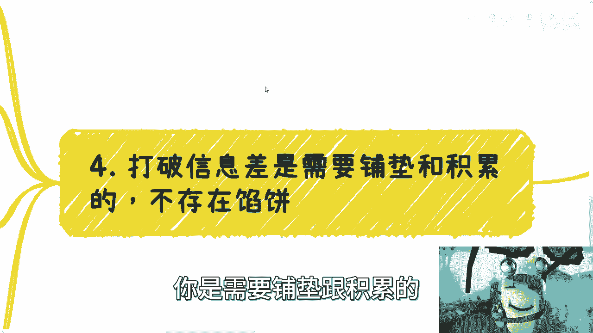

不存在馅饼，你别去想了，想这个事情还不如买彩票，你知道吗，咳咳啊，就如我之前说的，很多人觉得呢，自己工作几年或者出去多浪一会儿，弄点学历回来能怎么样怎么样怎么样对吧，包括今天还有人来问我。

他说哎我主页换了个行业好啊，我说都一样，有什么区别，随便就还你爱咋还咋还对吧，包括今天早上咨询，我跟他们也说了，我说你要是就在意，比如说有很多人说哎我本科是一年20万对吧，我我硕士回来一年40万。

我就说你一年，但凡但凡你要是为了这20万的差价，你说我情愿去花个3年读个全日制，或者花个一年到海外留学，我说你但凡是这种思想，你以后也赚不到什么大钱，你就这么回事，你赚不赚得到，我不知道。

但是赚不赚大钱，我觉得你是不可能的，因为你格局就这么大，那怎么办呢，对不对啊，那么为什么，因为商业本身就是很混乱的市场，你跟我都是个体，没有用的，我们都是渺小的，我们能能能左右个屁，对不对。

没人关心你是海龟还是啥，说白了谁都可以是海龟，因为骗子太多了，那狼来了，叫了不是三次了，你妈300次都有了对吧，你要冲破信息差，说白了就是需要更多的你的case的积累，你的合作伙伴的积累。

然后看机缘巧合，就是就说白了你今天台阶往上走对吧，LV1LV2LV三，然后呢你你往LV10LV20对吧，那能不能再往上走，就看你的命了，对不对啊，那么说白了，我觉得很多人呢是因为起跑线已经落后了啊。

其实本科我觉得就差不多了，甚至专科也可以无所谓，因为取决于你们想走哪条路，就虽然说我们说商业这条路的成功率是不高，但是但凡自己选择这条路，我们B没有必要再去卷打工人，那条路上的筹码了，因为你所有的学历。

所有的别的东西都是那条路上的筹码，没有意义的呀，那不吃饱了撑的嘛对吧，那当然也不是说有很多人觉得哦，那按照你这个说法，那我现在学历低，我就直接去找商业，那也那也很难，为什么，因为你想想看。

你活了20多年，你对那个世界，你对那个领域的东西一无所知，你要白手起家，这个难度两边都很高啊，那么商业上很多起步呢讲究的是个野啊，你想想看，那那他妈支付宝起步的时候，还没有所谓的合规不合规呢。

那照这么个说法，支付宝当时做移动支付，也不做移动支付，就是做那个做那个线上做做个体，就是就是叫做B端支付的时候，你想想那个时候有所谓的合规吗对吧，你要说他不合规，他也可以说不合规，你要说他合规吧。

他也没有无法可依对吧，怎么弄呢，但是不是还是干嘛是吗，那当然就是说在商业本身层面啊，也有很多分级对吧，也有比如说小打小闹的，也有郭嘉嘉的对吧，也有你想那些微商微商，我觉得也算商业对吧，那还有做大做强的。

高举高打的对吧，你你有很多不同的模式，至于你想做成什么样子，你全凭自己的选择啊，所以说我在这个地方啊，就是我要跟我觉得大家还是有个误区，就是不是说我今天做生意，我就要高举高打。

你知道不不就是说或者这么来说吧，就是高举高打，不是说一定跟政府或者跟企业有关，才叫高举高打，不是的，你明白吗，就是你在任何一个圈子里面，它都有，就是你每一个圈子其实都是个金字塔。

你每个圈子都是个梯形的模型，对不对，那你要做的就是在那个圈子里面，能否占据足够高的一些，比如说啊社群啊对吧，或者说名头啊或者什么东西，然后往下做事情，这叫高举高打。

你哪怕在那个领域里面没有任何的政府背书，没有任何的这种500强企业背书，那又怎么样呢，对不对，因为在那个领域里面，在那个圈子里面，你已经足够的让对方可以信任你，或者说足够的背书。

让对方觉得你是个很牛逼的人。

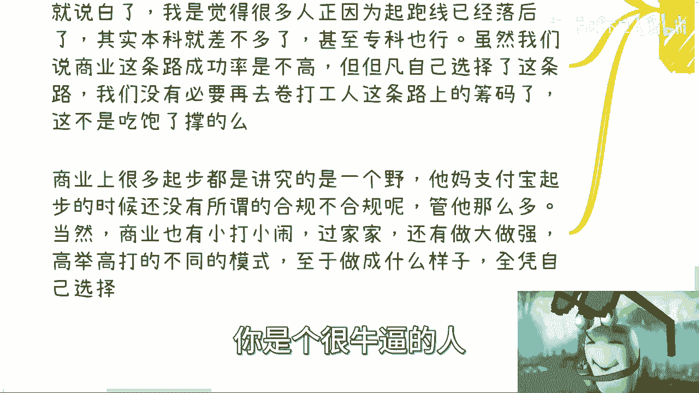

那不就够了吗，你管他这么多，对不对啊，那么第五点。

所以说一般啊，你看啊你们所有的人找我聊业务的时候。

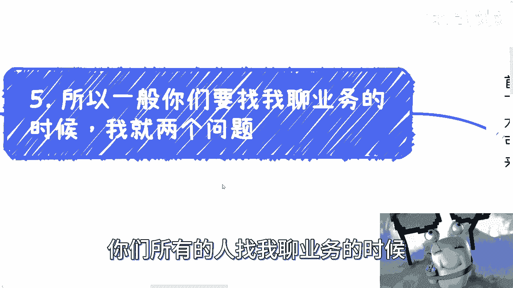

我就两个问题，就是所有的你们这个什么什么业务流程啊，商业模式啊，什么乱七八糟，我现在都不关心，我只关心两点，第一你就告诉我，你的投入产出比多高对吧，你但凡跟我说。

我什么什么什么一个小时500块到1000块对吧，但是我没法量化对啊，我也不知道啊，这个东西未来可能随着流量，或者随着什么东西可能会变化的，那我跟你讲这种东西你就别做，就是东你要做商业。

你的东西一定是可量化的，我不管这个量化你是通过什么手段来量化，这不重要，但是你得保证它能量化对吧，你要但凡不能量化，你就说明就还是个赌博的行为对吧，那么第二这件事情本身是否可以线性的提升。

投入产出比对吧，也就是说你是否可以比如说成倍的2。2倍，两倍三倍四倍，我可能只是投入人力，或者只是投入一些这个这个这个这个叫什么，时间上的问题，你可以批量化复制，能不能我只关心这两点对吧。

因为你但凡这两个当中有一个想不明白，或者说就是得出结论，就是没有的话，那么这个东西不是不能做，那就像我刚刚说的，你跟我讲一个我不可能跟你说这个业务不能做，我只能告诉你，这个业务适合快钱或者适合投机取巧。

是不可能持续发展的，你明白吧。

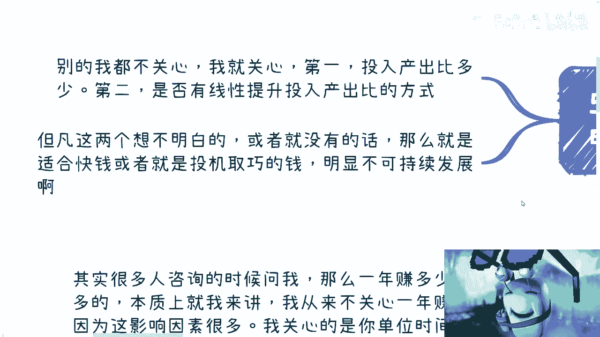

因为你要这么想，你们年轻的时候去赚点钱，这个是很正常的，但是等到你们年龄一旦大了，比如说30多岁，40多岁了，你想想看，你还每天在那边做投机取巧的钱可能吗，我不是说你赚不到，我觉得是你的精力跟不上。

首先这第一第一点，第二点是你年纪大了，你要去，就是我们说要往上走对吧，你要争取呃，就是以你为核心的这种社会地位甚至政治地位，你觉得你说出去的东西，是就是就是那种投机取巧的，或者说是那种快钱的东西。

别人怎么看，你对不对，你自己都不好意思拿出去讲对啊，那我觉得这是第二点，第三点是什么，就是你毕竟是可持续发展这件事情，就是你不管是人在什么地方，也不管你是啊，就是就是干活还是打游戏还是睡觉吧。

你本身单位时间里面，你都得拥有这个赚钱的能力，那么这个才是一个可持续发展的，这么一个大方向，而不是说哦我必须要996007哦，我必须要怎么样怎么样，没有意义的，这就好像很多人问我，他说你是不是平时很忙。

我说我不忙呀，我他妈空的很，对不对，就是本质上我觉得所有的人你要想改变，那这个地方我不强求，那我还是那句话嘛，你们改不改变跟我有什么关系，对不对，就但凡你想改变的，我觉得我本来这个标题写的是唯一要做的。

后来想想不对，唯一要做太绝对了对吧，所以我把它改成什么呢，就是别的你也可以做，但是在所有的事情当中，你必须要做一件事情是什么，就是你得无限去提升你的单位，时间的这个赚钱性价比就这么简单啊。

没了你们可以自己再想想看好吧，哎呀行啊，那就这么着好吧，反正你们手上有什么牌啊，然后呢这个商业想怎么做，或者你们有什么id啊，都可以都可以，你们天马行空想也可以，反正可以整理好。

包括就是你们个人的这些问题整理好啊。