# 如果我们开个上帝视角来看下大众的行为 - P1 - 赏味不足 - BV1oA4m1c7cd

好啊大家好啊，我这个最近事情比较多。

所以又凌晨来给你们录了啊，呃今天这个呃首先啊那个广州活动定了啊。

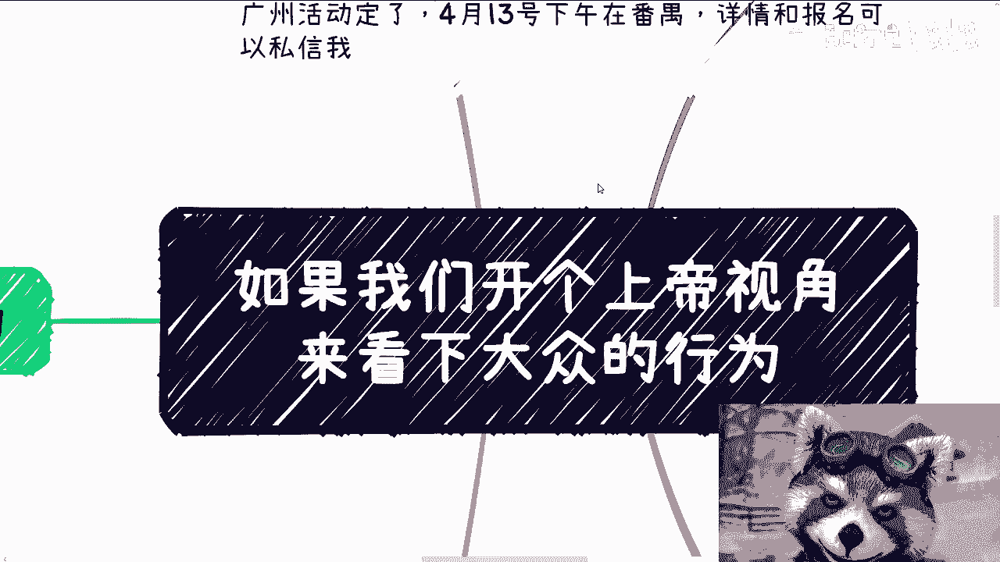

4月13号下午在番禺好吧，详情跟报名可以私信我啊，然后这个也没人跟我讲，广州金这个月是那个广交会。

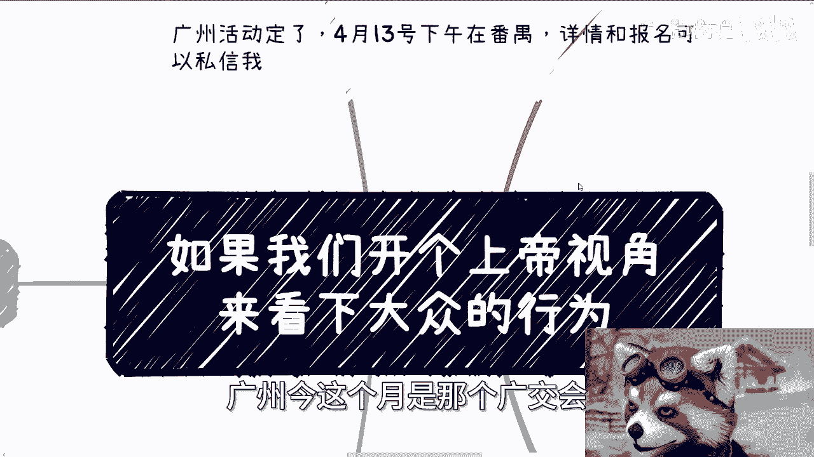

卧槽这这这飞机票他妈贵成狗啊，呃今天我们讲的这个话题呢就比较有趣啊，我的意思是如果我们开个上帝视角啊，我们可以来看一下大众的行为啊，首先呢我觉得是这样子的啊，就是大家不要对号入座啊，不要对号入座。

就是你们可以先跟着我这个视角先看一遍啊。

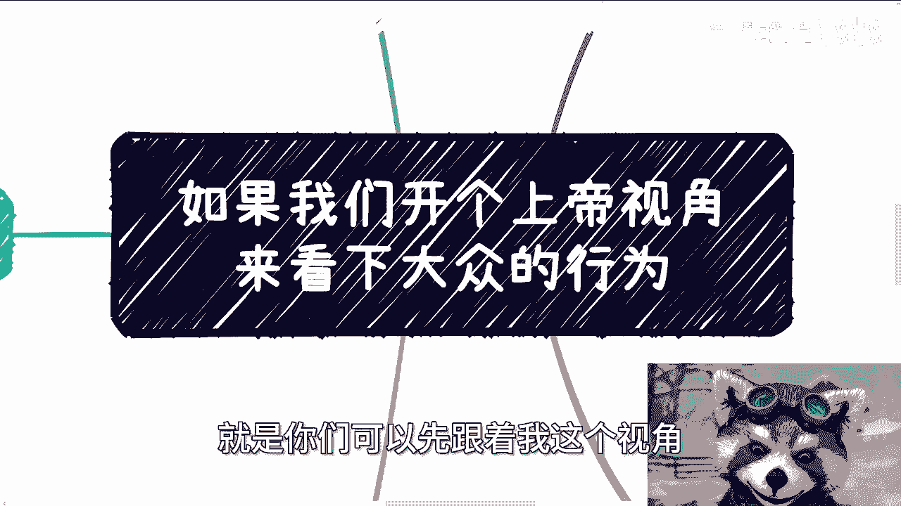

然后你们可以再仔细静下心来啊，可以去想想看啊。

那么首先第一类呢就是走在独木桥上的啊，那么我们开上帝视角呢，我们会发现大部分的人啊，这个本硕博对吧，工作考公考编千千万啊，那么在独木桥上的人呢，你会发现他们是自主的排斥外界所有的可能性。

就是基本上呢你会发现就是说他是孤注一掷的，你跟他讲什么呢，也讲不通，讲不听啊，你讲了呢，他他他也会不会觉得你是为他好啊，或者说对他们来讲呢，根本就没有别的可能性啊，记住是对他们来讲没有别的可能性。

就是他们自己认为没有别的可能性啊，那么当你跟他们说别的可能性时候，他们就会告诉你啊，这个我父母跟我讲啊，没有别的可能性啊，我父母跟我说这条就是最好的路啊，然后呢这个世界啊我们就没有别的可能性啊。

我们就是普通人啊，然后就一而再再而三的跟你强调啊，我们家里面也没关系，没什么东西啊，反正他妈屁都没有啊啊，然后自己是没有这个能力，在别的可能性上面做点什么的，对吧啊，但是呢你但凡开了上帝视角啊。

我跟你讲啊，你从一个第三方视角，你就会发现一件很神奇的事情啊，就是这个神奇的事情，就是他们虽然会就是像我刚刚说的，哎我不行对吧，我家里面也没有关系，没有什么东西啊，但是他们却反而会觉得哎牛逼了啊。

就自己会变成独木桥，独木桥上的佼佼者，获胜利者，就他们会认为这个是改变自己命运的方式，然后能改变吗，或者或者说他们最终改变的是谁的命运呢，他们不知道啊，那么其实什么叫独木桥呢。

并不是说现在上岸的就是胜利的，那我这么跟你们讲吧，你们但凡开了上帝视角跟第三方视角之后，你就会发现啊，很多人其实现在是卷出来的，但未来呢比如说23，32，20多岁，30多岁才刚开始。

后面其实很多人会发现自己并不喜欢，或者也并不习惯啊，自己就是所谓卷出来的这个结果，或者说卷出来的这个岗位，或者是卷出来的这个环境啊，然后在过程当中，有的人抑郁了啊，有的人也会选择再退出来做别的啊。

有的人会选择结束自己的生命等等等等等，但是你回过头想想看，如果我真的不喜欢，如果我真的怎么样子，那我为什么之前这么卷呢，难道我就是一个屋，非要撞下南墙，然后20多岁。

30多岁撞完之后我才明白的这么一个人吗，对啊，那么同样的千军万马，就如我之前说的，我们既然都是普通人，那么出生本身就是很有影响的，什么意思呢，就是说你既然都已经明白了，你说你家里没有什么关系。

没有什么样子，那你为什么一定要去卷这方面的东西，对不对，那你今天开上帝视角，我作为一个开上帝视角的，或者说我开我比如说我假设我开上帝视角啊，那你要我说我就要说是什么，我说那既然我们要明白的话。

我们既然已经明白这件事情，那么我们就不要幻想自己能在独木桥上面，怎么样了呗，你幻想啥呢，那当然了，有人就跟我说了，他说啊，我不我不是说想自己啊，我想着是自己或者未来三代或者怎么样，那我只想说大哥啊。

你不看看现在全球什么情况，你不看看现在中国什么情况，你不看看现在跟以前改革开放有什么区别啊，你还想着未来三代，卧槽我他妈真觉得牛逼，就是这事，那你想着未来三代，我觉得这倒没什么问题。

只不过你这种非常无脑的寄希望于未来，和你自己当下活在幻想里面没有区别。

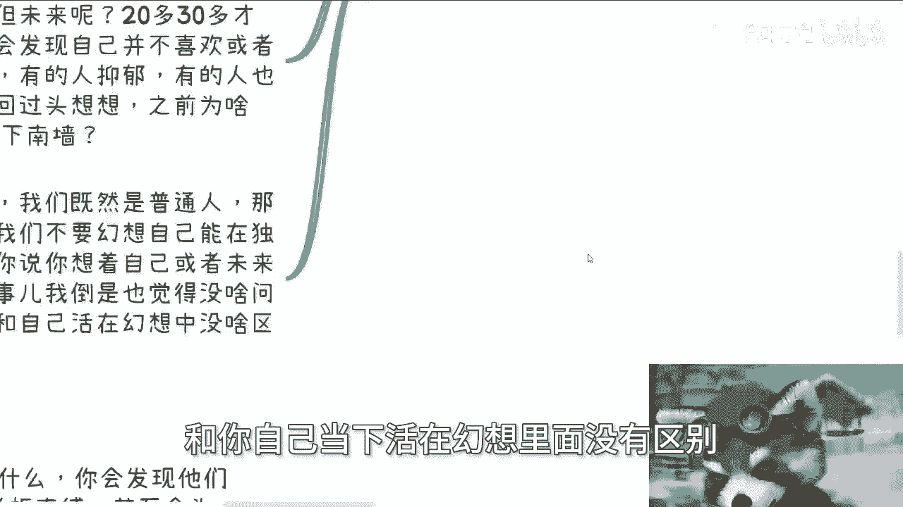

你不切实际啊，对不对啊，然后这是第一个，然后第二个是什么，就是另外一类人呢。

他是沉浸在自己的短板当中啊，那么其实这个呢在我聊下来呢，我感觉是大部分的大部分的，大部分的大部分的通病啊，就是说呃他呢会沉浸在自己的短板当中。

然后呢就是说不听改不掉啊，你会发现真的说的听呢，改的掉的呢，成功不成功，我觉得已经不重要了，因为我觉得但凡能说的挺改的。

就改的掉的，他已经成功了啊，或者他已经脱胎换骨了啊，那你比如说好多人跟我说，陈老师我性格很社恐啊，我在公众场合下面不知道怎么说话，你想想看啊，你从我的视角来看啊，你你你跟我讲这个有用吗对吧。

或者说你跟我讲完这个，我跟你讲什么东西有用吗，没用啊，对不对。

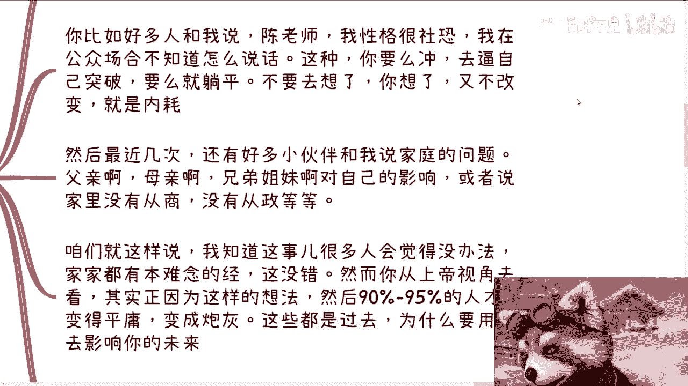

因为因为你说啊，我我我很社恐，我很多时候不知道怎么说话，或者说有很多人就跟我说啊，陈老师，我这个做商业对吧，我0~1不知道怎么做，然后呢我跟你讲有用吗，没用啊，你跟我讲有用吗，也没用啊，那什么有用呢。

我就告诉你，你要么就充对吧，你要么就逼自己去突破，你要么就躺平，什么叫躺平，躺平就不要想了，你不要去想那么多哦，你现在充我也不充的，然后你还要在那边想，又不改变，那你除了那号能干嘛呢，对不对。

你除了浪费你的时间能干嘛呢，然后最后啊最近几次啊，还有很多小伙伴跟我说家庭问题啊，跟我说什么啊，我家里面没有关系对吧，说我这个那个爸爸做什么的，妈妈做什么的，兄弟姐妹对自己有什么影响啊对吧。

或者说重男轻女，或者说还有些以前跟我说说，什么家里资产不留给自己的，不拉不拉不拉啊等等等啊，我跟你这么说，咱就这么讲。

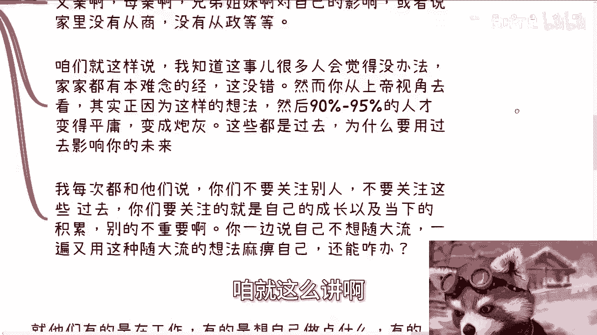

我知道很多事，很多人觉得没有办法对吧，就很多人就说哎呀，陈老师，你不能你不能叫什么，站着说话不腰疼对吧，我跟你讲，没有人站着说话腰疼是吧，我跟你讲啊，就是家家有本难念经，难念的经。

只不过每一家难念的经不一样，你知道吗，什么意思，意思就是说你但凡从上帝视角去看，其实正因为你有这种想法，然后90%到95%的人才，才会变得平庸，对不对，你才会变成炮灰，因为这些都是过去的，你跟我讲。

你说你家里怎么样，你爸妈怎么样，然后呢那又怎么样呢，你为什么要让他去影响你的未来呢。

没有意义的呀，你你你跟我讲，你跟别人讲，你每天在那边想这个东西，你每天就在那边想哦，因为这些东西我就是个普通人，你你我我就想说，你你用你的这个成年人的脑子思考一下，你觉得这两者有因果关系吗，有没有嘛。

对吧哦，那我每次都跟他们说，我说你们不要关注别人对吧，不要关注这些过去对吧，你你你们要关注的就是自己的成长，以及当下积累哦，你每天自己当下成长，当下积累，不关注你关注一下这些有的没的屁用没有。

有什么用呢，哦你就就这种在我看来是什么，就是你一边说自己不想随大流，一边呢又有又用这种随大流的想法麻痹自己，那你说我我咱咱就这么说。

你能怎么办，我能怎么办对吧，这神仙救不了你啊。

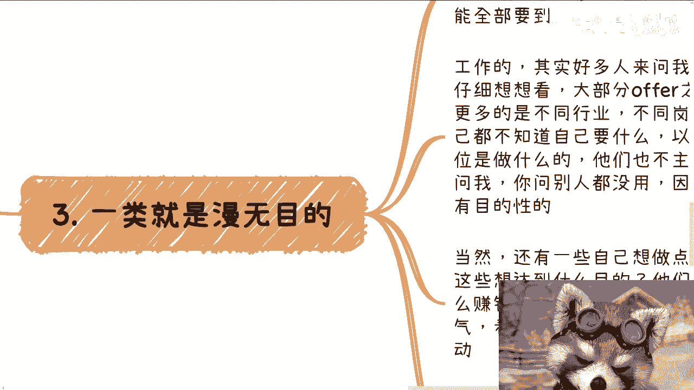

然后第三类就是叫做漫无目的的，哎这一点我真的也是觉得很很无解啊，就是你会发现啊，他们有的人呢是在工作上，有的人呢想自己做点什么，有的人呢想做一番大事业，有的人呢跟你讲完之后，就是既要又要还要啊。

然后感觉他妈自己都能要到，好像自己他妈头上长角了，你知道吗，那么你比如说工作的啊，其实很多人呃他私信来问我offer怎么选啊，但是你我就这么跟你讲啊，从我的视角，你知道我是怎么看的吗。

第一你们大部分人给我的offer之间，薪资不会差太远对吧，因为差太远，你们也不用来问我了，对不对啊，这是第一点，第二点是更多的呢，它差别是在于不同的行业，不同的岗位啊，然而呢你们想想啊。

问我的人大多数自己他是不知道自己要什么的，以及他其实也不去问hr，也不去问身边的人，也不去问那些真正对这些岗位了解的人，比如说我了解一下这岗位有兴趣到底做什么，对吧，这岗位未来有什么发展，他不问的。

他问我，你问我，我怎么知道呢，对不对，而且说白了你们自己都不知，就大部分人比如说选择一件事情的时候，不管是工作还是说别的事情，你们自己都不知道自己要什么，那你说你选什么玩意儿呢对吧，选什么东西呢。

当然啊还有一些自己想做点什么的，你问他们哎我跟你讲，你很好玩的啊，你比如说你开上帝视角，你问他们，你做这些想达到什么目的呢，他们会告诉你我要赚钱，但你问他怎么赚钱呢，他们就会说哎呀做了才知道对吧。

或者说看运气，看流量，那那我不管你说什么啊，你说的这些空话归根结底就是没有目的性的盲，就是开盲盒有什么意义呢，就这也是我咨询时说的最多的一句话，就是我说你们就是在赌博，我说你要是去赌博，你就赌呗。

就是你要么就是去想办法去了解你的结果，想办法了解这个做事情方式，你现在又不了解，然后你跟我说，陈老师我要去赌博，那你去赌呗，那还能说啥呢，你都赌博了，你还你你还来这说啊，我们要什么方法论对吧。

要什么结果，你要什么结果，你还不如抛个硬币来的快对吧，然而你会发现他们都坚信一句话是什么，他们都会坚信一句话，叫做大部分人都是漫无目的的，呃然后呢你就会觉得很好玩。

就是这个时候他们把自己归归结到大部分人了，但他们跟你聊的时候，他们又不觉得自己是大部分人，你懂吗啊，就是就是他们又不甘于不甘于平庸，然后就开始他妈的瞎折腾啊，或者说那个好，你说你说啊就是从我的视角来讲。

你说这是谁造成的呢，对不对啊，好然后第四点就是自己不够强大啊，却却那个眼光呢都都看着别人啊。

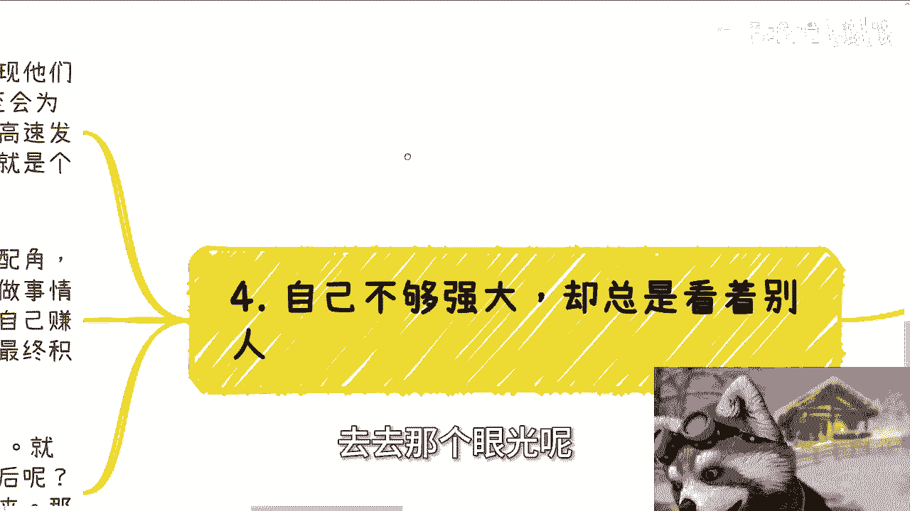

呃你我们再来举例子啊，就你就比如说你就比如说独木桥上面啊，不管他们最终做什么，你会发现他们会被KPI被主管，被公司，被老板，被一些短视频，被所谓的理论束缚住哦，然后呢他们甚至还会为了别人。

为了资本家去加班去去着想啊，他们在你会发现他们在自己的黄金年龄，该努力让自己高速发展的时候，总在想着别人，想着大众啊，就是用那种就是说啊大家怎么样怎么样，我也得怎么样怎么样的这种理论啊，来麻痹自己啊。

然后呢由于自己浪费了时间，由于自己没有积累，最终啊用自己是个普通人来PUA自己，从而感动自己，形成了整个的变自己变成炮灰的这个闭环啊，我我也觉得很神奇啊，讲不听的啊，那么在做事情跟谈判当中呢。

总是习惯性的去把自己变成配角啊，好像对方就比自己强，或者好像对方就是主角，好像对方就他妈牛逼啊，但事实上我就这么跟你们讲，你们都做事情了，我们每个人做事情谈判也好啊，做商业也好，赚钱也好。

第一优先级难道不就是为了自己成长，为了自己赚钱吗，包括我去工作，卧槽难道我去工作是为了跪舔领导的吗，难道我去工作是为了资本家赚钱的吗，那不是吧对吧，那他们为什么要管对方是谁呢，对哦你在那边想这么多。

你5年十年过去，最终积累不了什么，赚不到钱不还是一场空吗，有什么用呢，对不对，当然还有很多人有的嫉妒啊，眼红啊，攀比啊对吧，包括沉浸在这种短视频的噪音当中，这就好像很多人呢你跟他讲了，他知道这样不好看。

短视频不好对吧，相信网络上信息不好，然后呢没有然后了，3分钟热度还是继续刷，坚持不下来，能能你能做成啥呢对吧，那我我觉得啊客观的举个例子啊，你就拿我来讲，或者说你就拿我做B站这个视频来讲，我就问你们。

我不管你们做什么内容，我也不管你们到底是做成什么样子，你们有多少人能够像我一样，从去年3月份坚持到现在，几乎每天发的有吗，我我只能我只能说你们但凡能有人坚持的下来，我觉得你们就成功了，就这句话有吗。

对不对。

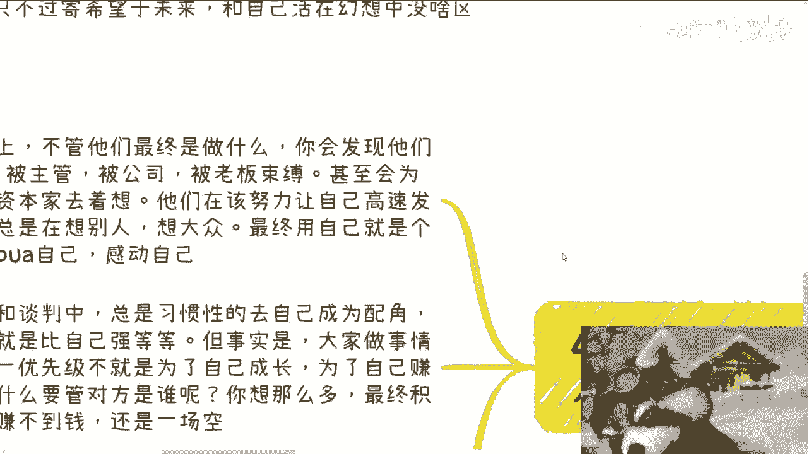

啊那么最后记住啊，关注过程的只有你自己。

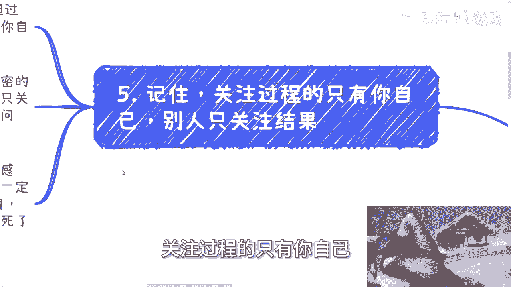

别人没有人关注过程，只关注结果，你一定要明白这句话啊，就是说你要明白是这个世上所有的很多，跟你说过程很重要，欣赏风景都是鸡汤，我跟你讲，你爱吃不吃，那是你的事，但是过程到底经历了什么，到底积累了什么。

最终只有你自己明白，你懂吗，我无论除了你自己以外，别人都是无法感同身受的，没有用的啊，而且你随着年龄大了之后，你就会发现，无论多亲密的朋友或者你所谓的家人，除了你自己以外，别人其实也只关心结果。

你真的我跟你们讲，你现在只要但凡有点阅历，你就会明白，没人关心过程，只关心结果哦，因为每个人都很苦，每个人都有自己的问题，谁都没空来关心别人，没有谁欠着谁的，对不对，就这么简单一件事。

你老婆你老公也不欠着你，怎么了呢对吧，你就像前两天嘶哈手麻掉手麻掉，卧槽断了断了断了对，你就像前两天那个咨询的那个小伙伴问我，他说他说陈老师，我我我之后要结婚对吧，他说我你这房子要不要买。

对他说对方必须要买怎么样，我说对方必须要买，不结呗，怎么了呢，我妈非要结的啊，不结得死啊，诶奇怪了，对不对，所以啊无论你的过程多艰苦，没有结果，除了自我感动，没有别的用处。

包括我一直说的战略方向一定要对，因为如果你方向就不对，你再苦再累没有用啊，你除了会告诉自己，哎呀我再熬熬就过去了，我苦尽甘来吧，用这种东西麻痹自己，事实上是什么，熬死了也没用，对吧你们仔细想想看。

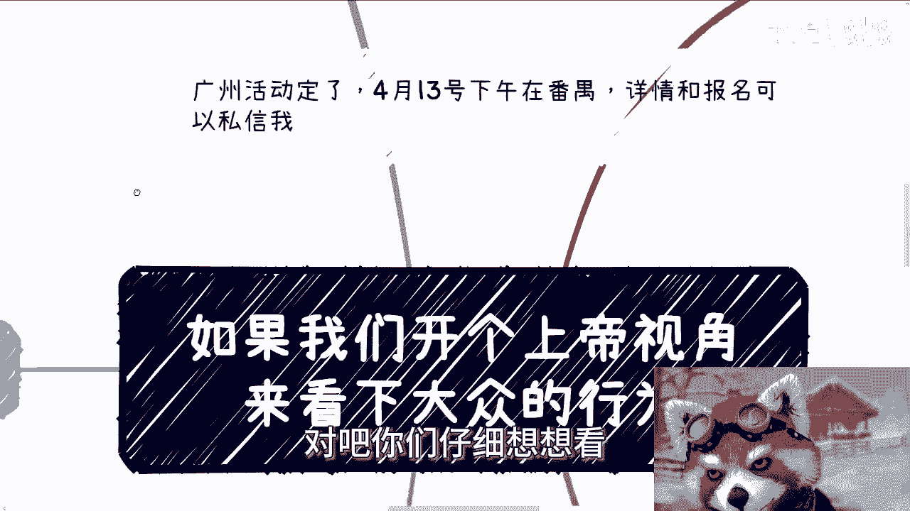

真的仔细想想看，就是啊就是这种东西因果律它是一个循环的，就是我一直跟你们讲，你们当下的积累会影响未来，而你们未来的想法其实是由于你们现在造成的，对吧哦，你你自己会觉得啊，因为我是个普通人。

所以我得不到任何东西是吗，不是是因为你用普通人这种观念，或者用你爸妈的这种观念来麻痹你自己，让你变成了一个中庸，走上了一个中庸之道，所以你最终一事无成，就这么简单啊，行那就这么着吧啊。

然后那个广州活动好吧。

我们继续报名呃，你们要报名的，你们就私信我好吧，然后那个职业规划商业规划啊。

然后包括你们手上有什么牌啊，融资啊对吧，包括商业计划书啊，包括其他的，你们要觉得呃希望通过我的认知，或者我的一些观察到的信息来呃，更好的帮助你们打你们的牌的话，你们也可以整理好咨询我啊。

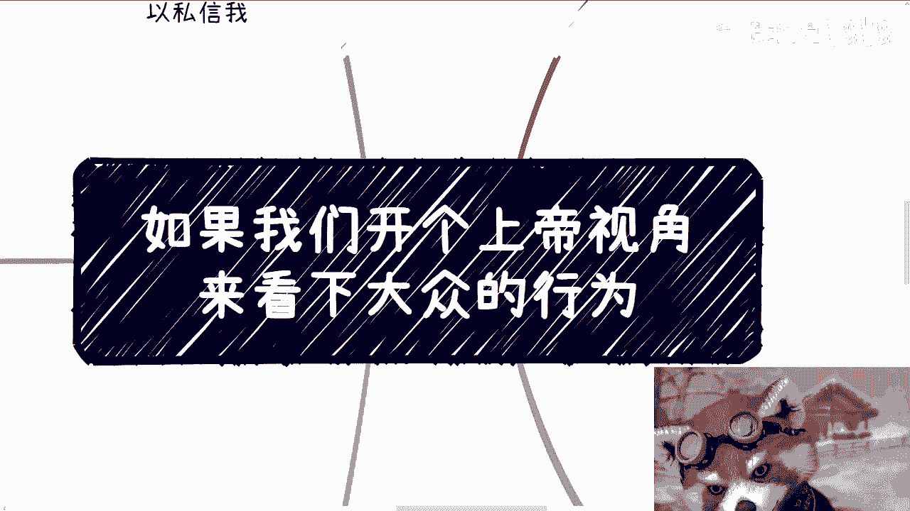