# 课程一：上帝视角下的四种大众行为模式 🧠

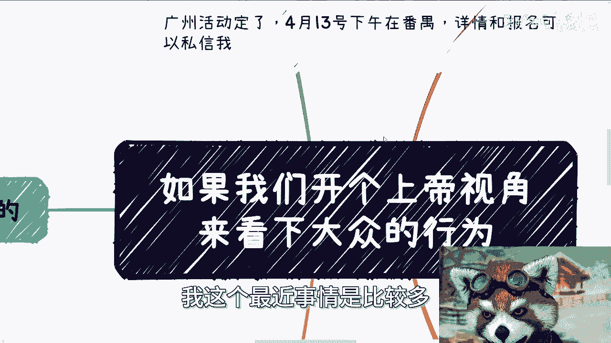

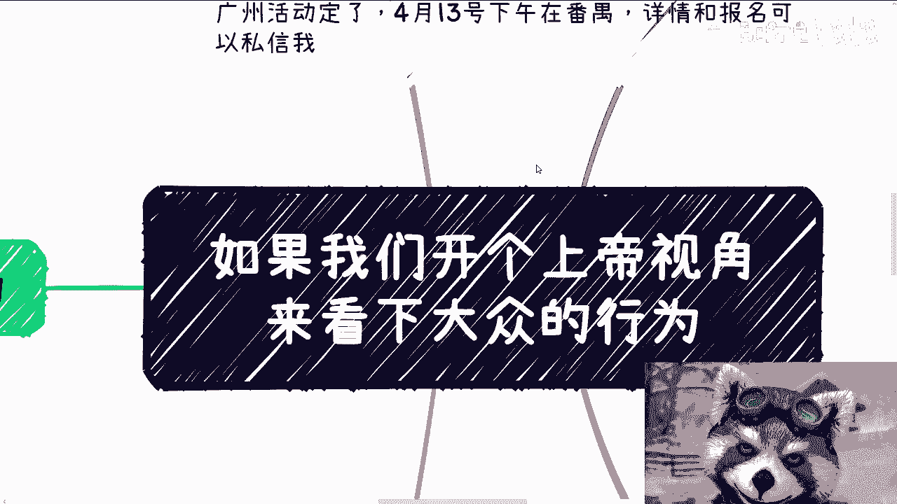

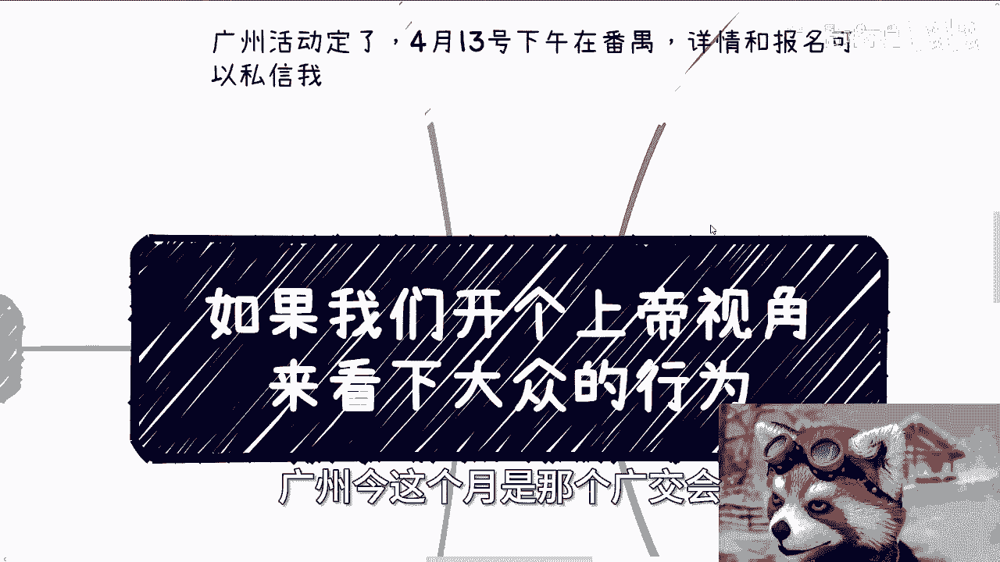

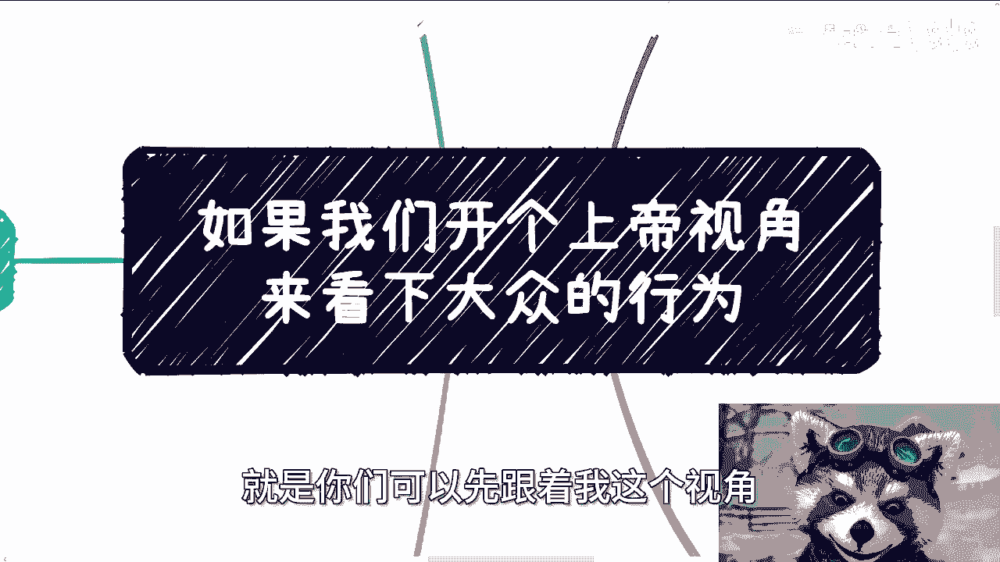

在本节课中，我们将学习如何以“上帝视角”或第三方视角来观察和分析大众的常见行为模式。通过这种抽离的视角，我们可以更清晰地识别出几种限制个人成长与发展的思维陷阱，并思考如何避免陷入其中。

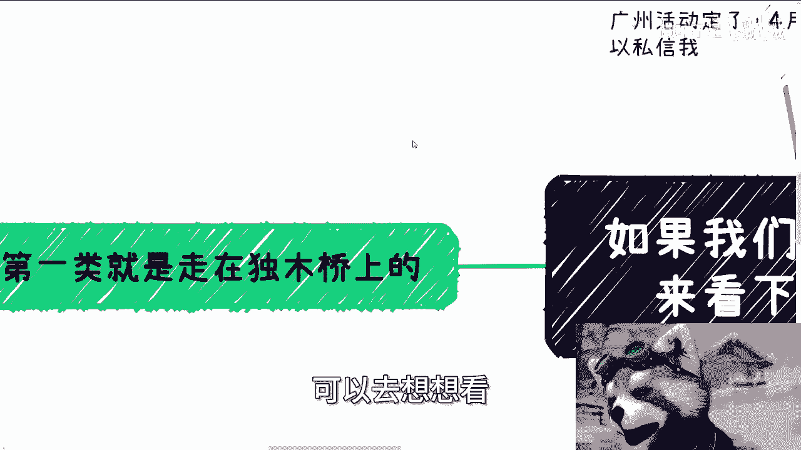

## 概述：开启上帝视角

当我们尝试开启“上帝视角”，即从一个抽离、客观的第三方立场观察时，会发现许多人的行为遵循着几种可预测的模式。这些模式往往导致他们陷入困境或变得平庸。本节我们将逐一剖析这些模式。

## 第一类：走在独木桥上的人 🚶‍♂️

上一节我们介绍了开启上帝视角的概念，本节中我们来看看第一种常见模式：走在独木桥上的人。从上帝视角观察，你会发现有大量的人拥挤在诸如考研、考公、考编等传统的“独木桥”道路上。

以下是这类人群的几个核心特征：

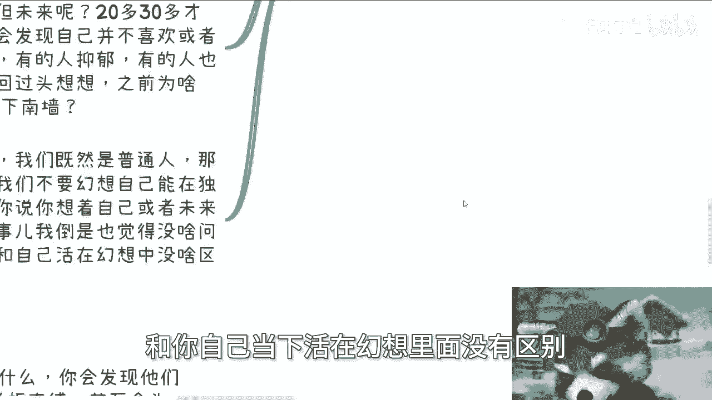

*   **自主排斥可能性**：他们主动排斥外界所有其他的可能性，认为除了这条既定道路外别无选择。
*   **自我设限的信念**：他们常持有的信念是：“我家里没有关系/资源”、“我只是个普通人”、“我没有能力做别的”。这种信念可以用一个简单的**公式**表示：**自我设限 = 认定自身条件不足 + 否定其他路径可行性**。
*   **矛盾的期望**：尽管不断强调自身条件普通，但他们内心深处却期望自己能成为这条“独木桥”上的胜利者，并视此为改变命运的唯一方式。

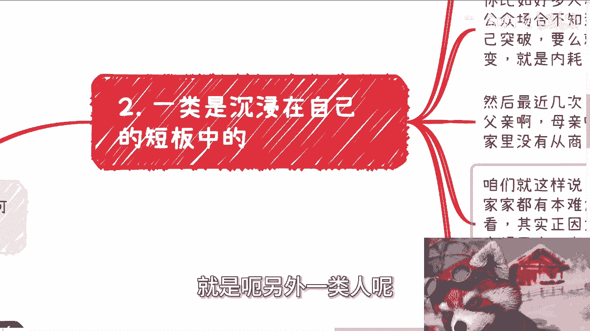

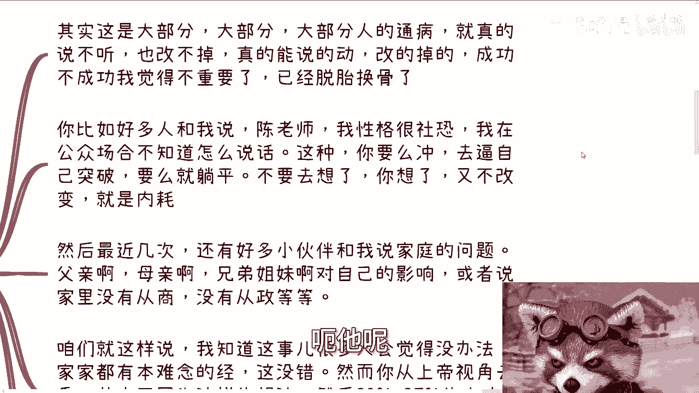

然而，从长远来看，许多通过激烈竞争“卷”上岸的人，在未来（如23岁、32岁时）可能会发现自己并不喜欢或适应这个结果，导致抑郁、转型甚至更糟的后果。既然明白自己是“普通人”，且家庭资源有限，为何还要将所有希望寄托于竞争异常激烈的单一通道上？这本质上是一种不切实际的幻想。更有人将希望寄托于“造福三代”，却忽略了当下与过去（如改革开放时期）完全不同的时代背景，这种对未来的无脑寄托与活在当下幻想中没有区别。

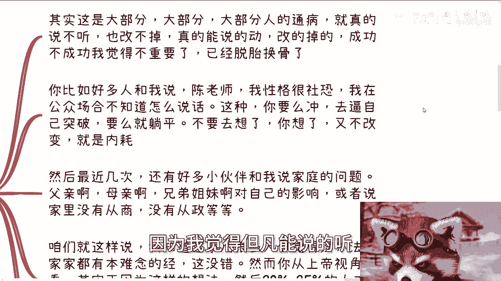

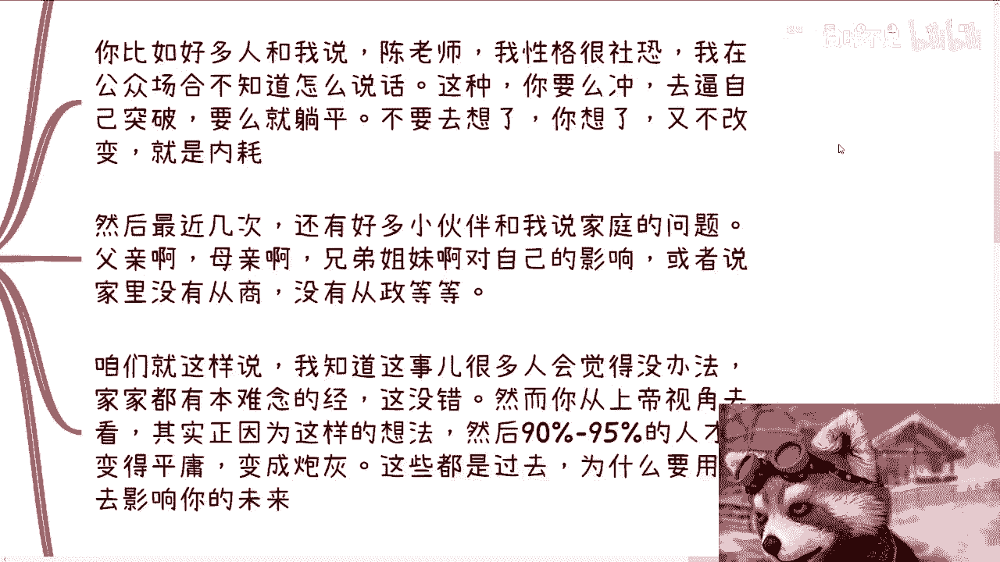

## 第二类：沉浸于自身短板的人 😔

分析了第一种局限于单一道路的模式后，我们来看第二种更普遍的模式：沉浸于自身短板。这是绝大多数人的通病。

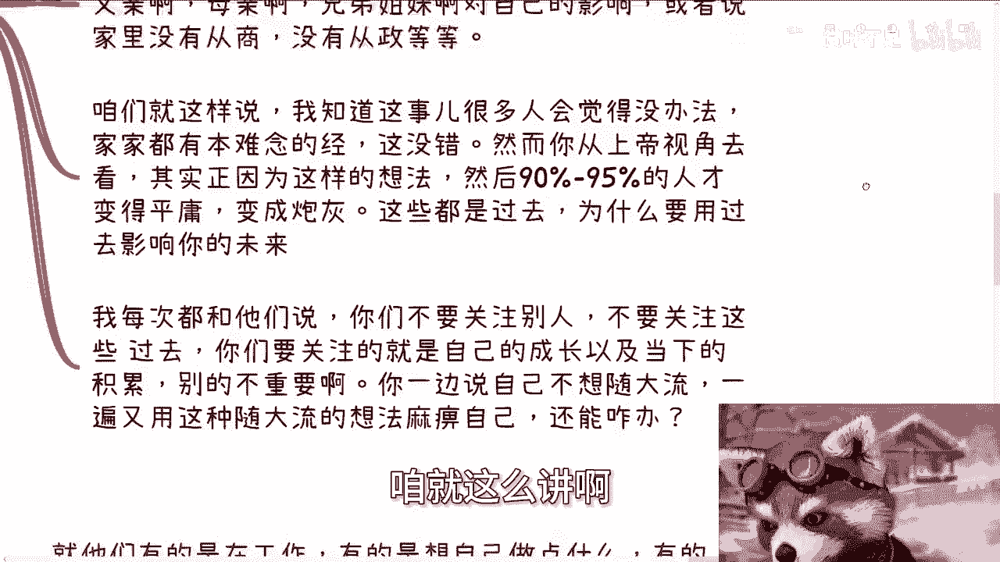

以下是这类行为的典型表现：

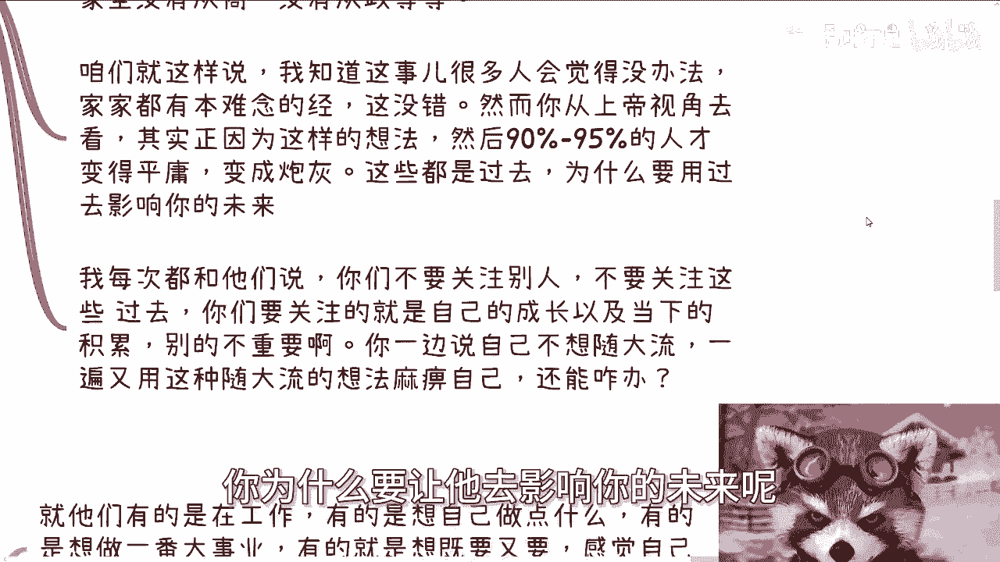

*   **认知固化**：他们明确知道自己的短板（如“我性格社恐”、“我做商业0到1不会”），但仅停留在认知层面，认为“改不掉”或“不知道怎么办”。
*   **消极循环**：不断向他人倾诉短板，但倾诉本身不带来改变。这形成了一个**代码**般的循环：
    ```python
    while True: # 无限循环
        认识到短板()
        感到焦虑()
        向他人倾诉() # 此步骤不改变状态
        # 缺少“实际行动()”函数
        回到初始状态()
    ```
*   **归因于过去**：常见是将现状归咎于家庭问题（如父母职业、重男轻女、资产分配）。他们认为这些无法改变的过去，决定了自己只能是“普通人”。

从上帝视角看，正是这种“因为过去A，所以未来只能是B”的线性因果思维，使得90%-95%的人变得平庸。每一家都有难念的经，但关键在于是否让“难念的经”定义并束缚你的未来。持续关注无法改变的过去，而非当下可积累的成长，是毫无意义的。这本质上是一边声称不想随大流，一边用大众化的借口麻痹自己。

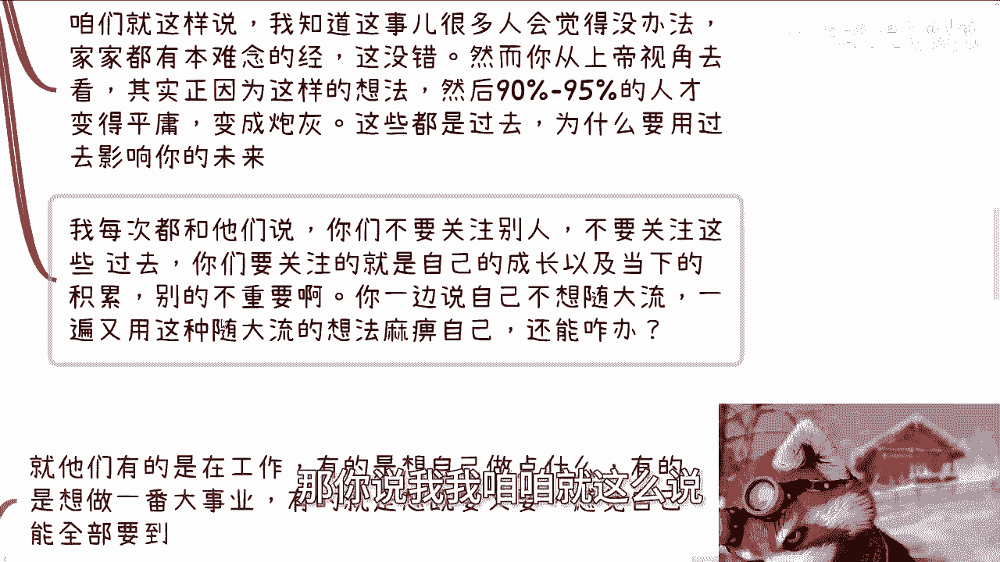

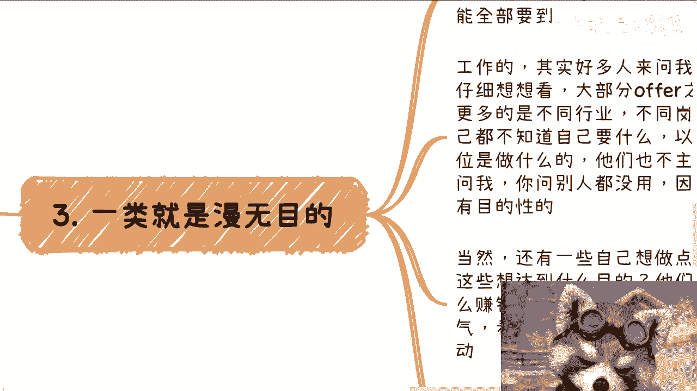

## 第三类：漫无目的的人 🎯

接下来，我们审视第三种模式：漫无目的的行动。这类人无论是在职业选择还是个人发展上，都缺乏清晰的目标。

以下是他们的两种典型场景：

1.  **职业选择迷茫**：例如在选Offer时，提供的选项之间薪资差距不大，区别在于行业和岗位。但他们通常既不清晰自己真正要什么，也不主动去调研目标岗位的具体内容、发展路径（询问HR、业内人士），而是询问与自己情况类似的第三方。这相当于在未知地图上随机选路。
2.  **行动缺乏目标**：当被问及“做这件事想达到什么目的”时，回答往往是“赚钱”。但进一步追问“如何赚钱”，则会得到“做了才知道”、“看运气/流量”等模糊回答。这本质上是一种“开盲盒”式的赌博行为，而非有目的的规划。

有趣的是，这类人常会引用“大部分人都是漫无目的的”来为自己开脱，但在沟通中又不甘于将自己归为“大部分人”。这种矛盾心理导致他们在不甘平庸和盲目折腾之间摇摆。

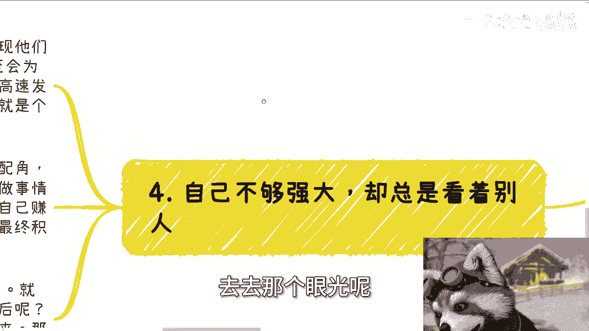

## 第四类：关注他人胜过关注自身的人 👀

最后，我们探讨第四种模式：自身不够强大，却将目光过度投向他人。这种外部聚焦严重消耗了本应用于自我成长的精力。

以下是这种模式的具体体现：

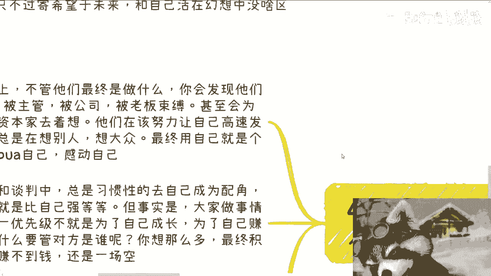

*   **被外部标准束缚**：在黄金年龄，容易被KPI、老板、公司制度、短视频流行理论或“大家都这样”的社会观念所束缚，甚至主动为这些外部因素加班、辩护。
*   **在互动中自我矮化**：在做事情或谈判中，习惯性地将自己放在配角位置，潜意识认为对方更强、是主角。这违背了做事的第一优先级：**为了自身成长与获利**。
*   **陷入情绪与噪音**：容易陷入嫉妒、眼红、攀比，或沉浸于短视频等制造的信息噪音中。即使知道有害，也因缺乏坚持而无法改变，陷入“知道-做不到”的循环。


一个关键的对比是：**关注过程 vs 关注结果**。必须明白，这个世界上，除了你自己，没有人真正关心你的过程有多艰辛。无论朋友还是家人，最终关注的往往是结果。因为每个人都有自己的困境。艰苦的过程若无结果，除了自我感动，别无他用。这也强调了**战略方向正确**的重要性。如果方向错误，所有的“苦熬”和“苦尽甘来”的自我安慰都是徒劳，最终可能一事无成。

当下的积累影响未来，而你对未来的看法又由现在的思维模式所塑造。认为“我是普通人所以一事无成”是本末倒置；真相是，你用“普通人”的思维麻痹自己，选择了中庸之道，才导致了一事无成。

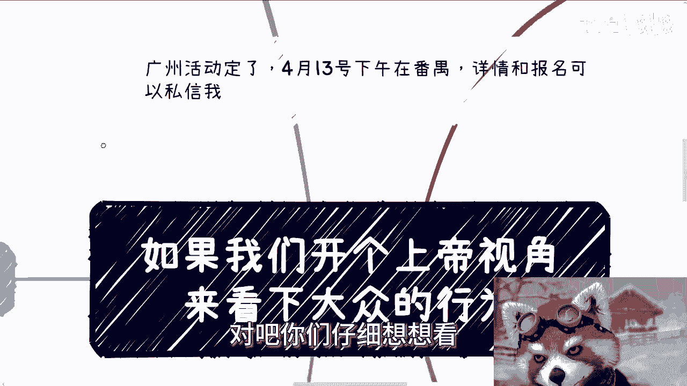

## 总结与行动指引 🚀

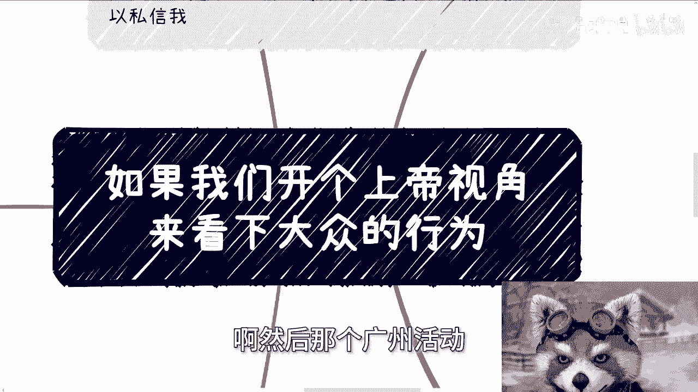

本节课中，我们一起学习了从上帝视角观察到的四种常见大众行为模式：
1.  盲目拥挤于“独木桥”，排斥其他可能。
2.  沉浸于自身短板与过去，不愿改变。
3.  行动漫无目的，如同赌博。
4.  过度关注他人与外部，忽视自我积累。

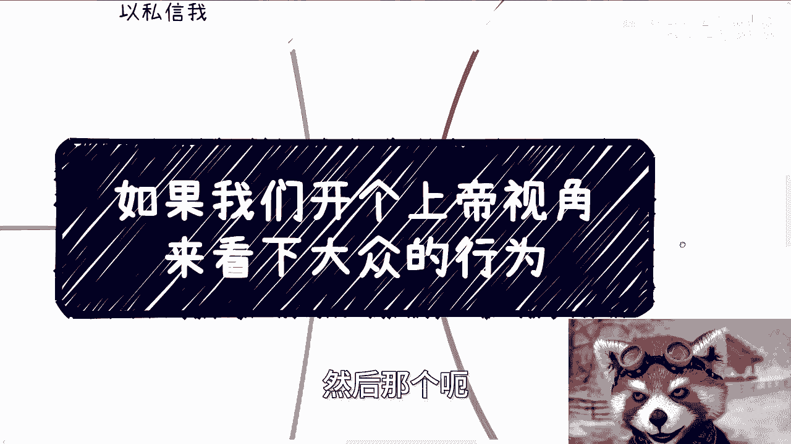

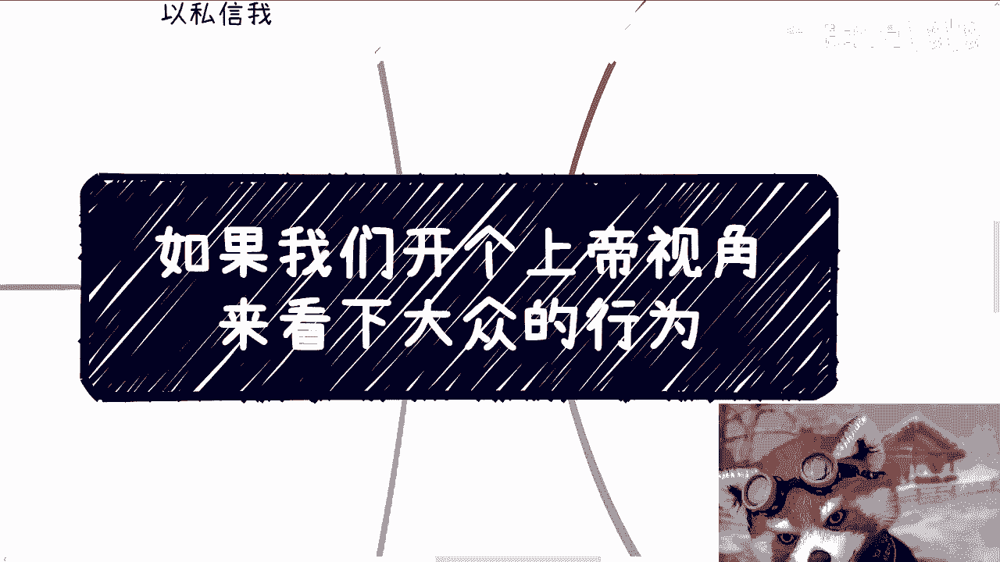

要打破这些模式，核心在于：**将目光从外部、从过去、从短板收回，聚焦于当下自身的成长与有效积累，并为自己的行动设立清晰目标。** 记住，能为你的人生负责并持续关注过程的，只有你自己。