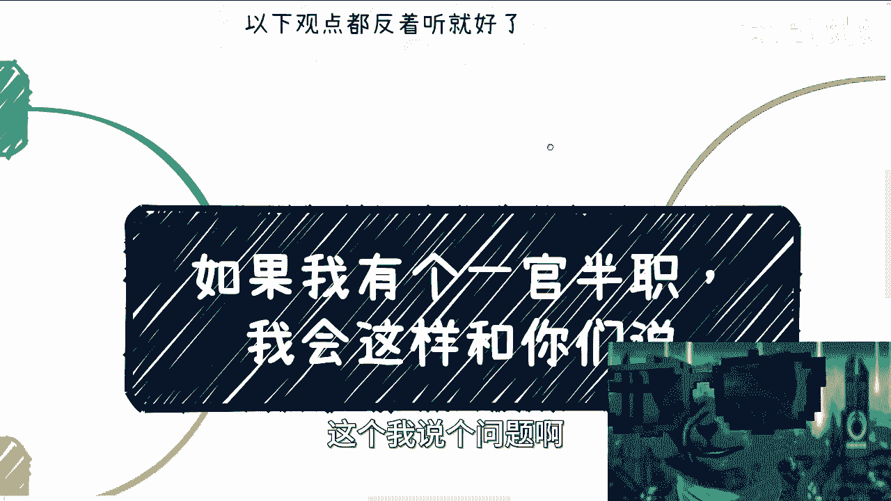

# 课程名称：信息甄别与独立思考 🧠 - P1

## 概述

在本节课中，我们将要学习如何识别不同立场下的信息差异，并理解为什么来自不同背景的人会给出截然相反的建议。我们将通过一个假设情境——“如果我有个一官半职”——来剖析信息背后的立场与局限性，从而帮助你建立更客观的判断力。

---

## 信息提供者的立场差异 🤔

最近咨询的人很多。通过交流发现，大家也会咨询其他人。无论从社会地位、头衔还是个人包装来看，我可能都不如别人。因此，我给出的建议和方案可能与别人大相径庭。

所以，我需要在此说明。首先，以下观点，尤其是这个大标题下的内容，大家一定要“反着听”。请不要被我误导。

我想说明的是：如果我有一个一官半职，我也不会像现在这样跟你们讲话。我之所以能给出相对客观的经验，正是因为没有那些束缚。我认为我的建议相对客观，主要有以下几点原因。

上一节我们介绍了信息提供者立场不同会导致建议差异，本节中我们来看看具体有哪些因素影响了建议的客观性。

以下是支撑我观点客观性的几个核心因素：

1.  **业务范围广泛**：我的业务贯穿了老百姓、企业、高校、政策四方，同时涉及1~3线城市。最关键的是，直到明年、后年，我依然身处一线战场，而非脱离市场空谈理论。
2.  **立场无束缚**：我没有被任何东西束缚，即“屁股没有决定脑袋”。但凡我有个一官半职，就不可能像现在这样讲话，否则早就被举报了。
3.  **无特殊背景**：我没有任何特殊背景，一切靠自己走到现在。上上下下、三教九流的人都接触过，了解社会的真实面貌。

---

## “一官半职”下的标准话术 📜

那么，如果我真的有一个一官半职，我会怎么跟你们讲呢？

以下是几种典型的、符合其立场的标准建议话术：

1.  **唯一出路论**：“好好读书，这是你们唯一的出路。” 否则，难道要说读书没前途、打工没前途、公务员未来不稳定吗？那样的话，我可能看不到明天的太阳。
2.  **鼓励创业论**：“好好创业，这才是你最大的舞台。做得好可以赚大钱，会有投资，打工不如自己做老板。” 但现实是，在经济下行期，创业九死一生，投资方也变得极为谨慎。
3.  **压力动力论**：“好好生三胎，生了之后才知道自己压力多大，有了压力才能更努力去赚钱。” 这是一种将个人压力与奋斗强行绑定的逻辑。
4.  **形势大好论**：“一片大好啊，经济已经反弹，大家蓄势待发，就准备All in了。” 例如，鼓吹元宇宙、AI等概念，声称未来有很大发展，许多产业会被AI替代，鼓励大家全力投入。

---

## 现实与话术的割裂 🔍

上一节列举了标准话术，本节中我们来看看这些话术与现实情况之间的巨大割裂。

*   **关于AI与机会**：很多人觉得AI好，要All in。但若追问AI如何具体替代人工、需要多少年、普通人如何从中赚钱，他们往往一问三不知。**公式：盲目All in ≈ 成为韭菜**。
*   **关于经济复苏**：话术会说“老百姓消费热情高涨，很有钱”。但事实是，除了家底厚实的，许多普通年轻人和家庭的实际情况惨不忍睹。这半年咨询下来，闻者伤心。
*   **关于政策与机会**：现实情况复杂，并非“非黑即白”。有政策不代表有机会，没有明确政策也不代表没机会。例如，某地举办行业大会释放信号，这算机会吗？如果我说“这是先机，要抓住”，会有人说“政策没落地都是内定”；如果我说“等政策明确再说”，那又成了不切实际的空话。**核心概念：现实 ≠ 二进制（0或1）**。

很多时候，信息并非只有对错或真假，不是二极管思维。每个人提供的信息都受其经历、立场（“屁股”）和视角局限性的影响。

---

## 总结与核心要点 🎯

本节课中，我们一起学习了信息甄别的重要性。

1.  **立场决定观点**：信息提供者的社会角色和利益立场，深刻影响其输出内容的倾向。“一官半职”的身份会要求其输出符合主流、安全的话术。
2.  **识别标准话术**：诸如“唯一出路论”、“鼓励创业论”、“形势大好论”等，往往是脱离复杂现实、简化矛盾的标准化建议。
3.  **拥抱复杂现实**：真实世界不是非黑即白的。机会与风险并存，政策与市场动态交织。判断时需要结合具体情境，避免二极管思维。
4.  **培养独立思考**：在接受任何信息时，都要思考信息背后的提供者立场、利益驱动和视角局限性。这能帮助你过滤噪音，更接近事实本质。

希望你能明白，每个人讲话都有其立足点和利益驱动。在这片土地上，能像我这样不受束缚、愿意分享真实观察的人可能不多。这既是因为组织结构，也是因为我仍希望能为普通人做些实事。本课程就当是一次启发思考的探讨。