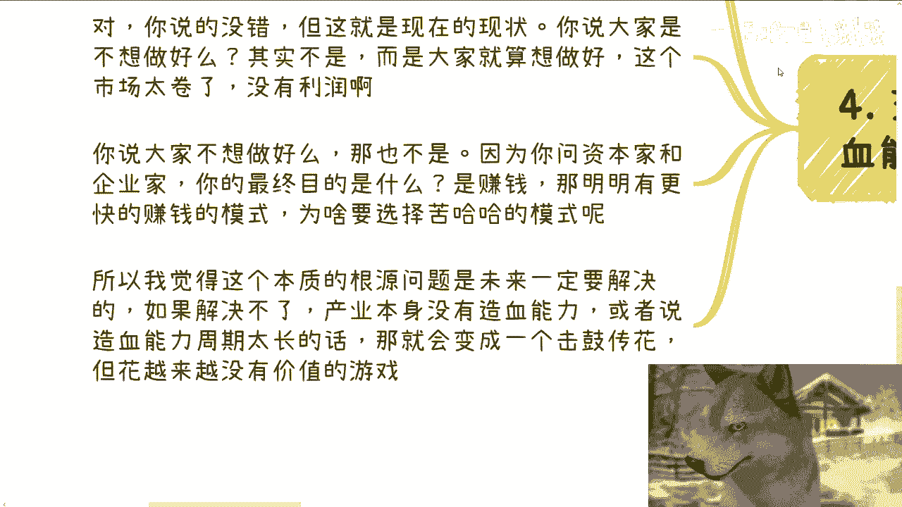

# 如果某一天增发印钱了-会不会增加很多工作岗位---P1---赏味不足---BV12U411U7HM_

## 概述
在本节课中，我们将探讨一个常见的经济问题：如果政府增发货币（即“印钱”），是否会显著增加社会上的工作岗位。我们将从资本流向、产业盈利能力和市场现状等多个角度，分析这一过程在现实中可能如何运作。

---

## 下一期活动预告 🗓️
下一期活动已经确定。活动将于8月25日在西安举行，地点位于西安建筑科技大学李家村附近。活动主题将围绕不同企业的offer选择（如国企、央企、民企、外企），以及自媒体、跨境电商等领域展开。最后，活动将帮助大家展望行业现状与未来。想要报名或了解详情，可以私信我。

---

## 核心议题：增发货币与就业的逻辑链条 🔗
今天我们讨论的主题是：如果某一天增发货币了，会不会增加很多工作岗位。你们可以先思考一下。我记得可能在某次充电视频中提到过，但没有展开讲解。

前两天和朋友聊到这个话题，我们谈到了美国大选、美国降息，以及可能出现的经济小高潮。在这个问题上，我和对方产生了分歧。

他认为会有比较多的岗位增设出来。逻辑链条是：政府将钱给到资本，资本流向企业，从而带来一段时间的经济上涨，之后可能再次下跌。我问他，为什么资本要流向产业？他认为，这是为了整个产业的发展，也为了增加税收，最终报告数据也会比较好看。当然，目前报告数据本身可能存疑。

我稍微思考了一下，根据我的认知，我与他有分歧。我对他说，我认可你描述的这个逻辑，但在我看来，这个逻辑很可能只会在脑子里过一遍，而不会真正落地执行。我们来分开说明。

---

## 第一点：税收的来源问题 💰
首先，我说说税收的问题。税收确实重要，但钱是哪里来的？税收的钱不还是政府印发出来的吗？政府发钱到资本手里，资本到企业手里，企业到个人手里，个人领了工资，然后产生了税收，税收再交给政府。这个过程是不是有问题？

当然，有人会说，也许是有问题，但现在很多产业不就是这个样子吗？正因为现在很多产业是这个样子，所以我才会得出结论：不会再这样了。为什么？因为这没有意义。

你们有没有想过？要增加税收，除非资本投资的企业、企业所在的产业本身是盈利的，有造血能力。例如，政府投入100万，企业能在一年内创造500万甚至1000万的产值。这样谈税收，我才相信。正因为我觉得这个老把戏以前大家都做过了，已经玩烂了，现在大家更聪明了。所以，这些老把戏在脑子里过一遍就好了。

---

## 第二点：资本与企业的根本目的 🎯
我的观点是，只要政府发下的这笔钱给到的资本家和企业家，他们大可以在形式上走一遍这个把戏，然后套出更多的利润，或者说以更少的时间套出更多的利润。意思是，投资、创业、开设岗位都可能会进行，但无非都是走个形式。因为资本和企业家都是为了赚钱，不是为了来做产业的，也不是用爱发电的。

当然，这一点可能大家存疑，我后面会说明。更何况，大概率这个产业根本就不赚钱。你们想想看，美国大选降息，会刺激什么产业？肯定是一些相对比较虚的、泛高科技类或泛前沿科技硬科技类的产业。这些产业怎么盈利呢？

所以，你说是不是有波小高潮，我不知道。但是，就算岗位开出来，也是小范围的或者虚设的。根本不会存在大面积的岗位开放，也根本就不会存在真正的大面积的岗位开放。为什么要去真的走一遍呢？完全没必要。走一遍除了浪费钱，还能干嘛呢？

---

## 第三点：近年市场现象的印证 📉
近几年看看OFO、滴滴、新能源电动车，看看最近几年其他的产业，不都是一个套路吗？这叫雷声大，雨点小，或者说就是媒体声音大，岗位少。我别的不说，人工智能AIGC从去年到今年讲得多大，吹得多大，声音多大。我就问你们开了多少岗位？你们但凡找过工作的，心里没数吗？

---

## 第四点：问题的本质在于造血能力 ❤️
这件事的本质还是在于没有造血能力。当然，我在这里首先提一点，我指的造血能力并不是单纯说盈不盈利。我指的造血能力更多是一个体系，包括政策、印钱的增发、钱怎么用、怎么监管。这是一个整个体系才会形成的造血能力，不是说单纯有没有。

我相信有小伙伴看到第三点时会想：如果资本家、企业家都不想做好，那么产业本身就好不了。你说得没有错，但这就是现在的现状。我们就这么问：大家是不想做好吗？不是，而是大家就算想做好，这个市场太卷了，没有利润。就像我之前跟你们说的，我们创业是我们不想创好吗？我们但凡想好好创业的，哪个人不是背几千万贷款？我就问你愿不愿意背？你摸着你良心回答。

那么，你说大家不想做好吗？那也不是。因为你问资本家跟企业家，他们的最终目的是什么？他们都回答是赚钱。那我就问，明明有更快的赚钱模式，他们就在手上过一刀，走一遍形式，那为什么要去选择苦哈哈的、真的把这个钱投下去、开岗位，以及在开之前就知道赚不到钱的方式呢？为什么呢？

这些事情放到个人身上，扪心自问。你不要站在道德制高点来批判我，或者批判这些人，你没有资格批判，我也没资格。所以我觉得这个问题的根本源本源就是我说的，它是有一套流程、一套体系，包括监管、创业、造血能力。必须有办法解决这个东西。如果解决不了，产业本身没有造血能力，或者说造血能力周期太长的话，那就会变成一个击鼓传花。

就像我们之前举过滴滴的例子，滴滴整个花了10年的时间才盈亏平衡。你不觉得滴滴本身就是个击鼓传花吗？以前传花的早就出去逍遥自在了，但是现在这个花越来越没有价值了，对老百姓也是成本越来越高的花。这不就是一个击鼓传花吗？

---

## 第五点：未来可能的情景 🔮
那么，我们反过来说，如果未来真的某一天，比如降息了，中国增发货币，给更多的钱到了资本方、地方政府手上，那么问题来了：怎么样对他们最有利呢？那当然是造出一个新的“花”来击鼓。但是，问题是大概率这个新造出来用于击鼓的产业，它没有利润，没有造血能力。你开这么多岗位，除了烧钱，还有别的用处吗？没有了。那为什么要烧这个钱呢？有毛病吗？

所以，反正我是这么个观点。大家就当我把我们当时的聊天复述出来，给大家可以了解了解。

---

## 总结
本节课中，我们一起学习了增发货币与就业岗位之间关系的复杂性。我们分析了从政府到资本，再到企业的资金流向，并指出如果目标产业缺乏真正的盈利能力和造血体系，那么新增的货币很可能不会创造大量实质性岗位，而可能只是在体系内空转或催生虚设岗位。问题的核心在于建立一套能够确保资金有效转化为生产力和真实价值的监管与市场体系。

---

## 附加服务与活动提醒 📢
活动提醒：8月25日在西安的活动，要报名或咨询详情的，可以直接私信我。

另外，我发现在职业规划、商业规划方面，很多小伙伴对于未来一到三年、三到五年还是蛮有焦虑感或规划需求的。在职业规划、商业规划，包括你们自己主业副业的平衡、主次分不清楚，或者应该怎么规划不清楚，以及股权、股份、分润、分红、合同等方面，如果你们希望透过我的一些认知和视野，获得更接地气的建议或少走弯路，那么你们可以整理好对应的问题和个人背景，我们再来进行咨询。

现在讲完已经12点45分了，我加完字幕就会发出来。