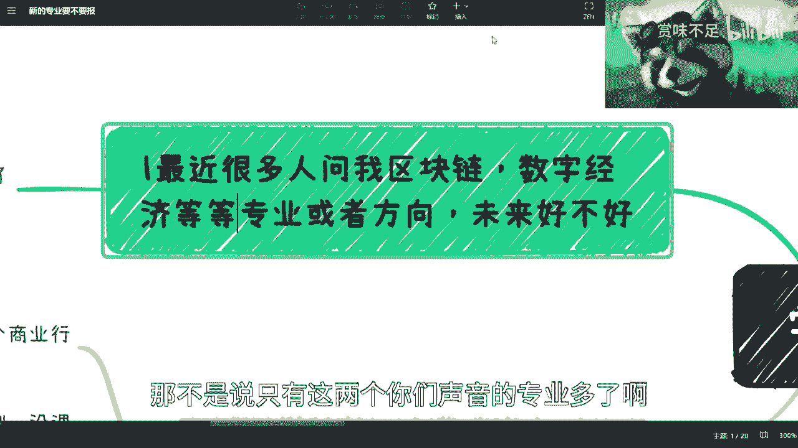

# 学校新的专业和方向要不要选 - P1 - 赏味不足 - BV1fL411m7Cu

好啊大家好，这个最近呢因为聊呢都有很多人在问啊。

说这个区块链专业对吧，还有那个数字经济专业啊，我也这个私信让他们发，我看了一下，就是他们的这个课程内容，就看完之后我就一言难尽，就他们因为很多还是很年轻的嘛对吧，就说啊这专业要不要选啊。

或者现在已经选了对吧，包括就有本科啊，研究生的这些啊，就是说对这些呢其实唉就就就怎么说呢。

就是说大家了解的还比较浅哦。

我在这地方首先说一点吧，就是说首先呢你整个高校啊，不管他是什么技校啊，职校啊，985211啊对吧，还是各种东西啊，其实都一样的，那高校的水呢其实还是很深的哦，我而且我跟你们讲优势有很多啊。

我这边就不说了，这属于嗯对吧，那简单来讲呢，就是说你们但凡以后只有去涉及到相关业务，你们才会知道不涉及的。

其实唉都是以讹传讹啊，没什么很大的这个东西啊。

但我在这个地方呢，主要今天要来讲的是什么呢，就是这个很多人都在问嘛。

就这个新的专业要不要报对吧，包括这个专业报了之后，这个这给出路怎么样对吧。

我索性就简单的说一下啊，首先你比如说区块链专业或者方向对吧，那当然这个可能还有数字经济对吧，我帮你们加上数字经济等等啊等等，那不是说只有这两个你们声音的专业多了啊。

我只是给你们举例子啊对吧，微量好不好对吧，你说啊这个核心是什么，就是肯定有一些新的专业，包括数字经济对吧，就整个你们去看那个课程，其实这个东西不用我讲，你们也能知道，就是整个这个课程的课。

在整个这个专业的课程，他其实就是个缝合怪对吧，就是说我比如说你说什么叫数字数字经济对吧，你上上下下有几个人知道数字经济，那数字经济什么人家啊，不知道不知道怎么办了，那没关系啊对吧。

计算机哪两个哪两个课程，金融哪两个课程，对不对，什么通信哪两个课程，对不对，人或编程编程那边在呃，那个那个计算机软件相关在哪两个课程对，软件工程在哪两个，反正就这么写吧，数字嘛经济嘛对不对。

但我跟你们讲，你们这种这种课程学出来有卵用啊，你们自己想看有卵用，就是就是你知道吗，就是专业这个东西啊，其实你学的广，你本身还不如学的精，你说对吧，你说你说你你一个3年的专科，4年的本科。

你如果33年四年你专攻一个东西啊，我觉得出来不管怎么样，我们称之为叫做有一技之长的对吧，你3年四年在那边啊，这边学两个月，那边选两个月，这边学个入门，那边学个入门给出来嗯，唉我也没说错啊。

的确什么都不会是吧，你会啥啊，你说啊，然后这是第一个，第二个呢就是我跟你说，新的专业他都有什么现状呢，我跟你讲都一样啊，首先你要明白专业这个东西啊，对于你们来讲它是一个课程啊。

包括对研究生来讲他是个课题，对你们对你们老师，但是呢专业这个东西本质上是一个商业行为，就是我一直跟你们提的这个商业思维对吧，包括商业逻辑，就它是个商业行为，什么意思呢。

你就是它本身就是个利益的一个关系对吧，就是我今天满足了，是不是满足我KPI对吧，我是不是赚到钱了对吧，或者怎么样，那学校里面有回扣的，你们不要以为你们的学校你们校长没有回扣啊。

这个事情哎呀我就不多说了对吧，没啥好说的是吧，就都这样啊，所以呢就是简单来讲，你们要要觉得学校为你们好，NO NO NO NO NO啊，不可能出现这种事情的，就是没有一个商业行为，一个人是来做慈善对吧。

这就好像我跟你们说，就是我也是一样的，你说我今天在这个地方做视频，我是来做慈善的吗，不是我就不是来做慈善的，我为什么在视频里面跟你们提很多咨询，是因为我也希望你们来咨询对吧，因为有很多真实的细节问题。

你们的确咨询了才能够解决问题对吧，我也希望你们来付费咨询对吧，我也不是来做慈善的，但是话又说回来，就是本质上对吧，我要去赚钱，我要做很多事情，我也不是来就是给C端去做的，我本身的服务的对象还是对吧。

就是他们竟然去薅别人的羊毛，那没关系啊，那我去薅学校跟政府的羊毛嘛，对不对，嘿嘿对吧，那我本身服务就是企业，政府，包括高校对吧，所以说我觉得这个事情对我来讲，就是一码归一码啊。

那么第二呢就是说呃你新的专业对吧，我跟你们说很清楚的，不管是什么新的专业，我可以就是打保票给你们讲，没老师，没教材，没实验，没案例，没课程，反正什么都没有哦，那也就是为什么会出现这么多。

很神奇的这种课程，就是你会发现他的课程的内容，跟他的这个专业的方向，专业的名字完全不搭，嘎对啊，那么第三个呢，那请问你怎么办对吧，那高校当然有的是办法啊，采购啊，招投标啊对吧，缝合是吧啊，我跟你们说啊。

就是啊我可以说一点吧，就是中国多少高校你们可以去多少所高校，你们可以搜一下对吧好，我跟你们这么说吧，中国有很多的高校啊，一年的预算费用放在高校里的都是上亿的啊，你们想想看上亿的什么概念啊。

就是投到什么地方去了，对吧，这钱干嘛去了，你们自己想啊，我就不说了对吧，所以你们记住一切都是KPI啊。

一切都是KPI，没有什么区别啊，这当中的利润，这不是百分之几十的问题了。

是百分之几百的问题，那么第三呢就是而且呢课程还是落后的，那我们简单来讲，你比如说现在有很多人问我区块链对吧，数字经济是吧，好我就跟你们讲啊，首先你就拿区块链来讲，我就问你们高校里面哪个老师分得清楚。

web3跟区块链，你们随便拎一个出来啊，你哎你别别人别说啊，你来找我找我pk，那你妈哪个人搞得清楚，他懂个屁啊，啊没有在这个行业这么多年跌打滚爬过来，谁他妈搞得懂个屁啊，他妈每天在那边做研究。

做学生能懂个啥啊，除了纸上谈兵，除了不接地气，接地府以外，还能懂个啥对吧，他能搞得清楚现在就业情况吗，他能看得到整个行业横尸遍野吗，有吗，一群鸡你知道吗啊我跟你们说，我当时在北京的时候还有个教授。

哎呀搞笑的很诶，怎么回事对吧，在北京搞销售狠啊，你们知道吧，就当时我跟我那个在在一个演讲上面，你知道吗，我在那边讲什么呢，我在那边讲这个token啊，我就说我说啊token呢是由智能合约对吧。

来生成的啊，那它能够有很多很多作用啊，然后那个教授呢就来说啊，这个东西中国不允许的啊，中国这个是这个不合规的，然后我直接在他妈的就100多号人面前怼他，我说他妈的谁跟你说不合规了，你帮我。

你给我拿出来哪个法律法规说不合规对吧，我说我说你作为一个高校老师对吧，你做事情要严谨啊，别以讹传讹，听到风就是雨，你们他妈中国做老师就这个吊样子，现在是吧啊，然后你比如说第一点。

你看啊咋搞的清楚国内区块链现在现在情况吗，有多少区块链企业盈利的，有多少做区块链人盈利的对吧，搞不清楚啊，他就他就知道在那边以讹传讹对吧，高校告诉你们，我的大趋势啊，大方向你们要学啊。

好学校出来全部失业，哼你们自己看着办，我跟你们说啊，你们别别那个对吧，第二个web3，从头到尾咱不说web3以后，我是看好web3的啊，但是我不想从头到尾到现在，99%都是投机分子啊。

还有1%我可以说有人做事情的，不是没人做事情啊，都是投机分子，你指望一个高校毕业的人，你进去卷你卷的过谁，你告诉我啊，这里面哪一个不是被割过的，不是被割过十几万，几10万的，你就是想卷别人卷的过谁啊。

更何况大部分人也出不了国，你出不了国，你做马尾也不算对吧，这没点逼数，我跟你们说啊，第二呢就是你说导师为什么要做项目，诶这个木呢，哎呀就他妈的嗯对吧，为什么要做项目，当然是为了用学生这样的免费劳动力啊。

回头呢他就说他做了什么牛逼的项目，申请了什么牛逼的补贴对吧，申请了什么什么国家级的东西对吧，反正跟你们没有关系，你们就负责毕业，失业就结束了，对不对，不就这个样子吗，是不是我跟你们说。

你们但凡做这种区块链或者数字经济的东西，你就去问你们老师，你就问他哎，很简单，为什么问题，那你告诉我，你解决了你解决了什么痛点问题，对吧有吗有吗，二你告诉我你怎么赚钱，是吧。

那你你你告诉我为什么一定要用区块链，或者这个这个他说的这种方案啊，那历史上没人做了吗，啊，还是还是说这个没没人有他聪明，对吧就是就是他他本身就是PUA啊，一顿就是POA啊，你知道吗。

其实本质上都是他妈重复造轮子，而造的是没有用的，轮子没有任何用的，他除了是骗补贴，他还能干嘛呢对吧，那也就骗骗学生了对吧，第四我跟你们说，高校现在里面不但与行业不接轨，课程内容还落后，你们想想看。

数字经济也好，区块链也好，新兴行业包括新能源，对碳中和啊，你新型行业最大特点是什么，就是技术啊，内容更新快啊，行业变革快啊对吧，现在高校现在最大特点是什么，接脱轨是吧，你你弄啊。

我跟你们说什么情况就弄一个好一个专业，比如说2022年弄好一个专业，可以啊，结束了啊，跟行业有什么关系啊，咱就上呗，招完人上上4年，还有4年，4年后不知道啥样子，我跟你们说是吧，数字经济更是上上下下。

有几个人潜心研究过数字经济啊，啊他知道什么是数字经济啊，他妈的数字经济怎么发展啊，他知道个屁对吧，还他妈开专业啊，开开个毛啊，真的是是吧，然后你看最后一个，你看你说有你问我有没有前景对吧。

我跟我就跟你讲，这事不用我来回答，你先思考一个问题，专科3年，本科4年对吧，然后3年后4年后，你包括研究生对吧，硕士这边你读3年，我们加起来7年对吧，你比如说你能预料3年后4年后的事情吗，你谁能预料啊。

你不要跟我说，他妈的拉出高校，谁能知道未来34年后，这些新兴行业的发展情况是吧，就我跟你讲，但凡能预料的是不会告诉你们的，为什么，因为这些钱他自己赚了就结束了，而且或者说告诉你们也无所谓。

因为这些钱你们也赚不到对了，然后第二点你拿着红头文件，你比如说啊你看到国家大力支持扶持，是扶持扶持跟你有个蛋关系，你你你一个区块链专业，比如说4年后对吧，出来大概打个比方，出来500万毕业生。

周500万问题，先做什么，拿政府扶持吗，拿政府养老金了啊，低保吗啊跟你有什么关系啊是吧，那第三点就我之前说过了对吧，之前是以前是30年河东，30年河西，现在别说30年，3年三个月就可以河东河西了对吧。

所以我跟你们说，真的就是哎呀，就是我之前说职业教育，那个时候就我不是有一期说职业教育嘛。

说职业教育这个时候呢我就就说过了，这是一个生态上的问题，你知道吗，学生都是无辜的啊，年轻人都是无辜的，就是就是大家都想去弄新的专业，或者早期的方向，不想在老的地方卷，这是没有错的，但是问题是什么。

问题是你们花了3年四年去学生的方向，你们学出来的东西根本与行业不接轨啊，你知道吗，而且脱轨脱的厉害呀。

哎我有时候说句实话啊，我有时候说句实话是什么呢，就是这些专业培养出来不是学生。

也不是未来的人才，是未来茁壮成长的韭菜，你知道吗，就你们出来只会被隔，没有别的选择，没有别的出路了，你们出来的时候会永远觉得啊，老子要赚钱了，老子是一个新兴行业，我碾压你们所有的这群垃圾。

但事实上是什么呢，事实上是你根本就不接地气，对于行业来讲，你就是个新型韭菜。

没有区别的，你知道吧。

唉所以呢就是这样子的啊，就是我觉得吧你们就大部分学生啊。

你们虽然分不清楚，就你说有哪些新的专业要不要报。

但是我跟你们说，你们我觉得也很简单，就是你们去看一下他那些课程，但凡里面那些课程就是瞎瞎给你搞的。

你都不要去报对吧，你一看就是个缝合怪对吧，就是一个就是一个，就是就是就是把各个不同的专业对吧，这边拉两个，那边拉两个，这样就比较保这种报了没有用，你知道吗，就不管你是什么学校，报出来都没有用。

没有区别，因为它跟它的DNA，它的根里面就是不就是就是不行的好吧。

