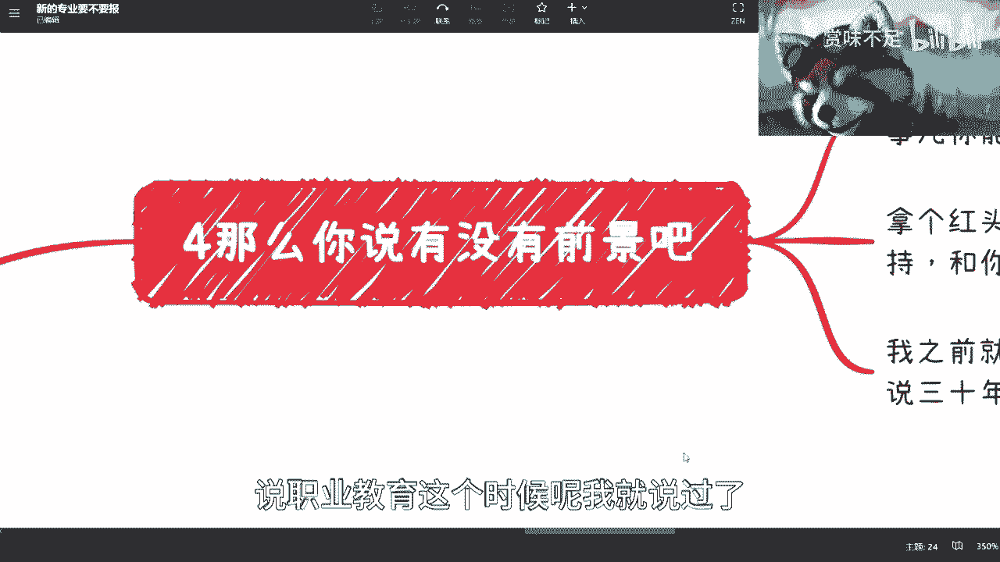
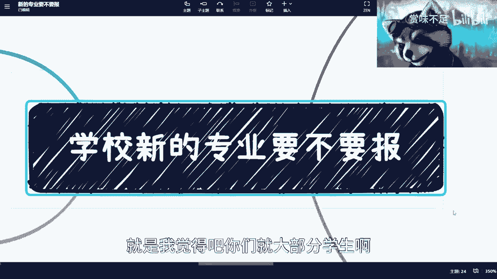
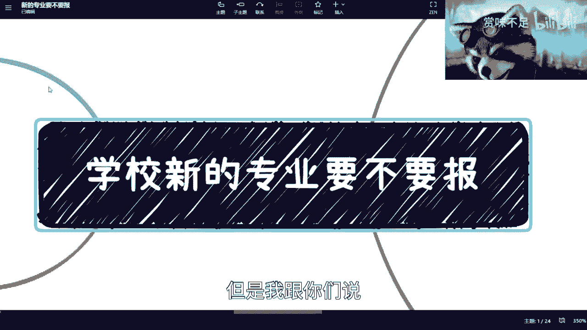
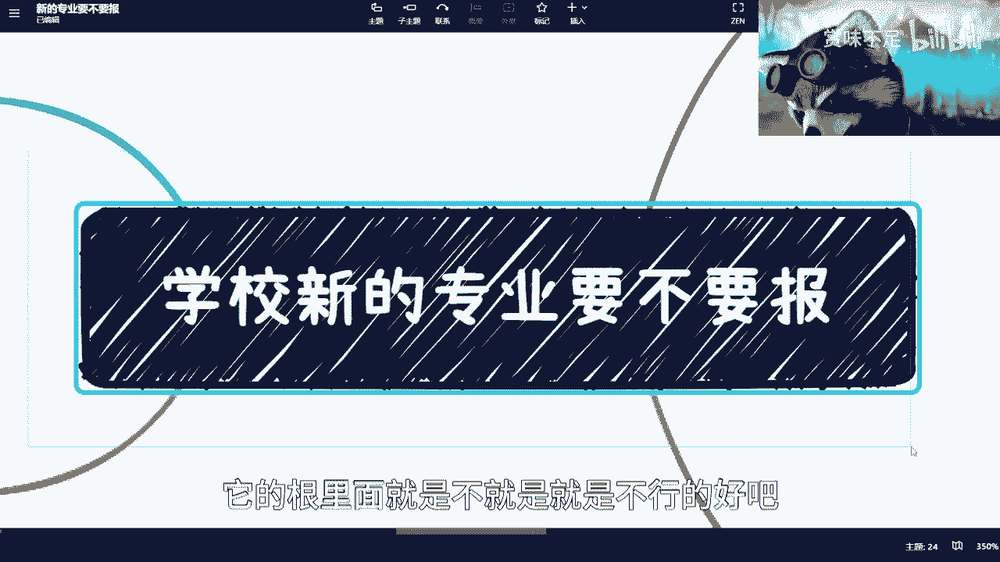

# 课程01：如何判断新兴专业是否值得选择？🤔

在本节课中，我们将探讨一个许多学生和家长关心的问题：高校新开设的专业（如区块链、数字经济等）是否值得选择。我们将分析其背后的逻辑、潜在问题，并提供清晰的判断方法。

---

## 概述：新兴专业的普遍现象

近期，许多人询问关于区块链、数字经济等新兴专业的选择问题。在查看了相关课程内容后，我发现存在一些普遍现象。许多学生，包括本科生和研究生，对这些专业的了解仍比较浅显。

首先需要明确一点：无论是技校、职校还是985、211高校，其内部运作逻辑有相似之处。高校体系复杂，水很深。对于未亲身涉足相关行业领域的人来说，很多信息实际上是以讹传讹，缺乏实质内容。

本节我们将聚焦于一个核心问题：是否应该报考这些新兴专业，以及选择后的出路如何。

---

## 核心问题分析

以下是对新兴专业（以区块链、数字经济为例）的几个关键分析点。

### 1. 课程设置是“缝合怪”

许多新兴专业的课程设置存在根本问题。以“数字经济”为例，其核心定义模糊。课程设置往往成为不同学科的简单拼凑：从计算机、金融、通信、软件工程等专业中各取几门课程组合而成。

这种“广而不精”的培养模式存在弊端。在三年的专科或四年的本科学习中，如果每个领域都只学两个月入门，那么毕业时很可能“什么都不会”。相比之下，专注于一个领域学习三到四年，至少能培养一技之长。

**核心公式**：`低质量课程 ≈ 计算机课程 + 金融课程 + 通信课程 + ...`（简单叠加）

### 2. 专业设立本质是商业行为

必须理解，高校开设新专业本质上是一种商业行为，遵循商业逻辑。其动机可能包括完成KPI、获取经济利益（如项目经费、补贴）等。学校并非慈善机构，其决策首先服务于自身利益。

这就像我做视频和提供咨询，虽然能帮助大家，但最终也希望获得合理回报。高校的运作同样如此，其服务对象和利益链条更为复杂。

### 3. 教学资源严重匮乏

对于绝大多数新兴专业，一个残酷的现实是：**没老师、没教材、没实验、没案例、没成熟课程**。正因如此，才会出现课程内容与专业名称严重脱节的“神奇”课程设置。

高校的应对办法通常是采购、招投标、将现有课程进行“缝合”。中国许多高校年度预算高达上亿，这些资金的流向和效率值得深思。一切都围绕着KPI和利润运转，其中的利润率可能不是百分之几十，而是百分之几百。

### 4. 课程内容与行业严重脱节

以区块链为例，高校里有多少老师能真正分清Web3与区块链的区别？很多教师缺乏一线行业“跌打滚爬”的经验，其知识可能停留在纸上谈兵、脱离实际甚至错误的阶段。他们可能不了解行业的真实就业情况、盈利现状及残酷竞争。

导师做项目，有时是为了利用学生的免费劳动力，最终成果用于申请补贴或荣誉，而与学生未来的就业关系不大。如果你面对这类专业，可以问老师几个尖锐的问题：
*   该方案解决了什么**真实痛点**？
*   其商业模式如何**盈利**？
*   **为什么**必须用区块链或该方案？历史上没人做过吗？

很多时候，答案可能指向“重复造无用轮子”，目的仅是骗取补贴或忽悠学生。

### 5. 行业发展快，教育跟不上

新兴行业（如区块链、数字经济、新能源、碳中和）的最大特点是技术迭代快、行业变革迅速。而高校体系僵化，课程更新缓慢。一个2022年设立的专业，其课程可能沿用四年，届时行业早已天翻地覆。

数字经济本身就是一个宏大且快速发展的概念，有多少人真正潜心研究并理解其内涵与发展路径？在缺乏深刻认知的情况下仓促开设专业，效果可想而知。

### 6. 就业前景充满不确定性

关于新兴专业的就业前景，你需要先思考几个问题：
1.  **时间跨度**：专科3年，本科4年，硕士再加3年。谁能准确预测3年、4年或7年后某个新兴行业的具体发展状况？能预测的人往往不会公开分享，因为这关乎巨大利益；或者即使分享，普通人也难以参与。
2.  **政策与个人的关系**：国家扶持政策（红头文件）与普通毕业生个体关系不大。当数百万相关专业毕业生同时涌入市场时，个人如何脱颖而出？扶持资金很难直接惠及每个学生。
3.  **行业变化速度**：过去是“30年河东，30年河西”，现在可能“3个月就河东河西”了。行业变化极快，学校教育很难跟上。

---

## 总结与行动建议

综上所述，许多新兴专业存在课程缝合、商业驱动、资源匮乏、脱离行业、前景不明等核心问题。这导致一个可悲的结果：这些专业培养出的可能不是未来的人才，而是“未来茁壮成长的韭菜”。毕业生怀揣碾压他人的梦想进入行业，却因所学不接地气而更容易被收割。

那么，如何判断一个新兴专业是否值得报考？

**一个简单的判断标准**：仔细查看其课程设置。如果课程看起来是七拼八凑的“缝合怪”，从各个不同专业生硬地拉来几门课拼凑而成，那么无论是什么层次的学校，都建议谨慎报考。因为其基因和根基就有问题，很难培养出市场需要的实际能力。

本节课我们一起学习了新兴专业的潜在陷阱与判断方法。核心在于理解专业设立的商业本质、评估其课程设置的合理性，并对快速变化的行业前景保持清醒认识。希望这些分析能帮助你做出更明智的教育投资决策。