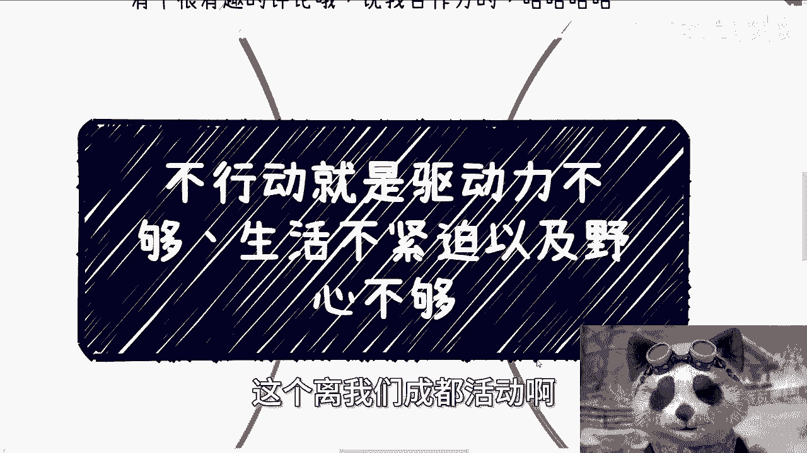

# 课程：行动力与驱动力解析 - P1 🎯

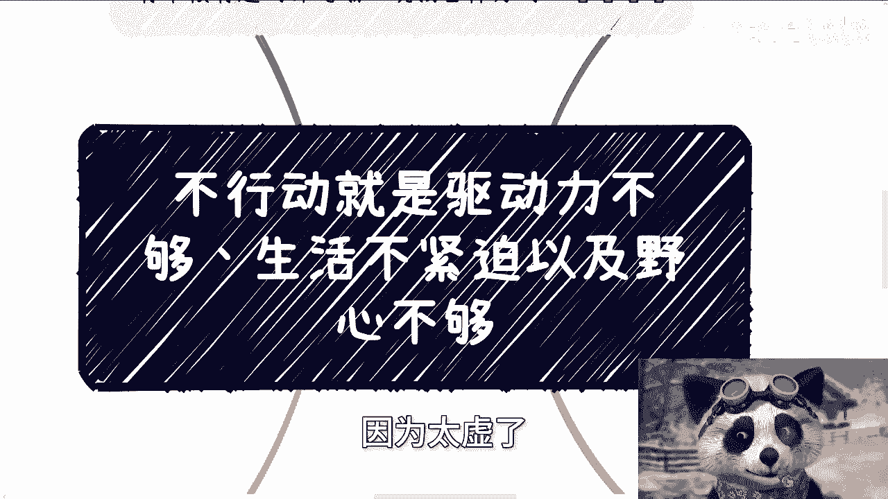

在本节课中，我们将探讨一个普遍存在的现象：为何人们难以将想法付诸行动。我们将分析“不行动”背后的核心原因，包括驱动力不足、目标模糊以及自我设限等问题，并提供清晰的思考框架。

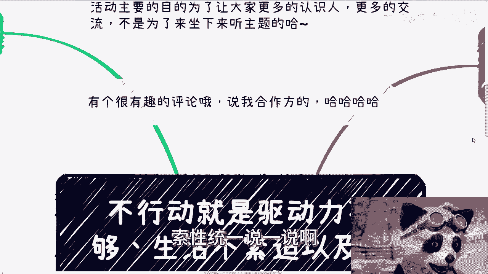

---

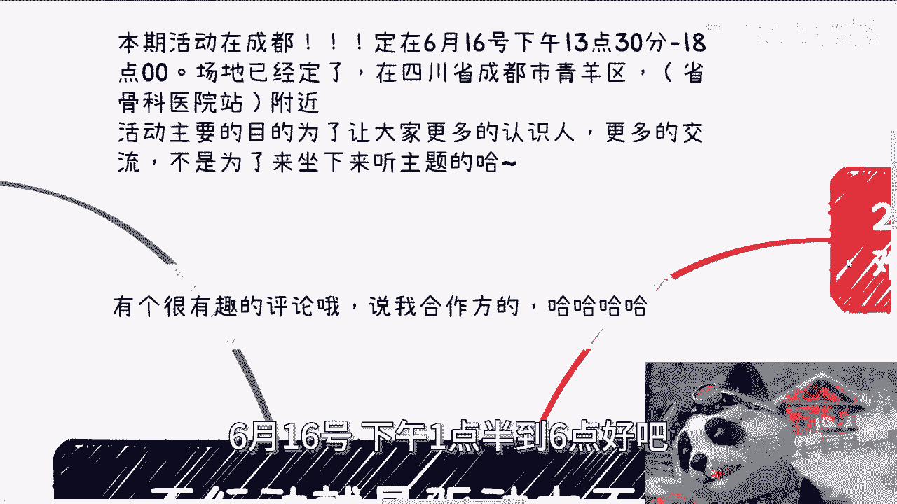

## 成都活动通知 📅

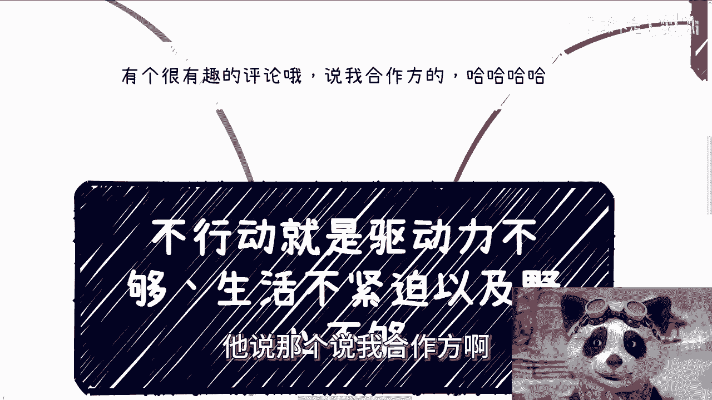

成都线下活动已确定于6月16日下午1:30至6点举行，地点在青羊区神骨科医院附近。活动详情或报名请通过私信咨询。

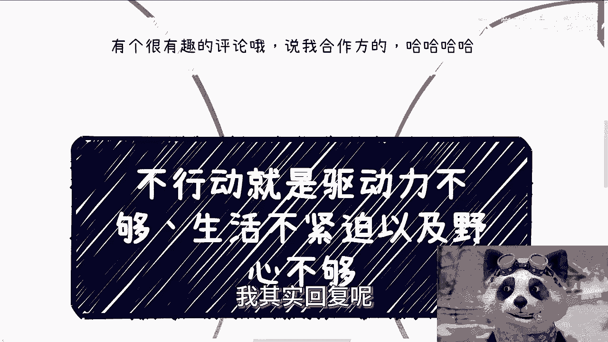

---

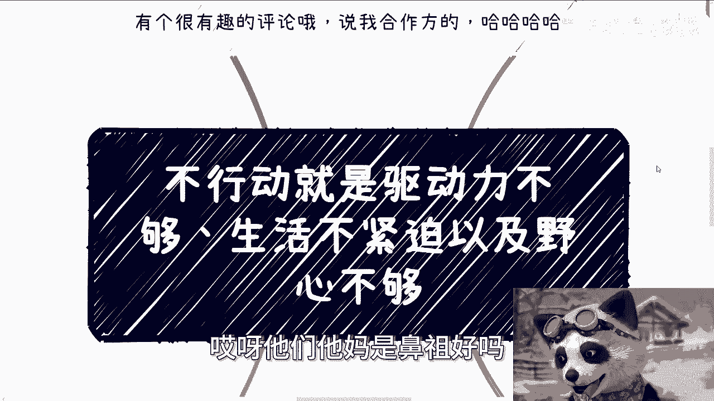

## 关于“合作”与“中介”的讨论

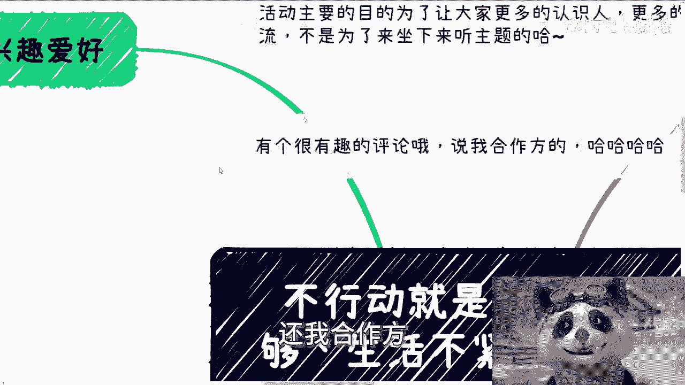

有人评论说我分享的内容像是“拉皮条”或做中介，担心被合作方看到不好。我的观点是，在商业环境中，资源对接与中介服务是普遍且基础的模式。我的合作方们大多深谙此道。因此，分享这些实践经验并无不妥。

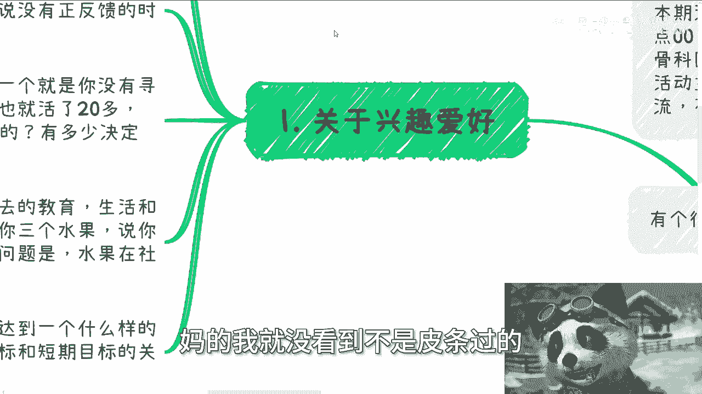

---

## 问题一：为何在兴趣爱好上难以坚持？ 🤔

许多人尝试将自己的兴趣爱好发展为事业，但遇到挫折或缺乏正反馈（如得不到认可或赚不到钱）时，就容易放弃。这背后通常存在两个根本问题。

### 1. 兴趣爱好的选择本身可能受限

很多人过去二三十年的选择和决定并非完全自主。在有限的选择范围内认定的“爱好”，未必是真正的热情所在。

**核心逻辑**：这好比从一个装有1000张纸条的黑盒子里，只随机摸到了两三张（例如计算机、土木工程），就认定这是自己的终生爱好。这个选择范围本身过于狭窄，结论自然不可靠。许多人的“爱好”其实是由过往教育、生活环境等外部因素塑造的。

**公式**：`认定的爱好 ≈ 有限环境暴露选项 ∩ 自我合理化`

因此，当你觉得在某个“爱好”上坚持不下去时，很可能因为它本就不是你真正的热情所在。

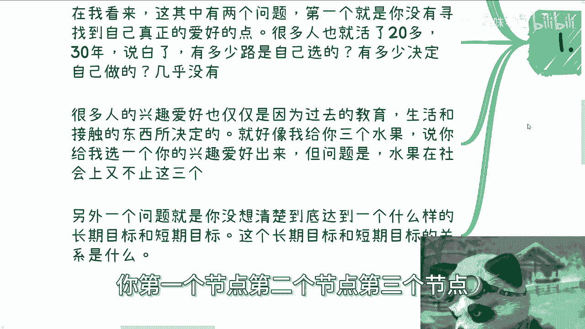

### 2. 缺乏清晰的目标拆解

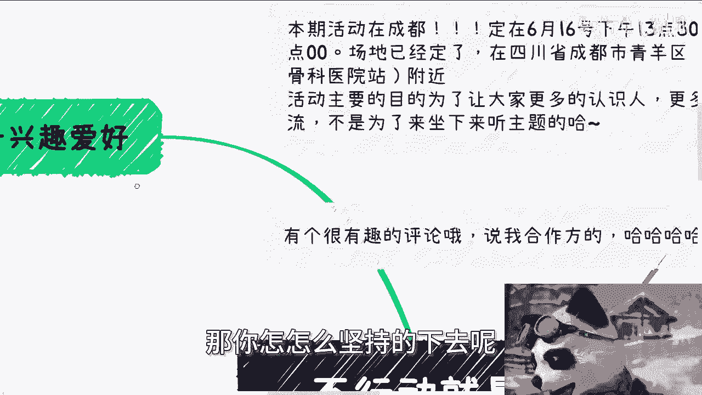

即使对某个领域有兴趣，如果只有模糊的长期愿望（如“我想在计算机领域成功”），而没有具体的、可执行的短期目标，行动就难以持续。

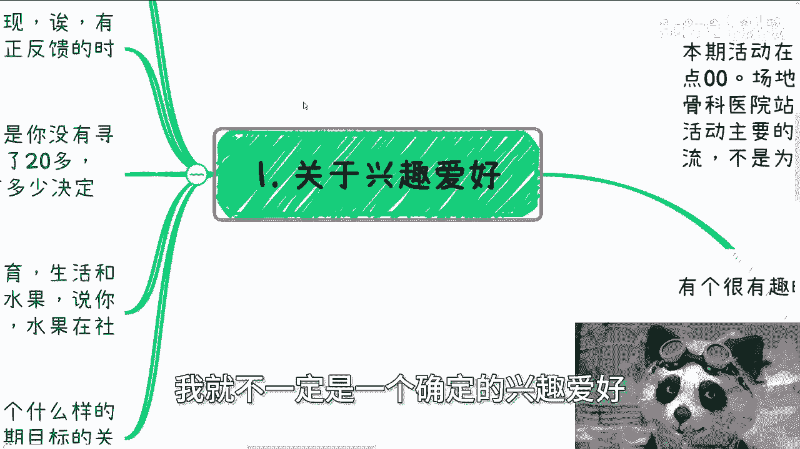

**核心逻辑**：一个不确定是否真爱的方向，加上一个模糊的目标，几乎注定无法坚持。你需要将大目标拆解为具体的里程碑（Milestone）。

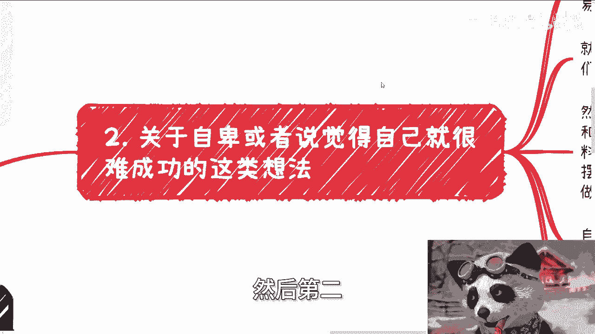

**示例**：
*   **Milestone 1**：完成一个基础编程课程。
*   **Milestone 2**：独立开发一个简单应用。
*   **Milestone 3**：获得第一份相关实习或自由职业项目。


没有这样的路线图，动力很容易消散。

---

上一节我们探讨了兴趣与目标模糊如何导致行动力匮乏，本节中我们来看看另一种常见的内部障碍：自我否定与自卑。

## 问题二：自卑与“我肯定不行”的思维陷阱 🌀

认为自己很难成功，这种想法本身常常是一种自我借口和逃避方式，并且极易陷入恶性循环。

**恶性循环的形成**：
1.  经历一两次失败或挫折。
2.  产生“我不行”的自卑和自我否定情绪。
3.  这种情绪影响后续做事的积极性和认真程度（例如，写论文时不再认真查资料、接地气）。
4.  因为消极应付，得到更差的结果。
5.  用这个更差的结果来验证并强化最初的“我不行”想法。


**关键洞察**：这个循环的起点和持续动力，往往**只来自于你自己**。外界并没有持续施加否定，是你自己在不断强化这个负面信念。指望寻求外部肯定来解决内部否定，是方向性错误。

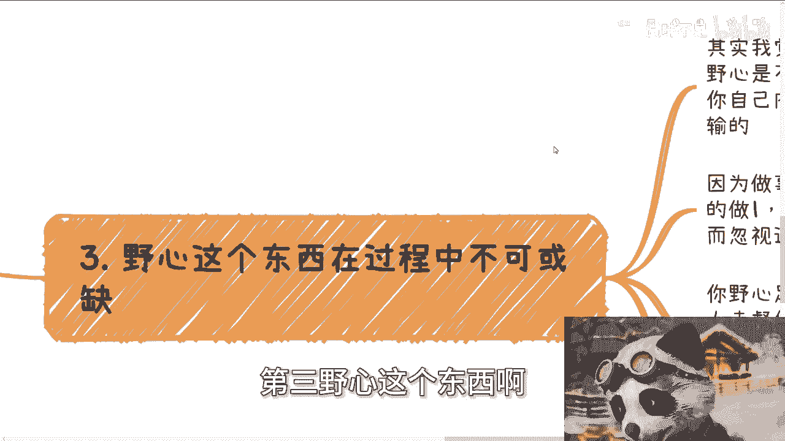

**代码逻辑描述**：
```python
# 错误的循环逻辑
while True:
    if 遭遇挫折():
        自我否定 = True
    if 自我否定:
        努力程度 = 低
        结果 = 变差()
        自我否定 = 强化(结果) # 用更差的结果再次证明“我不行”
```

跳出这个循环，需要从第三方视角审视：这种自我施加的情绪，对达成目标毫无益处。

---

克服了自我设限，我们还需要前进的燃料。接下来，我们探讨驱动行动的核心要素：野心。

## 问题三：野心是驱动与实践的起点 🚀

在行动过程中，野心是不可或缺的。它不一定需要完全切合实际或完全发自内心，甚至可以由外部灌输。

**为什么野心重要？**
1.  **提供初始驱动力**：先有“想要”的念头，才能有行动的开始。野心的正确性可以在实践中修正。
2.  **促使目标明确化**：当你的野心足够大，你无法忍受自己停留在模糊状态，会本能地去拆解和明确目标。
3.  **忽视过程困难**：强大的野心能帮助你聚焦于最终结果，从而减轻对过程中困难的恐惧。


**实践的价值**：即使失败，实践本身也具有巨大价值。
*   **实践3年**：可能撞墙多次，但积累了经验，排除了错误选项，提高了未来成功的概率。
*   **空想3年**：只有臆想，没有经验积累。

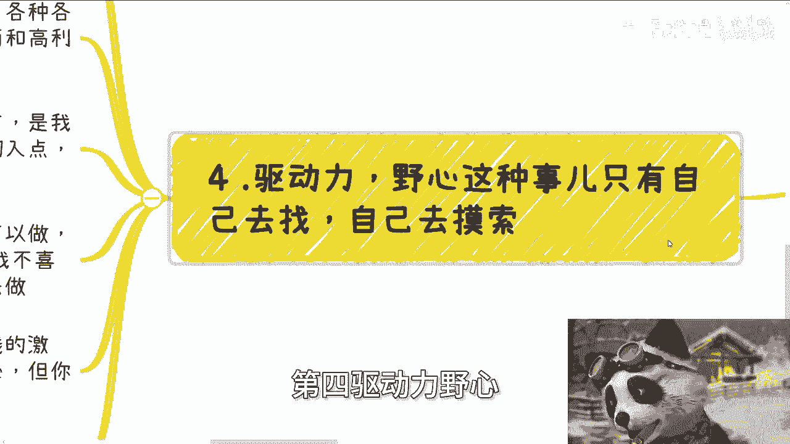

两者可能最终都未达到世俗意义上的“成功”，但前者的人生体验和认知深度远胜后者。**实践是检验和修正一切想法的唯一标准**。

---

最后，我们来探讨驱动力与野心的根源。它们从何而来？

## 问题四：驱动力与野心只能靠自己寻找 🔍

驱动力和野心很难依靠外界灌输或简单方法改变。很多人并非没有，而是没有找到能激发它们的具体方向和切入点。

**核心比喻**：人生选择如同一个装有1000张纸条的黑盒子。如果你只接触过其中的两三张（你的专业、现有工作），你怎么能断定其中没有能点燃你真正野心和驱动力的选项呢？

**外部激励的局限性**：高薪工作可以让人“表现”得有野心、有动力，但这可能是由金钱外部驱动的。一旦外部激励消失，动力也可能消退。这不能证明此人本质没有野心，只是没找到能激发内在热情的方向。

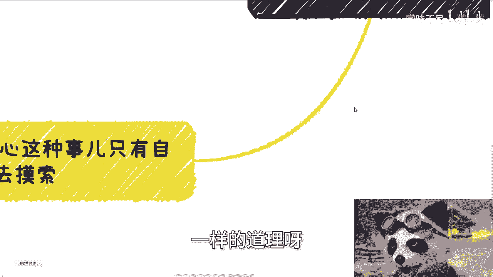

**结论**：因此，拓宽视野、深入了解社会、接触不同领域和人群至关重要。这相当于去探索黑盒子里更多的纸条。虽然无法穷尽所有可能性，但探索的范围越广，你找到真正能激发内在驱动力和野心的领域的概率就越大。

---

## 课程总结 📝

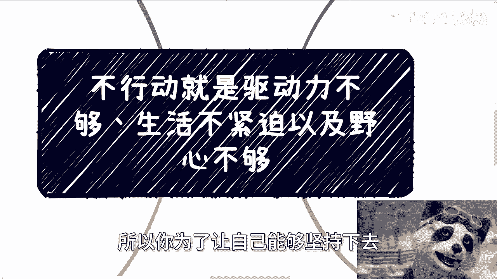

本节课我们一起学习了影响行动力的几个关键因素：
1.  **审视兴趣来源**：你的“爱好”可能源于有限选择，未必是真正热情。
2.  **设定清晰目标**：将模糊愿望拆解为可执行的短期里程碑（`Milestone`）。
3.  **打破自我否定循环**：警惕“我不行”的自我设限，避免陷入消极行为的恶性循环。
4.  **拥抱野心**：无论来源，野心是启动和维持实践的关键燃料。
5.  **主动探索**：驱动力和野心需通过广泛实践和探索自我来发现，无法完全依赖外部给予。

记住：**不行动，往往源于驱动力不足、目标模糊及自我设限。而解决之道始于清晰的自我审视、目标拆解，以及勇敢地投入实践，在实践中不断修正方向。**

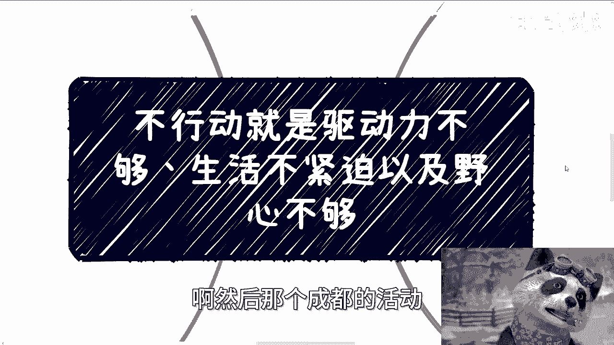

---

## 咨询服务说明 ℹ️

我提供职业规划、商业规划、股权设计、商业计划书等领域的咨询服务。如果你希望借助外部视角厘清个人资源、做出更贴合现实的发展决策，可以整理好个人背景与具体问题后前来咨询。

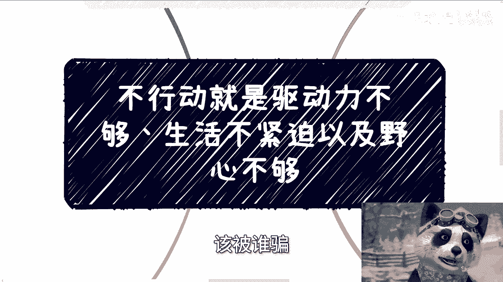

**重要前提**：咨询旨在提供视角、方法和规划建议，**不能替代你自身的实践**。指望仅通过咨询就实现“年入百万”的质变，是不切实际的。请对承诺“快速成功”的服务保持警惕。