# 实践是检验一切的标准，不实践就是驱动力和野心不够 - P1 - 赏味不足 - BV1Vs421u7V8

好大家好，这个时间越来越近了啊，这个离我们成都活动啊。

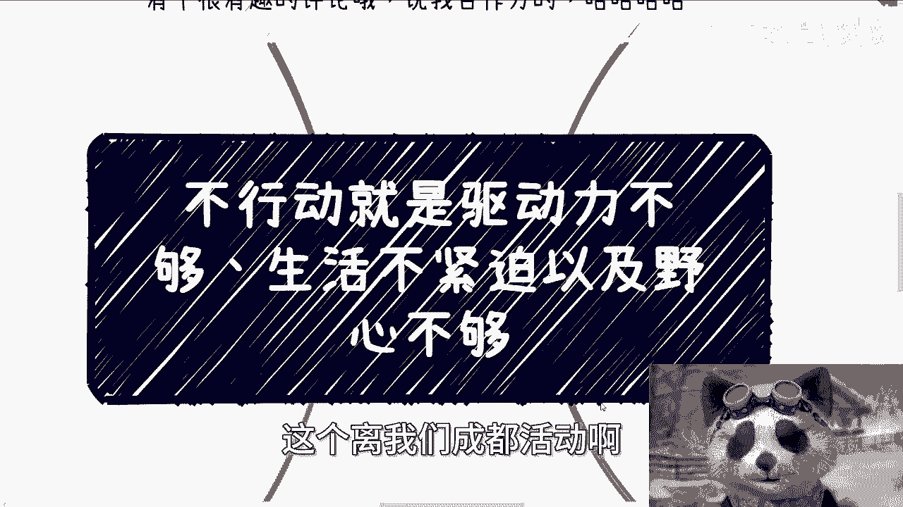

呃今天我们来讲的这个主题呢叫做不行动，就是驱动力不够啊，生活不够紧迫以及野心不够，嗯哎呀这个东西其实我不太想讲啊，因为太虚了。

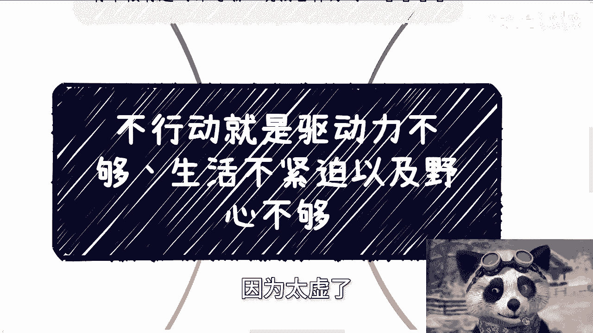

但是呢就是聊下来，我发现每个人都有这问题，唉算了算了，索性统一说一说啊。

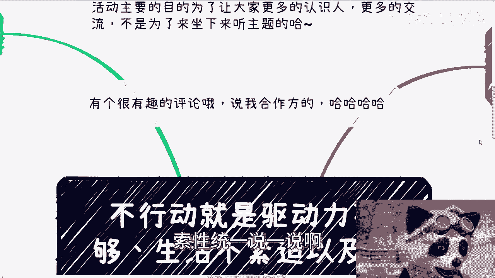

呃首先那个成都活动定了啊，就6月16号好吧，6月16号下午01：30到六点好吧。

场地已经定了，在青阳区神骨科医院附近好吧，然后活动这个详情或者报名，你们继续私信我啊，呃然后说一个很有趣的评论啊，就是就是昨天好像我我今天刷的时候，我看到昨天有人说啊，他说那个说我合作风啊。

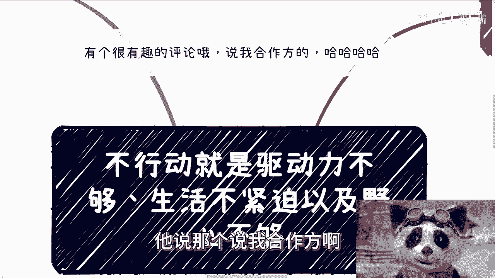

他说陈老师讲了这么多叫什么拉皮条的对吧，或者说怎么做中介的啊，他说他说被合作方看到不好，我其实回复呢我是这么毁的。

我说他妈的他们哼他们做的也不少对吧，但其实我心里面是这么想的，他妈的要说到皮条跟中介，哎呀他们他妈是鼻祖好吗。

哎呦他妈的我算屁，真的是还我合作方。

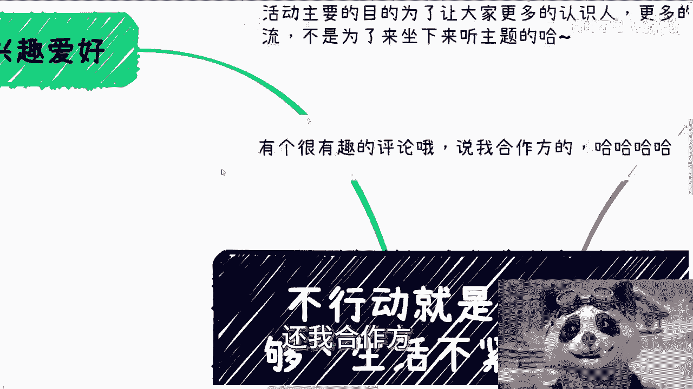

我合作方他妈哪个不是他妈皮条啊，啊说不好听点妈的，我就没看到不是皮条过的。

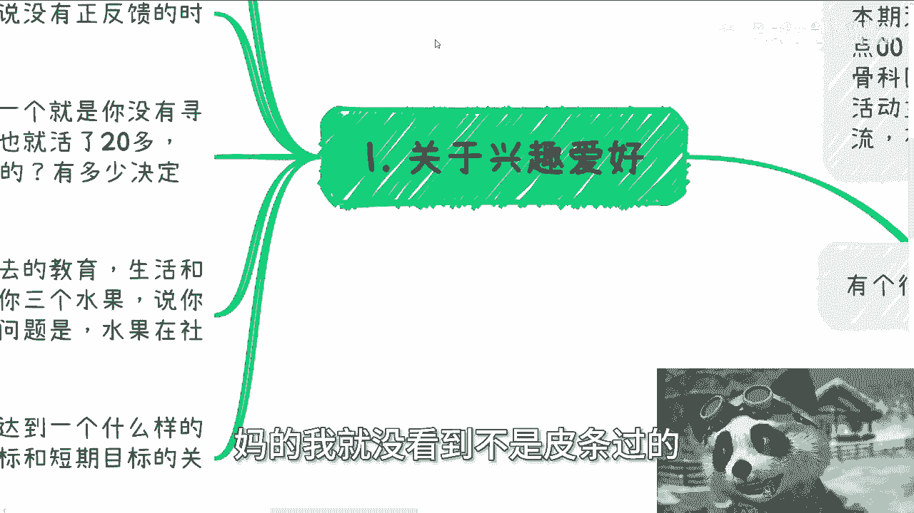

真的是啊，然后第一啊关于这个兴趣爱好啊，呃很多人呢会选择在自己的兴趣爱好上，做一些工作或者赚钱的业务啊，这这也没毛病啊，但是这些兴趣爱好上吧，当做的时候呢，又发现诶啊有一些挫折或者是碰到一些问题吧。

或者说没有正反馈的时候，什么叫没有正反馈，就比如说啊得不到认可啊，或者赚不到钱的时候，那么就容易半途而废啊，那么在我看来呢，这其中有两个问题，第一个问题就是说，就是你压根就没有寻找到自己真正的爱好的点。

因为你想嘛很多人也就活了20多年，30年，说白了你们有多少路是自己选的，有多少决定是自己做的，我可以担保票几乎没有对吧，那么在一个几乎没有自己做决定，自己这个这个选录的，这么一个一个一个过程当中。

你怎么就知道你寻找到了真正爱好呢对吧，我给你们打个比方，这就好像我今天跟你们说，你前面有个黑黑盒子，这里面有一张1000张纸条啊，1000张纸条好，然后呢我不告诉你有1000张啊，我就说你摸你摸两张。

然后呢你相当于比如说摸到了计算机啊，摸到了土木，摸到了什么，然后呢你就说啊，我在这里面我寻找到了我的兴趣爱好，就一2‰，你告诉你选择你找到兴趣爱好，你妈去骗谁呢，唬谁呢，对不对，就是很多人的兴趣爱好。

其实是仅仅是因为过去的教育，过去的生活，过去所接触到的东西所决定的对吧，这就好像我刚刚说了，我给你三个选水果，让你给我选出一个兴趣爱好来，但问题是水果肯定他妈不止三个啊，对不对。

你不觉得这个逻辑一上来就错吗啊，然后呢你跟我说，哎陈老师，我觉得这个兴趣爱好我坚持不下去，他爸就不是你的爱好，你为什么要强求呢，对不对，这是第一啊，第二另外一个问题呢，就是说他就没想清楚。

到底是个怎么样的长期目标跟跟短期目标啊，当然这个长期目标和短期目标关系是什么，他也没想清楚对吧，也就是说就是说他只是有个很模糊的说哎，他他说我想比如说做呃叫什么，比如说土木是我的爱好对吧。

或者说什么计算机是我的爱好，那我们要细节，比如说土木跟计算机，你到底要做成什么样的目标呢，对吧，你你比如说my stone masone two，你第一个节点，第二个节点。

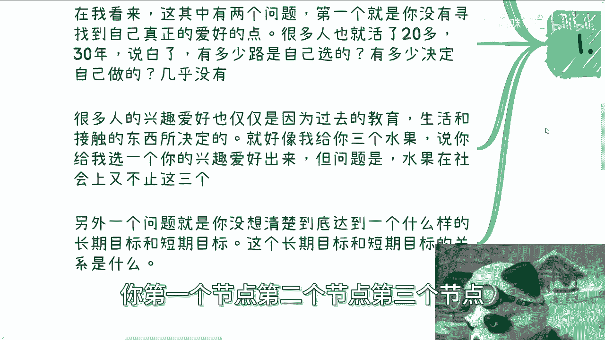

第三个节点呃，你分别做什么呢，他不知道的，那你这怎么坚持的下去呢。

你相当于就是一个又不是一个完，我就不一定是一个确定的兴趣爱好。

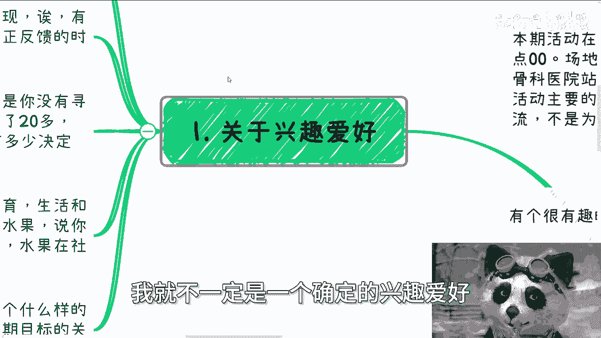

再加上一个模糊的目标，他妈坚持的下去，他妈出轨了，对不对啊，然后第二关于自卑。

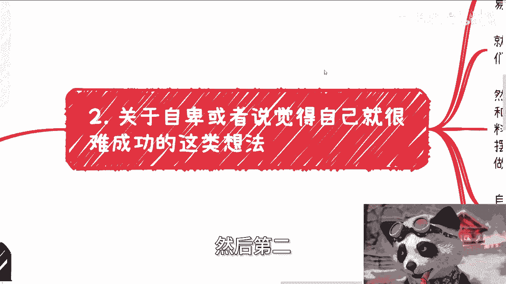

或者说觉得自己就很难成功的这类想法，我跟你讲啊，这也是很神奇的，就至少在我看来，这种想法本身是毫无意义的，而且大部分人是一种自我借口逃避的方式，而且这种自我借口和逃避的方式。

很容易产生恶性循环，为什么，因为你仔细想想看，这就好像我们很多时候，我们的自卑跟我们的自我否定，是发生在我们真正做事情的事情，当然了，有些人就说了，他说哎不是的，他说我这种自我否定和自我自卑。

一定是发生了什么事情，那大哥，那他妈你告诉我哪个人一生当中没有失败啊，哦你有过一次两次你就自卑跟自我否定了，那还做什么呢，对不对好，那么你就会发现，在发生这种自卑跟自我否定之后，那么他之后的事情。

他就会影响你所有后面事情的态度跟积极性，就比如说啊打个比方，你写篇论文，你我不说这篇论文，你最终到底写的好不好，但是正常来讲，你明明应该查很多资料，应该了解很多行业产业的内容，对不对，你应该去接地气。

去做很多东西，对不对，好那么由于你的自卑，你的自我否定，直接摆烂啊，直接摆烂，然后就是哎就就就他妈这么做了，随便做啊，拉他妈倒啊，内心就告诉自己，反正他妈做不好，或者觉得自己就是做的不好对吧。

但是问题是，问题是，你有没有想过这个因果关系就是这么来的，就是自然你都已经消极对待了，结果可想而知，对吧哦，那么你可能就就因为这个结果，然后更加自卑，更加消极，那不就是恶性循环嘛对吧。

但是本质上你跳出来，你从第三方的视角，你就会发现这种情绪没有意义，因为为什么，因为没有任何一个外界或别人在影响你，整个地球上。

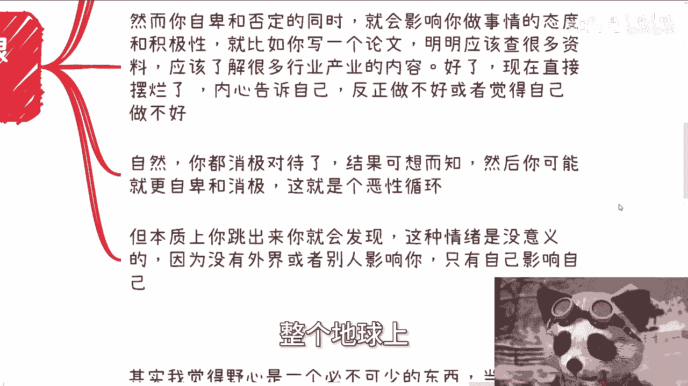

只有你这个个体在影响你自己，那他妈的这切你对不对，你你你你你你有没有想过对吗，然后有很多人呢还指望寻求外部的影响，那你想想看你的影响就不不来自于外部，你只要外部的解决方案怎么给你解决呢。

啊第三野心这个东西啊。

我觉得在过程当中是互不必必不可缺的，就是当然啊这个野心你说是不是真的切实际，比如说你说我他妈将想想长生不老啊，无所谓，我跟你讲这无所谓，以及是不是你内心真正内心萌发出来的，也无所谓。

你也可以是别人灌输给你的，为什么，因为你先要有也行，你才能有驱动力，至于这个野心是不是真的是不是正确的，我们可以在过程当中去修正，总比的走不出去好吧对吧，因为事情本身，就是事情本身是所有的东西。

是来自于实践的对吧，而不是单纯这种实践，不是单纯一两次就能得出结果的，而是不停的去追求结果，从而哦而且是这样子的，而且就是说你不停的去追求结果，从而忽视过程当中，困难是最大的一个点，最大的一个点在哪里。

就在于你的野心，只要你的野心够大，那么你的目标就会足够明确，为什么，因为你不明确，你的野心，就会让你觉得卧槽你你你你不能忍受你自己，你懂吗，你一定会明确，当当然啊，这个目标到底是不是对的，无所谓。

你去做了，你会发现这个目标可能有问题或者怎么样，你可以不停的修正对吧，没有关系的啊，没有关系的啊，但是你得有，而且这个目标不用别人督促，你也会拆出来一个一个步骤，当然啊你不要去纠结这个步骤对不对。

因为你只有做了才知道对不对，你但凡在做之前就纠结他对不对，那你永远做不下来啊，然后实践它会让你不停的去修整呐，这就好比啊我给你打个比方，这就好比我花了3年时间在撞墙，我做了很多很多事情，但是都失败了。

你花了3年时间在想，再优柔寡断，虽然你跟我的确都浪费了3年时间，但是至少我有了做事情的经验，我有了相关经验，我也更多的排除了错误的答案对吧，那么我比你的成功概率就来的高。

当然也许我跟我最后我跟你都不会成功。

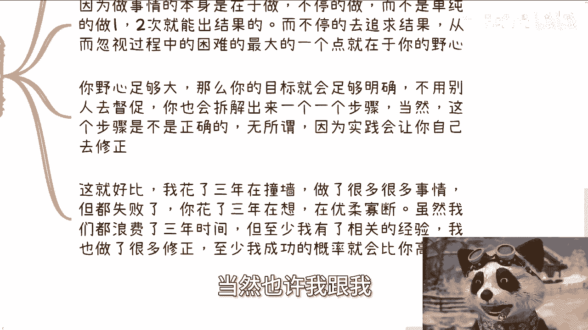

但是至少我觉得这种人生这种经验是有价值的，不是停留在臆想啊，第四驱动力野心这个事我跟你讲。

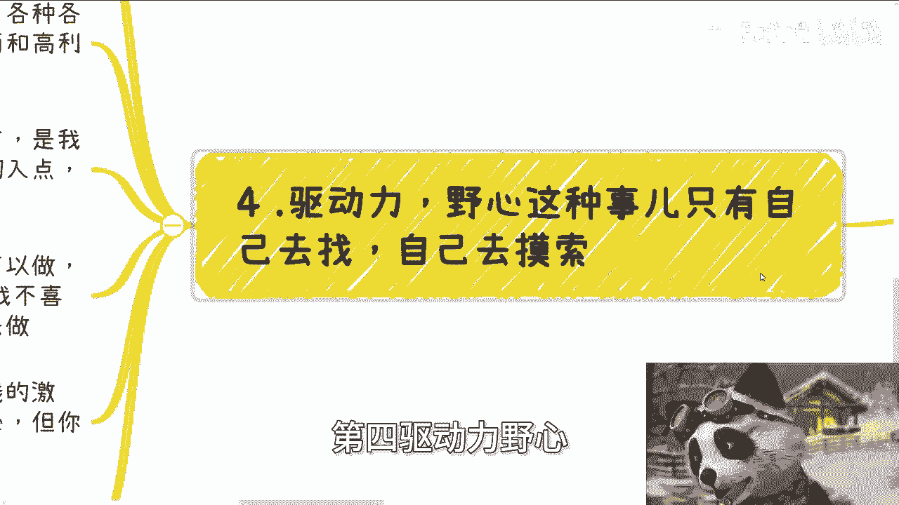

只有自己去找，自己去摸索，你依靠外界是没有用的啊，我是觉得我个人觉得，这种东西靠外部是很难影响的，很多人其实都会问有没有好的方法啊，或者怎么样子，我说实话也许有一些方法能辅助，但是你说有些方法能改变。

一定是骗人的，这个社会或者世界上的玩法和模式很多，各种各样各个操作背后，我给你们讲，再小再小的一个一个一个，一个一个一个切入点啊，它背后往往都蕴藏着就是能产生价值的一面，以及非常高利益化的一面。

但你说驱动力跟野心，很多时候不是我们没有，是我们没有找到，就是我相信啊，你们很多人其实会说嘛，就说哎呀我没有这个驱动力，我没有这个野心，我跟你们讲，不是你们没有，是你们没有找到。

让你们有驱动力和野心的方向和切入点对吧，因为你们根本就没有看到过，就是我说了，就是说这个箱子里面有1000张纸条，你压根就没有看过这1000张纸条，你更别想去，更别说你说哦。

我要从这个这个别的一些纸条上面去，找到我的野心跟驱驱动点，你怎么找到对吧，这就好像你让我去找工作，你给我薪资再高，我可以做呀，我也可以做的很好呀，我可以表现出来，我他妈很有野心啊，但是这个野心是假的。

这个驱动也是假的，因为只是钱，你给我的钱带来的，因为我不喜欢啊，我无法从内心产生动力啊，你无法从我内心产生野心去做啊对吧，那么这种时候就说我纯纯的就是一个，就说是怎么说呢，由某一个东西驱动的钱驱动的。

一旦没有钱的激励，我就会懈怠，我就会变成一个没有驱动力，没有野心的人，那么你能说我是一个没有野心的人吗，你能把我就直接看死嘛，不行吧，这就好像比如说我的确不适合应试教育，我高考考的很不好啊。

我我名落孙山，那你不能把我这个人否定掉吧，对不对，一样的道理呀。

所以说很多时候啊，就是我跟你们讲，就是你们可能自己不一定有这个感觉，但是你你知道吗，我跟你们聊下来，我就有很强烈的感觉，就是就是这个人读读计算机的，那个人读土木的，这个人读会计，那个人读设计的，跟我说。

哎陈老师，我觉得这个东西哎呀我我我是有有想法的，我也蛮喜欢的，但是我坚持不下去，我其实心里面就在想，根本就不喜欢你，只是因为你读了这个专业，因为你做了这些事情，因为你已经有了这么大的沉没成本。

所以你为了让自己能够坚持下去。

所以说自己喜欢，那你说硬是在这上面去找，你找不到呀，你明白吧，对吧啊，所以这也是我为什么说，就是说你们要更多的去了解社会，更多的去跟别人接触，因为你这个箱子里面有一张1000张纸条。

也许你不能把这1000张纸条都了解清楚，但是至少总比你只了解那两张，只只了解你现在20多多多来，30多年以来只了解这些方面，来到强吧，对吧啊，行就这么着吧啊。

然后那个成都的活动好吧，那个咨询或者呃这个详情或者报名，你们就可以私信我，然后职业规划，商业规划啊，股权股权分润分红啊，那个期权啊股份，然后那个商业计划书白皮书啊，包括你们手上有什么牌。

你们没有什么牌啊，你们希望通过我的视野，通过我的跟我的一些沟通，能够让你们更下定一些决心，或者说更能够贴近地呃，地契，更能够做出做出一些嗯，比较比较贴，贴近于当下发展的一些这个决定的话。

那么你们可以整理好个人背景跟问题，再来咨询好，再来走咨询啊，然后同样的就是说，如果你们想通过咨询就年入百万对吧，就通过咨询什么的量变产生质变啊，通过咨询就是说能替代你们实践的，那你们不要来找我哦。

你们这个钱呃该被谁骗。

该被谁骗啊，不要来找我。