# 课程一：客观分析996、007与35岁现象 🔍

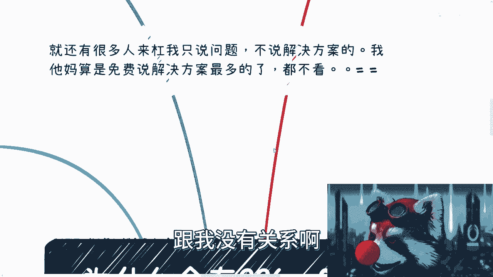

在本节课中，我们将客观地探讨当前职场中普遍存在的“996”、“007”工作制以及“35岁”职业瓶颈现象。我们将从经济环境、企业竞争、个人发展等多个维度分析其成因，并尝试理解这些现象背后的逻辑。请注意，本课程仅阐述事实与问题，不提供解决方案，也不涉及情绪引导。

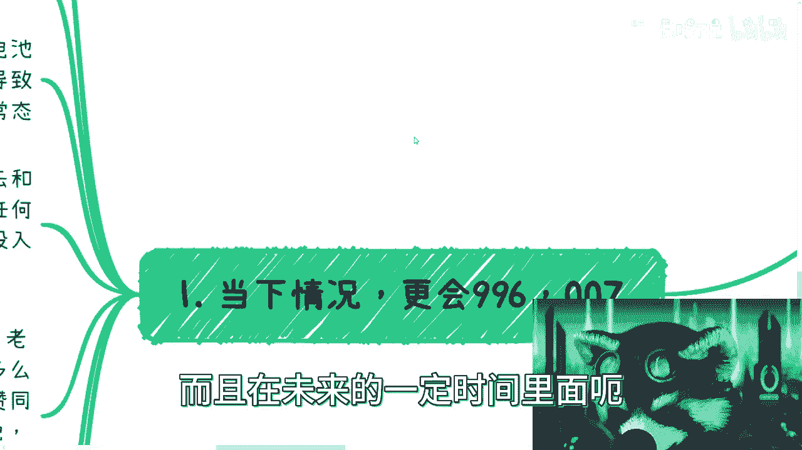

---

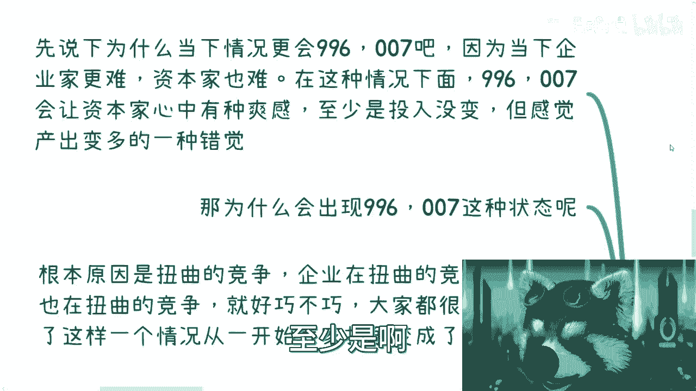

## 第一部分：为何“996”与“007”会更普遍？ ⏰

上一节我们概述了课程内容，本节中我们来看看“996”与“007”工作制为何在当前及未来一段时间内会更加普遍。

根本原因在于当下的经济环境。企业家与资本家面临更大的经营压力，而这种压力会直接传导至员工身上。对于资本家而言，即使员工没有实际产出，让他们留在办公室也能带来一种掌控感和安全感。其核心逻辑是：

**资本家的安全感 ≈ 可见的劳动力投入**

即使这种“投入”未必等于有效产出。

以下是导致这种现象加剧的几个具体原因：

1.  **扭曲的竞争环境**：企业间的竞争日益激烈且非常规化，这种压力自上而下传递，使得超时工作从一种抗争对象变成了默认的常态。
2.  **无效的对比与PUA**：企业管理层常以海外顶尖公司（如Google、微软）的工作强度为标杆，向员工施压，却刻意忽略薪资、福利、工作条件等关键因素的对比。
3.  **员工的“内卷”**：在任何群体中，认知与选择都会大致呈现“五五开”的分布。总有一部分员工会选择通过加班、讨好领导等方式进行“内卷”，他们的行为会迫使其他人跟进，从而形成整体氛围。
4.  **制度的变种**：为了规避风险，超时工作衍生出许多变种，例如大小周、拆分合同与薪资、用发票报销抵扣加班费等，使得劳动者更难维权。

综上所述，在经济下行、效益不佳的背景下，资本家为寻求心理安全感和成本控制，倾向于延长工时。同时，扭曲的企业竞争和部分员工的“内卷”行为，共同推动了“996”、“007”的常态化与加剧。

---

## 第二部分：“35岁”为何成为职业坎儿？ 🎯

理解了高强度工作制的成因后，我们再来看看另一个关键现象：为什么“35岁”在互联网等行业被视为一个职业坎儿？

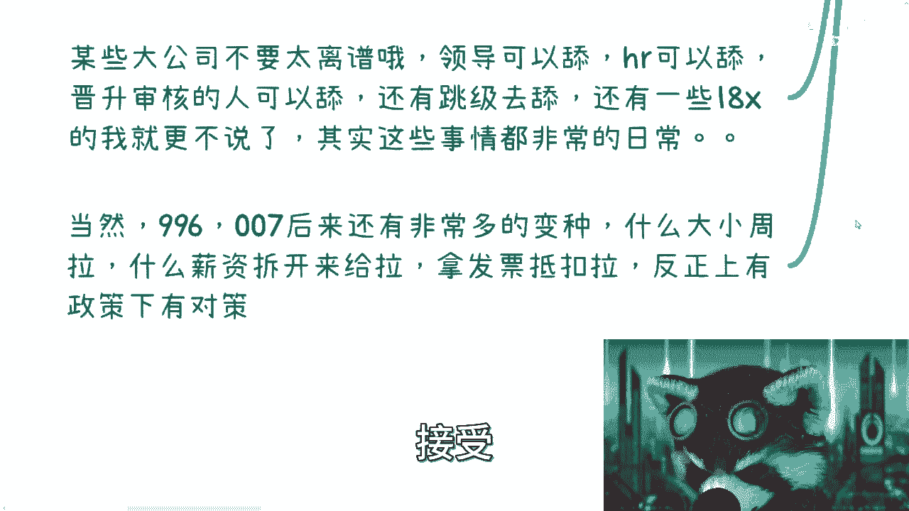

对于个人而言，35岁左右是继毕业、求职后的第N个迷茫期。此前因忙碌工作而无暇思考的问题会集中爆发。此时个人面临的情况可以用一个公式概括：

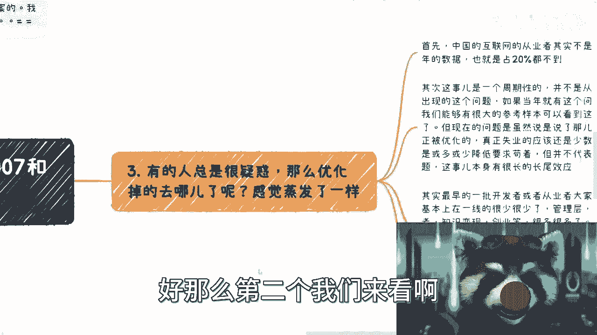

**35岁的压力 = 职业瓶颈 + 家庭责任（父母健康、子女教育）+ 经济压力（房贷等）**

工作不再单纯，个人需要考虑的维度急剧增加。

对于企业而言，招聘时对35岁左右的人群存在顾虑。这并非简单的年龄歧视，而是一种基于概率的筛选策略，类似于企业偏爱“985/211”毕业生。其考量的核心点是：

**企业招聘成本 ≈ 筛选效率 + 管理成本 + 潜在风险**

企业认为，从更年轻、更“单纯”的群体中筛选，综合成本更低。以下是企业方的具体考量：

1.  **管理成本高**：认为35岁左右的员工“事多”，可能不好管理、要求多、请假频繁。
2.  **性价比考量**：年轻人的薪资要求通常更低，且可塑性强。
3.  **可替代性强**：互联网很多岗位技术门槛并非高不可攀，可替代性较高，企业无需依赖资深员工。
4.  **市场认知清晰**：经过多年发展，企业对互联网岗位的价值和人才市场有了更清晰的认知，不再为“屠龙之技”（即极高阶但应用场景极窄的技能）支付过高溢价。

互联网行业放大了这一现象，因为它将传统行业可能需要20年完成的职业周期（包括成就与危机），压缩到了5-10年内。竞争节奏快、人员更替迅速，使得企业与个人都更早、更剧烈地感受到这一年龄压力。

---

## 第三部分：被优化的人都去哪儿了？ 🗺️

既然“35岁危机”被广泛讨论，一个自然的疑问是：那些被优化的资深员工，最终都流向何处了？

目前我们并未看到大规模、清晰的流向，这主要由以下几点造成：

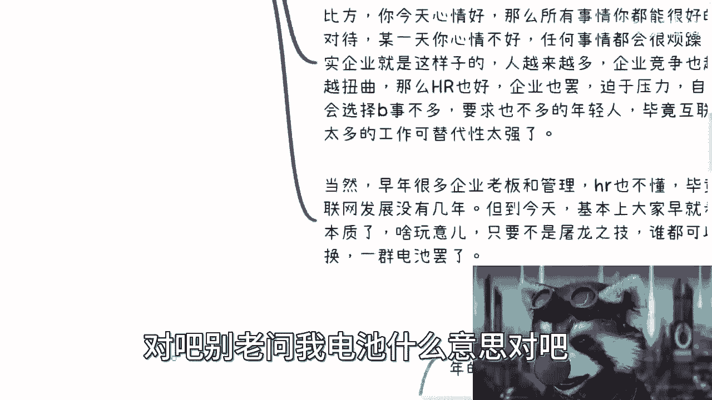

1.  **从业人员比例不高**：中国互联网从业人口占总就业人口比例远低于美国（约17-18% vs 35-38%），绝对数量没有大众感知的那么多。
2.  **现象处于进行时（ING）**：互联网的年龄优化问题是一个周期性现象，其长尾效应正在显现，但尚未形成完整的、可观察的终局样本。
3.  **幸存者偏差**：我们能看到的多是转型成功者，如成为高管、独立开发者、创业者或知识变现者。大量沉默的、挣扎的或已离开行业的人并未进入公众视野。
4.  **时代红利差异**：早期的互联网从业者享受了行业爆发期的红利，有更多转型机会。而当前时代的35-40岁人群面临的境遇截然不同，他们的未来才是更具参考价值的答案。

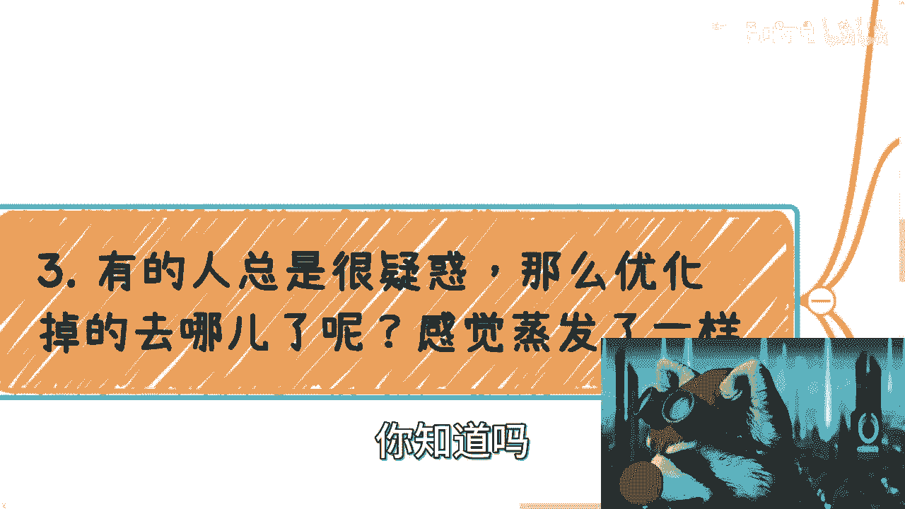

因此，当前被优化人群的最终去向，可能需要5-10年后才能给我们更清晰的答案。现在的观察更多是片段的、不完整的。

---

## 第四部分：这是互联网独有的问题吗？ 🌐

很多人认为这是互联网行业的特有问题，其他行业并非如此。本节我们来分析一下这个观点。

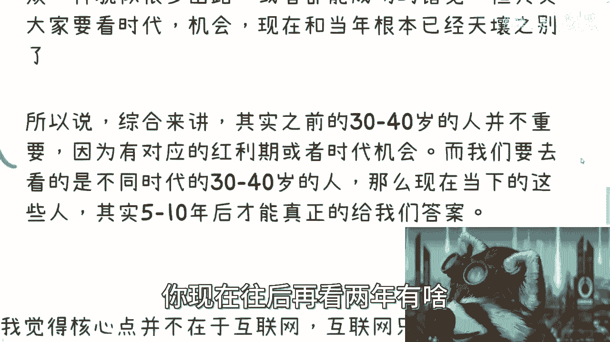

核心结论是：**这并非互联网独有的问题，互联网只是加速和凸显了这一过程。**

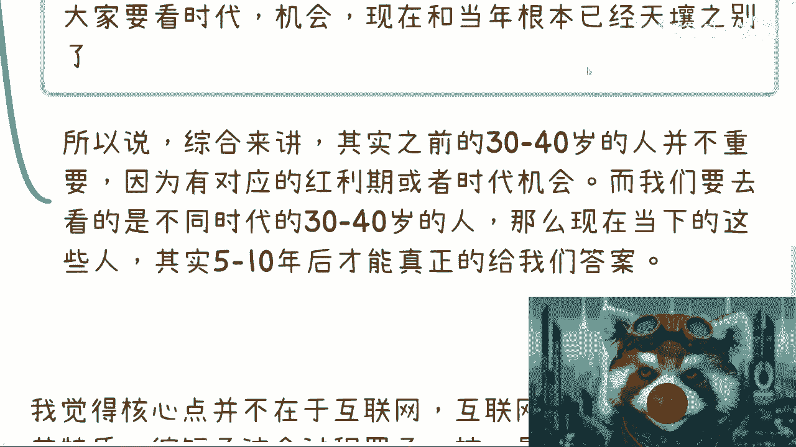

问题的本质在于以下几个普遍因素：
*   资本方（企业家）越来越倾向于压榨和PUA。
*   劳动者（“电池”）越来越逆来顺受。
*   市场从增量发展转向存量饱和。
*   劳动力供给持续增加。

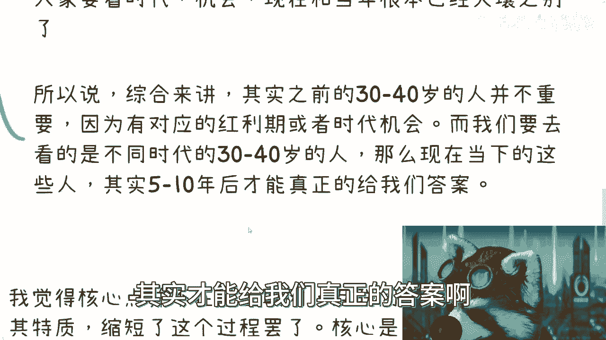

互联网因其**发展快、周期短、信息透明**的特性，只是将这一过程**缩短**并**提前**展现了出来。在任何**可替代性较强**的行业，只要符合“市场饱和”与“劳动力过剩”的条件，类似的“内卷”和“年龄优化”都或早或晚会发生。

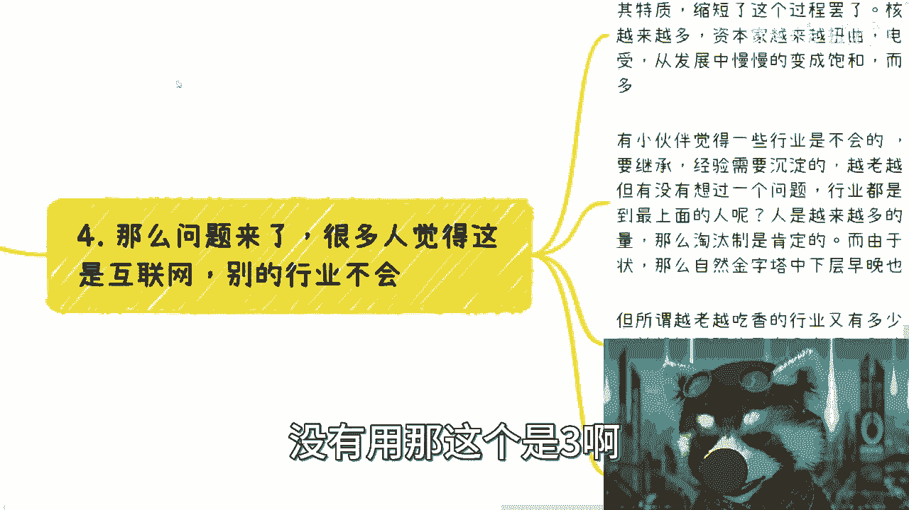

所谓的“越老越吃香”的行业（如医生、高级技工）确实存在，但我们要看两个关键点：
1.  这些岗位在整个就业市场中的**比例**很低。
2.  这些行业内部也是**金字塔结构**，能爬到顶端、享受“越老越吃香”红利的人永远是少数，中下层同样面临竞争与淘汰压力。

因此，这是市场经济和劳动力供需关系下的结构性现象，互联网仅是“先发考场”。

---

## 第五部分：未来会好转吗？ 🔮

分析了现状与成因后，一个关键问题是：这种趋势未来会好转吗？

目前的迹象表明，情况可能更趋向于悲观：

1.  **互联网化加剧**：互联网已与各行各业深度融合，其“加速内卷”的模式正在向更多行业扩散。
2.  **下行市场加速**：在经济下行周期中，企业为生存只会更加注重成本控制和短期产出，从而加剧压榨与优化。
3.  **行为走向极端**：资方与劳方的行为都在走向极端。资方极致地追求控制与产出；劳方则通过“内卷”和“跪舔”进行恶性竞争。这种系统性极端化难以自我纠正。
4.  **蝴蝶效应**：当下的选择（如全民考研、盲目内卷）会对行业生态和个人长期发展产生深远且不可逆的负面影响，而这种影响短期内难以被察觉。

综合来看，在可预见的未来，职场环境的竞争压力与年龄焦虑很可能只会加剧而非缓解。

---

## 第六部分：总结与换位思考 🤝

本节课我们一起学习了“996”、“007”和“35岁现象”的客观成因。最后，我们通过换位思考来总结这些现象。

**对于资方（企业家/资本家）**：
其首要目标是企业生存与盈利。在激烈的市场竞争中，对员工成本的严格控制和对甲方需求的绝对服从，是理性的商业选择。他们的决策公式是：

**企业决策优先级：盈利与存活 > 员工福祉**

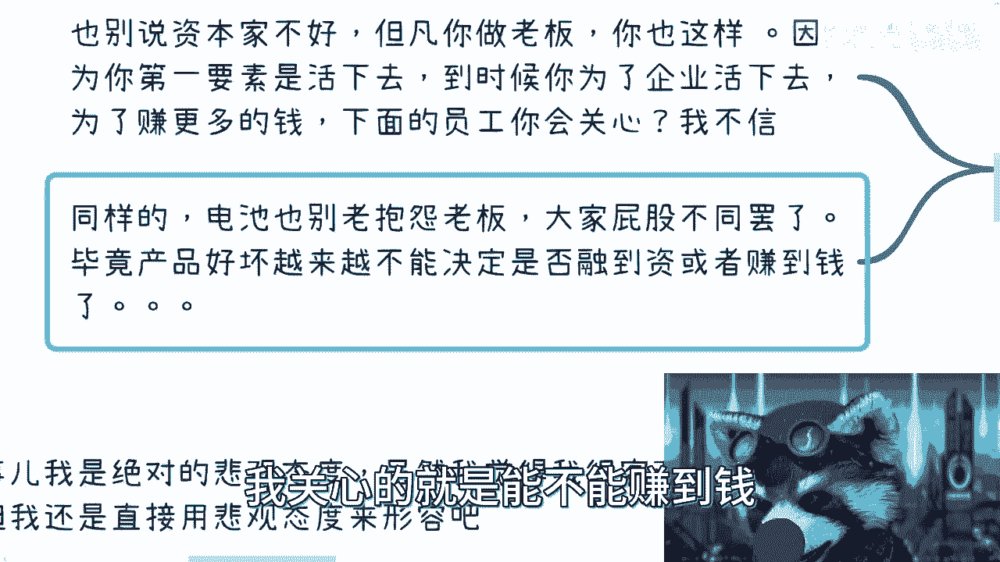

**对于劳方（员工/“电池”）**：
抱怨资方并无太大意义，因为双方立场根本不同。关键在于认识到，在当今市场，**产品/服务质量的好坏，与公司能否赚钱/融资的相关性正在减弱**。因此，资方缺乏改善员工待遇的内在动力。

这本质上是社会发展特定阶段的产物，是不同阶层在特定视野、格局和生存压力下互动所孕育的结果。理解这一客观规律，有助于我们更清醒地认识自身处境，并为个人规划提供更现实的参考。

---
**本节课总结**：我们一起分析了高强度工作制和职业年龄瓶颈的成因，认识到这是经济环境、市场供需、企业竞争与个体行为共同作用的结果。互联网并非根源，而是加速器。这一现象具有结构性，且短期内难见好转。理解其中的客观逻辑，是应对挑战的第一步。