# 客观的讨论下为什么会有996，007和35岁的坎儿 - P1 - 赏味不足 - BV1DP411C7Pg

好啊，这个总结完了总结完了，我要来讲一下。

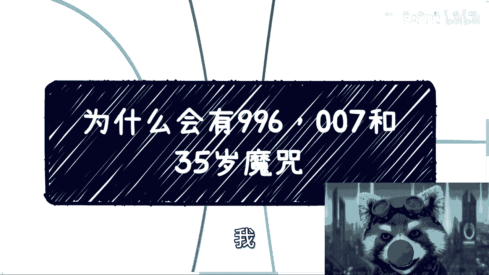

正正经哈哈，这个首先是这样子的啊。

就是我先一开始就说啊，不要来跟我杠，我只说问题，不说解决方案哦，也别来杠，我说贩卖焦虑啊，我跟你们讲的所有东西只有事实焦不焦虑，这是你们个人定的，跟我没有关系啊。

而且我说的解决方案已经够多了对吧，这个大家不看我也没办法对吧。

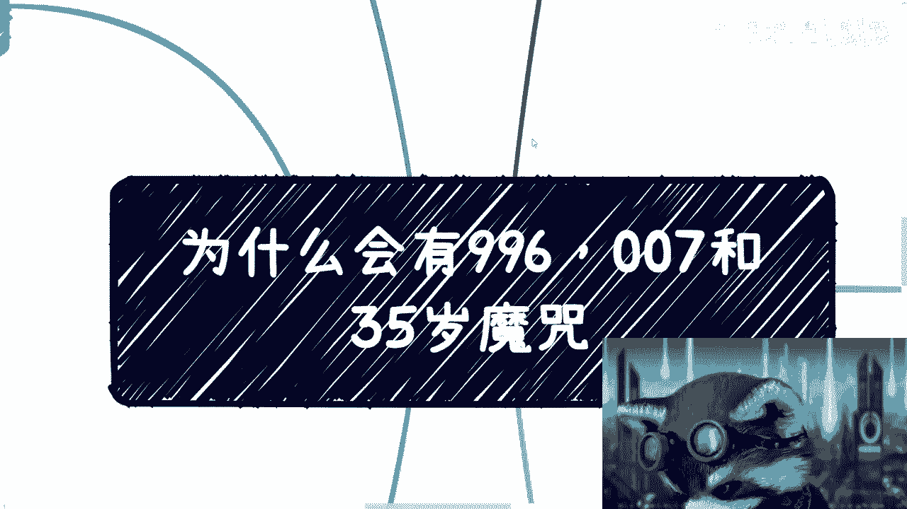

那么这一期呢我会把它放到就是错的，是这个世界对吧，不是我是吧，呃主要是来阐述一下，目前的996，007和35岁的这么一个问题，呃首先啊是这样子的，第一个啊就是在当下的这么一个经济环境当中。

而且在未来的一定时间里面啊。

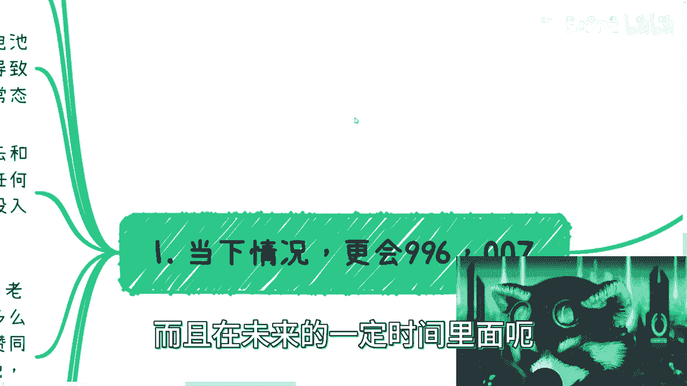

更会996007，为什么啊，呃因为当下的情况是企业家更难哦，而不是个人更难，而且个人的难不难其实并不重要，企业家的难，至少是啊。

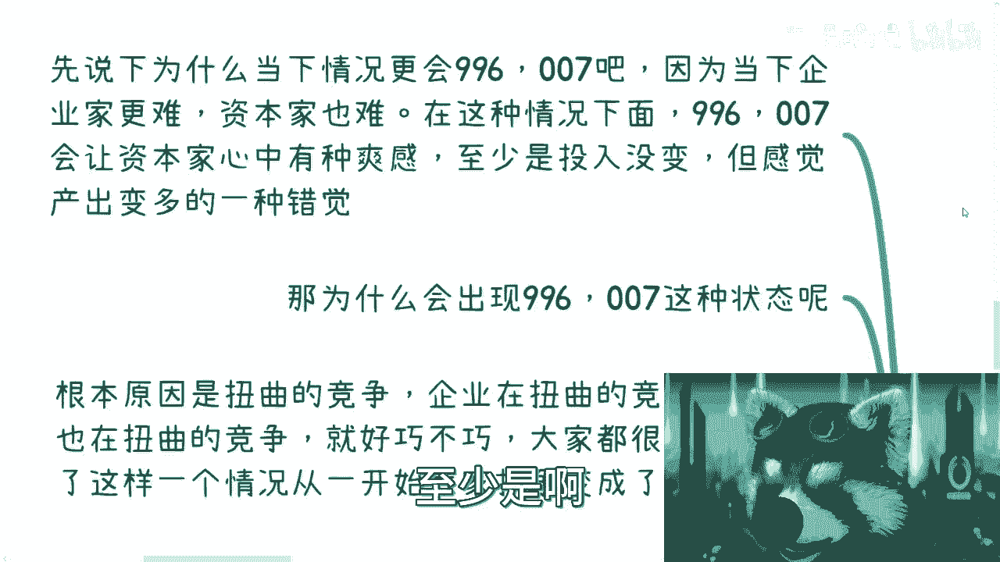

可以体现到就是说这个电池身上的对吧，那么企业家当下很难，资本家也很难啊，但是这种难呢跟电池的难是不一样的对吧，因为对于普通老百姓来讲，真的难是真的难啊，就难道很有可能就是属于那种。

就是说找不到工作或者吃不上饭的，是真的有可能的啊，那么这种情况下面呢，其实996007，是会让资本家心中会有种爽感，或者一种安全感对吧，因为为什么呢，因为但凡打过工啊，但凡做过电池的都明白。

就是资本家最要的是什么，资本家最要的就是，哪怕你没有事情做，你也得给我坐在办公室里面，让我看到你对吧，就是这样子的，那么他有安全感，你做什么，你觉得他关心吗，他不关心关心的是你的leader。

你的manager对吧，对于对于你们的老板来讲，who care是吧，那么就是说至少他会觉得我的投入没有变，但是感觉产出变多了，对吧这是一种错觉，但是他很爽啊，那么为什么会出现996007这种状态呢。

根本原因还是什么呢，就是竞争越来越扭曲，企业也在越来越扭曲的这么一个好，我只写了两遍啊，就一个是竞争越来越扭曲，一个是电池也在越来越扭曲的竞争，好巧不巧呢，就是上层就中层在扭曲吧，下层也在扭曲对吧。

那么大家都很扭曲，那么导致了这个情况，从一开始大家其实还是有抗争的，变成了现在的一个常态，为什么呢，因为大家都很扭曲啊对吧，就是就默认的就都接受了对吧，然后企业的竞争早年的时候呢，其实就有这种苗头了啊。

就有这种征兆了，就是说不停的去跟海外的企业对比啊，就是但凡早年在互联网企业的人都能明白对吧，就动不动就是说啊我们goo跟google怎么比，跟微软怎么比，跟oracle对吧，跟跟跟跟什么什么IBM对吧。

怎么比，反正就各种比对了，但没有意义啊，为什么，因为你没有任何上下文的去比你，你说你家创业公司对吧，就那么十个人，20个人，你个人家有什么好比的呢，对吧，就这种老老老板就是，你知道吗。

他就会他说白了就是为了PUA你，但是可能那个时候还没有PUA这个概念对吧，但是他自己可能也不见得知道他是在POE，但他事实上就在PUA对吧，那么你单纯的去跟别人去比，什么所谓的工作量一样。

不好意思啊，就你单纯的去跟别人去比所谓的工作量，人家投入多少，奉献多少对吧，他就不跟你谈薪资，别的什么都什么都谈啊，跟你说跟你说人家111个月，比如说一周就干多少工作，跟你说人家一个人抵几个人对吧。

而且在谷歌一个人抵十个人对吧，怎么样怎么样啊，跟你说人家的这个产出多么高，反正就是不跟你说薪水对吧，就是说员工作为电池，我跟你讲就更牛逼了，什么意思啊，就是我跟我说过对吧。

任何事情你到了老百姓头上去五五开，为什么，因为老百姓的认知就是这么局限对吧，基本盘的认知就是这么局限，无论多么离谱的事情，你到了基本盘身上就是五五开，也就是说总有一半人是赞成的，总有一个人是不赞成的。

你知道吗，当然所谓的赞成和不赞成，并不是说他们就表会直接表达说赞同不赞同，而是说当大家在卷的时候，你就会发现总有那么一半的人在内卷对吧，你要但凡大家说好，我做完就回去了，我管你卷不卷，那也不会。

现在这样子，不会的呀，对啊，就因为有有那么50%的人对吧，有那么一撮人对吧，开始卷，看谁走得晚，看谁朋友班啊，朋朋友圈对吧，发状态加班的多，看谁舔领导舔的好对吧，尼玛反正就是各种卷没有底线去卷对吧。

我跟你们讲，要是十五十年前，20年前没有这么个卷法，20年前不至于吧，差不多不至于十几年前吧，十几年前没这么卷发，现在不会这样子的啊，绝对不会的，那么某些大公司我跟你讲，不要太离谱，什么意思呢。

就是领导可以填啊，hr可以填，竞争审核的人可以填，还有去跳级去舔的，就是他舔的逻辑非常的神奇，就各种各样365，365度呃，365度也好，三百三百六十五条线也好，都给你给你舔一遍啊。

包括还有一些呢我不方便讲的对吧啊，所以这些事情其实都是就是非常日常的，现在我可以说当下也是非常日常的，就只不过说大家叫什么，就是透风不透风嘛，对不对，当然9966007后来有非常多的变种。

比如说啊大小周啦，什么什么薪资拆开来给了对吧，签合同分开来签了对吧，然后什么什么什么什么，比如说呃就比如说你做到一半跟你说，你要从A公司签到B公司了对吧，然后这个间接的给你降薪啊对吧。

然后拿发票去抵扣了对吧，就这么简单，就是资本家有非常多的方式，但是对于老板啊，对于这个电池是一点办法都没有的，你只能去接受对吧啊。

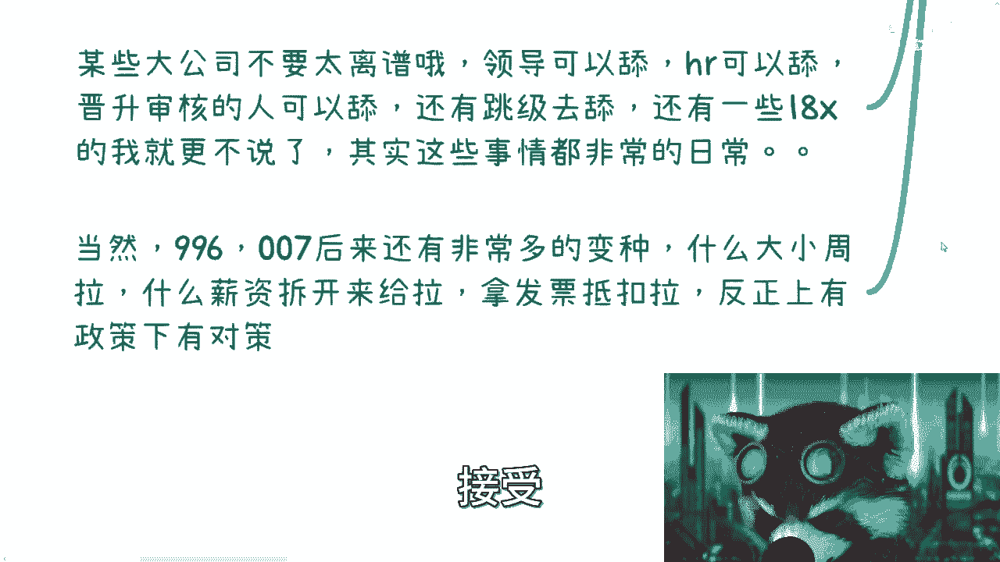

这个我觉得就总体来讲为什么更会如此呢，就是因为经济不好，就是因为整体效益不好对吧，就是因为他心情不好对吧，反正就这个样子，就是只会越来越严，只会越来越越越越多，应该说啊，那么这个是第一个好。

那么第二个我们来看啊。

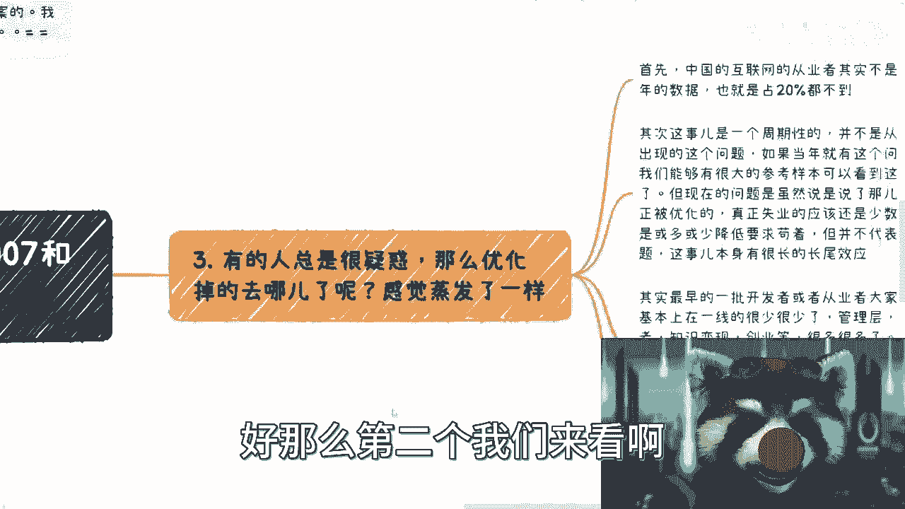

第二个人就35岁，这个事情其实本质上呢我跟你们讲，脊髓并不重要啊，这35岁就就大家这么一说嘛，对吧，并不是说一定是35岁，但是从电池来讲呢，35岁是个坎儿，是第N个迷茫期，为什么啊，因为你会发现很多人。

比如说上大学的时候会有迷茫期，然后还有一部分人呢是上完大学，他就是比如说现在找实习对吧，会有一段迷茫期，但是在这当中呢，他可能会有一段时间的不迷茫期，为什么呢，是因为他很忙啊，就比如说你刚毕业对吧。

你硕士毕业本科毕业去工作了，你可能你很忙啊，你一忙可能会忙，个人说两三年35年对吧，你就不迷茫，但其实不是你不迷茫，是你没空迷茫，你知道吗，但是你会发现有一个很神奇的点，就是越越是你投入工作的。

越是就是说现在里面的你过了几年之后，你会更迷茫，为什么，因为你对于世界不了解，你不知道外面什么样子，你会有种恐惧感，你知道吗，那么而且这个地方我也写了，无论你男女。

那那那那这个事情我就不能不能展开了嘛对吧，因为男性跟女性在职场上面，在很多东西上面的确有很大不平等性啊，但是我就不在这个地方说了啊，因为呃咱就统一来讲，就是无论男女，这个时候你考虑的事情都很多。

你但凡你会发现没有一个稳定的方向跟认知，基本上就处于一个上不上下不下的状态，为什么，因为你这个问题的时候，这个时候的问题特别多对吧，你父母的身体可能也不好，你父母年纪也大了，你自己年年纪也大了对吧。

你可能上有老下有小对吧，你可能还得去处理，就是说啊房子啊或者各种各样的问题，就是就是工作不再像你刚毕业的时候，那么单纯的说，我就去考虑这一个点，到后面你不得不去考虑，你知道吧，那么那么你从企业来讲呢。

其实30多岁的人属于事多的一类人，因为从基本盘就基本面来讲啊，就是不好管理，挑刺反水要求多对吧，请假多，各种各样的DEBUFF开始堆积到的人，就这个有点像什么感，感觉就有点像说啊企业企业家啊。

这个企业这边hr就说我就不要专科的对吧，我就不要非9852121的是一个道理，你知道吗，就是他不是说一定歧视你，他也不敢这么讲，但是他的思维逻辑是，我就是希望从这些人里面去挑，而剩下这些人我挑的不想挑。

30岁也是一样的道理，就是他们为什么不愿意去招30多岁人，就是我就不愿意在这里面挑我，我知道里面有好的，但是我不想调，我何必跟自己过不去呢对吧，其实你会发现本来也没什么，因为你是一个人对吧。

你你总归要走到这一步的，你总归要面临这样的问题，但为什么你会发现，所谓的这些问题都在互联网爆发出来啊，我跟你讲，主要就是因为什么呢，主要是因为那这个后面我会讲的，但是我先提前说一下互联网的特性。

是将这件事情，就比如说将这边很多的事情缩短了，就比如说本来一个20年周期的事情对吧，那互联网就是就把它缩短成了一个5年，就完成了这么一个事情，主要就是说他一方面是5年对吧，完成了一些正向的东西。

比如说我做了一些产品啊对吧，我做了一些贡献，但是同样的它的负面影响，也是在同样的这个周期里面展现出来，所以说你会发现主要还是因为人多，竞争的节奏越来越快，你再打个比方啊，你比如说你今天心情好。

你所有的事情你都能很好去对待对吧，某一天你心情不好，任何事情你都会觉得很烦躁，所以说其实你会发现企业也是一样的，就是竞争的人越来越多，企业竞争也越来越扭曲，那么节奏还越来越快，那么你会发现hr也好。

企业也罢，迫于压力，他自然会选择B事不多的，要求也不多的年轻人对吧，薪资也不多的年轻人，那么毫无疑问嘛，你何必给自己找不痛快呢，你想想看是不是对吧，那毕竟而且另外一方面，互联网这边的工作。

它不像以前的很多的蓝领对吧，或者很多的技术工，它可替代性太强，它的门槛也没那么高，你知道吗，那当然了，就是说我们就说啊，早年很多企业老板跟管理hr其实也不懂，我说不懂是指什么，不懂互联网的。

不懂里面的这个这个条条框框啊，但是呢毕竟互联网发展没有几年，那个时候啊，但你到今天，那咱说不好听点，从上到下，从里到外就不管接触没接触过的，基本上对互联网基本上就心里有点逼数，嗯对吧，什么玩意儿嘛对吧。

你只要不是拥有屠龙之技的，而且更何况我最早的时候我就说过，并不是哪家公司都需要屠龙之技的对吧，就就比如说我们说有一个人跟你讲，哎我这个做过日活一个亿的对吧，这个并发量比如说几千万的对吧。

那有多少公司用得到了啊，有多少公司能能做到日活一个亿啊，莫名其妙嘛，你说对不对，就这是个双向选择，你会发现拥有屠龙之地的人呢也很少，那有屠龙之剑那些人呢，也也很少地方给他们去发挥对吧。

也就是说谁都有替换芯一群电池而已，那你们现在能明白电池什么意思呢对吧，别老问我电池什么意思对吧。

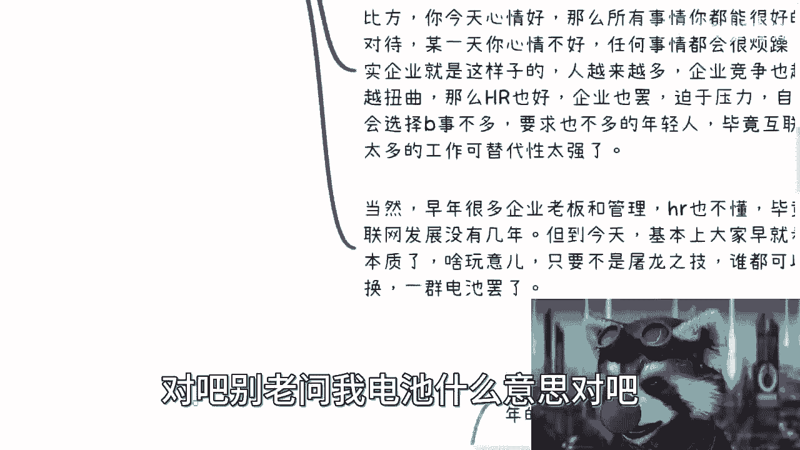

那我觉得这个是二啊，三那就有个人也会很疑惑，他说那既然一直这么说，一直这么说，那为什么我们看不到这些优化的人去哪里，你知道吗。

这是所有人心中的疑惑啊，我跟你讲啊，我当当然我个人看法不代表对啊，我就阐述一下我的想法啊，首先中国互联网从业人员其实不是特别多啊，你们可以去看整个的这个中美当时的比例，按照去年我看到的年底的这个数据啊。

就中国的比例应该在17%到18，也就20不到，北北美国差不多是35%到38了，差不多啊，就这么一个比例，就比例比其实不高啊，只不过大家平时上网上的多了，他会感觉好像很高，你知道吗，这是第一点。

第二点是其实这个事它是一个周期性的，就并不是说互联网从2000年开始，他就有这个问题，如果你当年就有这个问题的话，那么你到现在这些人差不多50多岁对吧，我们可以有很大的参考样本，去看这些人是干嘛的。

但是现在问题是，虽说过了这么多年，但是真正被优化，真正失业的其实还是少数，我觉得还是少数，就大家只不过是或多或少去降薪，要呃就降低自己的要求去苟着，但并不代表说那当然啊。

就事情上面并不代表说没有这个问题，或者说这个事本身它的长尾效应是比较长的，他现在只是个ING的状态，它不是一个一个一个一个一个就已经有结论，有结论的这么一个结果啊。

所以说呢另外一方面我们说2000年对吧，其实最早的一批开发者或者从业者，大家也看到了，基本上在一线是很少很少的，我不用点名对吧，大家自己去看也都知道了对吧，你现在要么就是非常高的管理层。

要么就是独立开发者，要么就在做知识变现，要么就在做创业，要么做什么很多很多对吧，这会给大众一种貌似拥有很多出路，同时又很成功的错觉，为什么呢，因为你要这么想，所有在外面发生的还有这个命对吧。

还有这个能力在外面发生的，不就是这些成功人士嘛对吧，或者不就是这些还还能够苟延残喘，还能够活着的这些人对吧，但其实你们要明白，就是你要去看时代对吧，你你说当年那个时代有很多的机会很多，怎么样。

你跟现在能比吗，现在有啥对吧，我不说现在有啥，你现在往后再看两年有啥对吧。

那所以说我觉得综合来讲啊，其实之前的啊这个30岁到40岁的人。

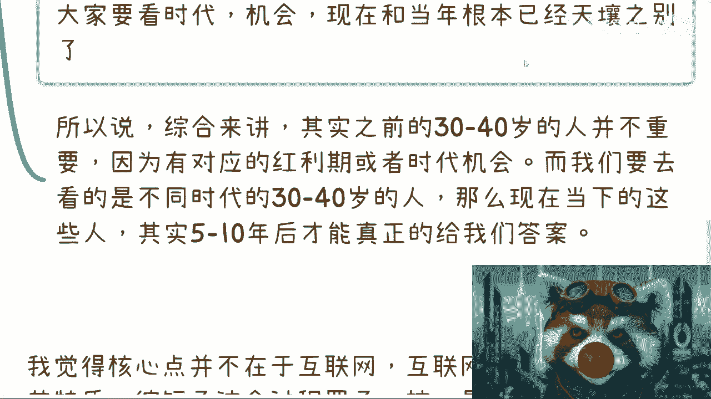

啊并不重要，因为有对应的时代红利期，或者说资本时代的一个机会，而我们要去看的是不同时代的，30多到40岁的人，因为你你你不是这个世界不是只有一一，就不是只有同一拨人，就不是只有一拨人三四十岁了对吧。

但他不同时代的时候，不同年份的时候，他总有那个年份的三四十岁的人了，对不对，所以我觉得当下的这些人其实才是最重要的啊，所以说我是觉得这些人的5年后10年后的情况，其实才能给我们真正的答案啊。

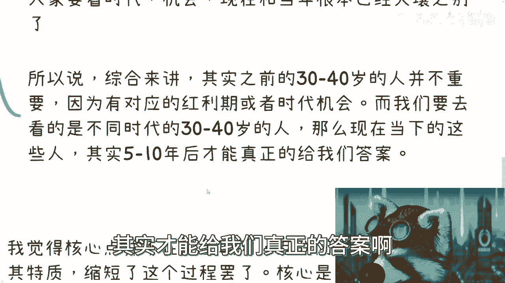

现在你说什么，我觉得这没有用啊，没有用，那这个是三啊四呢。

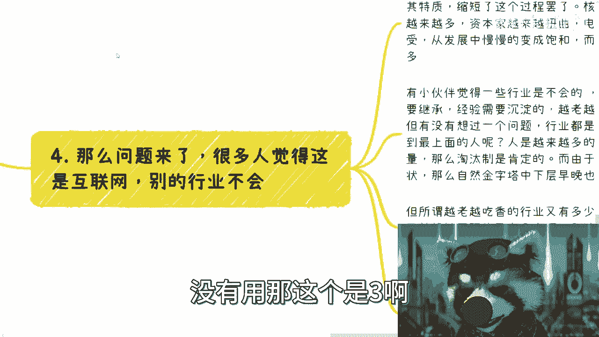

那么问题来了对吧，很多人觉得这是互联网，别的行业不会啊，这个事情也是之前说了很多次的呃，我觉得核心不在于互联网，我和互联网呢，只不过由于它的特性是缩短了这个过程，就我刚刚说的核心是在于，傻老板越来越多。

资本家越来越扭曲，这就好像我觉得现在未来的父母越来越多，是一样的啊，这个这个没有办法，这是个发展中就碰到的问题啊，然后电池呢还越来越逆来顺受，然后整个市场呢是从一个本来是从发展中。

慢慢的变成一个饱和状态哦，然后呢与此同时呢还人越来越多，我觉得核心就是这么一些综合因素导致的，跟是不是互联网完全没关系，互联网只是缩短了这么一件事情啊，那么有些小伙伴觉得一些行业是不会的。

比如那些需要经验传承或者经验需要沉淀的，越老越吃香的，我认为对的，这没毛病，但是你们有没有想过一个问题啊，所有的行业都是金字塔型的，就是就是你就算传承，就算怎么样，卷不到最上面的人，还是多数。

就个人依然会越来越多，岗位总总有那么一个量的岗位，不可能无限扩大的好，那么你就会发现淘汰是淘汰，淘汰制是肯定的，或者来说就是我们说的优化啊，什么各个方面都是肯定的，啊那么所以说呢你会发现这个结论是什么。

结论就是你底层的，就是我们刚刚说的这上面的这些属性，在每个行业都会发生，没有区别的，只不过就是或多或少或少的程度不一样，你知道吗，就说你在金字塔的中下层，早晚是有这早晚都是要面临这么个卷法的。

他只不过就是说互联网前两年提前发生的，而其他的行业是后面才会发生，因为它整个周期没这么快啊，那么我们又说嘛，所所谓越老越吃香的行业又有多久吗，或者说岗位上可替代性不强的又有多少，我们就说嘛又有多少对吧。

我就当然我也有很多人要说了啊，你说医生对吧，或者说一些造造造造宇宙飞船的，造造航母航母的对吧，各种各种手艺工对吧，我跟你们讲，这个你要去看占整个基本盘的比例能有多少，你不要拿出一个一两个对吧。

就非要说特例的行业来杠呃，这个没有意义的啊，那么我们来看，所以说从本质上啊，我个人是觉得呀我的小浣熊小熊猫哦，我错了，只要资本市场，只要替代性相对强的行业，其实我觉得都一样。

就只不过是整体的饱和度有区别，导致其其也不叫结果不同啊，其发生时间不同啊，我觉得是这样子的，但是呢就是目前来看啊，越来越压榨和PUA是资本家的通病，就这些东西他们甚至觉得是一种怎么说呢，是一种优越感哦。

那么这个东西是很难改很难改的，我跟你讲啊，而越来越简，我也曾经说过，这个东西是我们自作孽，我觉得这个就是电池的制作，你没有办法啊，你你别去讲别人，我觉得没有意义的哦，那么同样的还有人会关心吗。

他说会不会好转或者改变啊，我觉得这个事情呢，我现在基本上已经是悲观态度了啊，虽然我觉得我的态度是很乐呃，呃很客观的啊，但是我还是先用悲观这个态度来形容啊，因为从2000年互联网发展到现在。

互联网已经跟各行各业都已经结合了，就说白了就是嗯嗯结合的这个结果有好有坏，整体看来那就是资本市场这个卷，或者整个这个叫什么，就是就是电池的这个卷其实才刚刚开始，嗯嗯嗯就后面只会越来越离谱啊。

我个人觉得啊，在呃然后在当时非常上行的这种市场行情上面，你就会发现他都在往这方面的发展，就更不要说接下来这个下行的市场，他只会加速这个行业的一个互联网化，或者说加速这个行业的一个，一个一个一个周期啊。

其实你其实啊我是觉得大家都在走极端，就资本家来走的，就是说我我我付钱对吧，我有钱啊，我有资源对吧，你就给我往死里做对吧，有没有价值再说，反正有没有价值也是我说了算的啊，反正就是我对呃，我对内PUA。

对外画大饼对吧，而所有的电池呢也在拼命的去跪舔资本家，无论是工作时间还是薪水，其实都是在跪舔，就是我指的这个跪舔就是说啊大家拼命加班啊，拼命怎么样啊对吧，就底层互相伤害啊等等等。

其实都是都是在填资本家没有区别的哦，所以呢其实你会发现，当大家都在走向极端的时候，其实本你你你能指望它有好转吗，我觉得不会啊，我觉得不会，更何况我觉得这种行为，它不是一个单纯的节点行为。

它有着很强的蝴蝶效应，你们想想看，为什么会有很强互联，小米是因为无论是老板还是这个叫叫电池，做出这些选择的时候，其实是对未来的发展或者对未来的自身发展，行业发展都有很大的影响。

而这种影响是当下这些人可能感觉不到的，那我再说直白一点，这就像现在很多考研的人来杠我是一样的，就是我为了他5年后10年后的发展这个考虑，他就来杠我，我就要考研，我考完研我就牛逼了对吧，那我能说什么呢。

那么六呢我觉得就是换位思考啊，就最后我总结一下，就是也别老说资本家好不好啊，我跟你讲这些东西都是屁股决定的事情，就是但凡你做老板，你也这样，因为你第一要素是活下去，你第一要素是要给你的甲方爸爸交代对吧。

到时候你为了企业活下去，为了你的甲方爸爸，为了赚更多的钱，我就问你嘛，你下面的员工你会关心吗，我不信你要，但凡会关心你，第一个倒闭就这么简单，就就事实就是这样的，没有对错呢，这个事情对吧。

那同样的我跟你讲电池呢，电池呢也别去叫什么抱怨抱怨，老抱怨老板，为什么，因为大家屁股不一样，毕竟你要明白一点，就是我们很多人基本盘是会啊，我会从产品的好坏，会从服务的好坏上面去考虑这个问题的。

但是你们一定要明白，到今天为止，产品的好坏，服务的好坏，已经越来越不能决定是否融到资或者赚到钱了，对吧，那我为什么要关心他呢，没有必要关心我，关心的是能不能赚到钱啊。

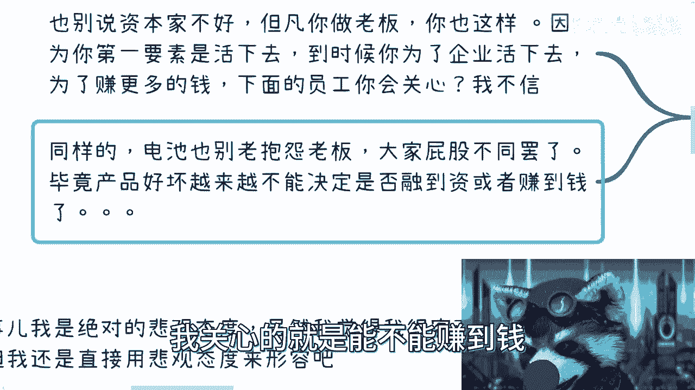

别的我care吗，我一点都不care，对不对，所以呢我觉得就是说嗯这个事啊，这个这个很多人都有不同的见解嘛对吧，又要受到什么啊，你插我笑对吧，这样子啊，各种各样的，但我觉得你们想想看啊。

就是本质上它其实是一个发展中必然会经过的，一个过程，只不过我们说很有本来这件事情啊，很有可能比如说他分十档对吧，就是最好的情况有那么五档，最差情况有五档对吧，那可能我们现在哎。

这个如果说有多元宇宙的话对吧，那在我们这个时间线的话，可能目前当下就是一个最坏的啊，那里面比如说有个什么第一档和第二档，或者我们现在最好的什么第五档，第四档对吧，就这种感觉，那你说未来怎么发展。

我们不知道，但是我觉得这是一个必必经的一个过程，没有办法，就哎呀，我感觉怎么讲呢，就是，嗯就是不同阶层的人，拥有不同的思想和不同的这个视野，还有不同的格局，而好巧不巧，碰巧不巧。

这些不同的视野跟不同的格局，所造就的就是这个结果，只能这么讲啊，孕育而生啊，孕育而生行吧好吧，我我不贩卖焦虑啊，我不贩卖焦虑，你们你们能听进去多少算多少吧。

