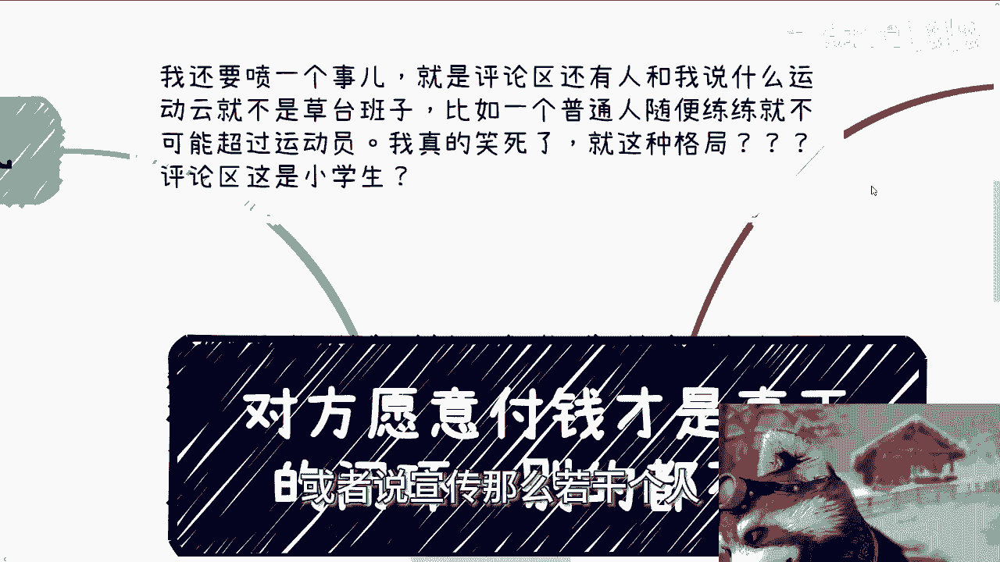
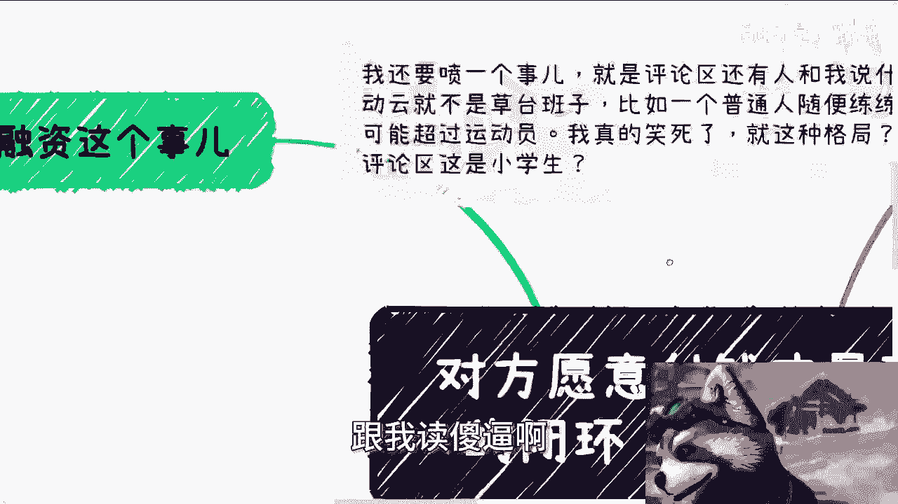
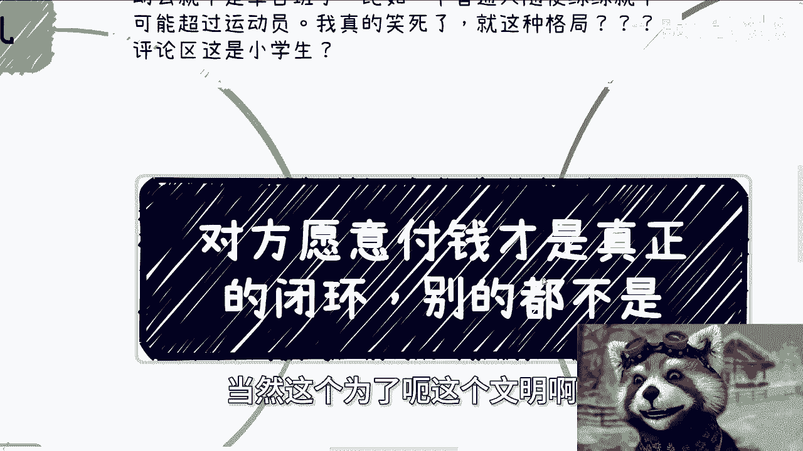
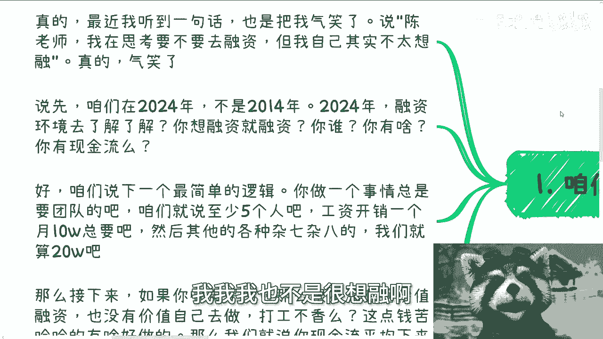
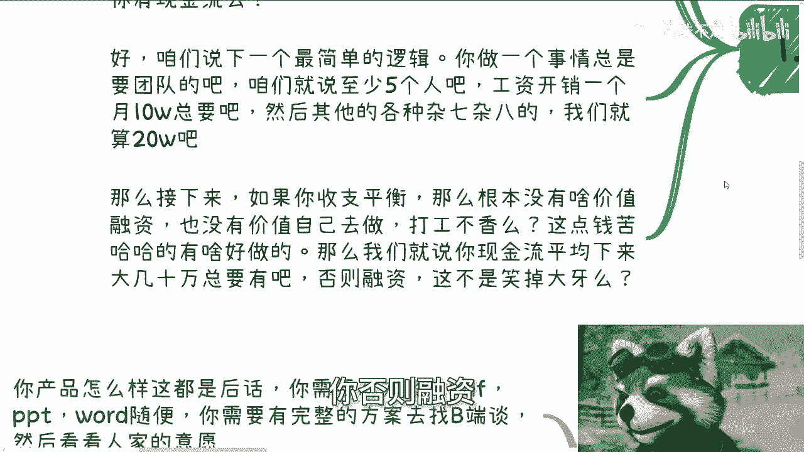
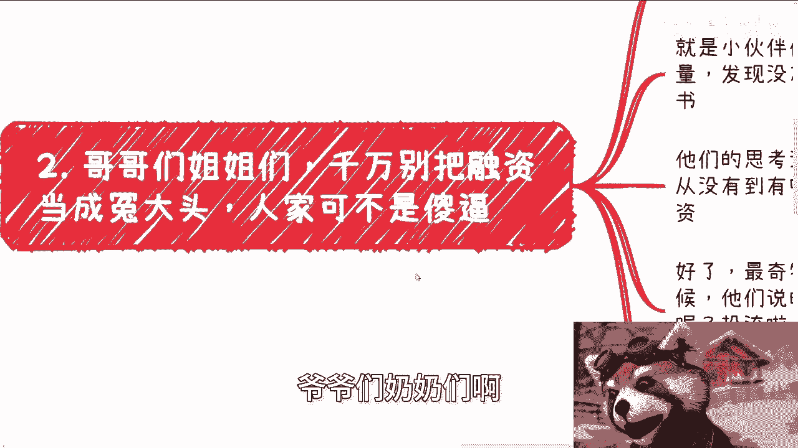
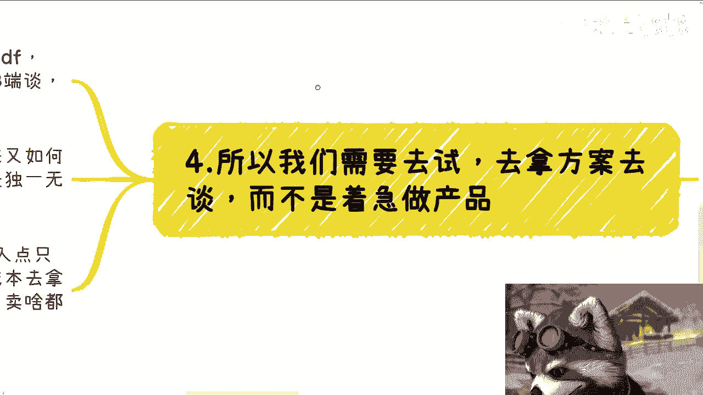
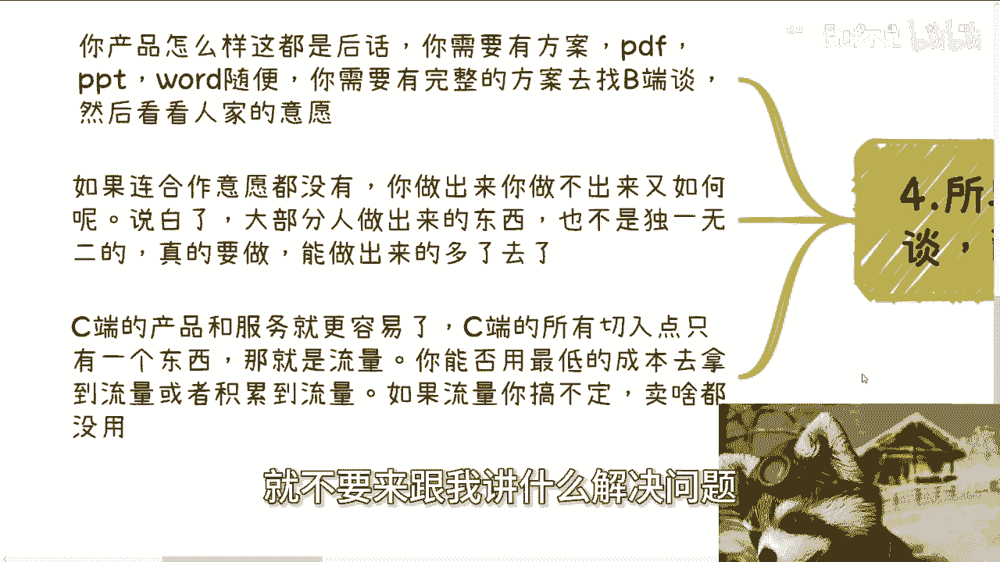
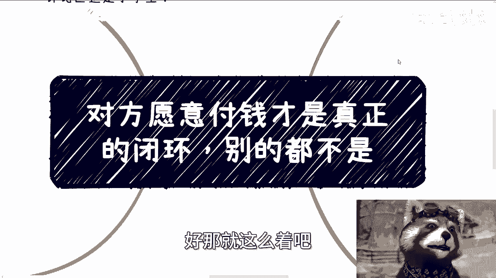

# 对方愿意付钱才是真正的闭环，别的屁都不是 - P1 - 赏味不足 - BV1TJ4m1w79y

好大家好啊，这个今天呃首先先说这个活动啊，这周六啊，5月25号下午在杭州好吧，活动地点在杭州站附近啊，详细内容跟报名额，大家可以私信啊，然后呢就是我要喷个事啊，他妈的他妈离谱啊。

就评论区还有人跟我说什么什么运动员啊，就不是草台班子啊，比如说什么普通人随便练，练就不可能超过运动员，我跟你讲，妈的笑死了啊，就这种格局啊，什么叫草台班子，草台班子的意思是说他妈的像运动员。

像这种叫什么竞技类的，他背后有多少牺牲者，他他妈他背后有多少的人牺牲，就是有背有多少的人他妈当炮灰，最终只有不停的宣传冠亚军对吧，或者说宣传。

那么若干个人这种本身的行为叫他妈草台班子，懂不懂啊，卧槽他妈就离谱，就这种格局啊，是不是他妈B站上，现在他妈都是小小学生，卧槽妈小学生都他妈比比这种，有他妈格局跟我读啊。

啊然后今天我们来讲的呢叫做啊，对方愿意付钱啊，才是真正的闭环啊。

别的屁都不是啊，当然这个为了呃这个文明啊。

我哼我字就不打了，对吧啊，首先呢咱们先来说融资这个事啊，我跟你讲啊，最终我最近啊我听到最多的一句话啊，也是他妈的把我气笑了，就说什么呢，说陈老师我在思考要不要去融资啊，但是呢他们有的人跟我说呢。

我我我也不是很想融啊。

我跟你讲，他妈的真的气笑了，首先啊首先啊咱们在2024年，不是在2014年，什么意思啊，2024年融资环境啊，你去了解了解啊，啊自己当个是人啊，想融就融啊，你谁啊啊他妈搞笑嘞，你有啥哼啊，你有啥。

你有现金流，还是你有什么啊，这现金流也没卵用啊，还还还是你以前你80里刚还怎么说，我的妈也不明白了，对吧啊，好咱们先说一个最简单的逻辑啊，比如说你今天做个事总要有团队吧，啊咱就这么来讲啊。

你一个团队说出去啊，不把人家大牙笑掉的，你至少得有五个人吧啊，工资开销要一个月10万总要吧对吧，然后其他各种杂七杂八，我算你20万啊，然后接下来我就这么跟你说，如果你今天收支平衡啊，你20万。

那么说难听点，你有啥投资价值啊，有啥投资价值啊，五个人干活，收支平衡，你有啥投资价值，对不对啊，然后甚至我觉得也没有什么价值自己去做啊，打工不香吗，不香吗，你还他妈操这么多心啊，这点辛苦钱，这点辛苦钱。

你你做啥不能做啊，而且另外我就说啊，现在现金流平均下来啊，就这么来说，就是你可能每个月不一定不一定就是说玩呃，就是就是都一样嘛对吧，但是你比如说在一个季度或者两个季度，你现金流平均下来至少大几10万。

总要有吧对吧，比如说你告诉告告诉我六个月对吧，我大概平均下来啊，收入每个月收入可能比如说四五十万，五六十万对吧，那你说还有前途，还有就是说未来可言，你否则融资这他妈不是笑掉大牙吗。

对不对，你根本就融不到，你懂吗啊。

然后第二点啊，哥哥们姐姐们啊，弟弟们，妹妹们啊，爷爷们奶奶们啊。

千万别把融资当成冤大头啊，人家不是啊，你们他妈的都要是把别人当，他妈的真的妈你们自己啊，我跟你讲啊，沟通到现在最让我神奇的逻辑是这样子的，就是小伙伴们要创业啊，要做事情啊，没问题啊，没问题啊。

发现可能没有流量啊，发现没有团队啊，发现没有合作方，发现发现也没有背书，发现屁都没有，对吧啊好，然后他们的思维思维逻辑是什么，是这样子的，他说就是因为自己没有东西啊，那么怎么从没有到有呢，当然是花钱了。

对不对啊，然后他们就想着融资啊，好我跟你讲啊，最神奇的地方来了啊来了，当我问他们为啥赚钱的时候，他们会说只要量做起来就能赚钱啊，牛逼啊牛逼，这个因果关系没毛病啊，然后量怎么来呢，啊投流投广对吧啊。

也没毛病啊，好然后我就问那合作方背书怎么来呢，唉请客吃饭呀，应酬啊对吧，给钱啊，钱哪来的，问投资方要呀，哎牛逼啊，有一说一蛮牛逼的啊，但是啊你们有没有发现一个问题啊，嗯各位啊本硕博的高材生们啊。

你们这个逻辑，这就好像啊，我跟别人讲，我没有中彩票，是因为我没有钱买足够多的彩票啊，我没有足够多的钱买足够，我没有足够多的钱买足够多的彩票号码，所以我如果要中彩票，我必须说融资买彩票，哎哎牛逼哎。

这逻辑有点吊的啊，是不是嘛，你们仔细想想是不是嘛，啊真的我跟我跟你讲气笑了，真的气笑了啊，然后第三个啊，什么叫真正的闭环，真正的闭环就是要有人买单，而且要评估出来投入产出比什么意思呢。

意思就是说如果是C端，那么别人真正花钱了到你口袋里了，这叫闭环啊，同时一个人买单，或者还说100个人买单肯定是不一样的，然后你才能那个评估出来，你投入产出比怎么样啊，那么你会去看哦。

OK如果今天有100个人买单了，你投入多长时间，有了数据之后，你可以评估投入产出比啊，那么意思就是说如果是弊端的话，那么你合同必须签完，合同上金额要确定的，有客户来签这个合同了，这他妈才叫闭环，OK啊。

合同没有钱也没有闭环，个屁啊啊，什么叫闭环，在你在你心里闭环，在你脑子里闭环啊，做事情评估一下赚了多少钱啊，我们说商业商业商业的本质是什么，就是赚钱，跟我谈别的，你懂吗啊，你们自己哼，我真的我也气笑了。

就是你我告诉你们，我跟你们讲啊，你们要要赚钱就奔着赚钱去，就是所有事情就是赚钱的，不要来跟我谈什么，哎呀这个产品怎么怎么好，这个产品怎么怎么怎么怎么解决别人问题，别逼逼啊，别比比你为别人好。

也都是你想的，别人能不能解决别人问题，也都是你想的，不是别人想的啊，你真正能不能解决问题，鬼他妈知道我跟你讲，真正解决问题只有用这一个东西来衡量，就是对方能不能付钱没了，对不对，有什么用呢，我跟你讲啊。

赚钱这个事情上面无非就两个点，要么高客单价，要么走量没了，简单明了，就这两个东西，我不管你做什么业务，就这两个东西对吧，否则你就是辛苦钱，这不叫赚钱啊，那么你必须确定对方要能买单，或者说确定量流量。

否则你赚什么钱呢，是不是啊，好第四，所以我们要去试拿方案去谈，要去套啊。

而不是说着急他妈的做产品，或者说着急来跟我聊，或者跟你的合伙人去聊，卧槽我们这个产品能他妈解决什么问题，是个人啊，你能解决什么问题啊，我早就说过了，你们我我们都他妈不是人，我们能解决什么问题。

你对自己没点逼数吗，啊要是能解决问题，他妈早就解决问题了啊，还他妈留到现在吗，啊我跟你讲啊，你产品怎么样，这都是后话，你要的是有才有方案，有PDF有PPT，有word啊，随便你啊。

你需要有完整的方案去找弊端去谈啊，当然这方案虚的实的随便你啊，无所谓啊，然后看看人家的意愿，如果连合作意愿都没有，如果连出钱的意愿都没有，你做出来你做不出来又如何呢，对不对。

说白了大部分人就像我刚刚说的，他妈大部分人做出来的东西也不是独一无二的，你真的要做能做出来的人，他妈在这片土地上多了去了，对不对，你你做不做得出来，这是重点吗，这他妈不是重点啊，重点是你画的这个饼。

或以以及你你你说的这个故事能不能打动对方，明白吗啊C端的产品跟服我跟你讲就更容易了，C端的所有切入点只有一个东西，那就是流量，逼逼别的啊，你能否用最低的成本去拿到流量，或者积累到流量。

或者来说去借别人的流量，随便你啊，只要你搞定你就是牛逼，只要你搞不定你就是，就这么简单，我他妈管你卖什么东西啊，对不对，就不要来跟我讲什么解决问题。

你妈解决什么问题啊，真的离谱啊，真的叫离谱啊。

呃从这个内容呢我们衍生出来另外一个点啊，就是现在这个大家也都知道了啊，这个C端啊有可能有很多问题对吧啊，有很多痛点啊，那么也有很多小伙伴呢想着就是说呃，做一个平台啊，比如说类似猪八戒。

我不知道你们有没有听到过猪八戒啊，这个东西可能有点历史啊，有有点有点古老啊，呃类似于猪八戒这种平台啊，然后呢想要什么解决C端的问题啊，解决什么问题呢，解决C端赚钱的问题啊，我跟你讲，这这他妈就离谱啊。

这他妈就离谱，这这他妈是做一个平台能解决的问题吗，啊回头我给你们讲，我大概呃明天吧，后天我肯定也会出个内容啊，我再来跟你们讲这种平台为什么不能做，做了为什么没有用哈，很简单对吧，我们就这么来讲所有东西。

别的咱先不说C端现在缺的是什么，缺的是钱对吧，不是缺别的东西，没有用的啊，一点用都没有的啊，你说我今天能帮助C端干嘛，不不好意思啊，我我不需要帮助，我只需要知道怎么赚钱啊，我不需要帮助。

不要不要来跟我搞那些有的没的啊，什么什么，你来帮助我什么做知识付费啊，帮助我来做电商，帮助我做别的东西啊，不要不要不要不要不要什么都不要啊，你就告诉我我怎么挣钱啊，我做什么，我做哪些事。

ABCDE做了我能赚钱，同时我不投入钱，这就是我要知道的，这就是广大C端要知道的，别的不重要，对不对，哎不要过来跟我讲什么什么什么，弄一个平台对吧，我说不好听点，他妈C端是C端，虽然有很多人是。

但也不至于这么对吧，你说我一个平台，你让我注册一下啊，然后呢，我为什么注册，哎，我注册了之后，我在你上面做生意，我还要给的啊，叫什么赚呃，你你还要在我里面扣手续费，为什么凭什么那莫名其妙的对吧。

啊然后包括那个那个做电商也是的，做电商你不得压货啊，啊卧槽我，我跟你们讲，很多人真的做事情很奥妙的，他们还有人跟我说什么做盲盒，哎，哥哥们，你们去了解了解做盲盒，开个模具得多少钱，而且哼而且开个模具。

人家不可能给你做一个两个的，我跟我跟我，我真的，我觉得很多人，对这个社会是不是一点了解都没有，就就就我感觉他活在活在这个外星球，你知道吗，就他会感觉就说哎我跟一些什么什么呃，合作商啊。

和一些工厂啊去聊聊对吧，那就能给我最低价，我哥哥们给你最低价的意思是什么，你知道吗，是你必须批量化生产啊，就就就就就就人家是不是吃饱了撑的，就给你这种小散户啊，做个50个100个，开个模具。

卧槽人家不要火了，要买，唉就离谱啊，好那就这么着吧啊反正你们想想看啊。

呃反正活动礼拜六啊，礼拜六在杭州，然后报名的继续报名，剩下的话就职业规划，商业规划啊，合同啊，股权啊，分润啊，分红啊，商业计划书啊对吧，Anyway，就各种各样的，你们觉得你们涉及到的东西。

你们要是摸不清楚的啊，就怕被别人坑的，你们也可以整理好问题，然后私信再走咨询，同样的，你们手上有什么牌，你们手上没有什么牌，你们也希望通过跟我沟通，或者通过我的视角能够给你们更好的。

或者说更相对整个贴近市场的这么一个，那个未来方向的话，那么你们也可以整理好问题，我们再来做咨询，好吧啊。

