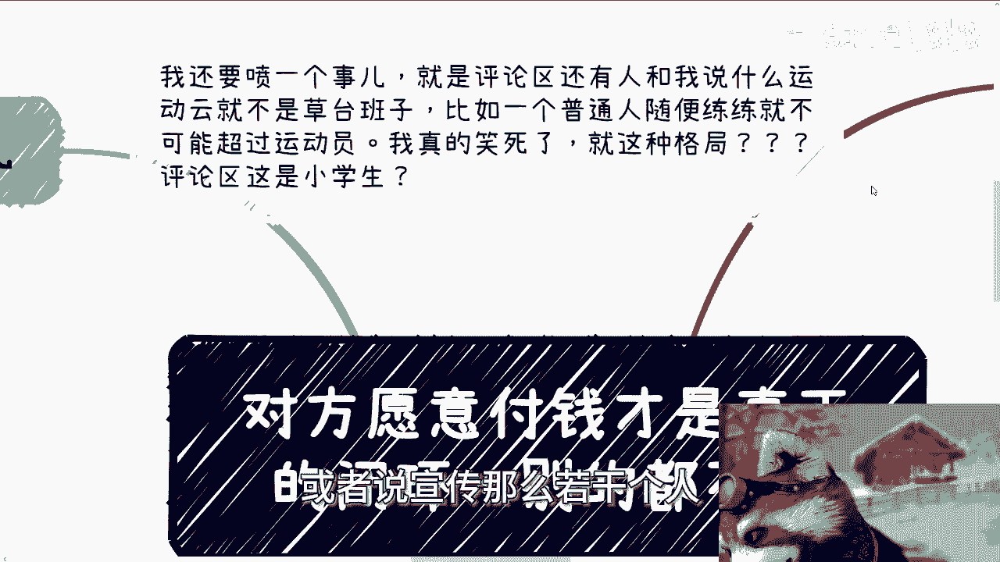
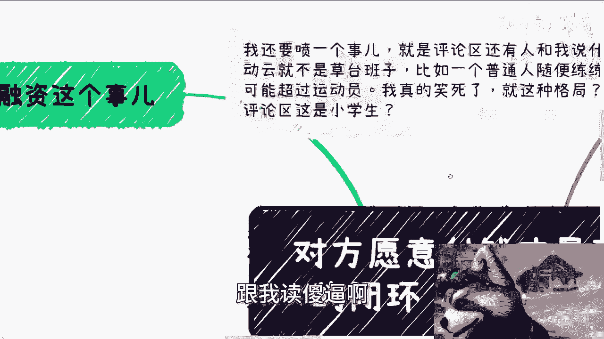

# 对方愿意付钱才是真正的闭环-别的屁都不是---P1---赏味不足---BV1TJ4m1w79y_no

在本节课中，我们将要学习一个核心的商业认知：如何判断一个商业想法是否真正可行。我们将围绕“真正的闭环”这一概念展开，探讨融资的误区、商业的本质以及验证想法的正确方法。

---

## 🚫 关于融资的常见误区

上一节我们提到了课程的核心主题，本节中我们来看看创业者在融资问题上常犯的错误。

首先，融资并非创业的起点。在2024年的市场环境下，融资环境已经与十年前大不相同。投资者关注的是项目的实际价值和增长潜力，而非一个单纯的想法。

以下是关于融资的三个关键认知：

1.  **融资需要基础**：投资者不是慈善家。一个团队若仅有五人，月开销约20万且仅能收支平衡，则缺乏明显的投资价值。其商业模型不具备足够的吸引力。
    *   **公式**：`投资价值 = f(团队规模，现金流，增长潜力)`
    *   一个仅能维持生存的项目，其投资价值趋近于零。

2.  **融资不是“万能启动资金”**：切勿将融资视为解决一切从零到一问题的“冤大头”。常见的错误逻辑是：因为没有流量、团队、背书，所以需要融资来购买这些资源。这好比说“因为没钱买足够多的彩票，所以中不了奖，因此需要融资来买彩票”。这个逻辑颠倒了因果关系。

3.  **现金流是硬道理**：在考虑融资前，项目本身应能产生可观的现金流。例如，在连续几个季度内，月均收入能达到数十万级别，这才能证明业务有持续发展的潜力和价值。

---

## ✅ 什么才是“真正的闭环”

理解了融资的误区后，我们来看看什么才是检验商业想法成功的唯一标准。

**真正的闭环，其核心在于“对方愿意付钱”**。任何不能最终导向现金流入的商业活动，都无法形成闭环。商业的本质就是赚钱。

这个闭环的成立，需要满足两个条件：

*   **对于C端（个人消费者）业务**：闭环的标志是消费者真金白银地完成了支付。同时，你需要通过数据评估**投入产出比（ROI）**。
    *   **公式**：`ROI = (收益 - 成本) / 成本`
    *   只有获得了真实的付费用户和数据，你才能计算这个比率，判断业务是否可持续。

*   **对于B端（企业客户）业务**：闭环的标志是**签署了具有确定金额的合同**。在合同签署、款项确认之前，一切合作意向都不构成闭环。

赚钱的模式归根结底只有两种：**高客单价**或**走量**。你的业务必须能清晰地指向其中一种，并最终让客户买单。

---

## 🧪 如何验证和推进你的想法

既然闭环如此重要，那么在投入大量资源之前，我们应该如何行动呢？

正确的做法是：**先用方案去测试市场，而非埋头做产品**。大部分人的创意并非独一无二，能否做出来不是关键，关键在于你构想的故事和方案能否打动付费方。

以下是具体的行动步骤：

*   **对于B端业务**：你需要准备一份完整的商业方案（PPT、PDF、Word文档均可）。用这份方案去和目标客户沟通，测试他们的合作意愿和付费意愿。如果对方连初步意向都没有，那么产品做得再完美也无济于事。

*   **对于C端业务**：所有切入点的核心只有一个：**流量**。你需要思考如何以最低的成本获取、积累或借用流量。在流量问题解决之前，讨论产品解决了什么“痛点”是无效的。市场只认流量转化后的付费行为。

许多创业者陷入的误区是，花费大量时间与合伙人讨论“我们的产品能解决什么问题”。实际上，能否解决问题应由市场（付费方）来回答，而非自己臆断。

---

## 💡 一个衍生思考：关于“平台梦”

从上述内容，我们可以衍生出一个常见的错误想法：打造一个帮助C端用户解决问题的平台（例如旧式的威客平台）。

这种想法的问题在于，它错误地理解了C端用户的核心需求。当前C端用户最缺乏的不是平台或工具，而是**明确的、低成本的赚钱路径**。

用户要的不是“帮助”，而是清晰的指令：**做什么事（ABCDE），能不投钱或极少投钱，然后赚到钱**。一个需要注册、可能被抽取手续费、且不能保证收益的平台，很难打动用户。同理，一些需要前期压货、开模等重投入的电商或实体产品模式，也与广大C端用户“低风险启动”的需求相悖。

---

## 📝 总结

本节课中我们一起学习了如何构建正确的商业认知：

1.  **融资不是起点**：它需要以坚实的业务基础和现金流为前提。
2.  **闭环的唯一标准是付费**：无论是C端的直接支付，还是B端的签约合同，钱不到账就不是闭环。
3.  **验证优于执行**：用方案（对于B端）或流量测试（对于C端）去探明市场意愿，远胜于闭门造车。
4.  **直面核心需求**：特别是针对C端的业务，要提供清晰、低风险的赚钱方案，而非复杂的平台或工具。

记住，在商业世界里，**对方愿意付钱才是真正的闭环，别的都不是**。一切思考和行动都应围绕这个目标展开。