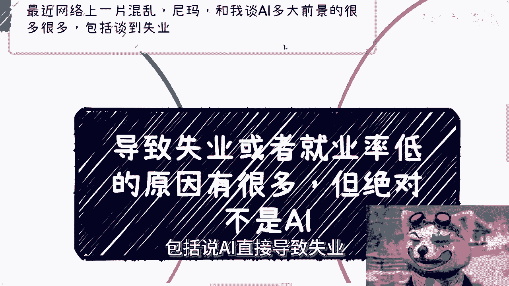
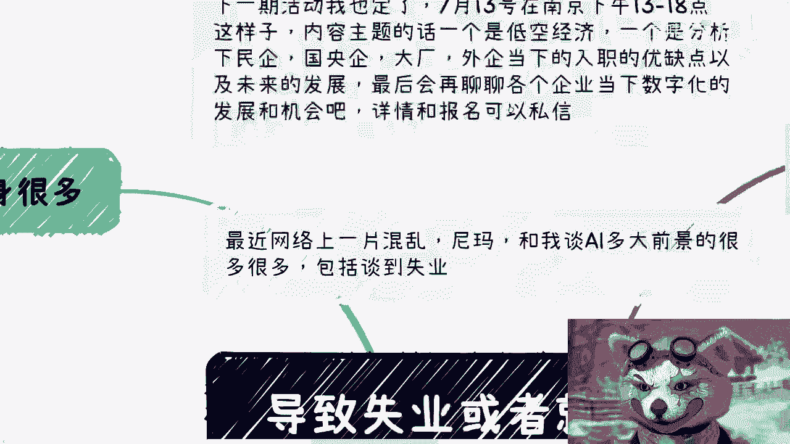
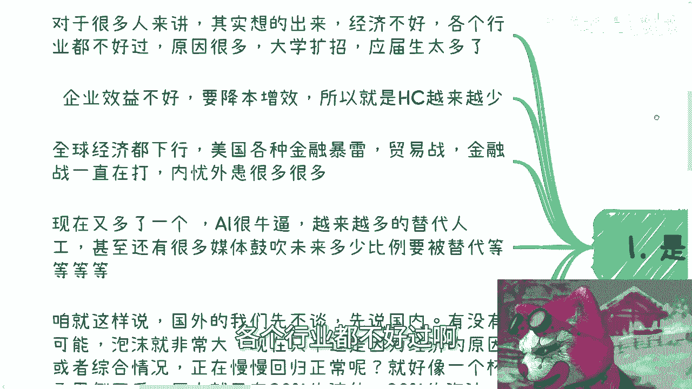
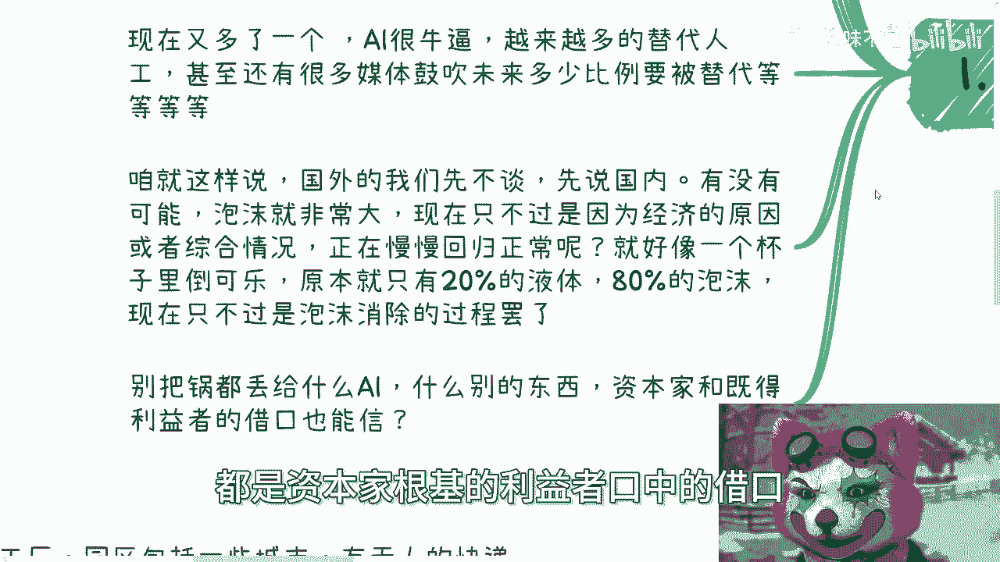
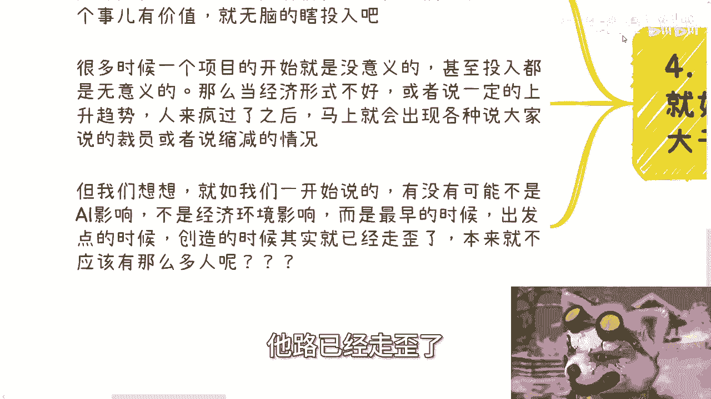

# 导致失业或者就业率低的原因可能有很多-但绝对不是AI---P1---赏味不足---BV1k4421D


## 概述
在本节课中，我们将探讨导致失业或就业率低下的多种可能原因。我们将逐一分析这些因素，并明确指出，将问题简单归咎于人工智能（AI）是一种误解。课程将揭示行业内在的结构性问题。



---

## 一、 失业问题的常见归因
上一节我们概述了课程主题，本节中我们来看看公众通常如何归咎失业问题。



许多人认为经济环境不佳是主因，各行业都面临困境。具体原因被归结为以下几点：



以下是常见的几种观点：
*   大学扩招导致应届生数量过多。
*   企业效益下滑，为降本增效而缩减人员编制（Head Count）。
*   全球经济疲软，例如美国经济问题、持续的贸易战与金融战。

如今，又多了一个流行的归因：人工智能（AI）。有观点认为AI将替代越来越多的人工岗位，甚至有媒体鼓吹未来将有极高比例的工作被替代。

---

## 二、 泡沫经济的本质：回归常态而非衰退
上一节我们列举了常见的归因，本节中我们来看看另一种可能性：泡沫破裂。

我们需要思考一种可能性：当前就业市场的问题，并非是从繁荣到衰退的直线下滑，而是一个巨大泡沫逐渐回归正常水平的过程。




这个过程可以类比为：**一个杯子里原本只有20%的可乐液体，剩下80%都是泡沫。现在的变化只是泡沫在消散，液体量并未减少。** 就业市场的调整，可能正是这种“去泡沫化”的过程，而非AI替代或简单的降本增效所致。

将问题全部归咎于AI是不准确的。许多其他因素，可能只是资本与既得利益者使用的借口。

---

## 三、 产业发展的效益悖论：投入与产出的失衡
理解了泡沫的可能性后，本节我们深入分析产业发展的根本逻辑：效益。

任何产业最终都必须看经济效益。我们以一个行业的初创阶段为例进行推演：

假设一个新兴行业初期有10个团队（或公司）进入，每个团队投入10亿元。根据常见的“二八定律”，最终可能只有20%的项目（即2个团队，消耗20亿元）能存活并达到盈亏平衡，其余80%的投入（80亿元）可能无法产生直接经济效益。

**公式推演：**
*   总投入：`10 团队 * 10 亿元/团队 = 100 亿元`
*   成功项目投入：`20 亿元`（占20%）
*   失败项目投入：`80 亿元`（占80%）

这80亿元的“亏空”需要未来数年由成功项目的盈利来弥补。为了分摊这些风险与成本，企业必然采取一系列措施，例如：
以下是企业可能采取的措施：
*   裁员。
*   缩减各项开支。
*   收缩业务边界。

这并非否定试错和投入的价值，而是指出：**不能在所有事情上都持续进行投入大于产出的亏损运营**。在互联网及相关领域，绝大多数项目的投入都长期大于产出。

---

## 四、 岗位需求的虚构膨胀：人浮于事的根源
上一节我们从宏观投入分析了成本问题，本节我们从微观岗位层面审视需求。

无论是传统企业新增互联网部门，还是互联网创业，团队规模在规划阶段常被严重高估。

**代码示例（比喻性）：**
```python
# 实际需要的团队规模
actual_team_size = 50
# 上报或规划的团队规模
reported_team_size = 500
# 规模膨胀比率
inflation_ratio = reported_team_size / actual_team_size # 结果为10
```


在经济上行、资金充裕时，这种人员膨胀不易被察觉。但我们需要反思：一个业务真的需要这么多开发、测试、产品、运营人员吗？许多岗位分工模糊，实际工作量可能并不饱和。当资本热潮退去，这些被虚构出来的岗位自然成为首先被削减的对象。


随之而来的“压榨”现象，其根源往往并非业务需求真那么大，而是无序内卷（“卷”）的结果。

---

## 五、 AI的角色：工具而非替罪羊
在分析了结构性问题后，本节我们客观看待AI的作用。



我们不否认AI的价值。它在特定场景，如工厂自动化、无人配送、灾难救援等领域，能有效提升效率或完成危险任务。

然而，正如第二节所述，**许多领域的项目从诞生起就缺乏市场基础或合理商业模式，其投入本身就是无意义的泡沫**。当经济周期转向或资本热度下降，这些项目自然会收缩或失败，导致人员优化。

问题的核心在于：**如果做事的方式不从源头改变——即始终追求规模虚构而非实效——那么无论出现什么新技术、新行业，泡沫依然会产生，最终受损的仍是劳动者。** 一个只需50人的项目报批500人，那么未来450人的失业几乎是必然的，因为项目无法创造支撑500人的利润。


不要用少数成功的“幸存者偏差”案例来掩盖大量资源被错配的事实。AI不是失业问题的根源，行业固有的泡沫化发展模式才是。

---

## 总结
本节课我们一起学习了关于失业问题的多角度分析。我们指出，将就业率低下简单归咎于人工智能是片面的。真正的原因更可能源于：**经济泡沫的消散、行业普遍存在的“投入大于产出”的效益困境，以及岗位需求在源头上的虚构和膨胀**。AI只是一个工具或催化剂，而非问题的本质。解决就业市场的结构性矛盾，需要从商业模式的实效性和资源分配的合理性入手，而非寻找技术替罪羊。