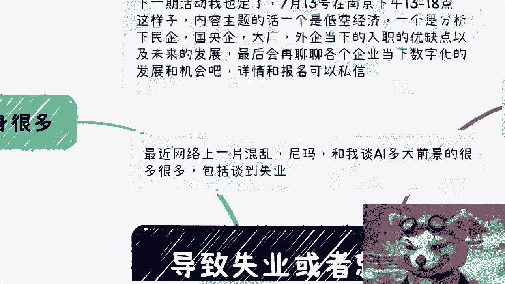
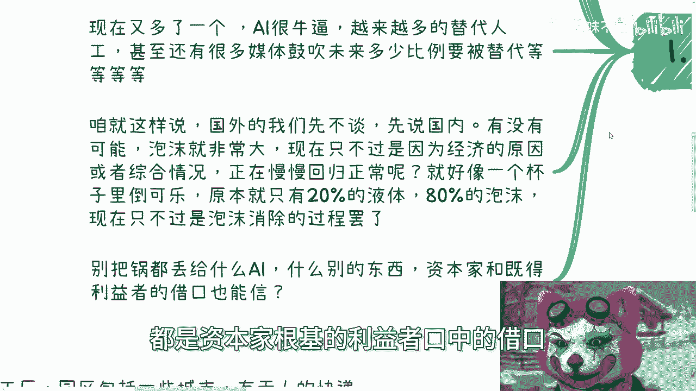
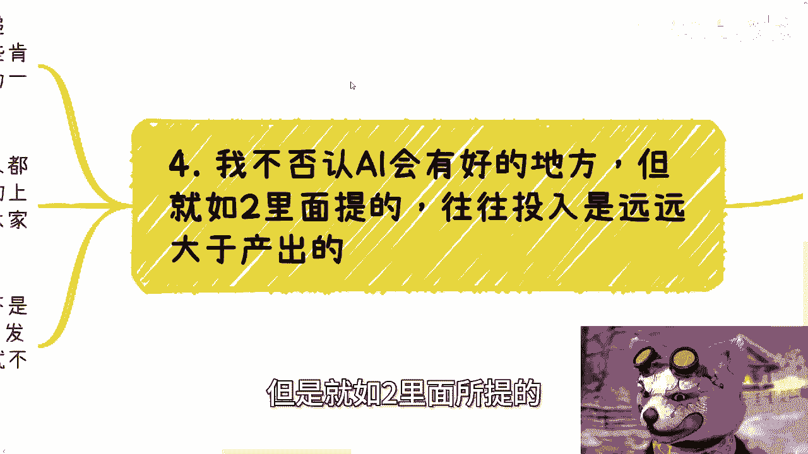

# 导致失业或者就业率低的原因可能有很多，但绝对不是AI - P1 - 赏味不足 - BV1k4421D7Ld

啊好大家好啊，嗯今天我们来讲的这个主题呢叫做导致失业啊。

或者就业率低的原因有很多，但绝对不可能是AI啊，绝对不可能是AI，嗯首先啊最近网络上一片混乱对吧，他妈跟我谈什么AI多大前景的很多很多啊，包括说AI直接导致失业。

我跟你讲，这他妈就离谱啊，呃首先啊我们先说啊，下一期活动我已经定了，7月13号，下周六在南京好一点到六点这个样子，内容主题的话，一个是低空经济，一个是我会给大家分析一下民企国央企大厂。

外企当下的这个入职的优缺点，以及未来的发展啊，最后再聊一下各个呃，这个企业当下数字化的这个发展，跟嗯跟跟跟这个这个落地的这个机会啊，然后就是说详情跟报名，大家可以去私信我。

啧好，我们今天正式来讲今天这个主题啊，首先因素本身很多啊，对于很多人来讲，其实想的出来，你比如说啊很多人觉得啊经济不好，各个行业都不好过啊。

原因很多很多，什么大学扩招对吧，应届生太多啊，企业效益不好，要降本增效，所以就head counter越来越少啊，对吧等等等啊，好包括他们觉得全球经济都不行，美国各种经济暴雷，贸易战，金融战一直在打。

内忧外患也很多很多，对不对，好现在又多了一个啊，觉得AI很牛逼啊，未来越来越多的替代人工对吧，甚至还有很多媒体鼓吹，未来多少比例要被替代掉，我跟你们讲，今天他妈的，我在微博上还看到那个什么什么。

未来80%的妈替换他妈的，真的是他妈吹牛不打草稿啊，然后就是咱就这么说啊，国外的我们先不谈啊，我们先说国内，我就问啊，我就说啊有没有这种可能性啊，我不知道对的错的啊，有没有这种可能性。

就是泡沫本来就很大，就是现在只不过是因为经济的原因，或者综合情况正在慢慢回归正常对吧，哦就不是说大家觉得是一个呃，比如说0。0坐标就是从正到负的角色，而做负正到负的这个过程。

而是一个原本就已经吹得很大泡泡，现在只是回归到正常的一个过程啊，这就好像我们今天一个杯子里倒可乐，原本只有20%的液体，剩下80%都是泡沫，现在其实只不过是泡沫消除的过程，不是什么AI啊，替代人工啊。

什么降降本增效啊，替代很多人，不是的，他妈扯他妈蛋啊，别把什么锅都丢给AI，我跟你讲，各种别的东西，都是资本家跟既得利益者口中的借口。

仅此而已啊，好第二点啊，我们说任何一个产业无论怎么吹。

最终你都得看效益吧对吧，我们来举个例子啊，一个行业的开始，我们打个比方，有十个人在这十个行业，在这个行业里面开始干干活啊，每个人组了一个公司，每个人组了一个团队开始进入。

当然我们就按照正常的八二原则来说啊，每个团队如果都烧十个亿，那么最终80个亿是扔到水里的，当然我们也不能完全说这80个亿没有价值，因为它至少提供了就业岗位，他至少也产生了一些市场的竞争力。

或者多多少少也反馈给了老百姓，但是这80%个亿的项目，他至少没有造血能力，肯定没有达到盈亏平衡，因为达到盈亏平衡，他就不可能属于那80%，对吧好，那么我们假设最终20个亿，有两个项目走出来的。

那么这个20个亿开始盈亏平衡，开始了长期的发展，那么我们假设啊这两个团队用了10年的时间，达到了20个亿的盈亏平衡，那么问题来了，这两个团队用了10年才开始盈利，那么未来还能不能继续盈利。

以及未来到底能盈利多少年，有人知道吗，不知道吧，对不对好，另外那80个亿的亏空谁来补呢，对不对啊，如果我们用未来N年来平摊，这80个亿的风险的话，就是说相当于是不叫拆东墙补西墙。

是拿别的墙的收益来补这堵墙的亏空的话，那么我们就请问他有多少，需要要做多少降本增增效的事呢，比如说裁员，比如说C那个缩减，比如说缩边对吧等等等，当然啊听到这很多人要说，他说那我们做很多事情就是要试错。

我们很多东西就是要投入，对没有错，但是不是说我们这个地方写了，不是说我们不能亏钱做事，是我们不能他妈什么事都亏钱做事啊，你们想想看，在互联网层面，到今天基本上所有的面所有的项目啊，我可以跟你们讲。

所有的项目都是投入大于产出的，就这么个简单情况哦，我我甚至不能说八二原则，我可能觉得有那么1%到2%的项目，是产出大于收入的额，产出大于投入的，那剩下都是都投入大于产出的，第三再说回我们的岗位啊。

无论从企业以前新增互联网事业部来讲，还是说从互联网本身企业的创业来讲，新增团队也罢，包括项目要去融资，问投资人要钱，问政府要钱等等等啊，团队本身的规划都是被虚构扩大了无数倍的，你明白吗。

哦也就是说明明一个项目只要50个人，他会报上去500个人啊，当然你说这是不是创业者，创始人或者投资人有意为之，我们说不准，但是这就好像互联网行业一个潜移默化的规则，就是因为它的成本很难去评估。

你说一个项目一个开，我比如说五个开发也能做，50个开发也能做，你怎么说呢，对吧，在经济好的时候，有钱的时候你怎么说都不为过，而且也没人来管，但是你们有没有想过，无论开发测试，销售产品，市场运营等等等。

你们有没有想过一个业务真的需要这么多人吗，你们仔细回想一下，你们所在单位真的需要这么多人吗，这么多人都在干嘛啊，大家打工可能没感觉，但是你一个企业每个月这么多钱出去，这么多成本出去真的需要这么多成本吗。

当然啊你们可能会觉得哦，那如果来说呃，人裁了之后，那么剩下的人就被压榨了，或者你们也有很多人会觉得，现在唉加班加的就已经很多了，人要被裁掉，加班加的更更多，对吧好，那么我们你你有没有想过。

就是你说人裁掉了，接下接下来要压榨，那为什么要压榨呢，就是压榨的原因不是因为这个需求，这个业务需要这些人干这么长时间，是因为大家没有节制的去卷，才导致这么个结果啊对吧，是因为真正需要吗。

不是那这些其实才是互联网的本质问题，从以前互联网加到现在的数字化改造，到现在数字经济，其实岗位根本没有分工，而且分工也不明确，你真的需要这么多工作量吗，真的需要这么多人吗，对吧。

你们我相信你们哪怕作为一个打工人。

你们心里也多多少少是有逼数的好，那么第四我不否认AI会有好的地方，或者会有帮助的地方，但是就如二里面所提的。

往往投入是远远大于产出的对吧，你比如说现在很多工厂园区，包括一些城市有无人的快递车，甚至出无人的出租车，未来还有灾难的救援等等等，这些肯定是有用的，你肯定有价值的，我我们不可能说这些东西没有价值。

但是我们不能因为一些事有价值，就TMD无脑在各个别的地方瞎他妈投入吧，对不对，那很多时候很多别的领域一个项目的开始，它本身就没有意义，甚至投入就是没有意义的，那么当经济不好的时候。

或者说有一定的上就是过了一定的上升趋势，一过了一定的人来峰之后，马上就会出现大家说的什么降本啊，或者裁员啊，或者缩减情况对吧，很多人就要说了啊，因为经济不好，因为怎么样子，我跟你讲一点关系都没有。

谁他妈一开始这个这个东西从他妈DNA开始，他就是个泡沫对吧，那但我们想想看，就如我们一开始说的，有没有可能不是AI的影响，不是经济环境影响，而是最早的时候创造的时候，他路已经走歪了。

对不对，对吧，所以说你们会发现我们一直讲的是什么，就是叫做治标不治本，就是所有的项目，哪怕未来明年后年到2030年，一直有些新的行业出来，如果我们做事情方式，整个行业的做事情方式，它从源头不改变。

泡沫永远在受伤的永远是打工人，就这么简单，这个事情会变吗，来不会变的呀，啊你说我今天做一个项目，明明只要50个人，我报500个人，那剩下450个人以后不就得死吗，这是必然规律啊，因为你赚不到这么多钱啊。

那么搞笑吗，不是在。

对吧我跟你们讲不要拿那些哦，就是说幸存者偏差啊，或者说明就是很有价值的东西拿出来，我我们不否认有价值的地方，但是太多的冤枉钱投在了冤枉的地方啊，好嘶唉好吧，就这么着啊，然后那个下周六的这个南京活动好吧。

报名也好，了解也好，你们继续私信我，然后剩下的话就股权呃，有股权了，就商业规划，职业规划好吧，那个呃股权啊，期权啊，商业计划书啊，白皮书啊，分红分润啊啊包括合同啊对吧，包括就是说啊一些这个商业合作啊。

包括你们现在手上有什么牌，你们没有什么牌，你们希望你们希望通过跟我的一些沟通，通过我的一些视角，能够给你们一些更接地气的一些计划或者，规划的话，好吧，你们整理好对应的背景跟个人的问题，我们再来组咨询啊。

