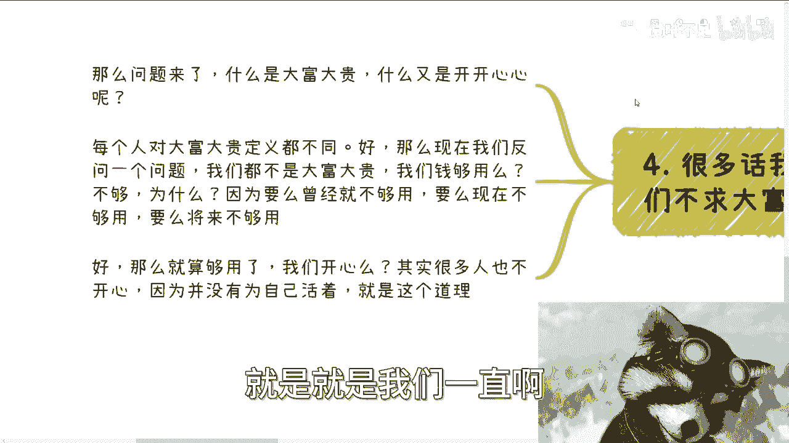

# 课程名称：尊重他人命运，包括你父母和孩子 - P1 🧠

在本节课中，我们将探讨一个核心观念：如何通过“尊重他人命运”来保护自己，避免在人际关系和家庭关系中消耗过多精力，从而更专注于个人成长与目标实现。我们将从商业合作、家庭关系和个人选择等多个角度进行分析。


---


## 第一部分：人不可信与商业避坑 🚫


上一节我们介绍了课程的核心主题，本节中我们来看看如何在商业环境中应用“尊重他人命运”的原则。

人这种生物是不可信的。很多人询问如何避开陷阱、避免踩坑，或者在商业和工作上如何变得果断。其实方法很简单。


**核心行动准则**：
```
一切以赚钱为目标。
一切以法律为基准。
不要相信任何人。
```

按照这个准则行事，你基本不会踩到大坑。当然，有人会认为这过于死板，会错失很多机会。这种说法没错。但问题在于，很多人既想不踩坑又想赚钱。这几乎是不可能的。既然不可能，就不要纠结于此。

以下是你在商业合作中可能遇到的三类人，了解他们有助于你保持警惕：

1.  **人不坏，但没有边界感**：这类人主观上无害人之心，但因其缺乏边界感，容易在无意中坑害合作伙伴。例如，他可能为了“搞好客户关系”而做出让你和甲方都产生误解的行为，最终结果难以澄清。
2.  **无法用“好坏”简单判断的人**：这类人的行为取决于他所处的位置。当他需要你时，会对你很客气；一旦达到目的，就可能忽视你的利益。很多人自己都意识不到自己有这种倾向，因此极难提前判断。
3.  **纯粹的白嫖或欺诈者**：这类人目的性极强，就是为了骗取你的方案、流量或其他资源。他们的手段可能非常自然，甚至看似无意。

面对这些情况，最果断的做法就是“尊重他人命运”，摒弃助人心理。如果一项合作不能带来明确的盈利可能，且逻辑不通，那么最直接的方式就是结束合作，寻找下一个机会。不果断，就无法向上走，也就赚不到钱。


---

## 第二部分：父母与孩子的命运轮回 🔄

在商业合作中保持距离很重要，在家庭关系中，这一原则同样适用。本节我们来看看父母与孩子之间常见的困境。


很多父母在无意中毁了孩子的大半生。在咨询中，我常遇到一些人（尤其是男性）在做人生重大决定时，核心动机是为了“偿还父母的心愿”或让父母满意。


**关键思考**：
每个人只活一辈子。如果你现在为了父母而活，做一件对自己未来毫无益处甚至可能带来痛苦的事，那么这些后果最终将由你自己承担，而非你的父母。当父母百年之后，你又该为谁而活？

现实中，有太多功能失调的家庭：存在借贷纠纷、离异、黄赌毒问题，或是通过“希望你继承家业”、“考公务员”等名义进行的精神束缚和PUA。许多人二三十岁了，却从未真正为自己活过一天，长期处于抑郁状态。

对于父母和孩子，我们的义务是清晰的：
*   **对父母**：养老送终。
*   **对孩子**：抚养其长大成人。

在此之外，每个人都必须先学会自救。如果一个人自己都不尊重自己、不管自己，我们为何还要过度操心？用法律厘清必要的责任后，就不应再被其消耗。最大的道德负担，仅限于完成上述基本义务。

---

## 第三部分：如何“管”孩子？ 🤔

既然我们讨厌被父母PUA，那么当我们成为父母时，又该如何避免重蹈覆辙呢？本节我们来探讨这个问题。

很多人强调“孩子要管”，但问题在于“怎么管”。这常常陷入一种轮回：我们的父母用“上好学校、找好工作”的模式管我们，现在我们又试图用同样的模式管孩子。这有什么区别呢？

作为孩子，我们最希望父母做到的是：你可以不了解我的方向和目标，但请不要PUA我，不要强行灌输。

反过来，作为父母也是一样。如果你的孩子读书不行，在你看来继承家业也不行，那又怎样呢？打骂没有用。我们需要的是沟通与发现，而非控制与循环。

---

## 第四部分：寻找生活的平衡与意义 ⚖️


我们讨论了如何在外部关系中断舍离，最后，让我们回归自身，探讨这一切的终极目的。


常有人说“不求大富大贵，只求开开心心”。但什么是大富大贵？什么又是开开心心？抛开定义不谈，一个现实是：大部分普罗大众的钱并不够用，或缺乏抗风险能力（如应对疾病、危机）。

即使假设钱够用，很多人依然不开心。我们一直强调要赚钱、要快速积累，其根本目标并不仅仅是金钱本身。

**核心目标公式**：
```
积累基础（金钱、抗风险能力） → 寻找平衡（与父母、与孩子、与自我） → 探寻个人生命意义
```




这个过程的目的是，当我们有了一定的基础后，能够去寻找与家人的健康平衡，并探索自己真正想要什么。而不是日复一日忙碌，最终却发现积蓄可能连未来的医疗费用都覆盖不了。

未来总会为一些事后悔，因为我们并非圣贤。有钱能解决很多问题，但解决不了所有问题；但没有钱，通常会带来更多问题：生活品质低下、精神状态不佳、家庭矛盾增多。

---


## 总结 📝

本节课中我们一起学习了“尊重他人命运”这一核心原则的广泛应用。

1.  **在商业上**：以**盈利**和**合法**为铁律，警惕三类人，摒弃助人心理，果断决策。
2.  **在家庭中**：厘清对父母（养老送终）与孩子（抚养成人）的基本义务，超出部分尊重其个人命运，避免过度消耗与道德绑架。
3.  **在自我成长上**：认识到积累财富的目的是为了获取寻找生活平衡与个人意义的基础。在真正强大之前，应优先关注自身建设。


要实现果断决策、避免无意义消耗、乃至未来探寻生命意义，首要一步就是：**放下助人情结，拒绝被虚假的道德观绑架**。你可以格局不高、认知不足、经验不多，但不要再让“因为他是我的父母/孩子”这样的想法，成为你前行路上不必要的负担。