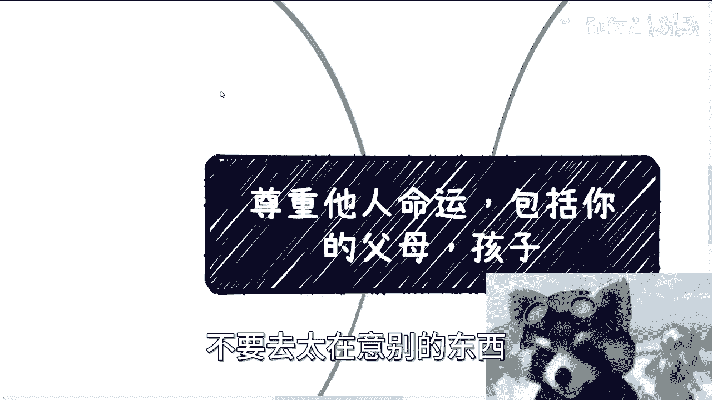
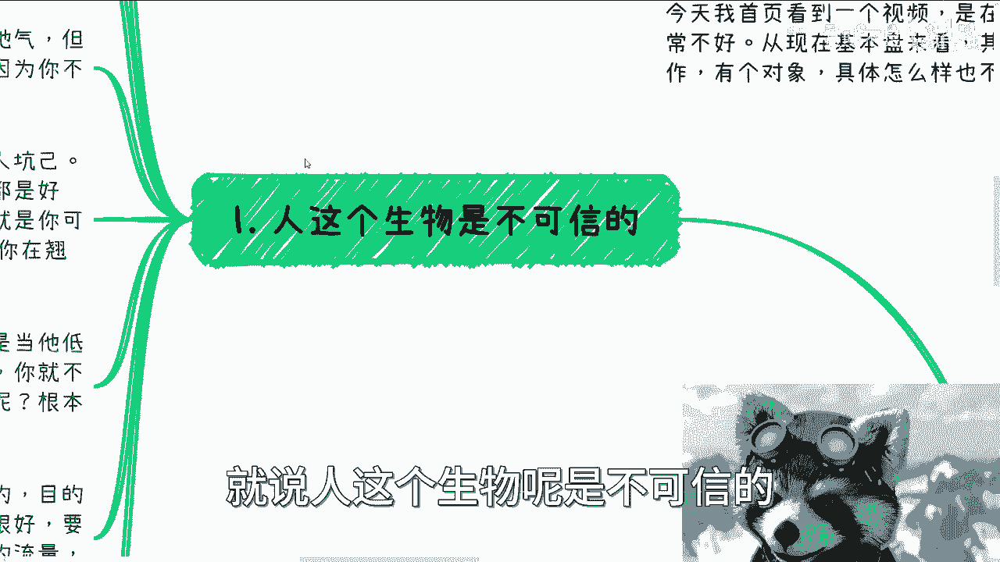
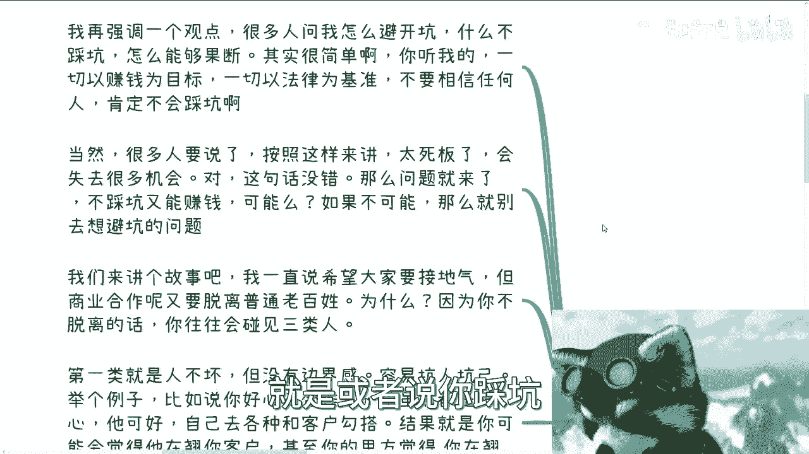
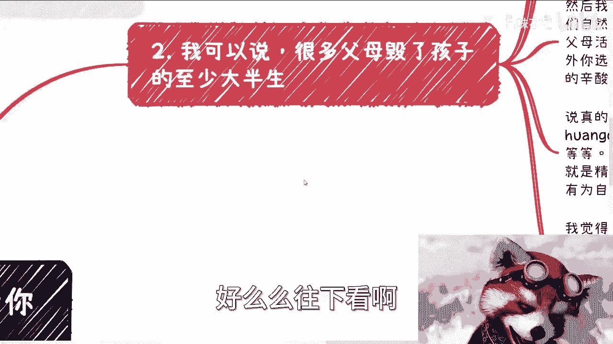
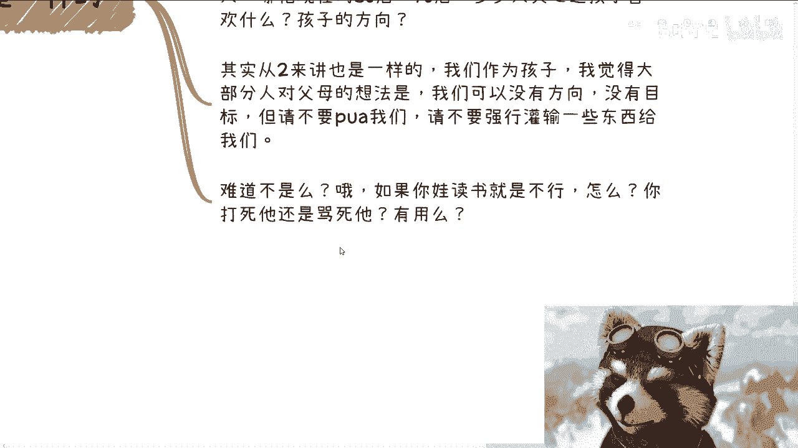
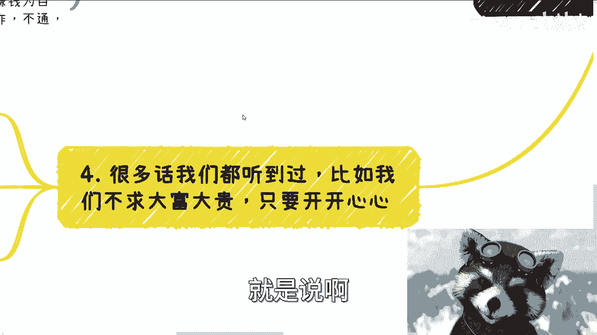
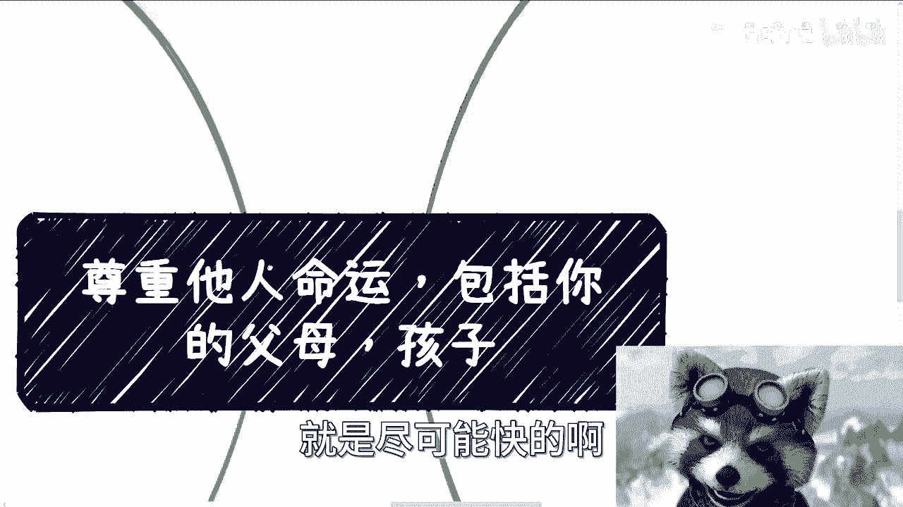
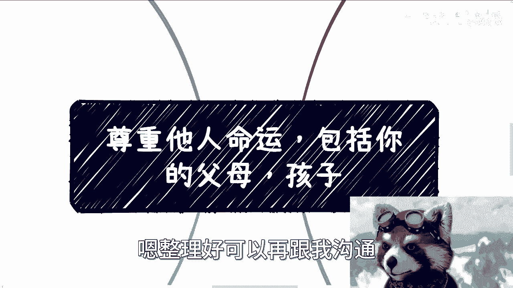

# 尊重他人命运，包括你父母和你孩子等 - P1 - 赏味不足 - BV1cB4y1Z7vq

哈喽大家好，这个终于终于到了北京，然后也终于空了下来，哎呀其实这个主题呢应该是前两天，但是被我拖了，拖到了今天呃，首先呢就是说因为前两天首页我看到个视频啊，他是说什么呢，说现在孩子失业啊。

一失业呢就或者或者说裸辞啊，呃父母就特别慌啊，也会态度非常不好，呃总觉得就是说孩子无所事事啊，那这个事情呢呃就这么说吧，就中国现在基本盘呢没有办法，呃其实很多父母呢或者再老一辈对吧，就再上一辈对吧。

嗯要的就是说孩子有个工作，有个对象，嗯其实啊，我是觉得就是说大家要求也不能太高啊，你说有很多人其实会说嘛，哎呀我父母也不关心啊，我到底做什么工作对吧，我这个对象怎么样，或者说你说上一辈的人呃。

上上一辈的人对吧，不关心或者怎么样，但我觉得你想想看啊，就现在这个社会发展这么快，你指望他们能这么关心呢对吧，他的确不懂啊，啊当然了，就是说现在这个关不关心是一回事，这很多家长呢也的确是就是说呃。

他虽然他虽然不懂，但是他非要来催你，所以说这个搞的就是矛盾很多啊。

本期这个内容呢叫做尊重他人命运啊，包括你的父母跟孩子，那为什么呢，是因为呃，本质上我觉得核心点还是说，所有人都是为自己活着啊，不要去太在意别的东西。

尤其是一些我们控制不了的东西，呃首先第一点呢，就是说人这个生物呢是不可信的啊。

你看啊我再强调一个观点，就很多人问我怎么避开坑对吧，怎么不踩坑啊，怎么能够就是说在商业上或者工作上面，在别的方面很果断啊，呃其实很简单，你听我的啊，一切以赚钱为目标，一切以法律为基准哦。

不要相信任何的人，就是你所有的做事情前提没有信任可言，那你铁定不会踩坑，你知道吧，就是或者说你踩坑你也不会有非常大的坑。

当然很多人要说了啊，按照这个说法呢，他就会觉得太死板，会失去这个比较多的机会啊，我跟你讲对，这句话也没有错，因为你但凡任何的合作或者很多东西，你说啊我一切都是以这个赚钱为目标，以法律为基准对吧。

就是说啊你只要这两个东西没有对吧，我就不做，那么你基本上社会错失很多机会，这也没毛病啊，但是问题来了对吧，那么你说很多人为什么会既问上面这个问题，又问下面那个问题呢，就是因为他想的是我不踩坑又能赚钱。

那就问可能吗了对吧。

那如果来说答案是不可能，那么就别去想这个问题了对吧，就别叫自己去纠结这个问题，或者来问我没有用的是吧好，那我们来讲一个故事啊，就是说啊我呢一直是希望大家要去接地气啊。

但是商业合作呢本身呢你要脱离普通老百姓呃，为什么啊，因为我们以前说过，就是在当时说那个战争，或者说不是我们说打仗的那个战争啊，就是说我们跟别人啊，你争我斗啊对吧，或者说你被别人坑啊，或者怎么样子啊。

就是说呃你不脱离普通老百姓呢，你往往会碰到一件三类人啊，第一人呢就是人不坏啊，但是没有边界感，什么意思呢，就是说啊，人本身没有一个主动要去害你的这颗心，但是呢他容易坑人坑己，为什么呢，因为他没有边界感。

他不知道啊，边界在什么地方，他也不知道红线在什么地方，你举个例子啊，就比如说你好心去合作对吧，他虽然都很好心啊，他呃就是他虽然都是好心，但是呢比如说啊我随便打个比方，比如说他自己去各种跟客户勾搭啊。

那么他觉得啊就是说呃完全没毛病啊，他觉得就是说为了跟客户搞好关系啊，或者说为了你帮客户搞好关系，对不对，好，但是结果呢，就是说你可能会觉得他在撬你的客户，甚至你的甲方会觉得他在抢你的客户好了。

那么这件事情你跳进黄浦江也洗不清了对吧，但是那一般啊我就这么跟你们讲，一般发生这种事情，如果发生在我身上啊，如果我是当事人对吧啊，然后呢你比如说你你也认识这个人，你跟我说啊，吕老师啊，这个人很好的。

这个人很怎么样的对吧，我们都相信这个人的对吧，我们可以帮他做背书对吧，那你从我角度来讲是什么呢，就是没有用的，因为人好不好，和他做这个事情，他本身没有任何的直接联系，你跟我说，因为他好，他不会做。

或者因为他不好，他就会去做，没关系的哦，就是他今天可以是个善人，他今天可以是一个非常nice的一个人，但是并不代表他不会做这些事情，甚至他心里怎么想的，我们也不知道，但是我以结果来导向。

我只会觉得洗不清对吧，那么第二类呢就是说呃没办法判断，就是坏不坏或者好不好用，或者说没有办法用这单纯的两个极端去判断，那更多的呢应该是说当它低于你的时候，他会把你当人看，当他达到目的，他就你就不是人了。

你明白吧，那么第二类呢，就是说呃你不能说他一定一开始就想好，过河拆桥，而很多人的性格是属于那种，就是说就是说他自己意识不到，但是他这种人是什么呢，就是当他低人一等的时候，他是很谦虚的。

但他高人一等的时候，不好意思，低于他的人都不是人，就很多人都这样子的，我跟你讲，你只不过他自己不知道啊，那么这个时候你想想看。

你连他自己都不知道你，你说我们怎么判断，我们根本判断不了对吧，那么第三类就是纯粹的来白嫖或者，坑蒙拐骗的啊，目的性极强对吧，那我再跟大家讲个故事啊，有些人表面很好，要合作对吧。

但本质上就是根据各种来白嫖你的方案啊，甚至呢白嫖你的流量对吧，而且做的非常不做作啊，非常的自然，甚至是无意的，哎我跟你讲多了去了对吧，所以说啊我跟你讲啊，这种事情是这样子的，就是呃你要放在以前对吧。

我还比较单纯的时候，我可能会跟你讲啊，这种事情你尽量一刀切啊，可能会误伤啊，你要放到现在，我就会告诉你，你拿把这个机关枪在这里扫射，哎，不带误伤的啊，没有一个冤枉的，我跟你讲啊，你闭着眼睛扫啊。

都没有冤枉的，你知道吗，就这个样子的啊，所以你问我怎么避坑，怎么能果断，很简单是什么呢，就是尊重他人命运，不要自己有任何的助人心理对吧，比如说他跟你讲了一些事儿啊，你觉得哎呀我心软了对吧。

我想帮助他对吧，那你早晚要被坑啊，那么你一切以赚钱为目的，有赚钱的可能，其赚钱逻辑是通的，那你在合作不通，那删除好友下一个对不对，这有什么意义呢，没有意义的呀，就是你不果断，你就不可能往上走。

你不往上走，你就赚不到钱，好我们往下看啊。

呃第二点啊，我可以说很多父母呢毁了孩子，而且至少是大半生啊。

为什么呢，你看啊呃我忘记什么时候做的咨询了，但是呢整个这个咨询当中呢，有太多的人其实是有这种类似的事情，就是我呢一般啊啊都说的可能不太好听啊，当时呢我记得我应该是跟一个男孩子啊咨询啊。

因为女生找我一般都比较温柔对吧，找过我都知道啊，那那个男生呢应该当时说呢做什么决定啊，那么碍于隐私，我肯定不可能说出来啊，反正就是要做什么决定，然后呢我就问他为什么，那么他意思呢就是要还了父母的心愿啊。

巴拉巴拉巴拉，那我相信听的人里面啊，咱这个不管有没有跟我沟通过啊，就是呃我相信总有人肯定也会有这种想法啊，呃我呢应该当时呢属于一方面，这种声音听多了有点烦啊，另外一方面呢我实在觉得他的这个决定呢。

除了所谓的去满足父母的心愿以外，毫无用处，就是对他自己，对他未来都毫无用处，然后我当时原话呢我是这么说的，我说每个人就活一辈子啊，我们自然都希望父母长命百岁啊，但是我说你想想看啊。

你现在为了父母活着以后，你父母百年之后，那你为为谁活着呢对吧，或者我们再换一个角度来讲，你选择了为你父母做的这个还愿了，这件事情以后，这件事情本身很有可能给你带来痛苦。

也可能给你带来背后的很多的一些心酸啊，抑郁啊对吧，或者其他各种各样的问题，因为蝴蝶效应，我们不知道他到底会带来什么样的问题对吧，但是他既然对你毫没有太大的作用，就说明你肯定会浪费时间在这件事情上面对吧。

那么相对来讲，你就会带来一部分的这个这个DEBUFF，那么我们就说啊，就是说你为了还愿所得出来的这些痛苦，这些辛酸都是你自己承受的，又不是你父母承受，那你图啥呢对吧，其实我就没明白，就是啊。

那么说真的呢，我身边我也见到过太多操蛋的家庭对吧，你比如说借钱的，离异的对吧，黄赌毒的啊，尤其是赌吧对吧，赌赌这个事情呢在很多家庭其实是很多的啊，然后还有比较好的呢，就希望你继承家业。

当然都是那种PUA性质的，就是说希望你继承家业，其实更多的是为了束缚你，不想让你出去啊，希望你考过公务员的呢，也都是那种就是说啊不管什么呃，现在世界怎么转，反正他就觉得你就应该待在这个。

这个自己的小乡村里面或者小镇子里面对吧，那么总结下来就两个，一个就是PV，一个呢就是精神束缚，就是你别看很多人20多岁，30多岁啊，现在因为咨询我的人大差不差，大部分都是小于40岁的对吧。

那很多人呢我是觉得你别看他20多，30多，他其实没有一天为自己活过啊，甚至因为家庭的原因呢，他其实一直很抑郁，但是呢他他可能别人也不知道啊，他也不想告诉别人啊，那我觉得呢其实大家都是这个成年人啊。

很多人说吕老师啊，你说父母跟孩子对吧，因为我这个标题里面不是提了父母跟孩子，就他们可能会觉得我提父母跟孩子，过于无情对吧，但是我观点呢其实很简单，就是你想呀我们可以尽我们的义务对吧。

你比如说你说啊养大成人，或者说这个呃养老送终对吧，我觉得我们可以尽我们的义务，但是剩下的呢就是所有的事情啊，他们自己都要先自救啊，因为每个人都是为自己活着的对吧，你说甭管是你的父母还是你的孩子啊。

你说他自己都已经不管自己，自己都已经不尊重不尊重自己，为啥我们还要操心呢，因为我实在看到过太多那种，就是说啊父母呢这根本没有这个担当啊，孩子呢也基本上就是属于那种啊，可能自暴自弃对吧。

或者说他他就是就是他就不希望，他就不想往父母定的那个方向上去走对吧，就是说他自己其实也不管自己，他自己也没有尊重自己，咱甭甭管他，就是这些啊，就多大对吧，你说是18岁还是80岁，这不重要啊。

那我发现会有很多人呢就是说造孽呢，他造的是这就是父母孩子造的孽，但是受苦难自己受苦，那我说你何必呢对吧，你随便啊，你爱咋地咋地嘛对吧，你要说要用法律的来撇清关系的，那你就去搞对吧。

该做什么东西做什么东西嘛，你别自己耗啊啊，那么说白了就是说做很多事情呢，他们归他们做，那为什么我们要兜底呢对吧，我觉得你如果道德观正常的话，你兜的最大的底就是说我孩子养大成人，我父母养老送终没了呀。

还有什么呢，没了呀，对了我们要有什么心理负担呢，我也不知道要有什么心理负担，是吧，然后我觉得第三点呢，孩子也是一样的，很多人说孩子要管，孩子要管，那么问题来了，怎么管。

就是其实所有的东西都是个轮轮回嘛对吧，你跟二一样，你比如说你怎么管，就是你父母管你，他都不知道怎么管，你怎么管你孩子，就我们是想自己再经历一遍这种循环，或者这种PUA吗，对吧。

很多人所谓的管就是哦要上好学校，要读好书，要考上好大学，要有好工作啊，什么领域好，什么方向好，到现在我跟你讲，很多八零后，九零后都做父母的，他不是也是这么个想法吗，但问题是你想想看啊，你仔细想想看。

你的这种行为跟跟现在这一代的上一代的父母，行为有什么区别呢对吧，那不就是上面我们说的这个，这个七八十年代的父母的一个，或者六七十年代的这个父母的一个循环吗，有什么区别呢对吧，你哪怕现在八零后。

九零后有多少人关心过，就说或者说去沟通过，你说他到底真的喜欢什么，或者真的想发展方向没有的呀，当然了，当然了，我们就说就说被应试教育所胁迫也好，或者说碍于整个大环境也好，对是没毛病了对吧。

但是这个结果是这样子的，我们得思考一下，所以其实从二来讲也是一样的，我们作为孩子，我觉得大部分我觉得大部分人对父母的想法，就是说你可以不知道我们有什么方向，没有目标，但请不要PUA我们对吧。

请不要强行的灌输一些东西给我们，那不就对了嘛对吧，那不就对了嘛，那反过来也是一样的呀，啊所以说所以说你看啊，孩子对你说哦，如果你娃读书就是不行对吧，你已经看出来了，就是说啊。

可能做你的自己的一些传统业务也不行，读书也不行，怎么了呢，你是打死他还是骂死他呢，没有用的呀，对不啦。

好那么第四点就是很多时候呢这个话啊，我觉得我们也都听到过，就是说啊他说很多人说啊。

我们不求大富大贵啊，只要还开开心心的，那问题来了，什么是大富大贵，什么又是开开心心呢对吧，你说每个人对大富大贵的定义虽然不同，但是我们反过来想一个问题啊，大部分的人普罗大众，我们现在都没有大富大贵。

我们但是问题来了，我们虽然没有大富大贵啊，那你说我们的钱够用吗啊也许有的人够用，有的有的人也许不够用，但是你说为什么很多人会不够用呢，是因为要求高吗，不一定吧，因为他不够用，可能是因为曾经就不够用。

比如说父母欠下的债啊啊也有可能现在不够用，比如说现在所面临的一些生活的压力对吧，生计的压力对吧，那还有一种就是将将来不够用对吧，无非是他将来想想到的要结婚啊，要买车啊，买房啊对吧等等等啊。

也有还有一种就说是为了未来的这种叫什么，就是比如说中年危机对吧，就比如说父母身体不舒服啦，自己身体不好啦，或者各方面啦对吧，就是要有抗风险能力，但是无论从哪个切入点来讲。

其实本质上大部分的人其实都是不够的，为什么，因为从目前医疗挤兑来讲，包括医疗的这个资源呃，怎么说呢，就这个收费来讲，大部分人的这个钱财，他其实没有这个抗风险力的那么好，那么我们退1万步来讲啊。

那就算我们够用了啊，那你们问问看你们自己，就算你们够用了，你们开心吗，也不开心了对吧，因为唉因为怎么说呢，就是就是我们一直啊一直以来说要赚钱对吧。

或者要要呃叫什么，就是尽可能快的啊赚钱或者怎么样子。

其实他目标不是说只为了赚钱，他目标其实是说，当我们有了一定的这个抗风险能力之后，或者有了一定的这个这个这个基础之后，我们就得去寻找，就是说啊我们跟父母之间的平衡，我们跟孩子之间的平衡。

以及我们自己到底要什么，他是要去寻找的，对啊，不是说我们每天就是忙碌的，你说从早上啊上班下班上班下班，一天到晚忙碌忙碌到最后就是说呃那当然了，以前就当当段子说，就说哎这个忙碌的钱还不够以后的医药费。

但现在看的确不够以后的医药费对吧，那那就回到一个很核心的问题，就是每个人活着到底为了什么对吧，而且我跟你们讲很多事情来未来总归会后悔的，为什么，因为你现在年轻，你现在就是感觉好像就心有余立足，你知道吗。

但是你等到30岁，30多岁，很多事情没有办法，因为毕竟我们不是圣贤，地球也不围着我们转，所以我以前也说过嘛，就很多时候就是说我们会发现有钱呐，呃能解决很大的问题，但是你只有钱，那也解决不了所有的问题啊。

但是呢你但凡没有钱呐，那哎呀只能说什么呢，就是说呃生活品质可能也不高，精神状态也不好对吧，然后可能家庭的矛盾也会多，那反正就是各种各样的问题吧。

对啊当然扯远了啊，所以说就说我们回过头来讲啊，就是说啊不管你是商业上想做的好，还是你要变成一个果断的人，还是说你不想浪费任何的时间，在一些无意义的事情上面，还是说未来你有机会再去寻找自己的，这个叫什么。

就活着的意义啊，我觉得首先第一大要素要做到的是什么，就是你可以格局不高，你可以认知不高啊，你也可以就是说呃就是各种各样的这个叫什么，怎么说呢，经验不多啊，但是核心点是什么，就不要再有任何助人的想法啊。

就是在你真正的强大之前，不要有任何助人的想法，而且也不要有任何的这种，当然这是我认为啊，不要有任何的这种叫什么，就是莫名其妙的道德观来绑架你，比如说就像很多人觉得啊，因为他是我父母啊，因为他是我孩子啊。

因为怎么样子没有这些，因为哪来的这些，因为啊对吧，你照顾他一日一日三餐对吧，吃吃饱，哪怕白馒头对吧，白粥吃饱就可以了，这就是你的义务，别的我们管得了吧，管不了的呀，你想想看，我们如果管得了。

就跟我们现在抱怨上一代一样，一代一代一代在那边说好，我们再被PUA，这是我们想要的，不啦对不啦，行就这么着吧，扯的时间有点长了，好吧好吧，然后大家反正有什么问题的啊，总结好总结好问题列表好吧。

然后也可以想想，就说这个有什么商业对吧，想做的或者说不知道怎么做的啊。

