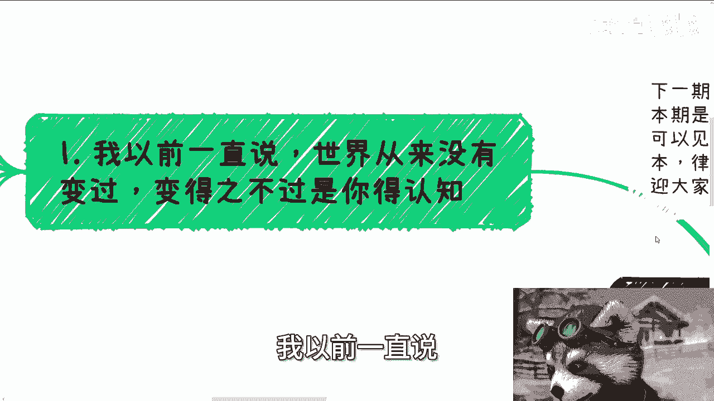
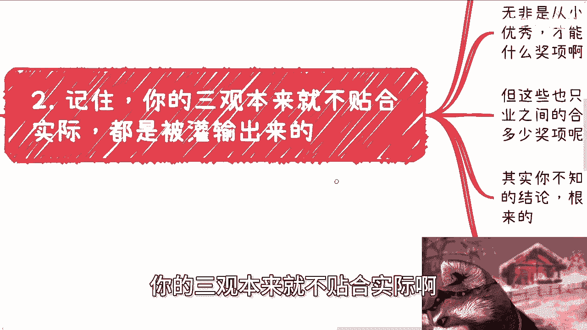
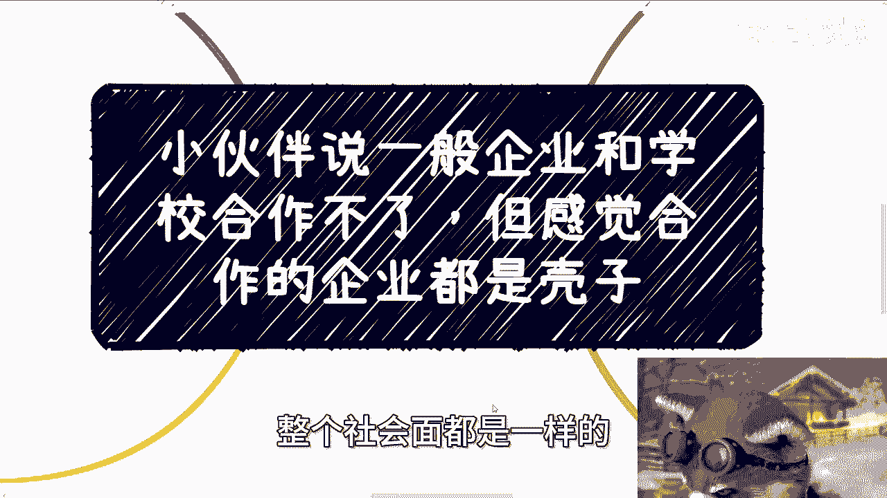
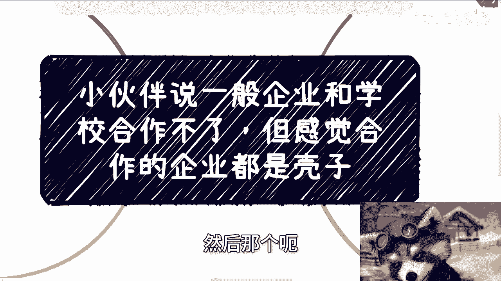

# 小伙伴说和学校合作的企业都是壳子公司 - P1 - 赏味不足 - BV1tHnfexEaz

好大家好，这个今天这个外面刚喝完酒啊，喝了一丢丢啊，一丢丢啊，正好也蛮好的啊，这个给大家。

但不妨碍我来给大家讲故事啊，今天呢有个小伙伴啊跟我提了一个内容啊，说一般企业他认为啊一般企业跟学校合作不了，然后呢，他去查了一下啊，跟他学校合作的一些企业啊，感觉这个企业都是壳子公司啊。

然后让我讲一期啊，我觉得没问题，可以来讲啊，可以来讲，首先啊下一期活动已经定了，9月8号在上海啊，本期2024年这个第二期数字经济大会，详细的话呢可以进评论区的这个报名链接好吧。

然后本次活动呢我也邀请了啊，有资本，有律师，还有我的一些创业的朋友啊，欢迎大家可以过来参会认识啊，简单来讲就是我觉得呃这些人啊都不错，你们现在要是用不到呢，也不代表以后用不到啊。

多多少少对你们来讲都是有帮助的啊，那么首先啊我先说一点啊，我以前一直说世界从来没有变过啊。

变的只不过是你的认知啊，那么很多小伙伴呢每次都会觉得哎呀，自己三观碎了啊，自己他妈的这个三观被颠覆了啊，怎么样怎么样，感觉世界变了啊，世道变了，人变了，但是我想告诉你们的是，其实世界一直没有变。

人也一直没有变，变的是什么，变的是只不过就是说你们以前太傻白甜，你们以前接触到的太少，变的是你们自己接触到的更多的，看到的更多的体验了更多的，或者说经历了更多的，仅此而已啊，就是这个世界。

并不是因为你经历的多的那一刻变化的，而是你经历的那一刻你自己变啊，那就好像今天小伙伴问我，他说陈老师能不能讲讲，消息合作和官方合作有什么区别啊，我就很懵逼，我回复我说我还不太明白啊。

校企合作跟官方合作有什么区别，这他妈不是一个东西吗，啊然后对方就跟我说了一下啊，我大概理解了一下啊，对他什么意思啊，他意思应该就是说校企合作呢，还是需要有一定门槛的，官方的合作呢肯定门槛更高啊。

然后呢这位小伙伴还去查了一下，发现合作的企业呢是一个壳子公司啊，那问我这个情况正不正常啊，我就乐了，那我也回复我说壳子公司啊，才他妈是常态啊，当然为什么我后面会跟你们讨论的啊，就是。

啊我说壳子公司才是常态，你希望是什么公司啊，啊几百人上千人还是拿到多少专利的啊，还是开了他妈10年20年的，对不对，那莫名其妙呢。

凭什么呢，对不对啊，说白了校企合作根本没有门槛，如果你们认为有门槛，那我就问你们，你们觉得门槛是什么，有依据吗，你们有任何依据吗，大部分人比如说跟这个小伙伴一样，觉得哎呀好像有点门槛，你们的依据是什么。

是你们自己YY有依据吗，丝毫依据没有，全他妈靠意淫啊，第二记住啊，你的三观本来就不贴合实际啊。

都是被灌输出来的，诸如我一直问的，你凭什么认为有门槛啊，你又凭什么认为不能是壳子公司呢，这些认知哪来的呢，啊啊无非是从小家庭学校老师告诉你呀，啊其实你学校很优秀才能去得到什么啊对吧，比如说什么证书啊。

评价啊，什么奖项啊，对不对，但是这些也只不过是别人设定的规则啊，对不对，你又如何得出企业之间的合作，或者所谓的校企之间的合作，需要多优秀或者多少奖项呢，你如何得出来呢，其实你不知道，你都是用以前的认知。

直接自己推出来这么个结论，然后问我哎，陈老师，这不应该，这合资公司是不是出来骗人的，哎那我就奇了怪了，你凭什么认为他骗人的呢，对不对，你根本没有任何依据，说白了你都是意淫，所以不好意思。

我告诉你你是错的啊，不好意思，这个我就这么说，如果这个世界是错的，那么你也是异类，你懂吗啊，我不管这个世界做不错不错，你的认知与这个世界就是不符的哦，第三这里的小伙伴跟我提到的是，只是继续教育学院啊。

咱就这么说，校企合作很多，我随便给你们列必修课，合作选修课合作，继续教育合作，软件采购实验室实训平台，产教融合，产学产学研，这个这个这个叫什么，就是落地啊，产业学院学生培训，师资培训等等等。

当然还有包括学校里面的什么浴室啊，食堂啊等实体的所有东西都能合作，你懂吗，你能听得懂吗，啊为什么诶，我就奇了怪了，你们男的，你们是什么样的认知，让你们觉得学校所有东西是不需要供应商的呢。

啊学校难道所有东西都能自己做，必修课，选修课，继续教育，软件软软软件，采购实验室，实训平台等等等，都能自己做，他不用供应商，什么样的错觉，让你们有这种误会呢对吧，难道你们还不明白吗。

校企合作或者企业合作，谁能合作，根本不是看企业资质的，是看关系，比如说他是不是校长或者院长的亲戚，比如说关系到位就可以了，你能懂吗，谁他妈看资质啊，你妈搞笑了，你给我到这个社会上找一个地方看资质的。

你给我看看有吗，对不对，所谓资质是什么，是做出来给大家看的对吧，就像我这边说的，满足满足资质的多了，那他妈凭什么你做啊，凭什么别人不做哦，学校有钱，为什么不给自己人赚，给你赚啊，你头上长角的毛利兰。

对不对啊，三眼三眼神童啊，杨戬这是不是啦，你你要有个逻辑的呀对吧，然后另外你问我壳子不空不壳子，壳子不壳子重要不啦，我他妈说直白一点，符合国家要求，谁他妈管你壳子不壳子唉，还问我有没有关呃。

就是我们还来区分什么叫官方合作，什么叫消息合作，有他妈什么是官方合作，不官方不官方合作的，官方也不过都是找自己人呀，什么叫官方啊，哎奇了怪了对吧，官方怎么了，官方他妈不也是人吗对吧，第四啊。

校企合作其实是油水非常大的，我就这么跟你们讲，小的单子几10万，大的单子上千万妥妥的啊，上到985211，下到职校绩效多了去了，卧槽，你不会认为什么大单子都需要985211，或者清北来做吧，不会吧。

不会吧，我不知道你们是怎么得出这种结论的，我怎么奇了怪了对吧，他妈笑死我了，我就告诉你们啊，不招投标的单子都是给熟悉的人管，清北清华北大和搞笑男，明白吗，啊如果要招投标的单子，所谓的硕士博士。

你们所谓的985211，清北的人，无非在这些招投标单子里面都是工具人，都是既得利益者或者作为关系户的工具人，能明白吗，这些工具人是写在技术项目书里面的，就算中标了，他们也赚不到钱，他们只能拿苦力活。

你懂吗，啊他妈搞笑了，你以为是谁啊，壳子对吧，要我说壳子公司才叫正常的，为什么，因为只有用壳子公司投入产出比值才是最高的，才是符合资本家跟既得利益者的逻辑，你但凡跟我说。

拿一个什么10年20年的公司里面还什么的，养着几十个人或者上百个人，这他妈叫什么叫。

听得懂吗，啊啊我再次告诉你们啊，你们每一年1200万应届生打工赚钱，你们这不叫赚钱，叫什么叫跪舔，叫乞讨，能懂吗啊，什么叫赚钱，我跟你们讲的这种校企合作才叫赚钱啊，明白不。

这才叫赚钱，一个项目两三个月或者半年上千万的项目经费，这叫赚钱啊，然后这种赚钱只看关系，整个社会面都是一样的。

不要来跟我谈什么学历，你妈搞笑嘞，真的我都不知道这种逻辑是怎么来的啊，我如果你们这种逻辑根深蒂固，我只能告诉你们，你们被PUA的太久了，仅此而已啊，好吧就这么着吧啊好吧，然后那个呃活动啊。

活动就大会啊，9月8号好吧，9月8号在上海，然后要报名的话，评论区可以直接报名，有任何问题的，你们可以私信来问我啊，然后剩下的话就是职业上的规划啊，包括商业上的一些规划啊。

叫什么就是职业额职业未来的一些发展啊，包括商业里面合额合同啊，项目计划书啊，白皮书啊，分红丰润啊，股权啊，股份啊，叫什么就融资啊对吧，股那个估值啊等等等，你们希望通过跟我的沟通。

能能给你们职业或者商业啊带来更好的，未来的规划的话，那么你们可以整理好对应的问题跟个人背景好。

