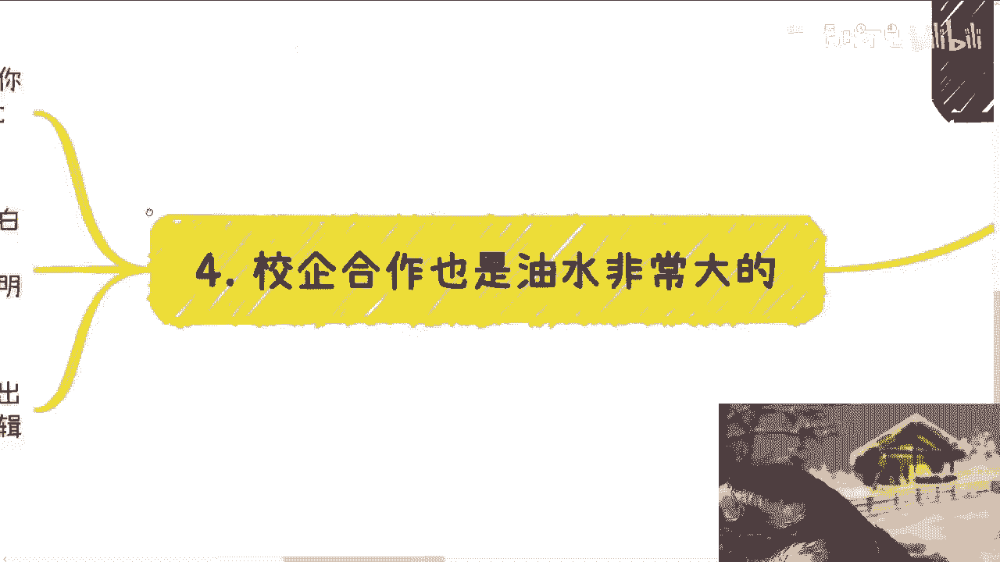

# 小伙伴说和学校合作的企业都是壳子公司---P1---赏味不足---BV1tHnfexEaz

## 概述
在本节课中，我们将要学习一个常见的现象：为什么与学校合作的企业很多都是“壳子公司”。我们将从认知偏差、社会规则、商业逻辑等多个角度，系统地分析这一现象背后的原因，帮助你理解真实世界的运行规则。

---

## 世界从未改变，改变的是你的认知
上一节我们概述了课程主题，本节中我们来看看一个核心观点：世界从未改变，改变的是你的认知。

很多人感觉自己的三观被颠覆，认为世界变了。但事实是，世界和人一直如此。变化的只是你接触到了更多信息，经历了更多事情。你的认知在更新，而非世界本身在突变。

例如，有同学询问“校企合作”和“官方合作”的区别，并认为前者应有门槛。这本身就是一种基于过往教育形成的、未经审视的认知偏差。

---

## 质疑“门槛”：你的依据是什么？
上一节我们讨论了认知偏差，本节中我们来看看所谓“合作门槛”是否真的存在。

很多人认为校企合作需要高门槛，合作企业应具备规模、专利或悠久历史。但请思考：这种认知的依据是什么？

以下是常见的错误依据来源：
*   **主观臆想**：缺乏实际依据，全凭个人想象。
*   **灌输的价值观**：来自家庭、学校教育的固有观念，例如“优秀才能获得认可”。
*   **错误类推**：将个人奖项、证书的评选规则，错误地套用到企业商业合作上。

**核心逻辑**：如果你的认知与世界普遍现象不符，那么需要调整的是你的认知，而非质疑世界错了。认为“壳子公司”合作就是骗人，这本身就是缺乏依据的臆断。

---

## 校企合作的本质：关系而非资质
上一节我们拆解了“门槛”的幻觉，本节中我们来看看校企合作的本质是什么。

校企合作范围极广，绝非单一形式。

以下是常见的合作类型列表：
*   必修课/选修课合作
*   继续教育合作
*   软件采购
*   实验室与实训平台建设
*   产教融合、产业学院
*   学生与师资培训
*   学校浴室、食堂等实体运营

学校并非全能，上述所有项目都需要外部供应商（企业）支持。那么，谁来决定合作方？

**核心逻辑**：决定谁能合作的，**不是企业资质，而是关系**。例如，合作方是否是校长或院长的亲戚，关系是否到位。资质文件往往只是用于满足形式要求。符合资质的公司很多，但利益通常流向“自己人”。

因此，合作企业是否是“壳子公司”并不重要，只要它符合国家形式上的要求即可。所谓的“官方合作”，其底层逻辑亦是如此。

---

## “壳子公司”的合理性：商业效率与利益最大化
上一节我们揭示了合作取决于关系，本节中我们来看看为什么“壳子公司”反而是常态。

校企合作项目金额巨大，小则几十万，大则上千万，遍布各类院校。这并非顶尖名校的专利。

在合作中：
*   **非招投标项目**：直接交由关系方负责。
*   **招投标项目**：高学历人才（如硕士、博士）常作为“工具人”出现在技术方案书中，为关系户背书，自身仅获取劳务报酬，而非项目主要利润。

**核心逻辑**：使用“壳子公司”进行合作，**投入产出比最高**，最符合资本与既得利益者的逻辑。

公式表示：
`合作收益最大化 = 利用关系获取项目 + 以壳子公司运营（降低固定成本）`

维持一个拥有大量员工的实体公司成本高昂，这叫 **`重资产运营`** 。而“壳子公司”模式轻便灵活，能将利润最大化。这才是真正的赚钱逻辑，区别于普通打工的“乞讨”式收入。

整个社会的运行规则相通，**关系网络**的重要性远高于纸面学历或资质。

---

## 总结与后续
本节课中我们一起学习了：
1.  许多人对校企合作存在认知偏差，误以为应有高门槛。
2.  “门槛”认知多源于缺乏依据的臆想和被灌输的观念。
3.  校企合作的本质是**关系驱动**，而非资质驱动。
4.  “壳子公司”是利益最大化下的合理选择，符合商业效率逻辑。

希望本课能帮助你打破一些不切实际的幻想，更深刻地理解商业社会的真实运行规则。

---

**附：活动与咨询信息**
*   下一期数字经济大会定于9月8日在上海举行。
*   活动将邀请资本方、律师、创业者参与，欢迎通过评论区链接报名。
*   若有职业规划、商业合作（合同、项目书、股权融资等）方面的具体问题，可整理好个人背景与问题后进行咨询。