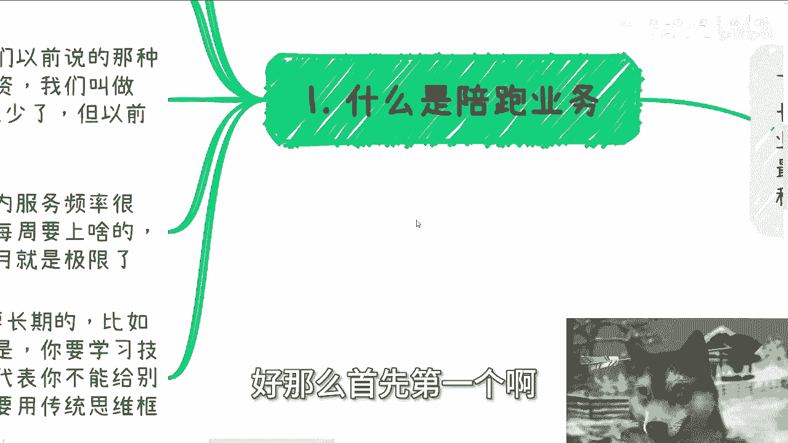
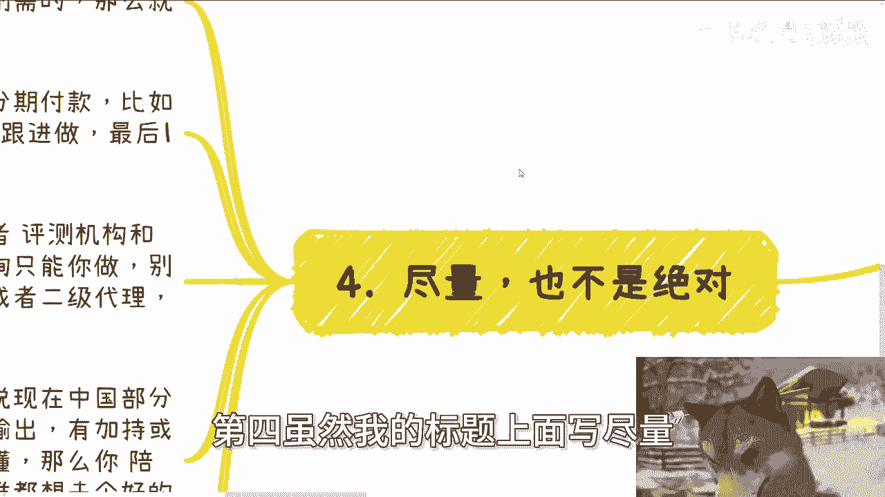
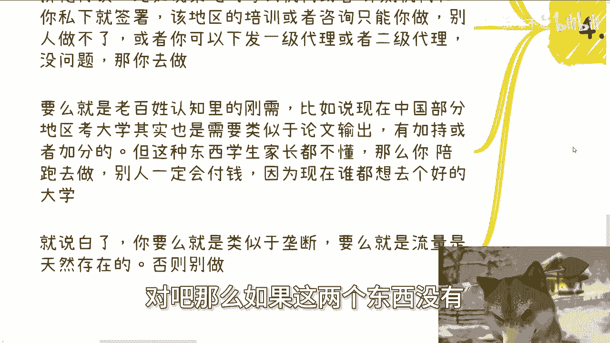
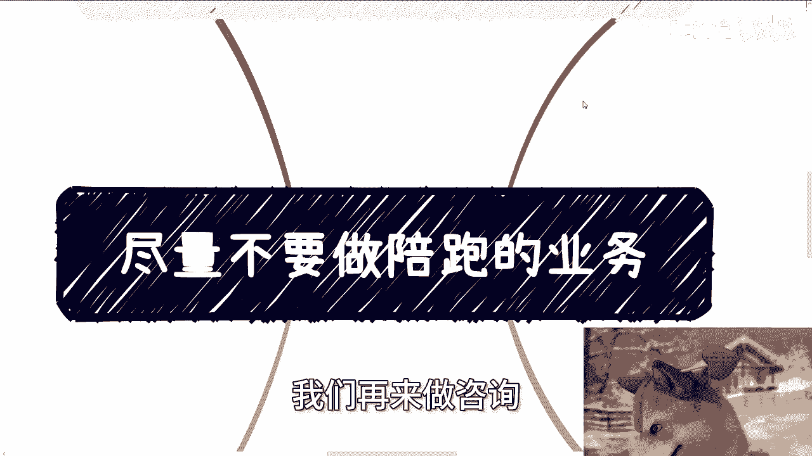

# 尽量不要做陪跑的业务 - P1 - 赏味不足 - BV1b142187JJ

好这个今天我们来讲的这个主题啊，叫做尽量不要做陪跑的业务，这个事呢放在2024年，或者当下的这种经济情况下面，是非常非常重要的。

极其重要啊，那么首先呢先说一下下期活动已经定了，就本周日啊，8月11号在长沙啊，在长沙，然后大概主题的话呢，一个是围绕不同的这个企业的offer啊，然后另外一个就是说围绕自媒体跟跨境电商。

然后最后呢就是帮大家也展望一下未来啊，然后围绕这个不同企业offer呢，就是私企啊，国企啊，外企啊，对公务员啊这些啊，那我们可以私下聊一下啊，那么呃反正要报名的或者了解详情的。

你们继续私信我好，那么首先第一个啊。

什么是配跑业务，就说白了啊，一个呢是你的业务周期不要太长啊，比如说你做一个业务，不管你交付产品还是服务啊什么呃，有很多人会跟我说，他妈的什么什么一个季度半年甚至一年的，我跟你讲，不要做，没啥好做的。

就当下这种天然就是呃叫什么，就是天时地利人和。

都是夜长梦多的这种环境啊，不要去做这种东西，那另外一个就是持续输出业务，比如说什么社区运营啊对吧，比如说给别人做问答，做做答疑呀。

别别搞啊别搞，还有就是那种长期的服务，比如说我们以前说的那种，帮着公司长期做财务啊，啊长期投资啊，我们叫做IPO陪跑啊对吧，虽然现在这样的企业或者这样的人呢也少了，但以前其实是蛮多的啊。

然后我发现我们现在很多年轻人啊，也会被这种很腐朽和传统的思想所所，怎么说呢，说传染啊，就是就是他们就感觉在学一些很老的东西，但是其实他妈的已经跟这个时代脱节了啊，还有就是说服务跟产品内容呢。

在一定时间内服务频率很高啊，就比如说一个课程上一年啊，一年呢每周都要去上对吧，或者说怎么样，其实我跟你讲，如果按照频率每周都要上的话，那要我说最多就一个月啊，不能不不能再长了，那么再长就他妈啊。

那么另外千万不要来自己，就是又又他妈回到那句话上面，就千万不要自己PUA自己啊，说什么这个业务一定要长期的对吧，比如说很多人跟我讲啊对吧，陈老师，我们什么教一个琴棋书画对吧，那肯定是个长期的。

不可能一两节课教完的对吧，比如说什么考公考编的这种辅导对吧，也是长期的，也不可能短期内完成的，怎么样怎么样，我就这么说啊，呃你如果学习一个技能，或者去教别人学习一个技能，那当然是长期的，速成不了。

这没有错，但是你说这些东西长期，并不代表你一定要去做这个长期的，吃饱了撑的，对不对啊，那你可以去给别人提供短平快的，比如说琴棋书画的咨询，比如说琴棋书画的一些短，就就简单的这种。

比如说职业相关的这种路径规划对吧，考公考编的这种路径规划，或者相关的一些问题解决解决方案怎么样子，你都可以做，你没有人让的去陪他们去学啊对吧，或者说没有人让你就把这东西拆的很散。

然后就就就就说我要去教人家这个东西，我跟你讲，教人家这个东西，你的性价比是最低最低的啊，然后第二嗯，其实之前有些朋友也跟我聊过，相关的业务模式啊，首先你看啊，我不做社群，为什么，因为很烦，我为什么很烦。

因为你拉一个群，别人问问题，你要回答啊，不别人问个问题，你是回答还是不回答呢。

对不对，我就问你，你回答还是不回答，如果群里面有人被诈骗了，那你说我有责任还是没责任呢，当然从事实角度来讲，我回答也好，不回答也好，有责任没责任也好，没有卵用，为什么，因为我回答不回答，那是我的事。

我回答也好，不回答也好，总有人会说哎呀陈老师耍大牌啊，然后陈老师他妈的不尊重我们，对吧啊，那只要有人被骗了，他总会会说的呀，哎呀陈老师这个跟别人蛇鼠一窝对吧，一丘之壑是吧啊，那那那我说啥呢。

哎我我所以我就说我图啥，我他妈图风险啊，我吃饱了撑的对不对，那还有小伙伴跟我讨论啊，关于这种什么包年啊或者咨询年卡啊，我说他妈拉拉他妈倒吧啊，为什么我跟你讲这样更烦，因为本来咨询你比如说是点对点的对吧。

一个对话形式的就短平快对吧，有问题问问题，大家一起交交流沟通，把问题解决了，来给我弄个年卡好了，那我就问啊，这个人比如说一年是十次咨询对吧，好那么这十次咨询以外的时候，他要问问题算咨询吗。

我就问你算不算，你如果算怎么计，怎么计费，怎么计算，如果不算，那别人问问题，你回还是不回呢，那么又回到这个问题上面，你回吧，你会觉得你被白嫖，你不回吧，人家就说了，哎我他妈买了年卡了对吧。

就因为中国人很多人的理念就是我付钱了，我就是爷，你跟他怎么说呢，对不对，那我还是那句话，我图啥啊，我图啥，我他妈图我图图他妈风险对吧，我跟你讲，以上这些都是陪跑业务。

你们有很多人在思考自己的业务模型时候，也会往这种模型上去思考，我可以理解，但是你们要明白一点，我们给别人做服务，不管是企业端，政府端，高校端，资本端还是个人端，我们给别人做服务，跟你去做餐饮是不一样的。

你比如说做餐饮，你说你一年对吧，优惠十次来吃十次，那没问题啊，但是你给别人做这种服务，你就很烦啦，对不对，你看看是不是啊，因为他来来消费十次，那十次就是来就物理条件将就来了嘛对吧，包括你。

你哪怕电商买东西也买嘛对吧，那你说咨询培训这种东西怎么怎么定义呢，就像我刚说的，他发你去微信问你个问题，你算不算咨询呢，对吧啊，第三还有就是说长周期的，你比如说做个什么培训啊，我问收多少钱。

他说每个人收一两千好，那我问上多久，他说啊，差不多一个月或者两个月，其中可能每个双休日，或者每隔个一个礼拜双休日，对吧好，我一般都这么说，我说他妈的算了啊，拉他妈倒这种东西呢。

我根本都不想问你受众有多少人，为什么，因为一般这种相对来讲比较长线的双休日，还有空来的人数不可能多的，如果人数多，你客单价根本不可能开得上去，对不对，那如果你客单价开不上去，那这东西那这东西能赚什么钱。

我说不好听点，对不对，我给你们算笔账，我不我就退1万步来讲，我就算你一个人收1000对吧，我就算你比如说做一个月，这一个月来100个人爽了吧，100个人10万块钱好，那么我就说啊。

你把你这一个月的时间成本刨掉，你把你呃各种比如说请嘉宾啊，或者物理空间上面找的一些场地的成本跑掉，你能有多少利润啊，你能有多少利润对吧，包括你营销招生还得成本吧，还得怎么样吧对吧。

那当然你按照我昨天说的啊，你说哎那我可以跟别人分润，可以怎么样可以的，但是我跟你讲啊，你要明白一点，你们换位思考一下，如果你们今天是个50万粉，100万粉的一个一个一个博主对吧。

或者来说一个一个一个有流量的人啊，别人来跟你说，哎我要做个产品，你一问哦，这产品他妈的1000块钱啊，然后呢要做两个例，也要做两个月，我跟你讲，别人不会合作的，为什么，因为所有的人都怕夜长梦多，对不对。

吃饱了撑的啊，那么这种业务就是我说的吃力不讨好，赚不到钱的，说白了你可以做，但是你需要铺在上面的时间很多，而且杂事很多，你看着可能流水不错，你很开心，但是我跟你这么说，你这一年如果赚100万的流水。

跟别人做那种短平快的，甚至投资躺着赚100万，这他妈简直天差地别，这是天堂与地府的差别，你知道吗，记住一点，业务模式都是自己定的，没有法律规定一定要什么模式，自己框自己哦，不要就是说那种什么哎呀。

陈老师，你你看到人家那种弹钢琴的那种，学学小提琴的都是一教教一年教怎么样子，那他妈那是人家关你吊事啊，对不对啊，第四虽然我的标题上面写尽量。

但也不是解绝对啊，只要结果明确，或者你有排他协议的，或者说你做的东西，在政策上和老百姓认知里是刚需的，那么就没问题啊，这三个点分别是什么，比如说你合同签了，签了是两年交付，然后呢他分期付款啊。

那么他一开始先付30%，中间付60%，尾款付10%，那没问题啊，那我们可以持续去持续去跟进做，最后那10%我们不要都可以对吧，第二排他协议，比如说某地的考试机构或者评测机构，跟你私下签署合同。

该地区的培训或者咨询，或者来说对应的啊，这种竞赛或者什么东西只能你来做，或者来说你有权去下发一级代理或者二级代理，别人都没有，那没问题，那你去做啊，第三种就是要么就是老百姓认知里面的刚需。

比如说现在中国地区啊，某一些城市，具体我就先不说啊，某些城市考大学考高中，其实是需要类似于像你那个本硕博毕业时候，论文的输出，就是这种论文的输出是有加持，有加持或者加分的。

但是这种东西现在的初中初高中的家长，学生肯定都是不懂的，那么他就需要你去辅导他，就是我们说的陪跑，因为这东西不是一个培训，一个咨询就能搞定的，你需要持续的去去扶持他啊，辅导他，辅佐他啊。

那么这种东西别人一定会付钱，为什么，因为这个东西在整个教育体制里面，他就是一个老百姓思想里面的刚需对吧，那么说白了什么意思，就是你要么的业你做的业务，要么就是能有类似于垄断的排他的这种能力。

要么就是你的流量是天然存在的，就像我们刚刚说的，你只要做这种东西，老百姓一定是认的，为不是说老百姓认，所以老百姓一定会认对吧，那么如果这两个东西没有。

你就别做对吧，没啥好说的，我跟你们讲，你们可以去反思反思你们的业务模型，你们很多人定的业务模型里面，都是把战线拉长的，战线拉长，还是那句话，对你们一点好处都没有的，你明白吗，我不管你们做什么业务。

对你们一点好处都没有的，因为为什么就是夜长梦多。

好吧行啊，然后下一期活动就是这周日啊，这周日8月11号在长沙好吧。

在长沙，然后那个剩下的话就说你自己工作上面，就职业规划啊，包括你跟别人一起做副业，或者你自己自己搞点什么业务啊，那么在这些业务上面呢可能有合同啊，分红啊，分润啊啊股权啊，股份啊对吧。

呃指那个呃叫叫叫商业计划书啊，白皮书啊啊包括你们这当中碰到有哪些问题啊，你们觉得希望通过跟我的沟通啊，通过我的一些视野，通过我对于当下经济情况的一些了解，能够给你们一些更接地气的建议和规划。

能够让你们少走点弯路的话，那么你们可以整理好对应的问题跟背景。

