# 尽量不要做陪跑的业务---P1---赏味不足---BV1b142187JJ

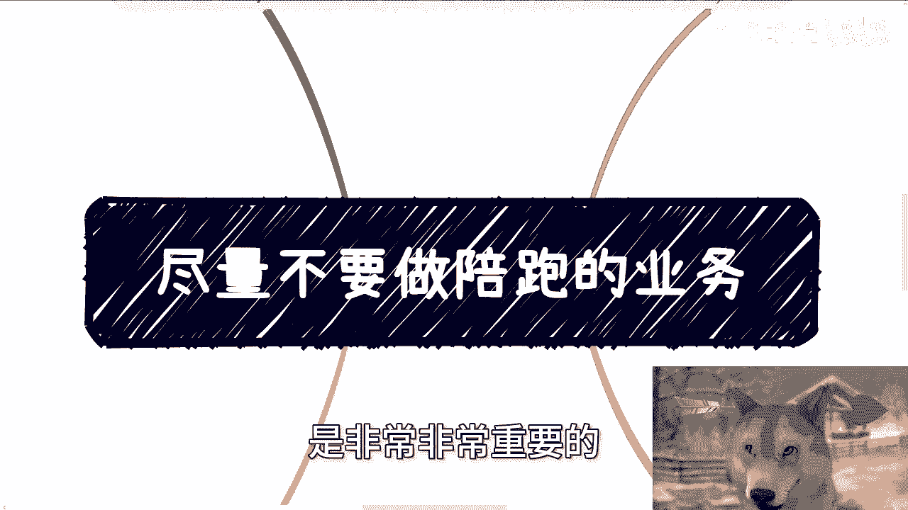

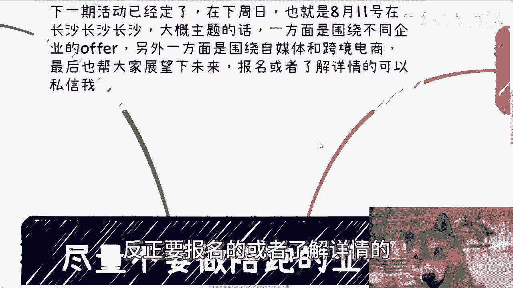

在本节课中，我们将探讨在当前经济环境下，为何应尽量避免采用“陪跑”式的业务模式。我们将分析其定义、弊端，并讨论在何种特定条件下这种模式才可能成立。

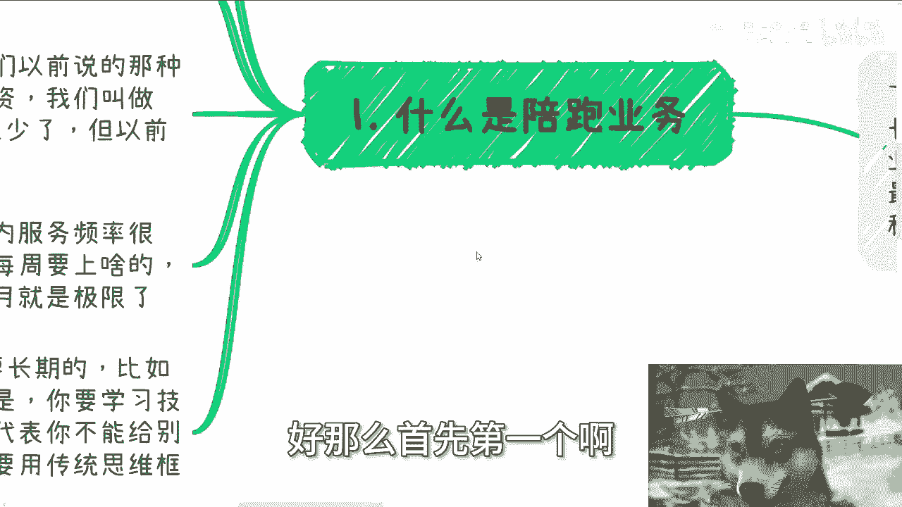

---

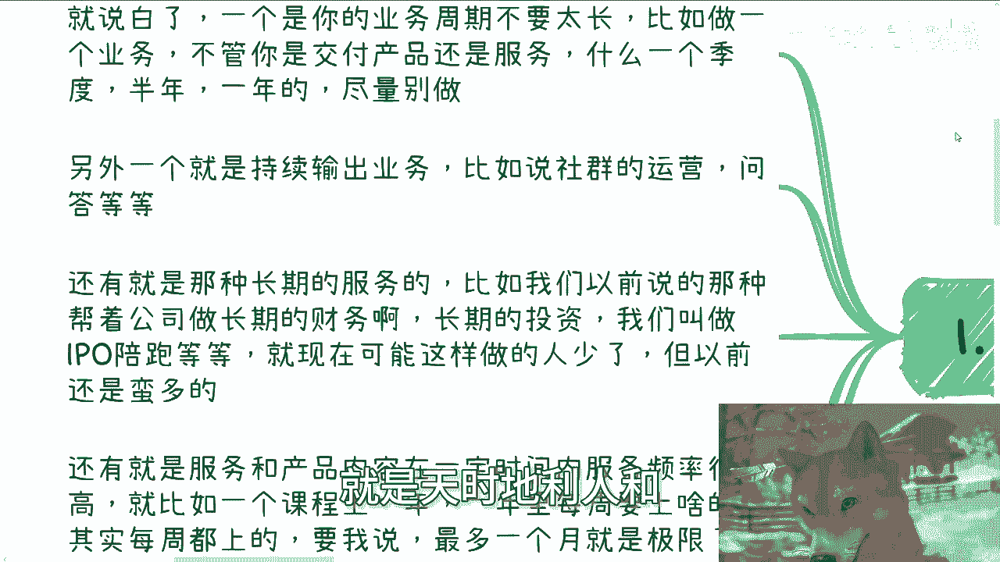

## 📖 概述

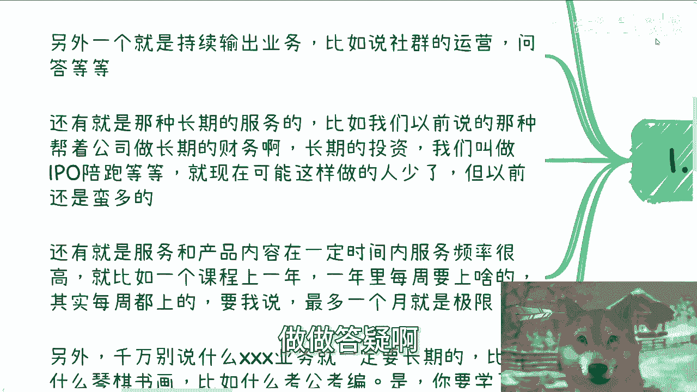

“陪跑”业务通常指那些周期长、需要持续投入精力、但单位时间回报率低的业务。在当下充满不确定性的环境中，这类业务模式风险高、收益低，往往“吃力不讨好”。本节课旨在帮助你识别并规避这类业务陷阱，构建更高效、更稳健的商业模式。

---

## 1️⃣ 什么是“陪跑”业务？

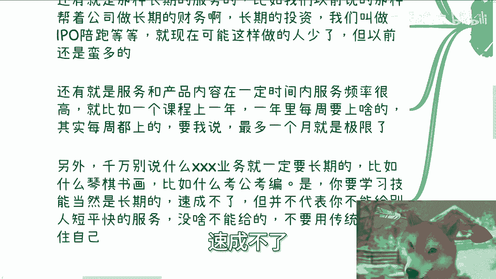

“陪跑”业务的核心特征是**周期长**与**持续输出**。具体表现为以下几种情况：

*   **业务周期过长**：例如，交付产品或服务的周期长达一个季度、半年甚至一年。在当前“夜长梦多”的环境下，这类长周期项目风险极高。
*   **需要持续运营**：例如，社区运营、长期答疑服务等，需要你不断投入时间精力进行维护。
*   **长期捆绑服务**：例如，为公司提供长期的财务顾问、IPO陪跑等服务。这类模式在过去常见，但现在已不适用。
*   **高频次服务**：例如，一个课程持续一整年，且每周都需要上课。这种高频率的长期服务会极大消耗你的精力。

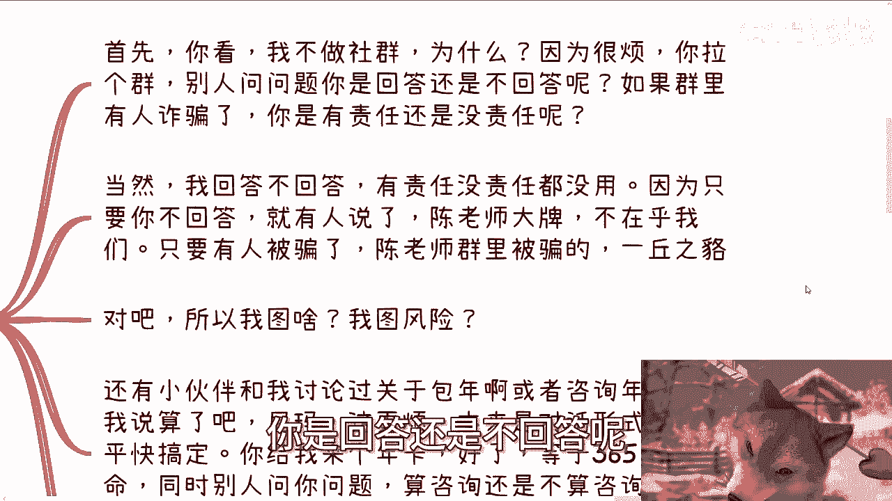

**核心误区**：许多人错误地将“学习某项技能是长期的”等同于“提供该项技能的服务也必须是长期的”。例如，教人琴棋书画或考公考编辅导，学习过程固然长，但作为服务提供方，你完全可以选择提供**短平快**的咨询服务（如路径规划、问题解决方案），而非亲自下场进行长期教学。长期教学的**性价比通常最低**。

---

## 2️⃣ “陪跑”业务模式的弊端

上一节我们定义了“陪跑”业务，本节中我们来看看这类模式具体有哪些问题。以下是几种典型的“陪跑”模式及其弊端：

**关于社群运营**
社群运营是典型的持续输出型业务。其弊端在于责任界定模糊，容易引发纠纷。例如，群成员提问你是否必须回答？若群内发生诈骗等事件，你是否需要承担责任？无论你如何处理，都可能面临口碑风险，可谓“图风险”。

**关于年卡/包年咨询**
这种模式将单次、明确的咨询变成了长期、模糊的服务关系。核心问题在于服务边界难以界定：年卡包含的咨询次数之外，用户的提问算不算一次咨询？如何计费？如果不算，用户提问时你回复与否都会陷入两难。这本质上是将清晰的交易变成了模糊的责任捆绑。

**关于长周期线下培训**
这类业务通常客单价难以提升（例如每人一两千元），且因占用周末时间，受众规模有限。即使招生情况理想，扣除时间、场地、嘉宾、营销等各项成本后，净利润往往很低。从合作方角度看，有流量的博主也不愿为低客单价、长周期的项目分摊风险，因为“所有人都怕夜长梦多”。

**总结来说**，“陪跑”业务模式往往**投入产出比极低**。你可能看到不错的流水，但为此付出的时间成本和处理的繁杂事务，与短平快或被动收入业务相比，有“天堂与地府”的差别。**业务模式由你自己定义，切勿自我设限。**

---

## 3️⃣ 例外情况：何时可以考虑“陪跑”？

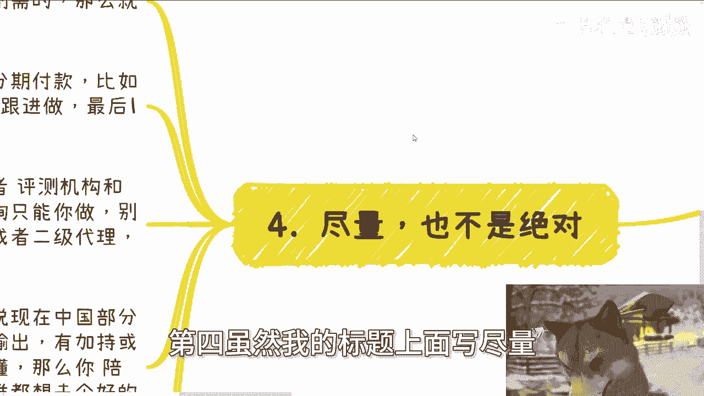

虽然标题是“尽量不做”，但也并非绝对。在满足以下**明确条件**时，长周期业务是可以考虑的：

1.  **结果明确且合同保障**：例如，签订分期付款的长期合同（如先付30%，中期付60%，尾款10%）。即使尾款比例小，但因有合同约束和前期付款，项目风险可控。
2.  **拥有排他性协议**：例如，与某地考试机构独家签约，获得该地区特定培训或业务的垄断经营权。这消除了竞争，保障了收益。
3.  **需求是政策或认知上的“刚需”**：例如，在某些地区，初高中升学有论文发表的要求，这对家长学生来说是陌生但至关重要的“刚需”。他们需要的是长期的辅导与陪跑，而不仅仅是单次咨询，并且愿意为此付费。

**核心公式**：
**可做的长周期业务 = 拥有垄断/排他能力 OR 面对天然存在的刚性需求流量**

如果你的业务不具备以上两点中的任何一点，那么拉长战线通常对你“一点好处都没有”。

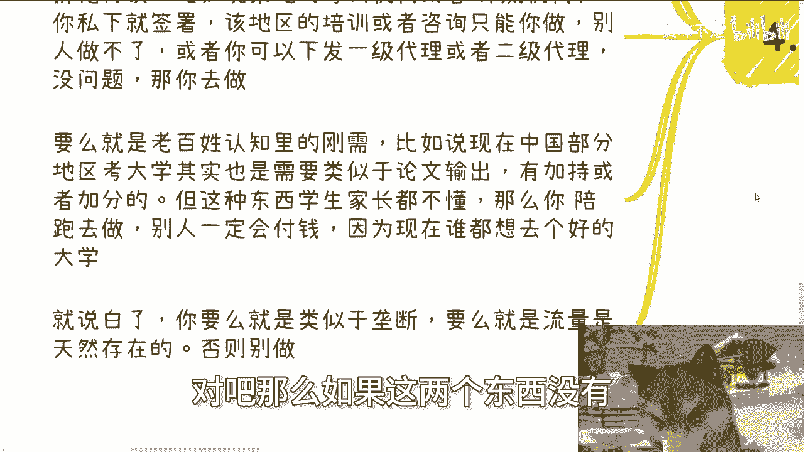

---

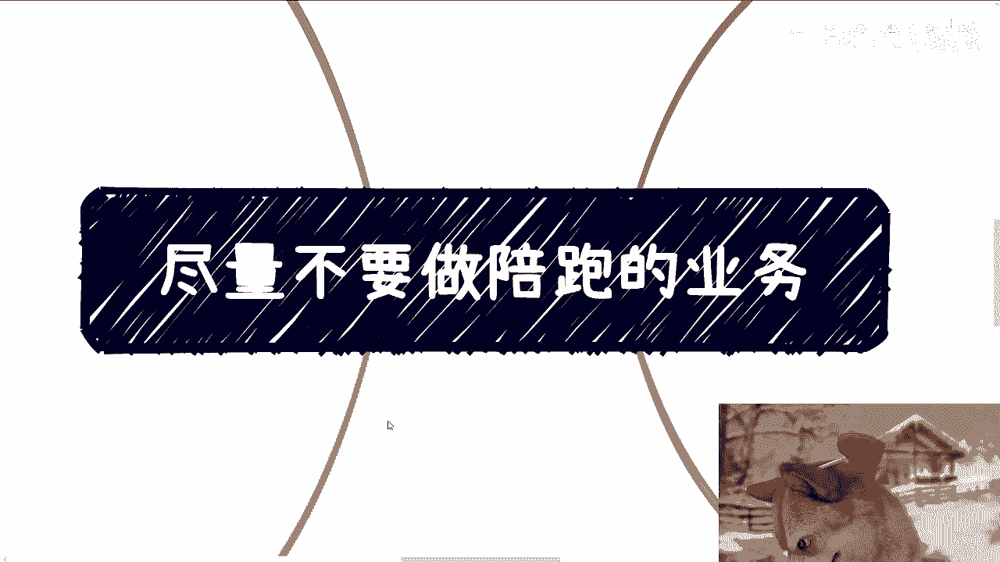

## 📝 总结

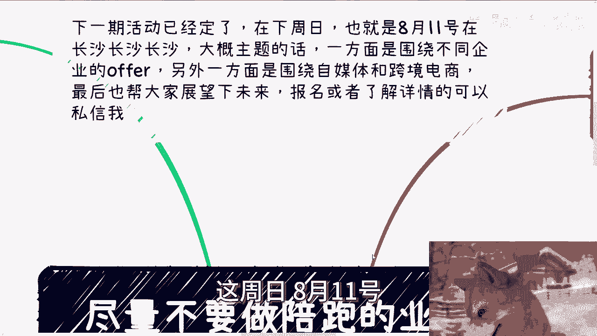

本节课我们一起学习了“陪跑”业务模式。我们首先明确了其**周期长、持续输出**的定义，并指出了将“学习长期性”与“服务长期性”混淆的误区。接着，我们分析了社群、年卡、长线培训等具体模式的**弊端**，即它们往往模糊责任、效率低下、利润微薄。最后，我们探讨了例外情况：只有在**合同保障结果明确、拥有排他协议、或面对政策/认知刚需**时，才可考虑此类模式。请重新审视你的业务模型，避免无谓地拉长战线，追求更高效的商业路径。

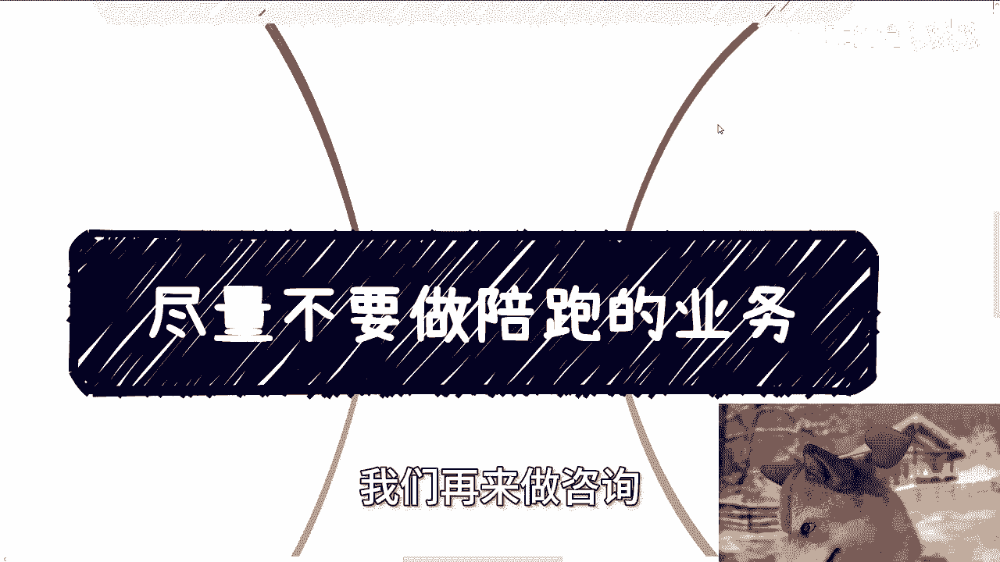

---
> 下期活动预告：8月11日（周日）于长沙举行。主题将围绕不同性质企业（私企、国企、外企、公务员）的offer选择，以及自媒体与跨境电商展开，并共同展望未来。如需报名或了解详情，请私信。
>
> 此外，若你在职业规划、副业合作、业务开展中遇到关于合同、分红、股权、商业计划书等问题，并希望获得更接地气的建议以少走弯路，可以整理好具体问题与背景前来交流。