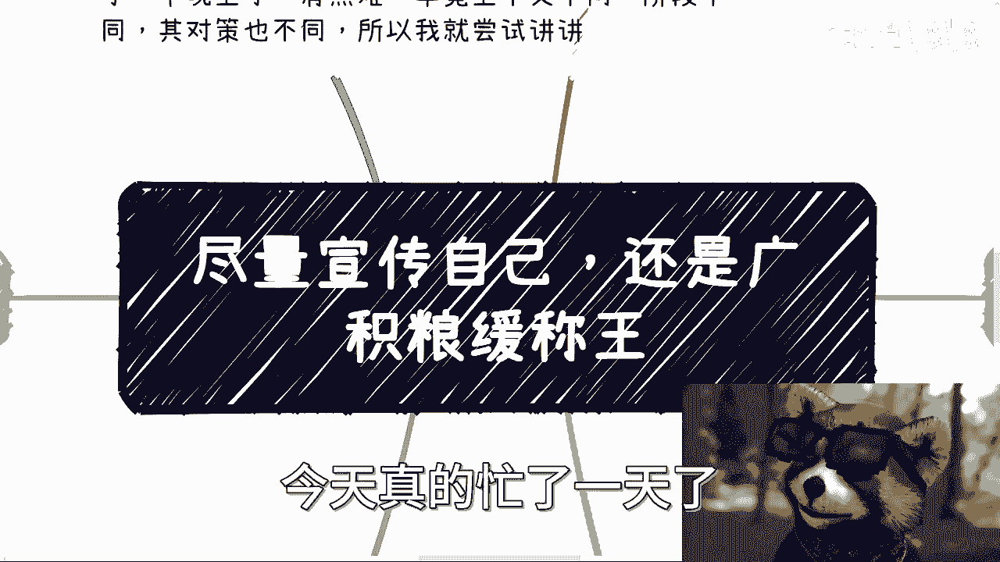
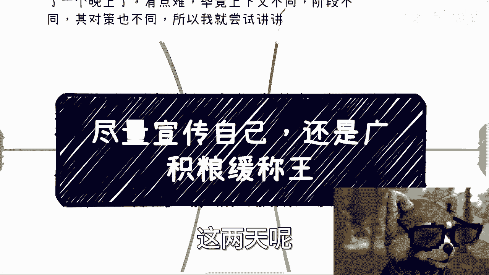
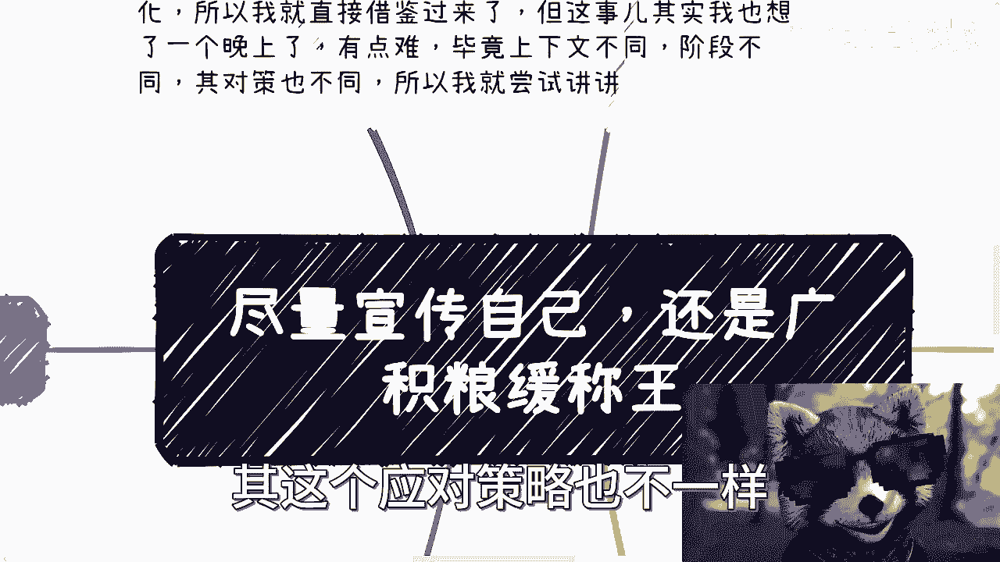
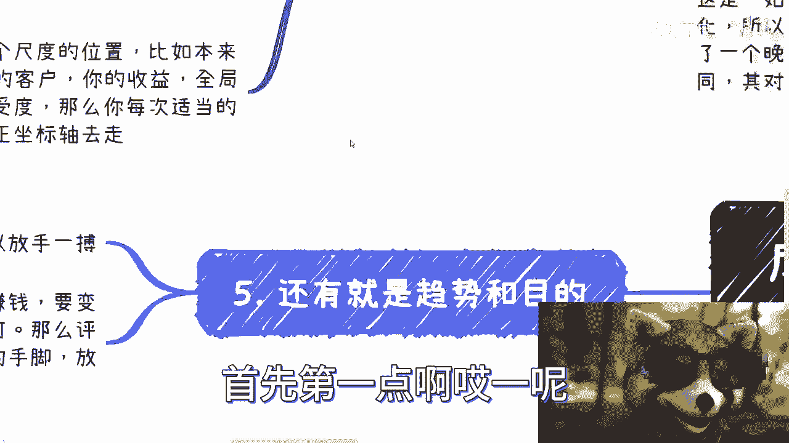
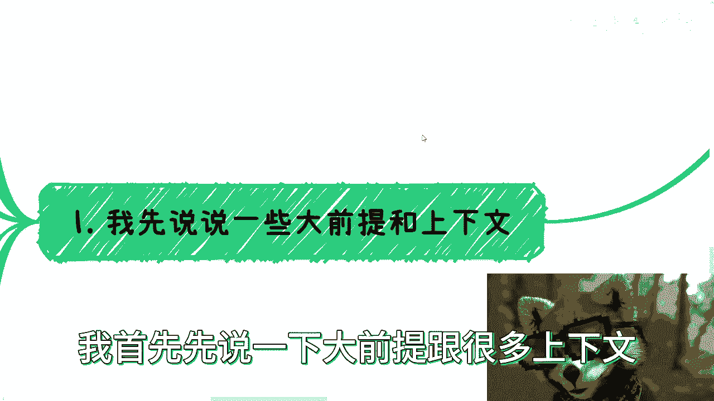
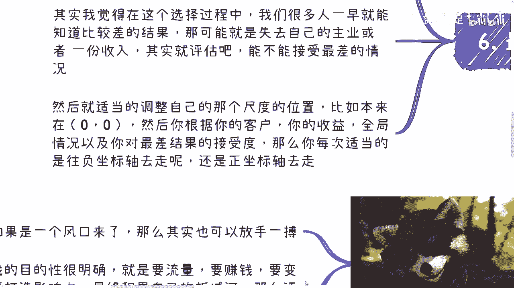
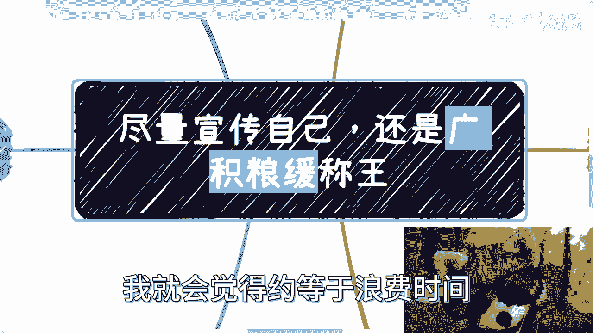
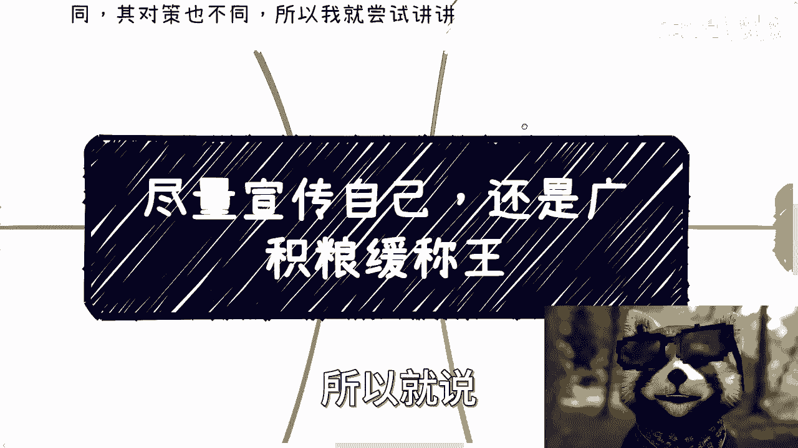
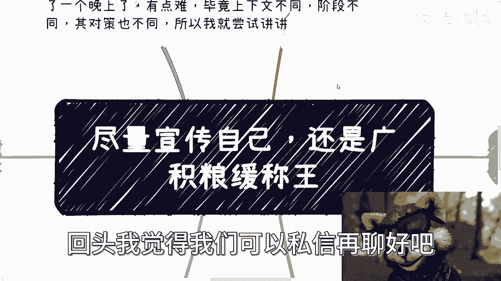
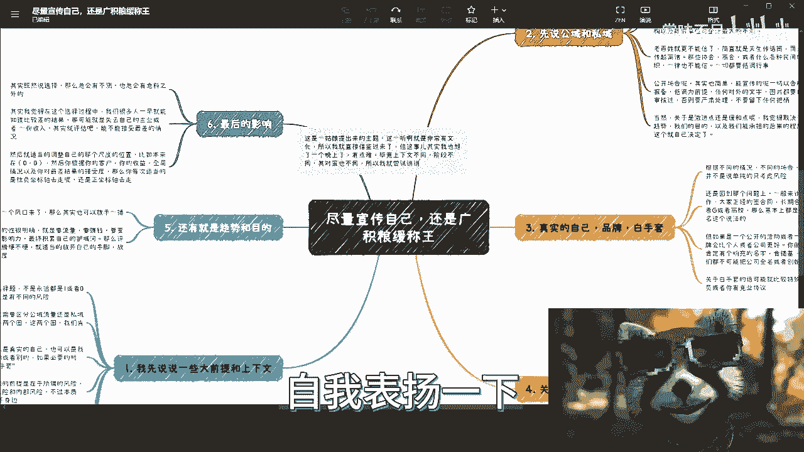

# 课程一：个人品牌策略选择 🧭

在本节课中，我们将探讨一个核心问题：在建立个人品牌或开展副业时，应该选择“高调宣传、快速推进”的策略，还是“低调积累、厚积薄发”的策略。我们将从多个维度分析，帮助初学者理解不同情境下的决策逻辑。

---

## 概述

一位观众提出了一个关于个人发展策略的问题：“尽量宣传自己，还是广积粮缓称王？” 这本质上是关于在品牌建设过程中，如何平衡曝光速度与风险控制的选择。这个问题没有非此即彼的答案，其策略取决于具体情境、目标与可承受的风险。本节内容将系统性地拆解这个问题，提供一套思考框架。

---

## 核心分析框架

要回答这个问题，我们需要建立一个分析框架。这个框架主要包含五个需要区分的考量维度。

### 1. 区分公域与私域流量

首先，我们需要区分宣传的两个主要阵地：公域（公开网络与场合）和私域（私下的人际与商业圈子）。两者的风险性质和应对策略截然不同。

以下是针对不同圈子对象的策略建议：

*   **政府与高校（半政府机构）合作方**：在私域圈子中，可以相对积极地宣传甚至适度包装自己。因为这类合作方通常边界感清晰，清楚什么能说、什么不能说。
*   **企业合作方**：需要保持谨慎。企业人员（无论职级高低）在商业敏感信息上的边界感可能较弱，存在信息泄露或误传的风险。
*   **普通民众、协会、民间组织**：必须保持高度低调。这些群体通常是信息的“传声筒”，信息在传播中极易失真，风险最高。

**过渡**：明确了私域的策略后，我们来看公域场合该如何应对。

在公开场合，一切宣传应以合规、报备和低调为基本原则。所有对外发布的文字、图片等内容，必须经过自己审核。未经审核的内容，不得以任何形式对外或对内公开，以避免留下把柄。策略是激进还是缓和，很大程度上取决于市场趋势和个人目的，这一点我们将在最后讨论。

### 2. 区分“自己”的不同形态

这里的“自己”可以指代真实个人、创作品牌或公司，甚至在必要时可以使用“白手套”（代持或代理）。根据目的和场合，选择不同的形态。

*   **目的：正式商业合作**：当需要签订长期正式合同时（无论对方是企业、政府或高校），必须使用真实的个人或公司身份。化名或隐藏身份无法建立信任。
*   **目的：公开活动或大众服务**：此时，一个响亮的**品牌**名称比个人或公司全名更合适。例如，举办“数字经济峰会”而非“张三公司大会”。
*   **特殊情况：使用“白手套”**：当项目敏感或风险极高时，可以操作一个在法律和股权上与你完全无关的实体（公司或个人）来执行。你是幕后操盘手，但公开层面查不到关联。公式表示为：`公开执行者 = 白手套实体；实际控制者 = 你自己（隐藏）`。这是风险规避的终极手段。

**过渡**：选择了合适的“身份”后，我们需要评估可能面临的风险。

### 3. 区分内部与外部风险

风险主要分为来自外部的和来自内部的，大部分风险根源在于自身。

*   **规避外部风险**：方法包括在宣传物料中避免与主业产生明显关联，以及对所有公开活动进行正规报备和备案。
*   **规避内部风险**：最大的风险常来源于身边的人。应对方法是保持低调，尽可能不向合伙人、同事甚至商业伙伴透露副业详情或与主业的关联。除非你像某些案例一样，主业关系松散，无惧举报。

**过渡**：理解了风险来源，我们还需要将策略放在更大的背景下审视。

### 4. 审视大局趋势与个人目的

策略的选择不是静态的，它随着外部环境和内在目标的变化而调整。

*   **看趋势**：如果处于明显的行业风口，评估后可以更激进一些（放手一搏），暂时搁置部分保守考量。
*   **看目的**：如果你的核心目的明确是**快速获取流量、变现或打造影响力**，那么你需要评估自己的“翅膀是否够硬”。评估标准可以量化为：`“翅膀硬度” = 脱离主业后的稳定收入能力 + 独立获客能力 + 个人吸引力`。根据评估结果，逐步调整宣传的尺度。

**过渡**：最后，任何选择都伴随着潜在后果，我们需要对其影响有所准备。

### 5. 评估决策的潜在影响

在做选择时，我们通常能预见到最差的结果。关键是要诚实地评估自己能否接受这个最坏情况。

决策尺度可以看作一个从-1（极度保守）到1（极度激进）的坐标轴。你可以根据**客户性质、收益、投入产出比、大趋势以及对最坏结果的接受度**，动态地将你的策略在这个坐标轴上来回移动调整。核心公式是：`最终策略 = f(客户画像, 收益评估, 趋势判断, 风险承受力)`。

---

## 总结与宏观建议

本节课我们一起学习了如何通过区分**公域与私域、真实身份与品牌、内外部风险**，并结合**趋势与目的**来动态制定个人品牌发展策略。

跳出具体框架，从更宏观的生涯规划角度出发，还有一个根本建议：**想清楚你的终极目标**。

如果你的目标就是最大化影响力或快速成就事业，那么策略上或许应该更倾向于 **ASAP（As Soon As Possible）**。过度纠结于“缓称王”可能导致在兼职状态下的所谓“积累”效率低下，从机会成本看，这近似于浪费时间。关键在于，你的策略应与你想成为什么样的人、以及你想把事业做成什么样子深度匹配。模棱两可或长期犹豫本身，可能就是最大的成本。

---
**课程小结**：个人品牌建设的“急”与“缓”没有标准答案，而是一道基于情境分析的动态选择题。通过本节课的五个维度分析，你可以构建自己的决策模型，在风险与机遇之间找到最适合当下的平衡点。