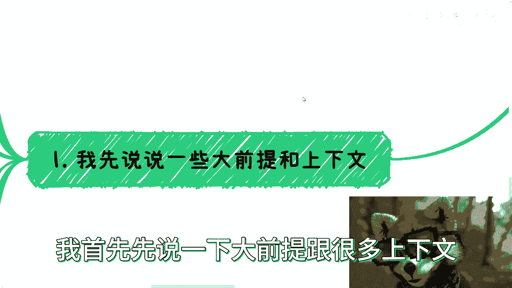
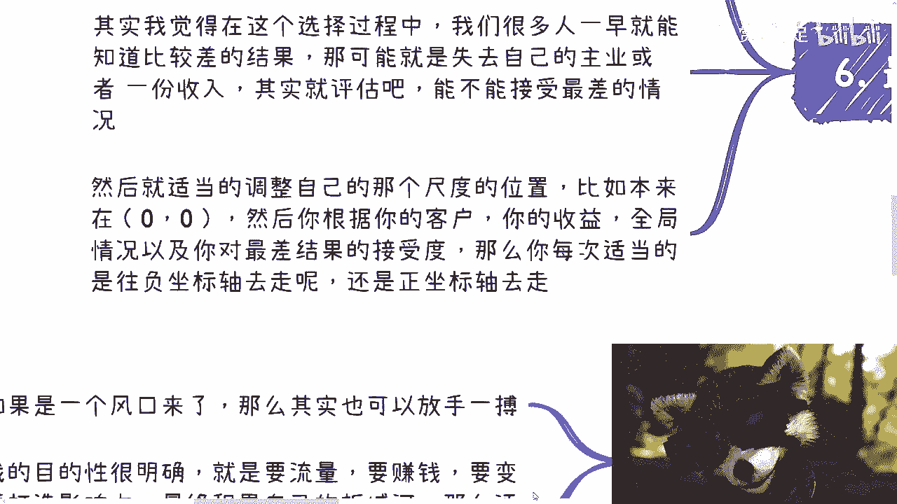
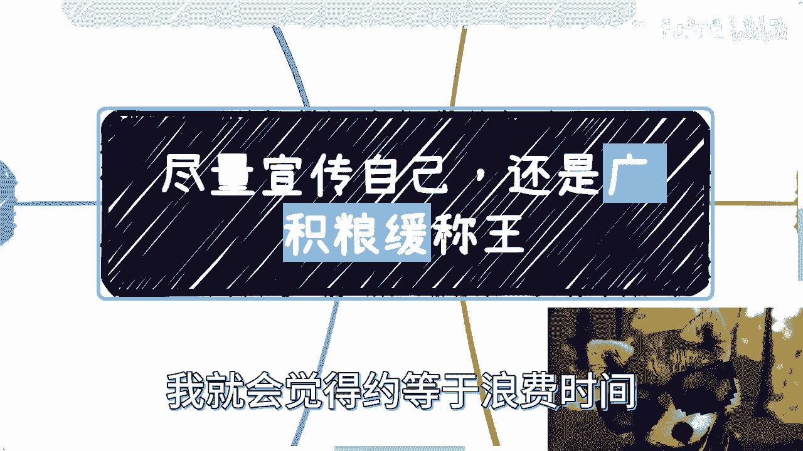
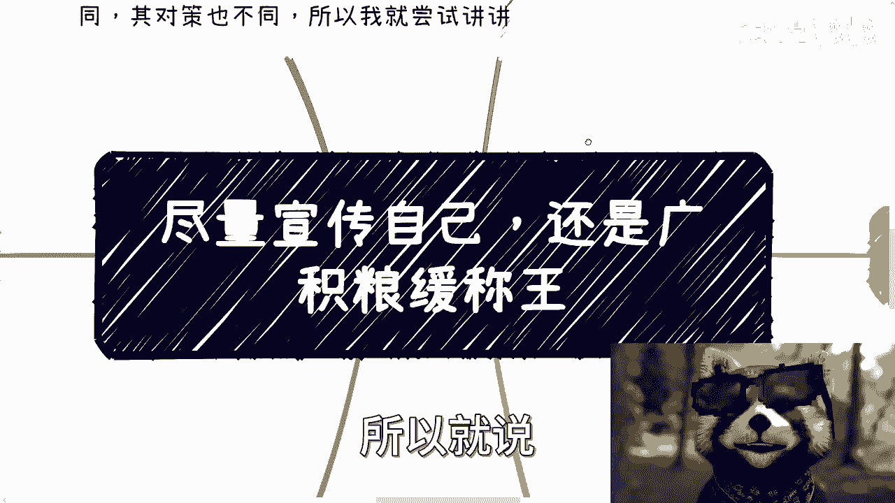
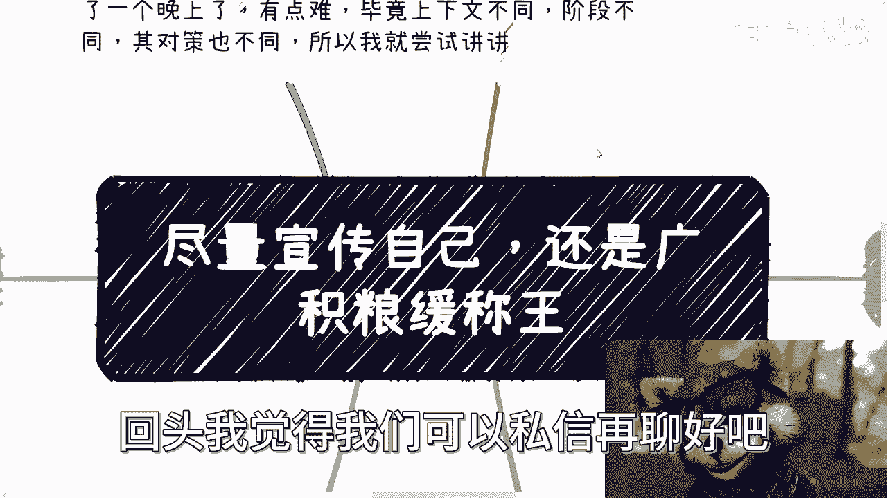
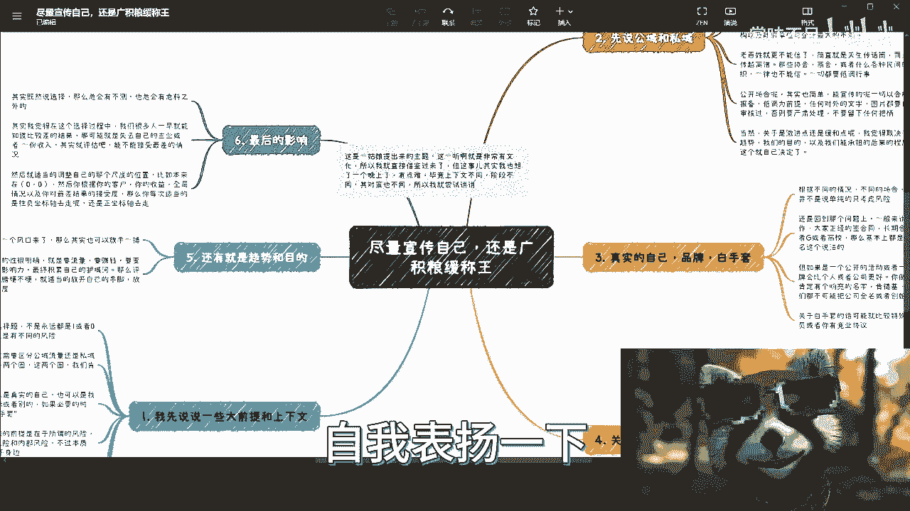

# 尽量宣传自己呢，还是广积粮缓称王 - P1 - 赏味不足 - BV17w411B7XN

哈喽大家好啊，今天真的忙了一天了。

现在马上就凌晨了，正好空下来啊，我觉得我空下来，反正也闲不住，就给大家讲吧，就讲完算了，不讲，我总感觉这个心里面压了啥事是吧，这个这两天有个小姑娘啊。

有个小小小姐姐哦，给我提了一个问题啊，我觉得还是有文化啊，一听就有文化，你看啊，你看这标题就不像我这种人取得出来对吧，呵呵他说了，他说啊，给我一个id啊，这个主题这个主题呢就是叫尽量宣传自己。

还是广积粮缓称王啊，这句话的意思是什么呢，意思就是说啊就是如果我们要去做一些事啊，要建立自己的品牌，那到底是走急功近利的这个尽量宣传自己的，加快步伐的这种方式呢，还是说就是说啊低调一点啊，慢慢慢慢。

就是说积累之后再去，再去就是说啊厚积薄发对吧，那么我看啊，就是我但是我跟你讲啊，这个事呢其实他跟我提了也有两天了啊，我说实话我昨天晚上想了一个晚上，也不是我特别去想啊，就是因为我就在想这个问题。

大概整个的这个框架脉络我想怎么说，但是我可能一边想呢，我就在那边想着想着发现我还想不下去，就可能这个问题没有这么容易，那有点难啊，毕竟上下文不一样呃，阶段也不一样，在每个阶段呢其实这个应对策略也不一样。

所以说啊我有一说一啊，你们别看这个也是同样一个XMIND的对吧，但这次的这个内容啊，有一说一我准备的时间还是有点长的啊。

这个也死了不少脑细胞，哈哈啊，首先第一点啊。

诶一啊一啊呃我首先先说一下大前提。

跟很多上下文，就是说，首先啊你看啊这肯定不是一个选择题对吧，他不是说永远都是一或者零一，我跟你讲一一或者零都有风险对吧，你无论选择这个叫什么缓存王，还是这个尽量宣传自己自己，他都有风险。

只不过它是不同的风险对吧好，那么我们考量这个问题的时候呢，我想了一下啊，有可能我想的不明不不不完善啊，因为毕竟还还是有点随意啊，有点随意啊，那我考虑这个问题的时候呢，需要区分几个东西啊。

一个是我们会区分公寓流量跟私域流量，简单来讲呢，这就是两个圈啊，那么这两个圈呢我们肯定要有不同的策略，对吧啊，这是第一点，第二点，同样的这里的自己啊，我们可以理解为可以是真实的自己。

也可以是我们创作的品牌商标或者别的anyway，任何一个东西对吧好，那如果必要的时候呢，我们甚至可以动用白手套啊，这个我后面会讲的啊，那么再者我们讨论这个问题的前提呢，是在于所谓的风险啊。

呃同样的就是说风险呢，也有外部风险跟内部风险啊，不过本质上大部分的风险都来自于自身啊，当然我们做事情呢还要看大局，看局势也要看我们的目的啊，大局趋势本身决定了我们会做怎样的选择啊，那么最后一点要说的是。

这个风险如果有了啊，那么其影响是什么样子的好，那么在我真正说之前呢，我得先装个逼啊，我得跟你们讲本次这个内容啊，你们可以从这个内容当中可以不得不看出来，我的认知之广阔啊，还我相信能够看得出来。

就B站像我这种人其实是太少了啊，哈真的这个这个逼必须装，卧槽，我今天我感觉我这个内容讲的真的是，哎呀他妈太良心了啊，首先先说公寓跟思域啊，这里说的公寓跟思域，并不是我们在运营层面上面说的公寓。

思域更多的是指宏观层面上面呃，意义上的说网络的公开以及私下的圈子啊，那么这个事一般我是这样看的啊，你看啊，私下的圈子，如果你的合作方，你的甲方啊，我不管他是你的谁啊，你的商业的合作伙伴当中啊。

我不管是一级关系还是二级关系，不重要啊，如果对方是政府或高校，而同时呢或者来说又是相对来讲有一定地位的，或者来说政治地位以及职称地位的这种人的话，那么你不用担心啊，你可以尽量在这些人之间。

也就是我们称之为的私下的圈子里面，你去尽量的宣传自己，甚至你也可以有一定的包装，为什么我告诉你们，因为这些人心里没有逼数，你知道吗，因为这些人知道什么能讲什么，不能讲，他们的边界感很强，为什么。

因为他们是政府跟高校，高校属于半政府机构，这些人心里面都是敞亮敞亮的啊，这个也是我们说其实呃选择合作方很重要，对吧，那这是第一点啊，但是呢我告诉你们啊，企业本身就不可信了，因为企业的人无能。

无论他的职能多高，你比如说他妈的什么P8P9P十，P11不重要，你知道吗，我跟你讲，企业里面的人，他心里面面对商业，他就是没有边界感的，为什么，因为他们做事情就是没有边界感的。

因为他本身工作就是职场上面跟商场，这他妈就是两件事情，你知道吗，他们并不知道什么话能说，什么话不能说，你知道吗，这也是为什么高校作为办政府机构，以及包括政府机构，单位与企业最大的一个不同地方。

这个不仅仅只是在我们这次的这个，topic里面来讲啊，任何一个你们的服务合作都是这个道理，你懂吗，好吧啊，那么第三个老百姓就他妈更不能信了啊，我跟你讲老百姓是什么，老百姓。

就他妈是天生DNA里面刻出来的八卦啊，天生传话筒，而且越传越离谱啊，那些协会商会或者什么各种民间组织，一律都不能信，为什么，还是那句话，只要偏离上面的，纯政府组织或者半政府组织都不能信。

因为他们心里面是没有笔数的，那么所以说呢一切都要低调行事，那么我们说完私私欲，你就来说公寓对吧，那么公开场合公开场合啊，其实也简单，能宣传的呢，一切以合规报备，低调为主。

那任何对外的文字图片要经过自己的审核，不经过自己审核，一律不能对外，不能public，也不能对内，帕布雷克，什么叫对内public，就比如说你今天去一家企业哦，哦不叫去叫去一个这个这个政府对吧，好。

然后呢你一定要通过你的审核，你才能去发给那些公务员或者发给那些客户，你知道吗，就一定是通过审核的啊，好不要人家留下任何的把柄，当然关于激进一点还是缓和一点，我觉得这个最呃很大程度上取决于带的趋势。

我以和我们的目的，以及我们能承担的后果的程度啊，这个我会在最后的时候跟大家去讲啊，好吧，然后这是第一点啊，那么第二点真实的自己品牌白手套啊，根据不同的情况，其不同的场合还有一定的区别。

并不是说单单的只考虑风险嗯，还是回到那个问题上，一般来讲啊，目的如果是商业合作，那么大家要正经签合同，长期合作的话，对方是企业或者政府或者高校，那么基本上你都是真实的，自己没有化名这个说法好。

那么有老师有小伙伴说了，诶，你刚刚上面不是说企业不可信吗，是企业是不可信的，但是如果你要就是真正的走到，正经的商业合作上，你要签合同了，你还他妈的是个化名，带着mask的，哼，不好意思，没人会信的好。

那么这是第一点，第二点，但如果是一个公开的活动或者是一个服务，比如说啊你要办一个沙龙啊，办一个活动，或者办一个相对来讲比较to c或者to public的，这么一个服务的时候啊。

那么其实品牌会比个人或者公司更好，因为你想想看啊，你今天做一个峰会或者做任何一个服务，你肯定得有个响亮的名字，比如说对吧，肯德基，麦当劳，星巴克，什么数字经济峰会对吧，你你不可能你说啊。

这个我我今天打一个品牌，我把自己的名字好，上海什么什么数字有限公司打在上面，他妈是不是吗，对不对，你看到过有多少是把公司全名或者创始人名字，拿出来做宣传的对吧，很少的呀。

啊那么关于白手套的话可能就比较特殊啊，比如说诶卧槽我没写完，原来怪不得我就想我缺了什么东西啊，不重要啊不重要啊，我们继续来看啊，关于白手套就比较特殊，那么这种情况下面。

你可以你说你可不可以做相关的东西也可以做，但是呢你可以这样子，你可以完全有一个白手套的公司，或者白手套的朋友来做这件事情，也就是说你是这个幕后的操作者，所有的东西都是你来做，他们只不过是你的傀儡啊。

但是从他们本身来讲，蛛丝马迹，不管是股东还是法人还是各个方面，查不到与你有任何的关系，那这件事情也就OK了啊，也就是说如果你有这种special的对吧，这种东西定位存在，那么你也不是死路啊。

也不是没有办法啊，但是我在这个地方说的也是，已经是没有办法的办法了啊，好那么第三点关于内外部风风险啊，所谓外部风险其实很多时候还是很好规避的，就像我们刚刚说的呃，你可以在宣传物料上面。

尽量避免跟自己主观主业有关的露出，或者来说所有的路都要走正规的报备跟备案，基本上就可以了啊，你可以露出就走，报报备跟备案，你也可以尽量避免露出好，那么很多人会觉得，副业跟自己的主业最好相关啊。

这个很多人也跟我这么提过啊，但其实呢是相反的，每个行业我就告诉你们，你要说圈子大也大的，你要说圈子小也小的啊，你觉得圈子大呢是因为你设计面不广，你认识的人不够label高。

你但凡设计的认识label高了，你会发现他妈的哼哼呃，有什么叫七度关系，六度关系嘛对吧，你今天认识两个人发财诶，这两个人可以互相点赞的，你说小不小，对不对啊，那么相呃尽量别让信息在同一个领域透风啊。

否则出问题了是早晚的事，那么内部的风险呢，我更多的还是指身边的人，因为大部分的举报来自于身边，当然你要说能不能规避呢，也能啊，那就是说你还是要低调，能不说的尽量不说，包括你的COFOUNDER。

包括你的partner，包括你的自己的这个商业合作伙伴，只要跟你的这个副业，或者跟你的自己想做的这条线有关的，你尽量不要去说自己的身份，也尽量不要说跟自己主业有关的东西，你都别说。

你除非就跟我一样没脸没皮对吧，也没有什么主主业挂钩啊，也没有什么合同挂职对吧，你能把我怎么样，你去举报好了，满地举报都跟我没关系，对不对，还真别说啊，举报这个事呢，还也也有白名单啊。

也有这个也不是白名单，白手套我写错了啊，也有白手套啊，那很多人为了规避风险呢，他还会找到外面的人诶，诶来替他举报，哎我跟你讲牛逼了啊，啊也也没毛病啊，也没毛病，好5年啊五啊就是我们说这个趋势跟目的啊。

呃你说如果一个风口来了啊，那么其实我觉得你评估一下可以放手一搏啊，也没毛病，就是别的东西呢，刚刚我们前面考虑这些，有的没的呢，你也可以不考虑啊，那如果我的目的很明确，比如说我的目的就是要流量。

就是要赚钱对吧，就是要变现，就是要打造影响力好呃，就是要最终积累自己的护城河，那么我觉得呢，你你就应该去评估现在自己翅膀硬不硬，所谓翅膀硬不硬嘛，也简单嘛对吧，就是我就算没有了这份主业。

我能不能有足够多的收入啊，包括呢我能不能有足够强的获客能力对吧，能不能有足够多的吸引力，无非就这些东西啊，然后呢你去慢慢放开自己的尺度，那么关于最后的影响呢，我在这个地方写一点啊，就是呃既然说选择。

那么总会有所谓的不测，也总会有所谓的意料之外的事情啊，那么其实我觉得在这个选择过程当中啊，我们很多人一早就能知道比较差的结果啊，那可能就是说哎我可能是去自己的主业，或者一份收入对吧。

或者说嗯再背上一个开除啊对吧，或者怎么样的唉这种有的没的东西啊，那么呃其实呢你就去评估能不能接受，在你的认知里面最差的情况啊，然后呢，其实我觉得你就得适当的调整自己的这个，尺度的位置。

因为它没有不是一个他不是一个固定的东西嘛，对吧，你说我今天有一个问题好，我回答你虽然不是零和一啊，但是我告诉你有这么一套逻辑，但这个逻辑他不是死的对吧，那么你就比如说本来对吧，你的这个尺度在0。

0这么一个坐标轴啊，然后呢你根据你的客户，你看啊，你的客户的性质，你的客户的画像，你的收益，你的投入产出比，你的全局的情况以及趋势的情况，以及你对最后结果的接受度啊，最差几个接受度。

那么你每次适当的对吧，你你你你这个心理你自己调整对吧，就是说你可以每次适当的往负坐标轴去移动，亦或者来说往正坐标轴去移动都可以对吧。

那么这个就是我觉得我觉得在这个问题上面的，一个一个观点啊，但是如果你呃如果我们说从我现在的经验啊，回退往回推的话啊，我还会给出一个更更宏观的建议是什么呢，就是嗯你得想好你到底想做什么。

就是你如果觉得我就是要打造自己的影响力，这就是我的最终目标，那么我我认为啊就是as soon as possible，就是ASAP就可以了，就本质上我觉得不用去考虑这么多，有的没的。

因为很多时候可能考虑这么多，有的没的，难得不偿失，好就是也不值得呃，就是也许从当下来讲，我们的确会面临哎就是到底是尽量宣传自己呢，还是说是慢慢来呢，怎么样子，但是如果我就说这个东西跟。

还是跟你本身的这个定位，跟你的目的性，或者跟你的性格，跟你想做什么样的人，和你最终商业想做成什么样子有很大的关系啊，因为在我看来，一旦模棱两可呃，它不是一件好事情，因为一旦你模棱两可。

或者一旦是一个呃叫什么，就是慢慢积累啊，或者来说怎么样的，因为你要明白，你慢慢积累，很多时候也不是真的全职积累，可能很多时候大家都是一种兼职的状态，积累对吧，但这种积累其实不叫积累。

当然可能也不叫浪费时间，但是你从我的角度，我就会觉得约等于浪费时间。

嗯好吧，所以就说我可能也暂时想到这么多。

这位小姐姐，反正你先看看了，反正有什么细节的，回头我觉得我们可以私信再聊。

好吧，哎呀行，那就先这样啊，我觉得我觉得我想的满命满满全的。

