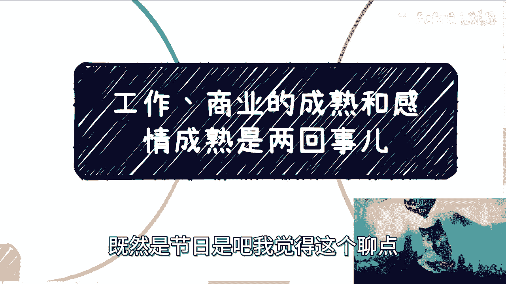

# 课程 P1：区分工作成熟与感情成熟 🧠💔

在本节课中，我们将要学习一个常见的认知误区：将工作或商业上的成熟与成功，等同于在感情关系中的成熟与成功。许多人容易将这两者绑定，但根据经验，这种想法往往过于简单，甚至可能带来问题。我们将通过几个关键点，剖析为何它们是两回事，并帮助你建立更清晰的认知。

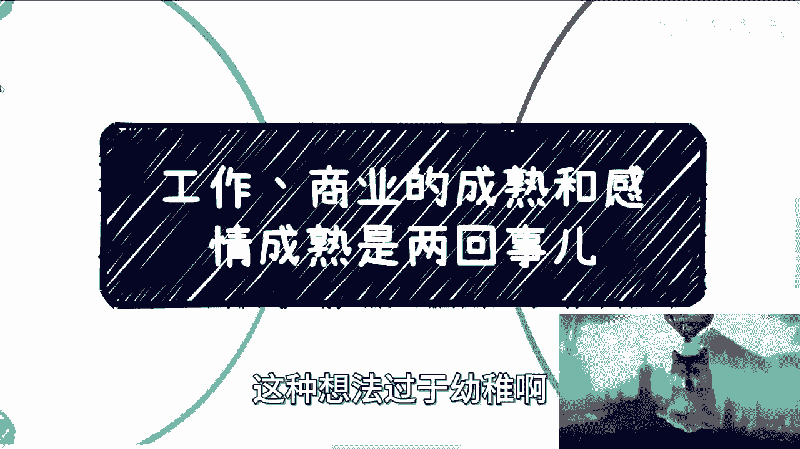

---

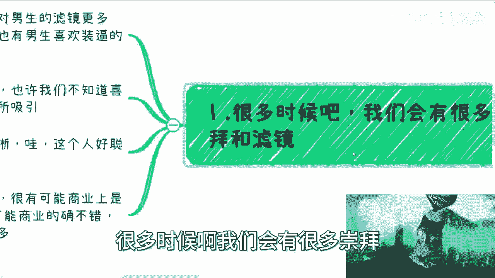

## 1. 警惕“滤镜”与盲目崇拜 👓

上一节我们介绍了核心误区，本节中我们来看看第一个具体表现：对他人，尤其是那些在事业上表现出色的人，容易产生“滤镜”和盲目崇拜。

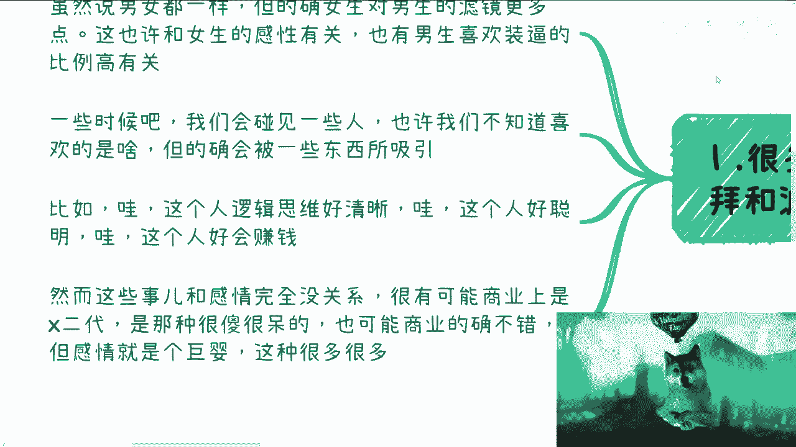

这种现象在男女中都存在，但根据观察，女性对男性的“滤镜”可能更常见。这可能与女性相对更感性，以及部分男性倾向于展示自己有关。

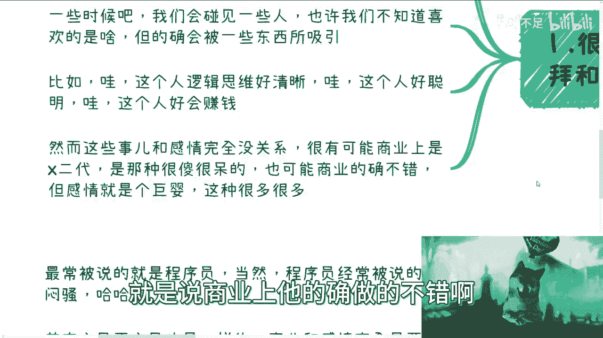

以下是几种常见的“滤镜”表现：

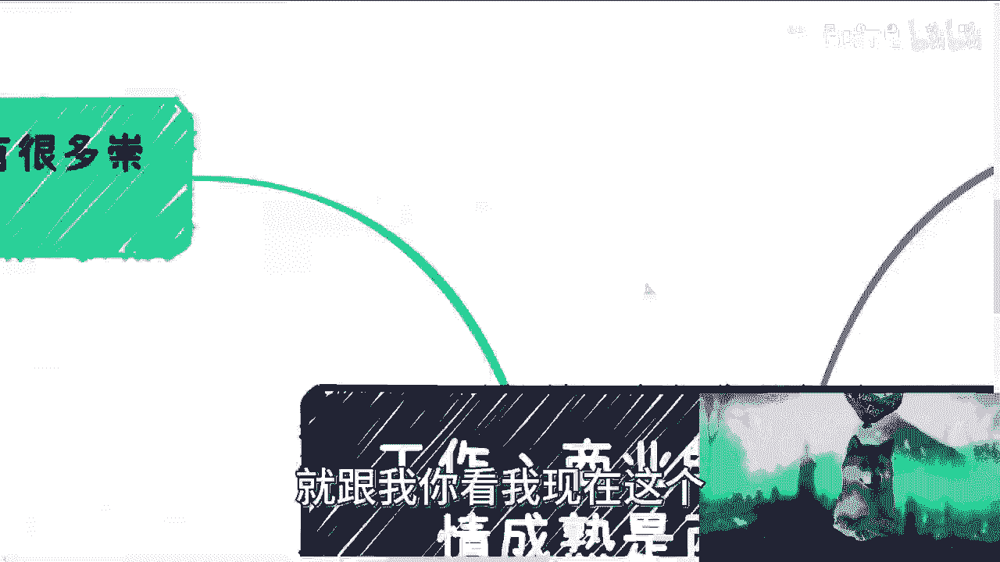

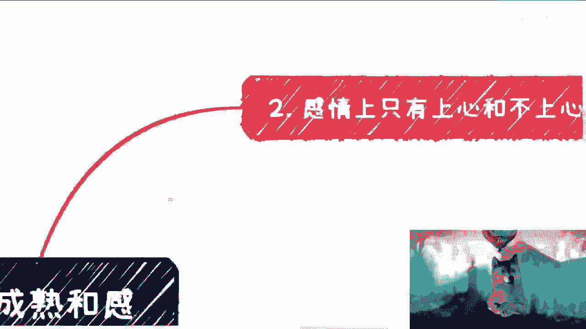

*   被对方在商业或工作上的能力所吸引，例如觉得对方“逻辑思维好厉害”、“好聪明”或“好会赚钱”。
*   不自觉地将上一代的成功或资源，误认为是对方个人的能力与成就。
*   通过想象（“脑补”）为对方赋予并不存在的“个性”或“高价值”。

**核心概念**：吸引力 ≠ 适配性。商业魅力 (`Business Charm`) 与感情中的适配性 (`Relationship Compatibility`) 是两个独立的变量。
```plaintext
感情成功 ≠ f(商业成功)  // 感情成功并非商业成功的函数
```

---

## 2. 区分“个性”与“借口” 🎭

上一节我们讨论了由能力产生的滤镜，本节中我们来看看如何辨别对方在感情中的真实态度。关键在于区分什么是真正的个性与原则，什么只是不愿付出的借口。

感情的核心在于是否“上心”，即是否愿意为对方花费时间、精力和心思。许多看似合理的理由，实则是缺乏用心的掩饰。

以下是需要警惕的常见“借口”及其辨析：

*   **不过节日/纪念日**：对方声称“我从小到大从来不过”。辨析：过去的习惯不能成为现在忽视伴侣需求的正当理由。关键在于当下是否愿意为对方创造仪式感。
*   **不送礼物**：对方声称“买礼物是消费主义陷阱/被商家割韭菜”。辨析：表达心意的方式有无数种，例如亲手做饭、准备简单的惊喜。拒绝一切形式，往往只是不愿付出的托词。
*   **不回复消息**：对方以“我很忙”、“我有个性”为由无视正常沟通。辨析：尊重是沟通的基础。忙碌可以延迟回复，但不能成为无视他人正常、礼貌问询的理由。真正的“个性”不应建立在对他人的不尊重之上。

**核心公式**：
```
有效理由 = 原则一致性 + 尊重对方
无效借口 = 单方面要求 + 忽视对方感受
```

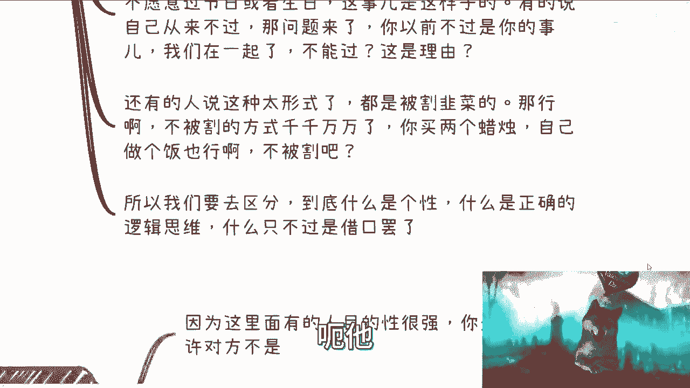

---

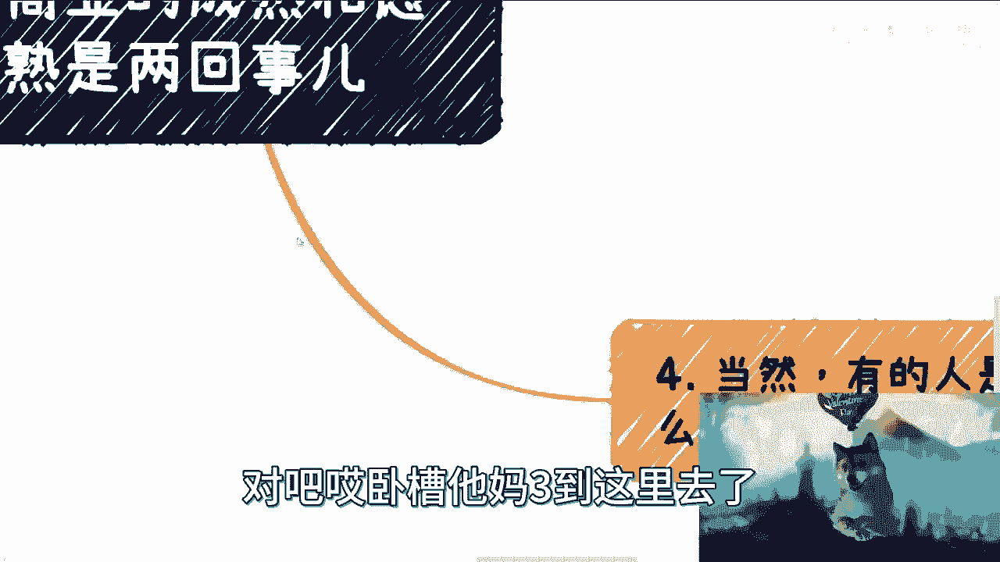

## 3. 事业上的“主见”不等于感情上的“主见” 🧩

上一节我们学会了辨别借口，本节中我们来看看另一个容易混淆的特质：主见。一个人在事业上果断、有想法，并不意味着在感情关系中同样如此。

感情中的行为模式可能与工作状态截然不同，甚至完全相反。

以下是几种可能的情况：

*   **感情中缺乏主见**：工作上雷厉风行，感情中却喜欢听从安排，或完全不知道自己想要什么样的关系。
*   **将工作强势带入感情**：把事业上的强势作风惯性带入亲密关系，对伴侣也很强势。这可能是他清楚自己要的相处模式，也可能只是他不自知的行为惯性。
*   **用商业框架处理感情**：用一套固定的、可量化的“标准”（如收入、学历、身高）来寻找伴侣，但问及到底喜欢对方什么特质时，却答不上来。这不是主见，而是偷懒的筛选机制。

**核心概念**：不要将工作特质 (`Work Trait`) 自动映射为感情特质 (`Relationship Trait`)。它们属于不同的人格维度。

---

## 4. 识别“商业化”的感情与不尊重 🚫

上一节我们分析了主见的不一致性，本节我们来探讨一种更极端的情况：完全用处理商业事务的理性思维来处理感情，甚至表现出不尊重。

有些人即使是在谈感情，其思维方式、沟通方式也极度“商业化”，充满算计，缺乏感性与真诚的互动。

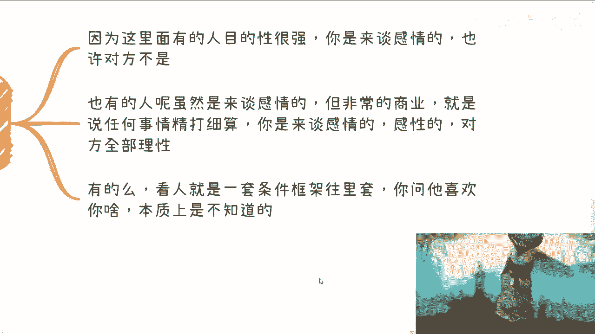

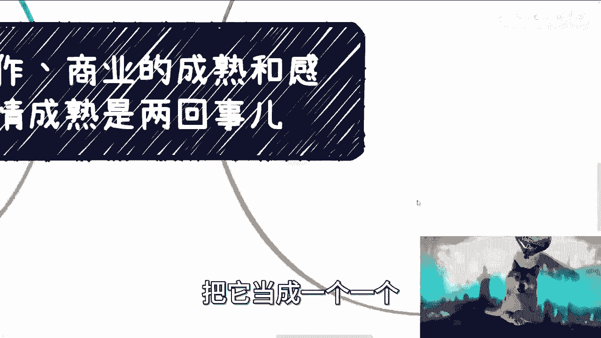

以下是需要警惕的信号：

*   **沟通像商务谈判**：感觉不像在谈恋爱，而是在与同事或合作伙伴协商。
*   **“扮猪吃老虎”**：标榜自己因商业成功所以在感情上也如此理性、计较，并以此要求你的谅解。这是一种精致的利己主义。
*   **毫无感情投入**：对方可能根本不是来谈感情的，但你因为“上头”（一时迷恋）而未能察觉。
*   **缺乏基本尊重**：无论对方社会地位多高（教授、大佬、大V），都没有理由在正常、礼貌的交流中无视或贬低你。尊重是人格的体现，而非地位的赠品。

**核心原则**：
```python
if 沟通方式 == “纯理性计算” and 互动感受 == “不被尊重”:
    建议 = “重新评估这段关系”
else:
    建议 = “继续观察，保持清醒”
```

---

## 总结 📝

本节课中我们一起学习了如何区分工作/商业成熟与感情成熟。

1.  **警惕滤镜**：不要因对方的事业光环而盲目崇拜，误以为其在感情上也必然成熟。
2.  **辨别用心**：学会区分真正的个性与不愿付出的借口，感情的核心在于双方是否愿意为彼此“上心”。
3.  **认清主见**：事业上的果断不等于感情上的清晰，两者可能完全不同。
4.  **拒绝物化**：警惕用完全商业化、框架化的方式处理感情的人际关系，并坚决维护自己在任何关系中都应得到的平等尊重。

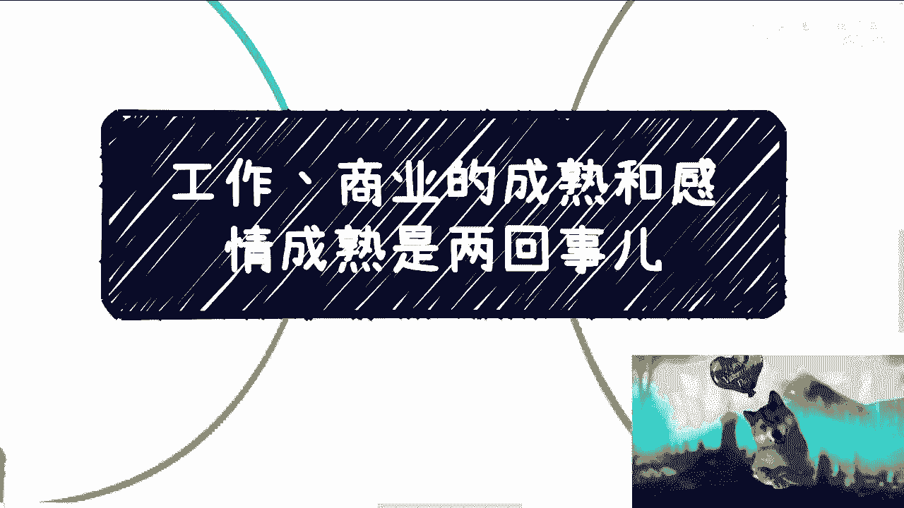

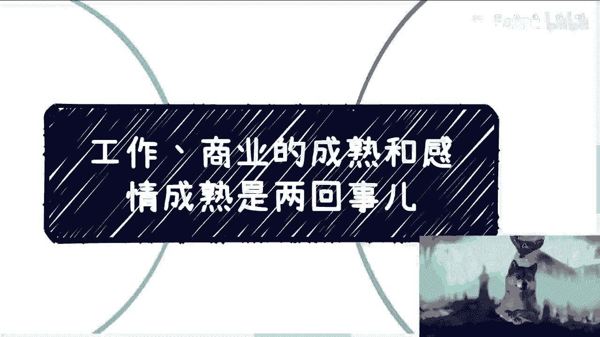

记住，一个在商业上成功的人，在感情上可能是个“巨婴”；而一个懂得尊重、用心经营关系的人，才是感情中真正成熟可靠的伙伴。