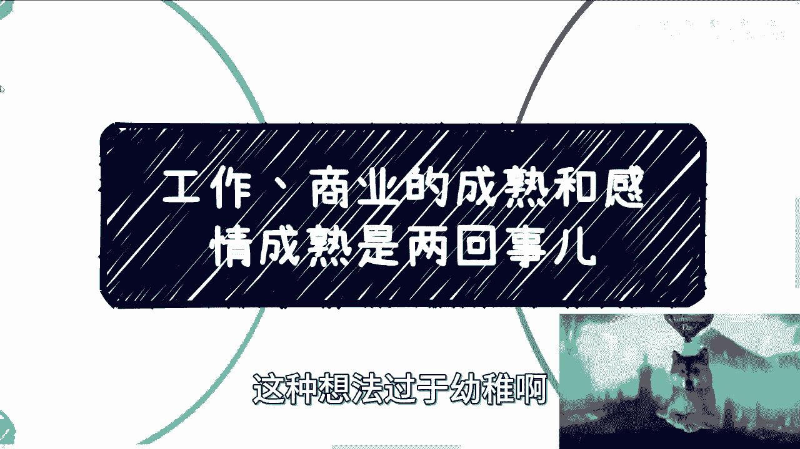
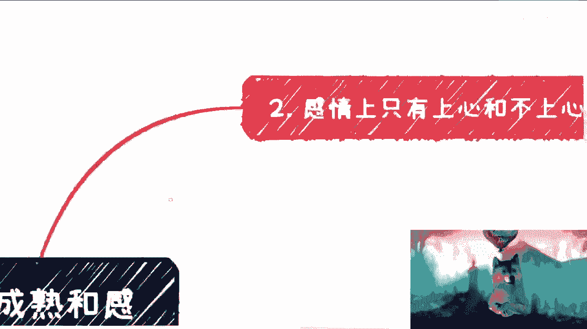
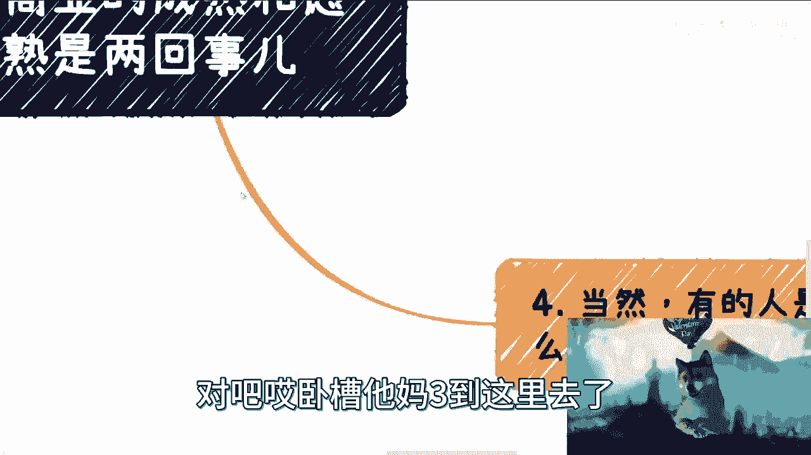
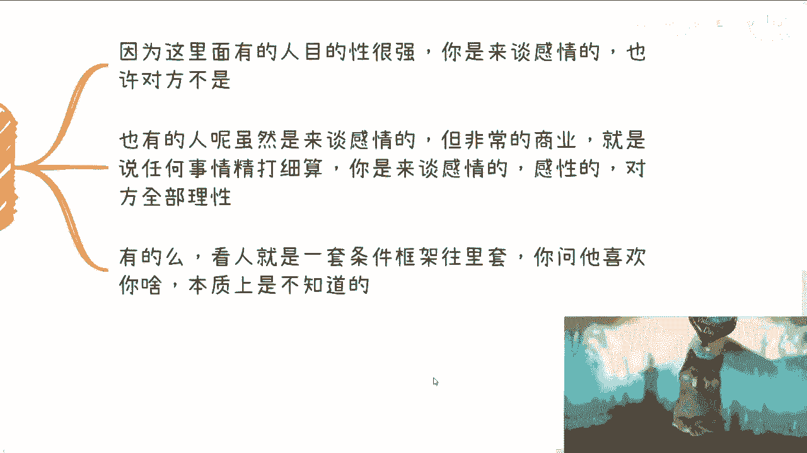
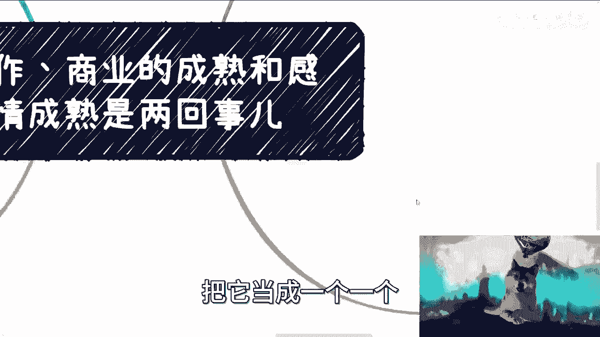
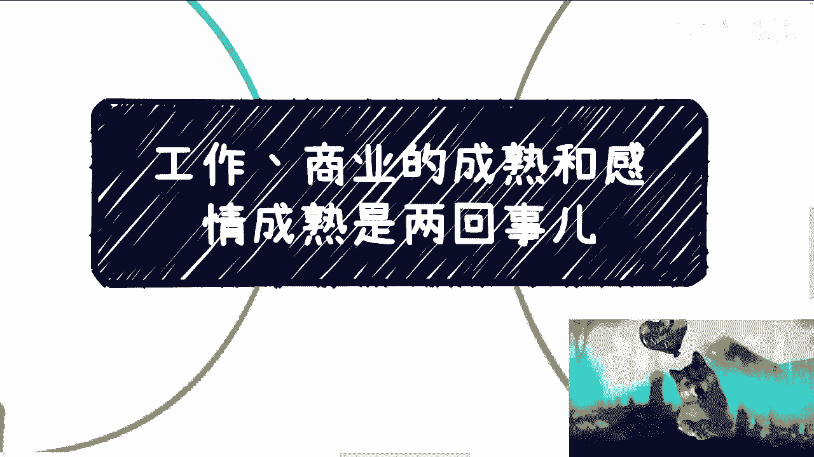

# 工作、商业的成熟和感情的成熟是完全两回事儿 - P1 - 赏味不足 - BV1ez4y1G7co

好大家这个节日快乐啊，既然是节日的时候，我觉得这个聊点轻松点的话题啊。

啊之前呢其实聊下来呢，也有一些是来咨询感情的啊，那么在这当中呢，我发现比较多的一个问题是什么呢，就是很多人会把工作商业上的成熟跟成功啊，和感情呢去完全的这个绑定，就他们会觉得工作跟商业上的成功啊。

成熟的人在感情上也是成功成熟的，我跟你讲这个事儿呢，我虽然不能一棒子打死，但是依我的经验啊，我可以说大概率啊，这个不要抱有这种想法啊，这种想法过于幼稚啊。

首先啊我跟你们讲啊，很多时候我们会有很多崇拜啊和滤镜。

就虽然说男女都是一样，但是的确啊就是我接触下来的女生，对男生的滤镜更多一点啊，这个呢我个人觉得也许跟女生的这个呃，感性有关系啊，就是女生相对感性一点比较有关系，也跟啊这个男生相对喜欢装逼啊。

比较有关系啊，那么这是第一点，第二点呢一些时候呢我们会碰见一些人，就也许我们其实自己不知道自己喜欢的是什么，但是的确会被一些东西所吸引，比如说哇对吧，这个人逻辑思维好牛逼啊，哇这个人好聪明，哇。

这个人好会赚钱对吧，就我相信很多女孩子是有这种想法的哦。

然而呢这种事情呢我跟你讲，跟感情呢完全没就这些事跟感情完全没关系，就很有可能商业上呢它本身是个二代对吧，你不知道啊，他隐瞒了某些事情对吧，你觉得他上一代的成功是他自己的成功啊。

那么这种人呢玩一一般是比较傻，比较呆的，也可能呢就是说商业上他的确做的不错啊。

但感情上就是个巨婴，我跟你讲中文很多很多啊，就跟我。

你看我现在这个为什么要用这二二哈对吧，这个真的好。

就感情上呢我跟你讲只有上心和不上心啊，就是说比如说商业成功或者会赚钱，这些人大家觉得其实很有个性啊，就是大家我跟你讲，很多时候大家是YY出来的，就意淫出来的，就会觉得就脑补出来，觉得这种人很有个性哦。

很有很有价值，或者什么，我跟你们讲这个事儿呢，就跟我们平时说这些大V啊，明星啊其实是一个道理，什么意思呢，就是说你就要说你有架子，我可以理解对吧，你要说你的消费啊，认知啊跟普通人不一样。

那我也可以理解对吧，但是你不能就是他们不能再就是说呃，这个这个三观啊，包括尊不尊重上面，你去有问题，什么意思啊，我们举个例子，比如说啊你比如说你就拿我来讲，你们发消息给我对吧，然后你说你只要客观的问。

你，哪怕简单的问对吧，你要说有时候愿意给红包，不愿意给红包无所谓啊，我从来不会去追问对吧，就说你有问题，只要不是伸手党，我都会回答的啊，但是我拒绝回答的理由也非常的充充足对吧。

就是说你只要不是伸手党对吧，你只要不是问问题，明明什么google bing啊，你一搜就有的，你非要来当我T了对吧，就是说我不来回，并不是因为我有个性，我不能跟你们说，我的。

因为啊吕老师这个啊粉丝过10万了对吧，然后我和他妈很有个性，不是的，或者你说我是做商业的，我很有个性啊，不是的对吧，就是如果我用这种理由来跟你们讲，我我说我不回你们，那么这个就是只是不尊重大家。

你知道吗，这个跟本身有没有个性没有关系，我可以用我我有个性来标榜我，但是这不能成为我不去回你们，或者我我去忽视很多是在事情的理由，你知道吗，那包括很多时候是什么呢，你们会发现你们跟别人谈恋爱对吧。

就是有的小伙伴呢他不愿意给你们买买礼物啊，有的不愿意给你们过节日，过生日对吧，我跟你讲这事儿是这样子的，有的人呢他会跟你这么说，他说我从小到大从来不过OK那问题来了，如果我是你，我就会问我，的。

你你以前过不过关我屁事啊，对不对啊，你以前你说你爸妈不给你过啊，你以前怎么样怎么样跟我有什么关系啊，你现在跟我在一起不能过吗对吧，这是什么狗屁理由啊，对不对哦，你要觉得你以前怎么样怎么样。

我们怎么样怎么样，那怎么办，哎莫名其妙，你说是不是啊，还有人说呢是这样子，他说哎这是一种形式对吧，你比如说我给你买礼物对吧，买很多东西太容易被商家割韭菜，那没问题啊，没问题啊，不被割的方式千千万万了。

你买两根蜡烛对吧，点好点，做自己做个饭，你不会做，学啊，这种不被割了吧，不要拿这种东西，就是你们也不要被这种理由所蒙骗，这种理由有屁用啊对吧，他愿不愿意在你身上花时间，他愿不愿意上心，这个是非常明显的。

而不是拿这些有的没的这个理由，对吧，所以我们要去区分到底什么是个性，什么是正确的逻辑思维，什么是呃，他是不是对你上心。

而什么只是一个借口对吧，哎我三到这里去了。

三关于有没有主见或者闷骚，我跟你讲啊，是这样子的，呃，最常说的呢就是程序员吧，程序员最经常被说的就是闷骚啊，但是主不主见，我跟你讲也是一样的，就是事业上有主见的，感情上不一定啊，不一定。

那么这里也有几种可能性，第一一种是感情上，他完全本来就没有主见，没自己想法对吧，或者感情上他就是喜欢听安排，有的人很两极分化，他觉得我工作上已经很累了对吧，那我就不想在感情上，我就喜欢听听从安排。

这是一种另外一种呢，就是说工作上很强势，而导致了在别的事情上面，甚至对自己的另一半也很强势对吧好，那怎么说呢，这种里面啊，如果他知道自己要什么，那没问题，就是说他要知道我自己感情上就是很强势的人。

那也没问题啊，但往往这种情况呢，他不知道自己要什么对吧，那他的强势只不过是工作上的强势的一种惯性，那么你们就想嘛，哦我们能将这种惯性跟这个人的感情上，是否很强势划等号吗，那肯定不能划等号啊对吧。

你不能因为觉得哎呀这个人好像在商业上，在工作上对吧，在在在他的事业上面，很强势对吧，我觉得他可能就是个很强势的人，不一定真不一定好，那么第四点就是，当然就像我们说的，就是说商业和工作和事业上面对吧。

他和感情上这些，他和感情节呀，哎呀，感觉这些他是不是完全有可能完全不一致呢，也不是有的人也就是一样的，你知道吗，但是他一样的人已经是过了界啊，什么意思啊，就是说你看啊，有的人呢他虽然是来谈感情的啊。

但是呢他非常的商业，也就是说他可能跟你聊，你就会觉得觉得他是跟一个同事在聊，或者跟一个合作伙伴在聊，你是跟他来谈谈朋友的，他跟你就怎么怎么想，就感觉这个感感觉上包括他的为人处事啊，包括跟你聊事情。

就感觉非常的叫什么，就是商业化哦，就是你是来谈感情感性的，就他全部是理性的，那这种东西呢就是嗯你要说他不懂吧，我觉得如果是我的话呢，就是我我劝的是，你就不要在这种不懂的人身上浪费时间对吧。

你要说他真的就是说就有一类啊，你说不懂的话呢，我觉得就别浪费时间，有一类呢我觉得你说他不懂呢，我觉得可能也不是不懂啊，他是懂呢，他就是这个扮猪吃老虎，你知道吗，就是就是他就是标榜啊。

就说自己好像商业上很怎么样怎么样啊，然后呢好像在感情上也是这样子啊，来博得你的这个叫什么啊，谅解或者怎么样，那我觉得这个也是就非常离谱的一个事情啊，那么还有的呢就是它完全嗯就不是了。

就是说你是去谈感情的，他完全就不是就不是来谈感情的，就对他来讲没有一点感情的东西啊，但是你不知道因为怎么怎么说呢，上头嘛对吧，那还有的呢，就是说他看人呢就是一套框架往里面套，就是我以前问过问过一些人。

我说我说你喜欢什么样子的，他就是给我一套理由啊，给我一套这个框架，那我说这个框架你在地球上能找到的多了去了，那你总不能每个人都说你谈朋友吧对吧，你问他他喜欢什么，他不知道的，他不晓得呢对吧。

那么这种呢我觉得也是一样的，就是大家在这种上头的时候，千万不要把这种把这种就是说啊，就明显听上去很傻的理由对吧。

或者说很很很无厘头的理由，把它当成一个一个一个正规的一个理由。

好吧嗯对，反正我觉得我就觉得这种情况呢很多很多嗯，包括就包括我们说的感情上，包括我们说的这种日常的，怎么说呢，这种自媒体对吧，或者怎么样呢，就是就是嗯我希望大家能明白一点，就是说呃对方是个教授也好。

对方是个什么，你们觉得好像是个大佬也好，或者是个什么自媒体做的很牛逼，几千万粉丝的人也好，就是我觉得是这样，因为我的三观，我我跟我早就跟你们说过，就是我看人一直是这样子的，就是就是我不关心他是谁。

我只关心就是说第一他有没有真材实料的东西，让我觉得我是就是这个需要对吧，就是说是尊尊重他的对吧，第二个就是说在正常的沟通当中，他是不尊重我对吧，因为他无论是谁，无论是任何东西。

没有任何一个理由是能够支撑他，不尊重我的理由啊对吧，除非是我已经有冒犯了，那我就说了，就像我说的，比如说啊我就是无脑在那边问对吧，我就是我就是无脑伸手对吧，我就是不经过脑子的对吧，然后干嘛干嘛。

然后就是可能我这个说东西本身是我不尊重他，在先对吧，那是另外一回事情，但凡我是一个正常的问题，但凡我是一个正常的需求，但凡我是用尊称对吧，就正常的这个正沟通，他没有任何理由来不尊重我，不能因为我的哦。

你告诉我你是个教授，你是个怎么样而不尊重我，而是应该更应该尊重我，为什么，因为你这个才是你地位的体现啊对吧，才是你这种人的体现啊，否则他那就我我我就觉得蛮离谱啊，但是我觉得大众其实很多人没有这个认知的。

他是反过来的，他就会觉得卧槽应该我去尊重这种人，这种人不，我是应该的，我也不知道为什么，你知道吗啊，你说他忙没问题啊，但是他不可能不来吊你哦，就是你说他忙没问题，那最多就是晚点啊，大家来聊这个东西。

这是可以的，或者说他不愿意聊也没问题，那么他可以拒绝你对吧，但是不能无视，我觉得无视就是就是不尊重，嗯行吧好吧。

这个大家节日快乐啊，就先这样吧，看我头上这个爱心对吧。

