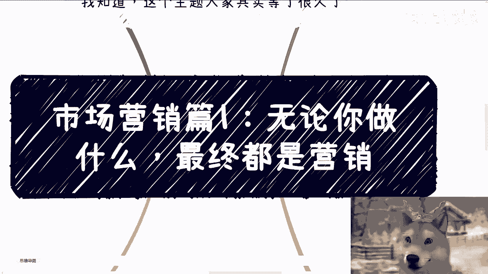

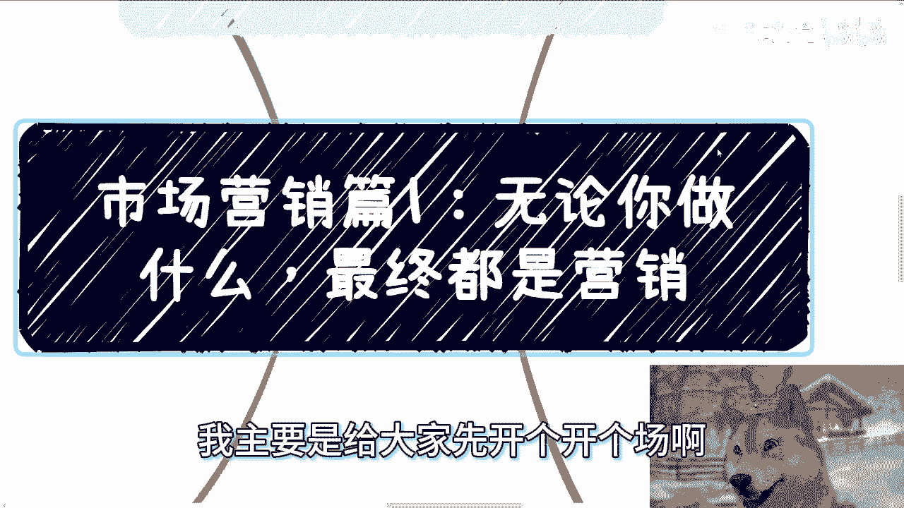

# 📚 市场营销篇1：无论你做什么，最终核心都是营销

在本节课中，我们将要学习市场营销的基本框架和核心逻辑。课程将帮助你理解营销的本质，并梳理出清晰的分析路径，为后续深入学习打下基础。

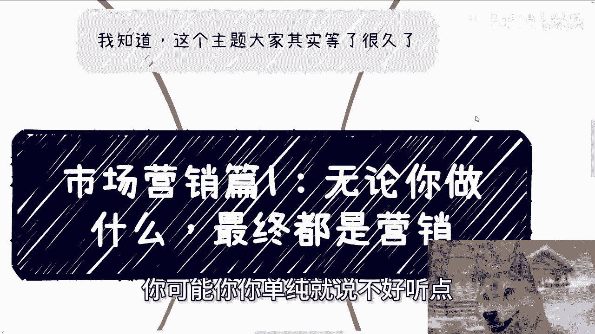

## 🌍 定义核心用户画像

上一节我们介绍了课程主题，本节中我们来看看营销的起点——用户画像。无论做什么，最终都需要面向特定的用户群体。

地球上所有产品的用户画像，可以总结为以下五类，你无法找出这五类以外的群体：

1.  **政府相关单位**：包括政府机构、下属单位、相关组织、协会、产业园等。
2.  **高校**：各类高等教育机构。
3.  **企业组织**：包括公司、民间非营利性组织（如非遗机构）等。
4.  **资本**：包括基金、国投、城投、个人投资者等。
5.  **老百姓**：普通消费者群体。

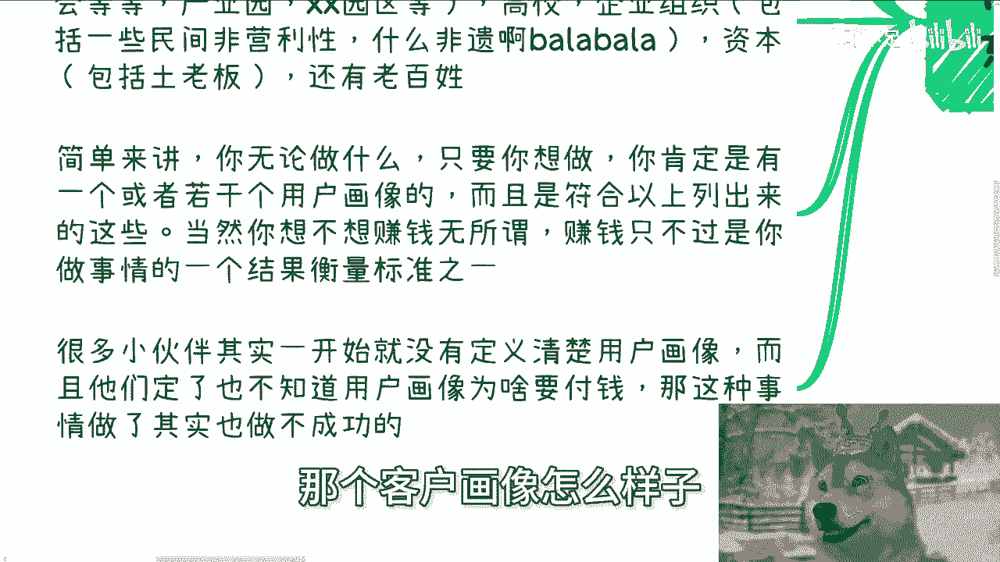

无论你做什么，只要你想做，必然有一个或多个符合以上分类的用户画像。赚钱是衡量事情成功与否的标准之一，但并非唯一标准。公式可以表示为：

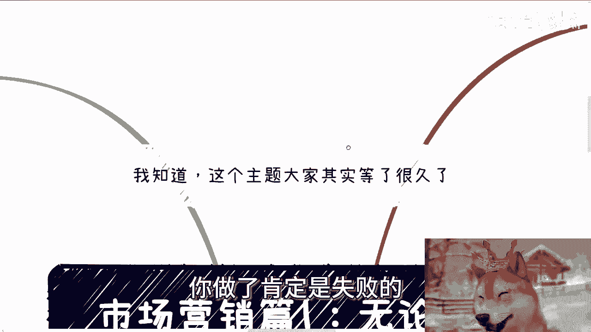

**成功 ≠ 赚钱，但不赚钱 ≈ 不成功**

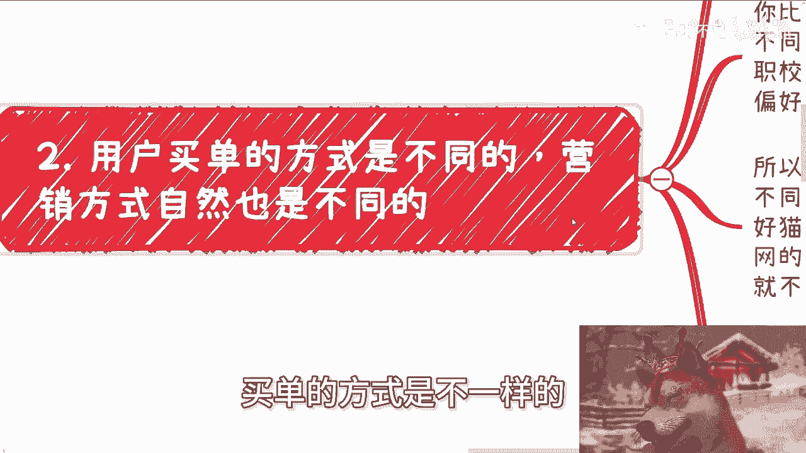

许多人在开始时并未定义清楚用户画像，也不知道客户为何愿意付钱。如果连这些都不知道，那么行动大概率会失败。

## 🎯 理解不同用户的买单逻辑

上一节我们定义了五大用户类别，本节中我们来看看这些类别下的细分逻辑。用户买单的方式不同，营销策略自然也不同。

虽然大框架是五类用户，但每类用户内部需要进一步细分。例如，“老百姓”可以按城市线级、年龄段、性别、教育背景等进行划分。不同细分群体的买单逻辑各不相同。

这句话在 **0到1** 的阶段尤其适用。**0到1** 指的是从尚未赚钱到赚到第一桶金的过程。在这个阶段，你可以采用广撒网策略，无需过度关心细节。

一旦你完成了 **0到1**，希望从 **1到10** 或 **1到50**（例如月入1万到月入10万）时，就必须开始深入细分领域，研究细节。此时，你需要精确识别目标客户的特征。

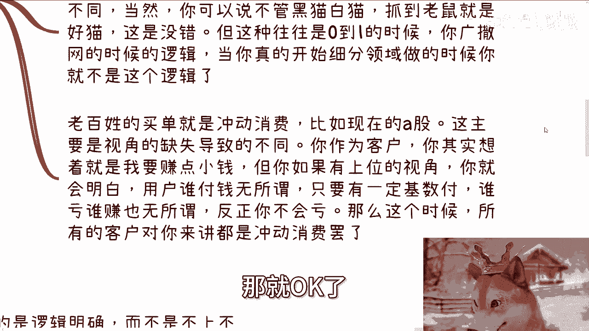

对于面向老百姓的营销，很多时候依赖 **冲动消费**。从高位视角（如平台或产品提供方）看，只要有一定基数的用户付费即可，无需关心单个用户为何买单。这是一个悖论：如果你过度关心每个客户的买单原因，可能反而无法做好规模化营销。

## ⚙️ 选择明确的营销手段

上一节我们探讨了用户细分，本节中我们来看看具体的行动策略。在商业实践中，我们建议逻辑明确，避免不上不下、优柔寡断。

做生意只有两种清晰的路径：

1.  **完全模仿**：不要自作聪明，完全参照他人成功的模式、包装和运营方法去执行。
2.  **完全原创**：坚持自我，摸索出一套属于自己的独特模式。

然而，许多人在实践中容易陷入两种误区：

以下是实践中常见的两种错误做法：

*   **误区一：被数据绑架**。自己起步时，过分关注后台数据和个别评论，并据此频繁调整方向，美其名曰“走一步看一步”，结果患得患失，无法坚持。
*   **误区二：模仿只学皮毛**。模仿他人模式时，只抄袭表面形式，却不理解内核逻辑，同时又不愿深入研究，反而自作聪明加入自己的“改良”，最终变成四不像。

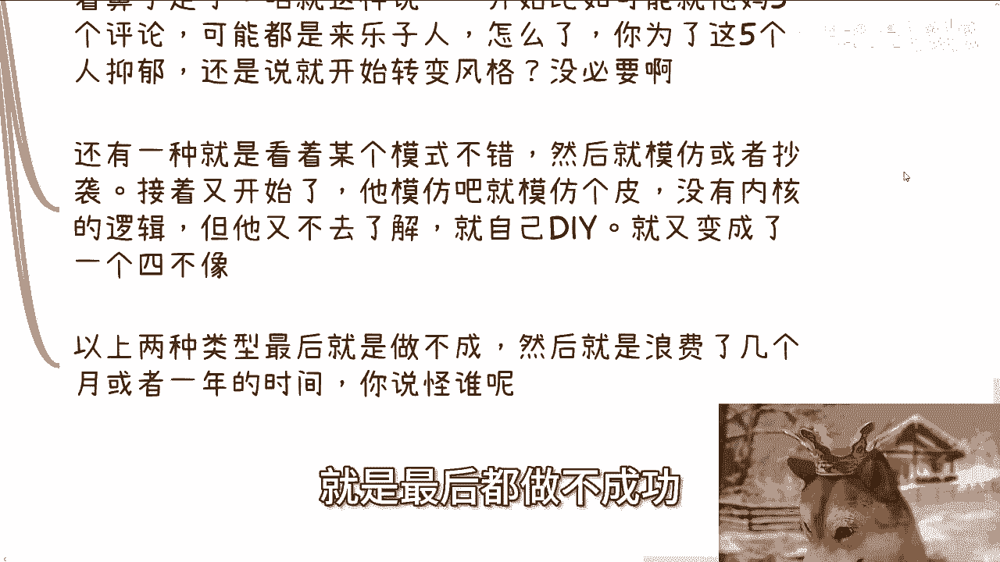

以上两种情况都会导致项目失败，浪费大量时间。在 **0到1** 的阶段，核心是 **只看盈利和变现**，快速试错，不要被非核心的数据和噪音干扰。

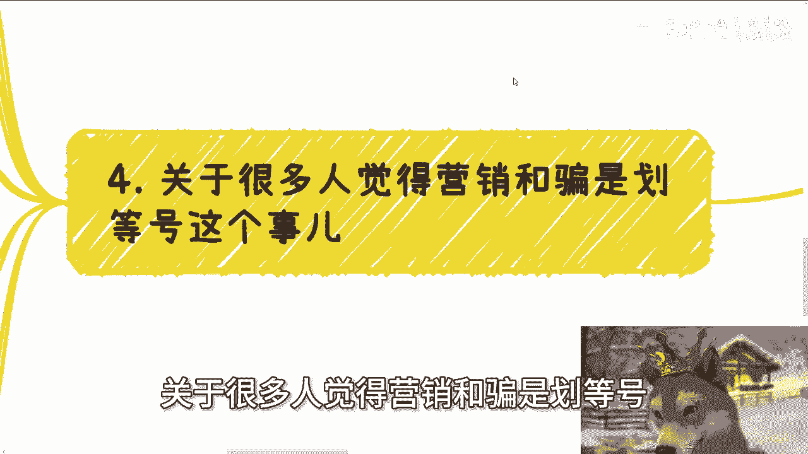

## 🤔 营销与“骗”的辩证关系

上一节我们讨论了行动策略，本节中我们来看一个常见的认知困惑。很多人将营销与“骗”划等号，我们需要辩证地看待这个问题。

视角决定一切。如何看待“骗”？

1.  **第一种情况：认知差异**。A卖一个东西，不信的人会觉得A是骗子。但谁能让所有人都信服？没有人能做到。总会有人持反对意见。
2.  **第二种情况：承诺无法兑现**。如果承诺了结果却无法落地（例如“交5万保就业”、“投资保证年化30%”），这才构成欺骗。

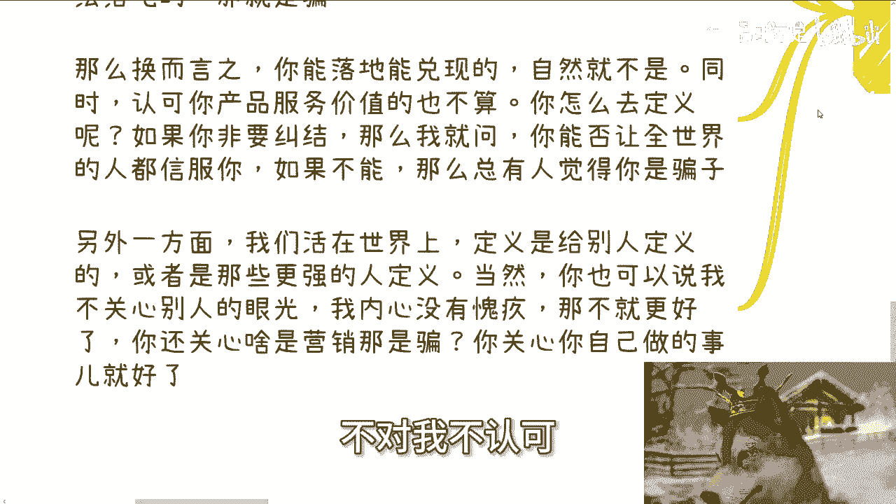

因此，关键点在于：

*   **能落地、能兑现的，不叫骗**。
*   **认可你服务价值的人，不认为这是骗**。

在社会中，定义往往是别人给的。如果你能做到不关心外界眼光，那么你只需专注做好自己的事。从商业和法律角度看，一个能成功兑现结果并获取回报的模式，就是有效的模式。

当下的经济环境中，很多人赚不到钱的原因之一，就是价值观束缚过重，认为所有营销和运营手段都很“low”，不屑于使用。但现实是，想要赚钱，往往需要在“站着”和“跪着”之间做出务实的选择。在有限的人生里过度纠结姿态，可能会错失机会。

## 📝 总结

本节课中我们一起学习了市场营销的入门框架。我们首先定义了五大核心用户画像，并指出清晰的用户画像是成功的起点。接着，我们探讨了不同用户群体的细分逻辑和买单方式，强调了在 **0到1** 和 **1到N** 阶段策略的差异。然后，我们分析了两种明确的商业路径及其常见误区，建议在起步阶段应聚焦变现，快速试错。最后，我们辩证地讨论了营销与欺骗的关系，指出兑现承诺和价值认可才是关键，并提醒在商业实践中需要一定的务实精神。

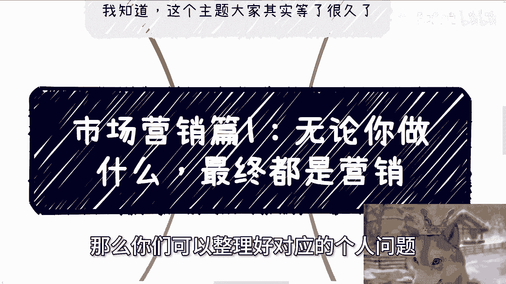

本课程是市场营销系列的开篇，后续我们将对这些模块进行更深入的拆解和分析。请注意，分享内容基于个人经验与认知，仅作参考。