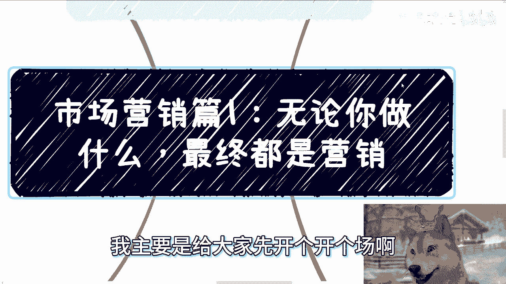
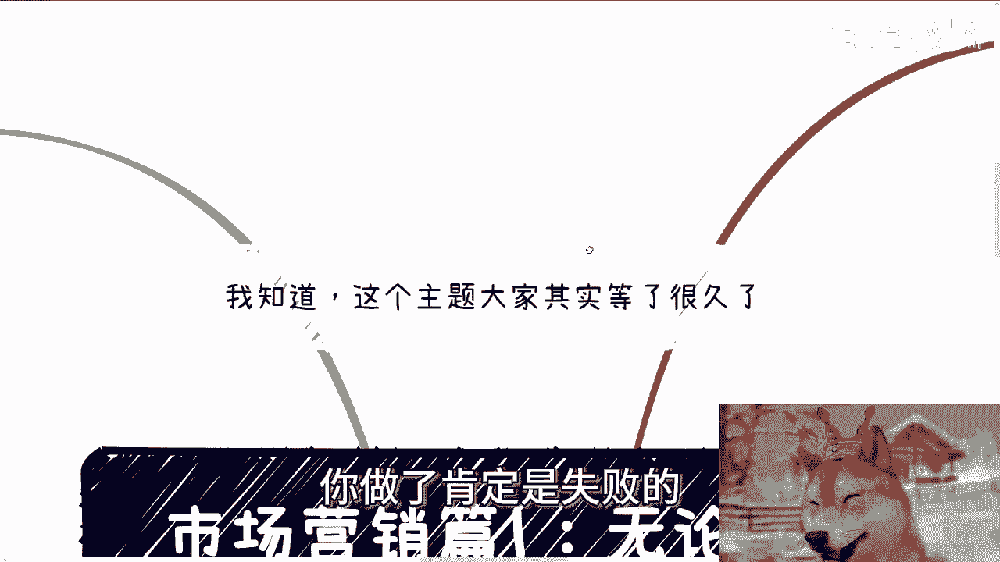
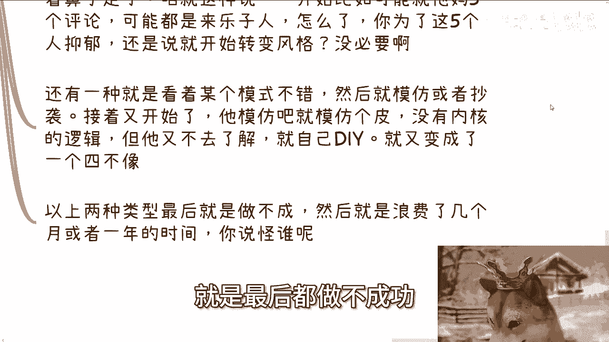
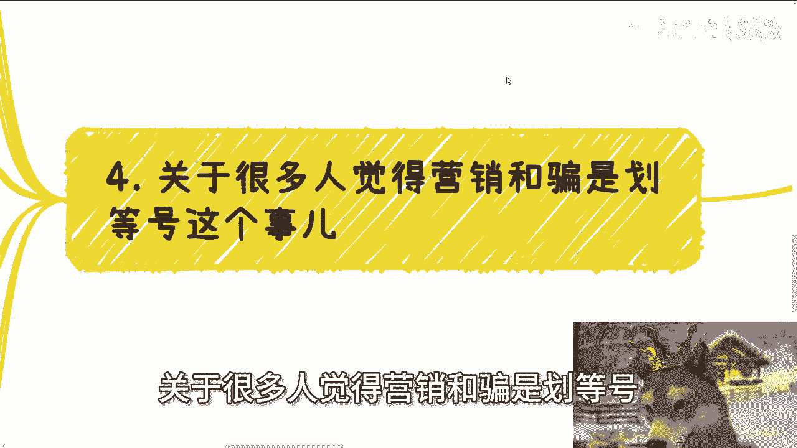
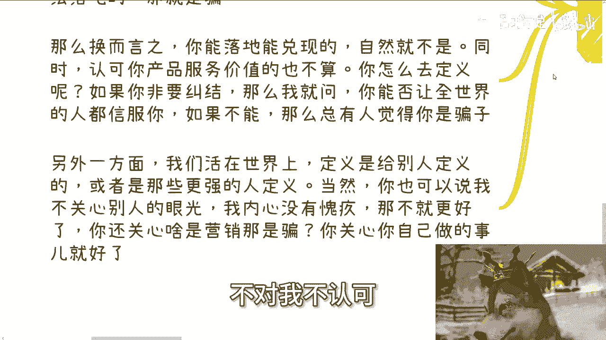

# 市场营销篇1：无论你做什么，最终核心都是营销 - P1 - 赏味不足 - BV1ce1BYPE95

好大家好啊，我们今天讲的主题呢是市场营销啊，我主要是给大家先开个开个场啊。

呃主题呢就是无论你做什么，最终都是营销啊，那我知道啊，这个主题其实很多人等了很久是吧，我之所以以前没讲呢，主要是因为哎呀怎么说呢，我咱实话实说，第一我也不是专门做营销的对吧，我也我不可能比那些啊微商啊。

或者以前做p to p的专业对吧，第二就是说嗯，这个东西怎么就我也不知道怎么讲法，就是他可能比较复杂，就是你用我的话来讲呢，就是他可能能明白的呢，他就听完或者说大家沟通一下，他也就明白了。

他但凡不明白的呢，你可能你你单纯就说不好听点。

你说我通过视频的这种方式跟他去讲，讲不明白啊，首先啊第一个啊营销从框架上上面来讲呢，我觉得有这么几个东西啊，呃你看啊你离不开的，或者说整个产业呃，就整个这个链链路上面有这么几个东西，一产品服务。

第二你展现给用户的产品和服务对吧，第三你的营销模式和运营模式，第四你的客户画像，第五你的最终的客户画像，对不对啊，那有点绕对吧，我跟你们讲无所无所谓啊，之后我们再慢慢来说，今天呢我们就开个场啊。

我们先来定义一下，地球上所有的产品的用户画像啊，我一般总结为就这五类，因为你找不出这五类以外的，其实这你你说不好听的，最终反正都是人，第一政府所有相关单位，下属单位，所有相关的一些组织。

包括协会等等等啊，产业园包括什么园区啊等等等，你反正你们自己举一反三啊，第二高效啊，第三企业组织，企业组织呢包括一些比如说民间非营利性组织，什么非遗啦对吧，什么什么乱七八糟各种东西。

反正你们只要相关的啊，就是同等级的，反正你们自己去举一反三，我就我我我也不可能全部给你们列出来啊，呃第四就是资本啊，资本里面包括就是说基金啊对吧，国投啊，城投啊对吧，土老板啊。

反正就他妈的能投资的都算啊，最后就是老百姓啊，那么简单来讲呢，无论你做什么，只要你想做，你肯定有那么一个或者若干个用户画像的啊，而且是符合以上我列出来的这些，你不可能找出别的东西来的啊。

当然啊你想不想赚钱，其实无所谓啊，这个东西不是我们关心的，关心的是你赚钱，这件事情，只不过是你做事情的一个结果，的衡量标准之一哦，那么也就像我们说的，你做的成功不成功，如果你不赚钱，你必然是不成功的。

你赚钱你不一定成功对吧，其实就这么个逻辑啊，那么很多小伙伴呢其实一开始就没有定义清楚，用户画像，就大部分人跟我讲的时候啊，你问他，你说你们的用户客那个客户画像什么样子的。

他不知道的啊，然后你问他这个客户客户画像为什么要付钱呢，他也不知道的，那么你既然这种事情都不知道，你做都不用做，我可以告诉你，你做了肯定是失败的。

对不对，嗯第二啊，用户买单的方式是不一样的。

营销自然也是不一样的，什么意思呢，你看啊，虽然我们说大框架是这五类用户，啊啊哈黑五类对吧，但你也要明白这五类用户下面你需要去细分的，你比如说啊你说老百姓大家都叫老百姓，那么99。9%就叫老百姓，对不对。

你比如说老百姓跟老百姓一样吗，唉一线老百姓跟五线老百姓能一样吗，咱不是歧视，咱是客观的说啊，你的很多人他妈二极管对吧，你妈到时候又要说了，帮陈老师歧视我，没有什么歧视，对不对啊。

第二你不同年龄段能一样吗，对不对，你，你你的客户是不是十几岁，跟他妈70几岁能一样吗，啊不同性别能一样吗，985211跟直销绩效能一样吗，对不对，你公立私立学校能一样吗，而你政府单位领导偏好都一样吗。

等等等，你虽然你说你是归类对吧，你打个比方，你说哎我问你，我说你这个呃客户画像怎么样，你跟我说哎我呃陈老师，我这个客户画像高校，那高校里面你还得细分啊，单纯高校没吊用啊，对吧啊。

所以呢不同客户里面不同细分客户，其买单的逻辑也都是不一样的，这句话没有错，但是这句话适用于的地方是什么，是0~1的时候，什么叫0~1，就是你还没有赚到钱，然后先赚到钱，就我一直跟你们讲的。

先走出第一步的这个过程，你可以广撒网，因为你不用去关心很多细节，但是一旦你赚到钱了，你说OK，我接下来要把这个这个这个一一，从1~11到31~50对吧，比如说你一个月赚1万。

你说我现在又从一个月赚10万，那么好，你接下来就得开始再往下就是开始去区分领域，细分领域，然后你就开始要做要做什么，要做细这个细节的一些一些内容，那说白了到那个时候你就不能说话。

我再他妈不管黑猫还是白猫不行的，你必须去看这个猫是什么颜色的，你必须去看这个猫是什么种类的对吧，然后你也必须看抓的是什么老鼠，因为你但凡要把你的1万扩展成5万，扩展成10万，你不去做这些区分。

你怎么扩展，对不对啊，那么老百姓买单呢就冲动消费啊，比如说现在的A股，这主要是视角的缺失导致的这个思维的不一样，比如说你作为客户啊，当然了，咱说的叫什么高智商对吧，叫做客户啊，低智商就是切低情商啊。

高情商就是客户，低情商就是韭菜对吧，你作为客户，你其实想的就是说我要赚点小钱对吧，所有的人都这么想的啊，但你如果如果是上位的角色，那那那这个地方又要说了低情商啊，低情商镰刀对吧，高情商上位的角色对吧。

你比如说有上位的这种视角，你就会明白用户谁付钱，对你来讲无所谓，因为只要对你而言，只要有一定基数，比如说14亿人里面只要有一定基数负，那就OK了。

谁亏谁赚，跟你没吊关系，反正你不会亏，对不对，好，那么这个时候啊，所有的客户对你来讲其实都是冲动消费，你会去关心下面哪个客户，他为什么买单吗，不会的，Maybe，也许这个客户他有自己的想法。

但是跟你吊关系啊，你想想看是不是就是他是个悖论，你们要明白啊，就所有的事情都是个悖论，就像我之前跟你们讲，领导也是一样的，领导不会关心细节，因为领导一旦关心细节，他就成为不了领导，这就是个悖论哦。

那么这个地方的说这个营销也是一样的，你但凡关心每个客户，他是为什么买单的，那不好意思，你根本就做不了这个营销，就说白了你根本赚不到钱啊，那么第三营销手段呃，商业上做事情啊，我们建议的是逻辑明确。

而不是不上不下，优柔寡断，不三不四啊，什么意思呢，意思就是说你做事情做生意，要么就是完全的一样画葫芦去包装去运营，说白了你就不要他妈自作聪明，搞些自己的什么乱七八糟的东西进去。

你就先完全参照别人的模式去走，对不对，好，这是第一种，第二种你要么就完完全全做你自己，然后去摸索出一条属于你的模式对吧，你就这两种，但很多人啊，你我这么跟你们讲，你听上去啊，比如说你现在在听。

我给你讲这个东西，你觉得哎陈老师说的有道理的，但是你真的去做的时候啊，我敢打赌你们大概率不是按照我这样去做的，为什么就很多人不是这样子的，很多人做事情是什么，就尤其是找流量，找客户上面。

他往往是两种做法，第一种是他自己做啊，他自己做，比如说陈老师啊，我要我要起个号对吧，我要开始自己做流量了啊，好没问题啊，这个到此为止，这件事情没有问题的好，接下来就有问题了，是什么，就是他自己做。

他会不停的去看后台数据和评论，然后会根据所谓的数据的变化跟评论的内容，开始修改自己的这个这个路线呃，美名其曰叫做走一步看一步，然后我跟你讲，他就开始患得患失啊，咱今天就说直白一点，你说要不要看数据。

我觉得看阶段你0~1的时候，你就简单粗暴，这数据跟你吊关系啊，对不对，就是你只要看你的你的内容，你的方向有没有变现，有没有流量，这就是你要关心的你，你你去看背后的数据，看这些评论，配吗。

那个时候你不配呀，你明白吗，哦就是说你要是没有流量没有变现，OK咱换方向换模式，你就直接换，这跟数据没有关系，你不要去干什么，哎呀今天什么50播放量，明天100播放量唉，跟你有什么关系，对不对。

你要快速的去试错，而是而而不是说不停的被播放量和评论，去去去去绑架，没有意义的，对不对，那那么咱就这么说，一开始你比如说可能他妈的就五个评论，而且这五个评论呢可能来的都是乐子人，怎么来。

为了这五个乐子人，然后抑郁，然后开始转转风格，然后跟跟他们他妈在网网上骂街，你觉得有必要吗，这他妈是你要做的吗，你说是不是啊，还有一种呢就是说呃就像我们刚刚说的，还有一种是什么，他说他看的摩根模式不错。

然后就是模仿对吧，或者抄袭啊，然后呢我跟你讲，他妈的，直到刚刚就是我说模仿跟抄袭为止呢，也没问题啊，你可以从道德上面谴责他，咱咱别别的，咱咱别的再说啊，就是到此为止还是没问题的，但接下来又开始搞了。

就是你模仿吧，就是呃他模仿吧，就模仿个皮，他是不模仿内核的内核逻辑，他不知道的，但是他他虽然不知道，但是他又不去了解，然后自己开在再他妈的自作聪明开始自己搞了，然后就变成了一个四不像的东西。

就相当于是皮是别人的，内核，是他自己的，那你怎么可能做得了呢，对不对，那么以上两种情况就是最后都做不成功。

然后浪费了几个月或者一年的时间，你说你怪谁呢，对不对，你想想看是不是啊，所以我才刚刚跟你们讲，就是说如果大部分人要去做，你们0~1的时候，就他妈的就是只看赚，只看盈利，只看变现，不要去看那些有的没的。

你们还没到那个阶段，明白吗，好第四，关于很多人觉得营销和骗是划等号这件事情啊。

咱们今天也说直白一点，我还是那句话，你看问题的视角决定了一切啊，好我跟你们这么说，什么叫骗A卖一个东西，不信的人，他就会觉得A在骗，对不对，但是A是不是在骗，咱不知道，哎咱咱先打问号啊，咱先打问号。

川普最近在竞选不支持的人，也可以称川普是骗子，有什么问题呢，没问题啊，你从他们角度有什么问题呢，对吧，但问题是谁又能让所有人信服呢，能吗，你能吗，我能吗，川普能吗，埃隆马斯可能吗，没有人对吧。

你总有人会觉得他是骗子，那么这是第一种，还有一种是什么，就是他承诺的东西无法兑现，比如说打个比方，比如说你今天碰到一个人，他跟你说，你交了5万，我能够保证你就业，而且我能保证你一年的就业啊。

或者说你投资，他说我能保证你年化30%对吧好，但是最后都没有兑现，没法落地，那这叫什么，这叫骗，对不对，那么换而言之，什么意思，意思就是说你只要能落地，能兑现的，那就不叫偏。

同时认可你服务价值的也不算骗，就像特朗普这现在去去去去竞选，支持他的人，他不会认为川普是骗子，对不对，你怎么定义这件事情呢，你如果你非要纠结，那么我就问你是否能让全世界的人都信服，你如果不能。

你去纠结它干嘛呢，对吧，而且另外一方面，我们活在世界上，定义是别人给的，你这个人怎么样，不是你说了算的啊，当然啊，你今天可以跟我说，人家陈老师这句话不对，我不认可他妈的。

别人想什么，关我吊事，对吧好哎，你但凡这样说，你但凡说我不care我，不关心别人的眼光，对不对，那不就更好了呀，那你去关心什么营销，什么骗呢，对你来讲，你只要关心你自己做的事情就好了呀。

你你管外界说你是营销，甚至说你是骗，说你是什么，对你来讲重要的，对不对，就是我还是那句话啊，从你你你这么来讲，从道德，从灵魂，从从从怎么说呢，从这个信仰对吧，或者说从价值观角度，你问我啊。

网络上某某某或者现实当中某某某，他是不是骗子，我会告诉你，他是，或者从我的角度，我觉得他是，但是你要是说不从刚刚那些基础上面，你跟你问我，你说爱陈老师，我们从一个商业的角度，从一个法律角度。

你问我他是不是我怎么我我怎么说，我只能说人家牛逼，对不对，那我能还能说什么呢，因为事实已经证明人家牛逼了对吧，就是这个样子的，就是我们一直说辩证辩证，你不能就单纯靠靠一个眼光去看一件事情，好吧哦。

所以我我为什么之前跟你们讲，就是说当下的这种经济环境，很多人不可能赚不到钱，但是他赚不到的原因是什么，原因就是他贪，他还非要去做他不了解的东西，然后另外一个就是他价值观太高，不停的束缚自己对吧。

该做营销的不做，该做运营的不做，他认为所有营销跟任务呃，跟跟跟运营都是low的，那你怎么赚钱，你怎么赚钱，就就就这么说啊，就像我之前跟我朋友聊的时候，或者你们看那个看那个叫什么呃，让子弹飞对吧。

也是一样的，就是哎我就问如果就就我们就这么说，这个社会上赚钱的人有没有人能站着有，但他妈他妈有几个，对不对，你既然要去赚钱，你难道还在乎站着跟跪着吗，啊如果你想要站着，那不好意思，大大大概率你赚不到钱。

就这么简单对吧，你非要在你就是有限的人生里面去纠结，我他妈到底站着还是跪着，你这不是在搞笑吗，对不对，好吧啊行，那么今天我们就开这个片啊，后面我会给你们详细再来一个个，反正就到时候拆分开来再来说啊。

反正当然我就我我认知有限啊，我也就是跟你们讲我所看到过的啊，或者我们以前做过的项目什么样子的对吧，那那剩下有还有很多一些他妈的很牛逼的对吧，或者说哼怎么说呢，就就道德非常低的那种对吧。

那我我也说不出口啊，啊反正就这么回事啊，那同样的那个职业规划就工作上面好吧，然后商业规划那个叫什么，就是赚钱啊，副业啊，上面你们但凡觉得有任何的问题，或者说整理出来相关的啊需要跟我聊一下的。

希望我能够呃给你们结结合你们个人情况，给你们一些建议和额，叫什么落地的这个规划的话，那么你们可以整理好对应的个人问题跟个人背。

景好吧。