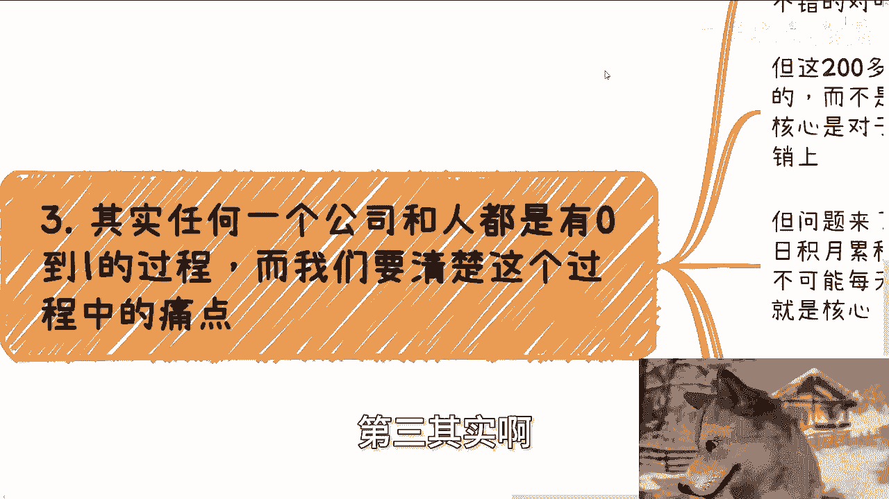

# 📚 市场营销篇2：工作中与商业中的市场营销本质不同 - P1

在本节课中，我们将探讨一个核心观点：工作中执行的市场营销任务，与真正商业环境下的市场营销，是两件完全不同的事情。理解这一区别，对于希望从执行者转变为商业思考者至关重要。

## 🔍 核心观点：角色与视角的差异

上一节我们介绍了市场营销的基本概念，本节中我们来看看执行者与所有者视角的根本不同。

许多人存在一种误解，认为在工作中积累的岗位经验能直接迁移到商业创业中。例如：
*   有人认为产品经理的工作经验对未来创业做产品很有帮助。
*   有人认为销售或商务工作本身就是商业。
*   有人认为金融或投资相关工作对资本运作更有帮助。

面对这些说法，只需提出一系列根本性问题即可揭示差异：
*   你是产品经理？你知道如何从0到1做一个产品吗？怎样的产品是用户要的？用户为何要为你的产品买单？
*   商业是销售？你知道如何从0到1拓展客户吗？如何定位初始客户？如何让客户在众多选择中认可你？
*   你是投资经理？你知道如何选择投资标的吗？如何进行资本运作？

这就像在家玩过家家扮演警察或护士，并认为自己因此积累了足够的经验去胜任真实的医疗或火警救护工作。这完全是两回事。

## 💡 差异根源：思想与看问题的角度

人与人的能力差别并不大，真正的鸿沟在于思想与看问题的角度。

逻辑上，我们都能理解许多事情。例如，看电影时我们能理解丢失孩子的父母的痛苦，甚至能感同身受。但我们本质上与他们一样吗？我们拥有他们那样的决心、毅力和勇气吗？没有。因为我们的角色不同，思想没有转变。

在工作中：
*   你做产品是为了满足老板的需求，而不是真正挖掘用户的需求。你只知道老板要什么。
*   你做销售是基于现有平台维护客户，却不知道如何在一个全新、混乱的市场中从零开拓。
*   大家都在思考如何赚钱，但区别在于，一些人（如创业者、投资者）懂得从资本或所有者的视角审视行动，而大部分人只从自身岗位的视角看问题，拒绝切换视角。

## 🎯 商业核心：理解0到1的过程与用户痛点

任何公司与个人都有从0到1的过程，我们必须清楚这一过程中的核心痛点。

假设你在公司负责一次产品营销活动：策划、海报、物料、嘉宾、礼仪一应俱全，最终现场来了200多人，效果看似不错。但这200人中，可能80%是冲着品牌本身来的，而非因为你这次具体的市场运营活动。核心是用户对品牌的认可与信任。

那么，这种认可与信任从何而来？答案是日积月累。但如何积累？用户绝不会因为品牌每天自夸而信任它。

以下是用户选择品牌的一些常见原因：
1.  身边人的推荐。
2.  长期、高频的广告曝光，形成心智占领。
3.  自身存在亟待解决的痛点（如痘痘、黑头、需要不刺激的化妆品）。

无论原因为何，用户购买的核心原因**绝对不是**因为他们真正、彻底地了解了产品。他们的“了解”本身就是营销和运营的结果。就像我们常在电梯广告里看到某个品牌，我们知道它很有特点，但这“特点”是广告告诉我们的，我们并未真正了解。这就是商业的现实。

## ⚠️ 执行者的误区：混淆岗位贡献与商业价值

基于以上分析，回到自身工作。在公司里，你可以天马行空地策划活动，即使被老板批评，活动最终仍会举办，你也能拿到月薪。你甚至可能产生一种错觉，觉得自己很厉害。

但事实上，你的个人表现对最终结果（品牌成功、公司盈利）影响甚微。你的KPI高低，差额有限。因为你并非公司的所有者（股东、创始人），你只是扮演一个角色。用户更是冲着品牌而来，而非冲着你或某次具体活动。

当你开始自己创业或做副业时，如果思想不转变，就会陷入困境。例如，自己做营销时，花一下午、一星期甚至一个月去打磨一张海报或一个产品细节。但关键问题是：**用户真的是被你的海报或产品细节吸引来的吗？** 通常不是。

少数人或许会，但如果只服务少数人，如何盈利？这就是长期应试教育和打工思维带来的局限：拥有技能（如运营、设计、销售），却不明白商业逻辑和用户真正掏钱的原因。你的“武功”再高，若不知道用户要什么，只知道“老板”（现在是想象中的用户）要什么，那将永远无法突破。

## 📝 总结与行动建议

本节课中我们一起学习了工作中市场营销与商业中市场营销的本质区别。关键在于**思想视角的转变**：从执行者（关心任务、老板需求、KPI）转变为所有者（关心用户真实痛点、品牌长期价值、商业闭环）。

工作积累的经验，若缺乏商业视角的淬炼，大多只是“过家家”式的经验，无法直接应用于真实的商业创造。在经济环境变化的当下，若计划未来创业或发展副业，必须有意识地培养商业思维，理解用户为何付费，而不仅仅是完成岗位任务。

若在职业规划、商业思考或副业探索方面有具体问题，建议系统梳理个人背景与困惑，进行针对性分析。