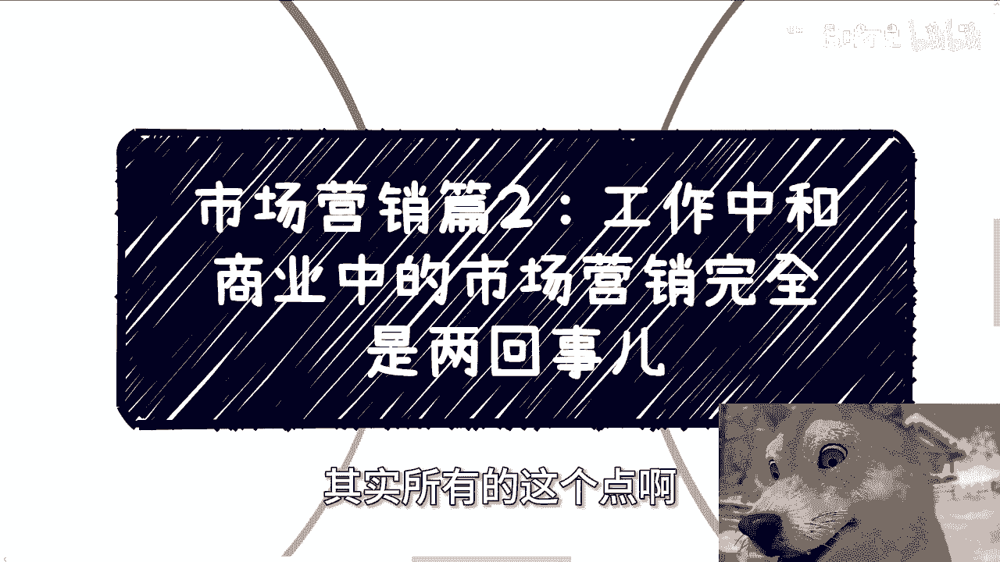
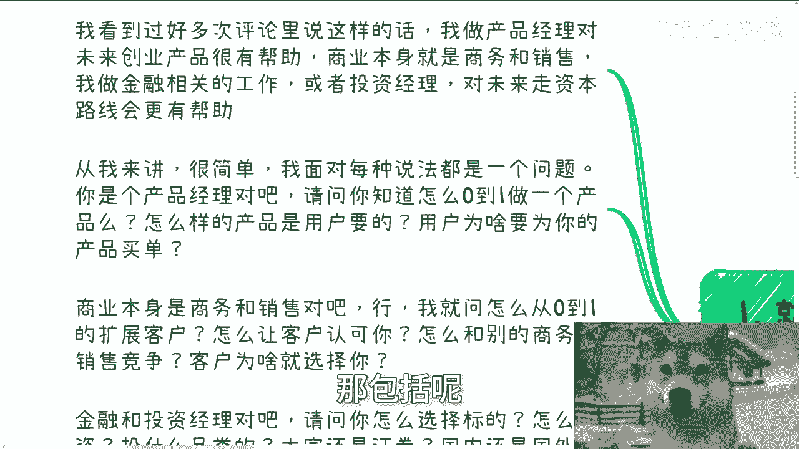
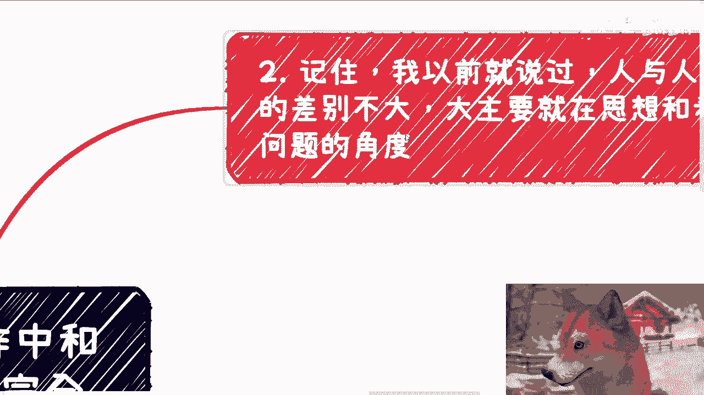
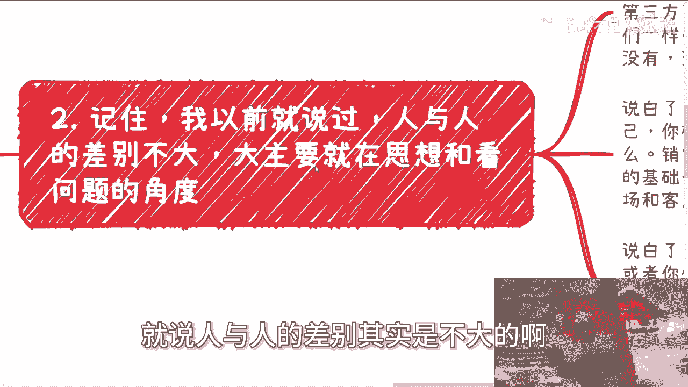
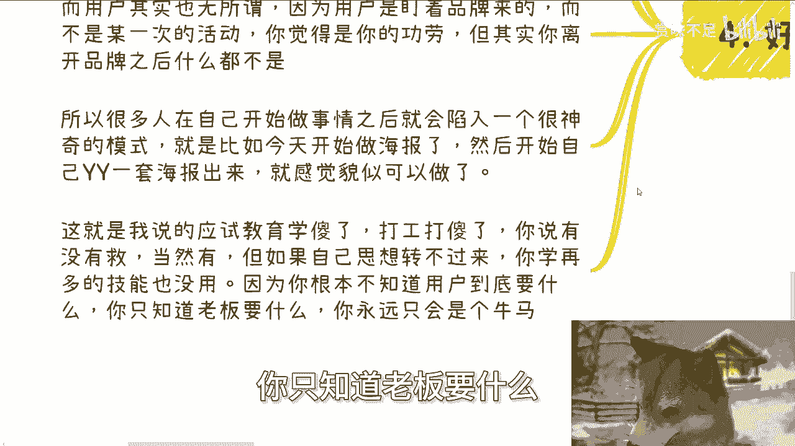
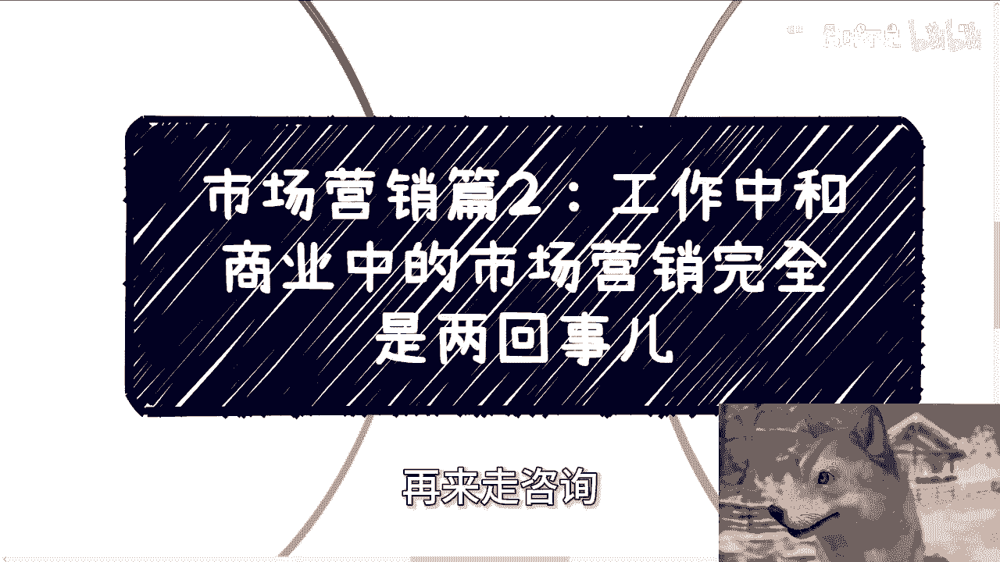

# 市场营销篇2：工作中和商业中的市场营销完全是两回事儿 - P1 - 赏味不足 - BV1EV12YSEWe

好大家好呃，我们今天来讲第二期啊，就这个市场营销呃，我们今天这个主题呢，叫做工作中和商业中的这个市场营销啊，完全是两回事，哎呀这个事情呢就不单单是市场营销上面，其实所有的这个点啊都是这样子的。

我们可以来看一下啊，额首先你看啊，就好像很多人到现在为止，一直评论区会出现这么一个东西啊，就是等一下我帮你们调一下啊，就是我看到过很多评论区啊，有这么一种话，他说我做产品经理对吧。

对未来创业做产品很有帮助，那么商业呃，然后说呢就是说商业本身啊，就是这个销售或者商务对吧啊，也有啊，说这种的，那包括呢就是说他说我做这个啊叫什么。

就是金融啊，我做金融相关的工作或者说投资经理啊，也会更有帮助等等等啊，那么我就这么说啊，从我来讲很简单，我面对每种说法，我就透支同一个问题，就是你是产品经理对吧好，我就问你。

你知道怎么从0~1做一个产品吗，怎么样的产品是用户要的，用户为什么要为你的产品买单，你知道吗，第二商业本身是商务和销售，对吧好，那我就问怎么从0~1去拓展客户，你怎么从0~1的时候去定位你的客户是谁。

怎么让客户认认可，你怎么和别的商务跟销售竞争，客户又问为什么选择你第三金融跟投资经理，对吧好，那请问你怎么选择标的，怎么投资，投什么样的品类，大宗还是证券，国内还是海外对吧。

你资本运作你知道怎么运作吗对吧，也就是说这是一回事吗，这就好像今天你在家里过过家家，然后在那边说啊，我在这边扮演警察，扮演扮演护士对吧，我要做这个医疗救护或者做火警救护，然后呢你就得出个结论哦。

我今天做了几年的过家家，然后呢我就能够很好的在未来直接去胜任，或者说去慢慢慢慢去做到这个医疗相关的救护。

或者火火警相关的救护，这他妈是一回事吗，能明白吗啊第二记住一点啊。

我以前就说过，就说人与人的差别其实不大的啊。

大的主要是在于思想跟看问题的角度，你比如说啊你说大家逻辑大差大差别大吗，其实大差不差的啊，这就好像我最近这次国庆我去看了个电影，说那个丢孩子的，你就这么想啊，你跟我可以作为第三方。

你比如说你说我们能不能理解这样的父母，能当然能，你能不能感同身受，也许你也能感同身受，但是你说本质上我们跟他们一样吗，我们有他们的决心跟毅力或者勇气吗，没有为什么，因为我们没有丢孩子，所以这就是差别。

你明白吗，这就是差别，你说你能你对于很多东西能不能理解，当然能啊，但是你做的时候真的能做到吗，你做不到，为什么，因为你的你的角色，你的思想没有转变过来对吧，那说白了你做产品是为了老板做。

不是为了你自己做，你根本就不知道他妈的用户要什么，你只知道老板他妈要什么，对不对啊，那么销售跟商务，你只知道维护客户，或者基于现在的基础去做拓拓展，但你根本就不知道怎么去开发新的市场。

或者说在一个百废待待兴对吧，就大家还是比较混乱的一个地方，你你不知道怎么去开拓一个新的市场出来，说白了大家都在销售，都在做金融，都在做产品，都在做开发，或者你们跟我一样，都在想怎么赚钱。

但是唯一的区别是什么，就是我们和其他一些人，可能我们是知道怎么从资本，或者从既得利益者的这个角度去看，我们做的事情，而你们大部分人更多的，他只会从自己的角度去看问题，他拒绝从别的视角去看问题。

对吧好，第三。

其实啊任何一个公司跟人都有0~1的过程，而我们要清楚这过程当中的痛点，什么意思呢，你比如说我们举个例子啊，比如说我们做一个产品的营销，对吧好，你今天负责一个某一个产品营销，你做了策划，做了海报。

做了物料，有设计，有嘉宾，有礼仪，有领导等等等等等，对吧好，然后呢，最后你看到现场来两两百多号人啊，蛮不错的啊，Very very very very nice，对吧啊，那么但这200多号人当中。

可能80%都是为了品牌本身来买单的，而不是为了这个市场或者运营来买单的，或者退1万步来讲，他不是因为你做了这个活动的市场或运营，而来买单的，也就是说核心是用户对于品牌的认可跟信任。

并不是基于某一次的活动好，那么问题来了，用户对于品牌的认可跟信任是怎么来的呢，那么我们得出个结论，就是日常的日积月呃，日积月累积累出来的，对不对好，那么这个日积月累的积累，又是怎么积累出来的呢。

啊或者说他是为什么能积累出来呢，对吧，总不可能这个品牌每天在那边洗脑，说哎我多么牛逼，我多么好对吧，没有用的，对不对好，那么至此，接下来才是核心中的核心，我们说的对方痛点，什么叫痛点。

就是我们举个最直接的例子，比如说男生啊脸上有很多痘痘，很多黑头，对吧啊，女生啊选择化妆品，可能有有一些刺激性或者化妆品不好的对吧好，你想想看啊，你们很多人选择一个品牌的因原因是什么。

因为你们身边的人推荐了，因为你们可能看到广告很多，你们每天看到一个广告，看就是一直看到某个品牌，然后突然之间啊，比如说今天我要去做黑头了，我要去去去洗头了对吧，或者我要去去呃，去去买一个电脑对吧。

那你可能一下子脑中蹦出来就是那个东西，对不对，好，那么呃呃也有可能，因为你们自己可能比较讨厌啊，自己本本身就有很多痘痘，有黑头啊，或者是已经使用了一些不好的化妆品等等等好。

那么以上这些其实都是营销跟运营的手段，但是你仔细想看，无论你们因为什么原因去购买，但是有一个原因绝对不是你们购买的核心，那就是说你们真正了解这个产品可能吗，不可能你们就算觉得真的了解这个产品。

你们的了解也是被营销跟运营出来的，对不对，比如说啊，你像我最近那个电梯里面看到什么，什么魔芋爽啊对吧，然后什么呃二手二手二手房的装修啊，什么东西，就是你问我他的品牌有没有特点，我知道啊，他广告打这么多。

我当然知道他特点，但是你问我真的知道他特点吗，就是这个特点是不是真的是不是你了解他，那我了解个屁啊，为什么，因为这就是老百姓啊，这就是整个商业的核心啊，就是我们不了解啊，对不对，好。

那么基于刚刚我们说的这个东西，回到我们自自己做事情上面啊，如果你在公司里面，你做个海报，做个策划，做个运营活动，你完全可以从你的角度开始天马行空，开始YY，开始在那边大手一挥。

说他妈的这就是我做的东西对吧，然后被老板骂的狗血喷头，但是无所谓啊，你最终活动还是会很成功的办举办，你最终还是能拿到你的月薪，甚至你会有一种错觉，就是你觉得的很牛逼啊，但事实上你无论多么牛逼。

无论你多么，也不会影响到你的月薪，也不会影响到你的KPI，为什么，因为无论你再怎么影响，你能影响多大呢，对不对，你你我说不好听点，你KPI高也高不高也好，也就差那么一些，你能影响多大。

这就好像你不是那个丢孩子的父母，你根本就无所吊为，你只是假装你很很有所吊为对吧，但但一个公司一个一个品牌，一个真正有所谓的是谁是股东，是创始人啊，不是你，而用户其实更无所吊，为，因为用户盯着品牌来。

而不是盯着你来，更不是盯着某一个活动来的，你觉得这是你的功劳，但其实你离开离离开某一些东西之后，的什么都不是啊，所以很多人在自己开始做事情的时候，就像我们刚刚第三点这边举的例子啊。

就是就是我们说很多人做事情的时候呢，他就不懂得怎么换位思考，当他自己做事情的时候，他就会陷入个很神奇的模式，就是比如说他今天要开始自己做营销了啊，做营销了好，然后他说我要做个品牌啊，我要做个海报。

然后开始自己玩玩一套海报出来，就感觉貌似可以了，但问题来了，你做这件事情的时候，你有没有想过用户到底要什么，用户到底是被什么东西吸引的，难道用户是就是你们知道吗，有很多人他真的就是你只要我只要不跟他讲。

你只要不跟他讲，他会在那边纠结，他的海报做一下午做做，甚至一个礼拜做一个月，然后在那边打磨它的产品有用吗，请问有用吗，用户是因为你的产品来了吗，不是没有明白吗，能明白吗，啊那当然有的人也会说，哎。

那那场是有些少数人，也会因为啊我的海报或者我的产品来的，是没有错，但问题是是要服务那些少数人吗，如果你就是要服务少数人，那你赚什么钱对吧，所以以上这就是我一直说的应试教育，学傻了，打工打傻了对吧。

你你你你你我就这么问，你说这些人他是运营能力不强吗，不是你说他是运营技能不强吗，也不是你说他是经验不够吧，也不是，这就好像今天怎么说呢，就是说啊那就很简单嘛，这就这就像什么。

这就这就像今天你帮别人去找孩子，你说寻找孩子过程当中有很多技能，很多细节很多，怎么说困难，你懂吗，你懂的，你可能有很强的经验，你可能有非常强的这种，怎么说呢，这个这个这个这个呃呃这个这个经验经验技能。

或者说人脉关系，但是这是你的孩子吗，不是那那也就是说如果你但凡思想不转过来，你身上就算有18般武艺，你也不会用，能明白吗，哦所以说本质上你思想不转过来，你不明白整个商业逻辑。

你不明白最终人家掏钱为什么掏钱，那么你身上再有无敌的武功，那又如何呢对吧，因为你根本就不知道用户要什么，你你我说不好听点，你只知道老板要什么。

那么你永远只会是个牛马，这就好像这就好像我为什么一直跟你们讲，就是你们现在年轻的时候啊，不要老是就说哎嗯比如说父母说什么对吧，老师说什么或者怎么样子，或者所谓的某些大佬对吧，包括我啊，包括我没有用的。

为什么，因为你们早晚有一天需要自己去面对一些事情，那你总不能跟我说哦，我到了自己面对某些事情好时候好哦，我开始呃无头苍蝇对吧，六神无主对吧，然后你变成一个无头苍蝇或者六神无主的时候。

你还又要在那边跟我说，爱陈老师，我我我是想赚钱的对吧，我我是想要有有怎么说呢，要要要特殊有有有特殊性的，要希望能自己做出点东西来的。

那你觉得可能吗啦，对吧，所以说所以说啊我一直跟你们讲的是，我们在这个这个怎么说呢，就是当下这个经济环境当中，大家要在当中做转折，就是做那种呃，这个比如说你说我一开始先工作几年对吧。

然后我去呃跨到什么创业啊，跨到我自己做点东西对吧，呃我积累积累，就是你要明白你工作几年去做一件东西没问题，这个逻辑你要怎么走都可以，但是你千万不要觉得你工作积累，能积累什么东西。

你除了能积累做牛马的经验，你什么经验都积累不出来，因为跟你没吊关系啊，对不对，这就像我一开始跟你们讲的，你们在那边过家家，过了3年你怎么了，过了3年你就会救人了，过3年你就知道怎么救护啦。

过3年你就知道怎么抢救了，这么两码事儿啊，啊行好吧，就这么着啊，然后呃这个职业规划工作上面商业规划啊，赚钱啊，副业啊，或者其他一些相关的，你们要是觉得有必要的话，你们可以整理好个人的对应问题。

跟个人背景好吧。

