# 市场营销篇3：市场营销能力是多元化的，并非单纯的包装与吹嘘 📚

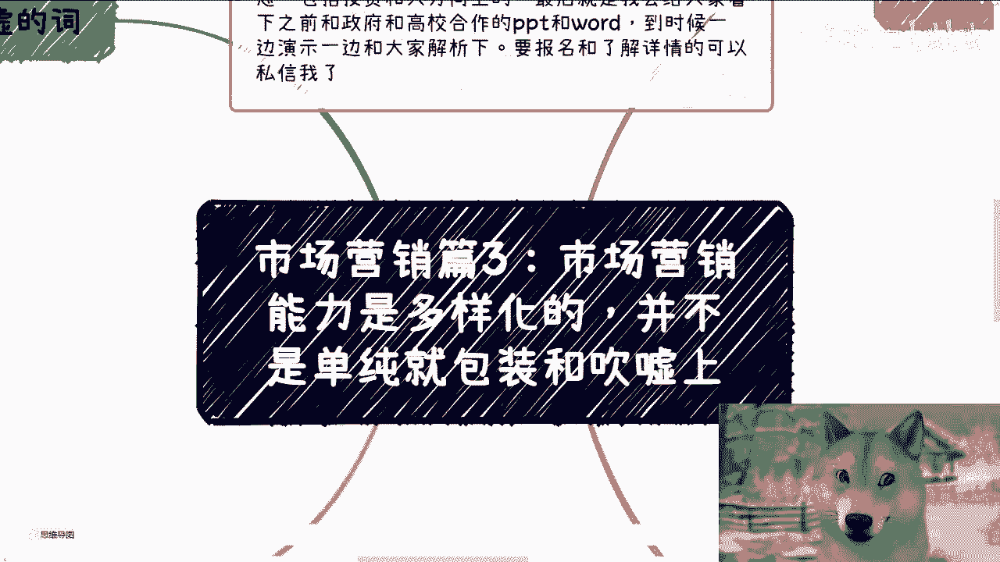

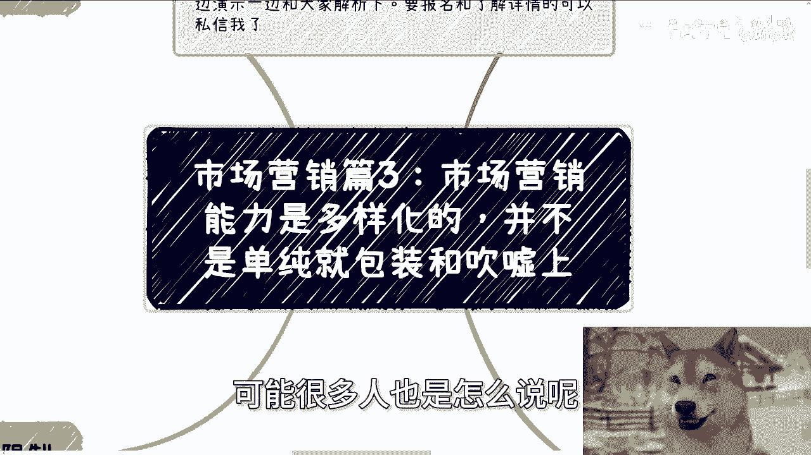

在本节课中，我们将要学习市场营销能力的真正内涵。很多人对市场营销的理解存在片面性，认为它仅仅是包装和吹嘘。本节课将深入一层，揭示市场营销与运营的核心区别，并阐述其多元化的能力构成，帮助初学者建立更全面、更本质的认识。

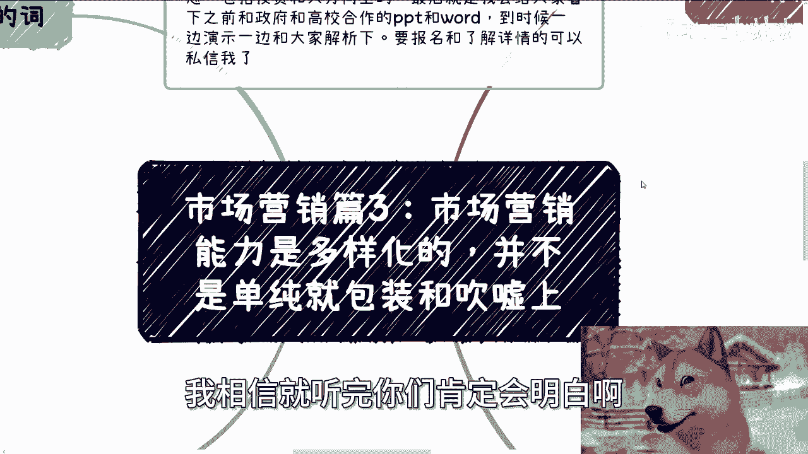

## 核心概念：营销与运营的本质区别

上一节我们介绍了对市场营销的常见误解，本节中我们来看看营销与运营的根本区别。

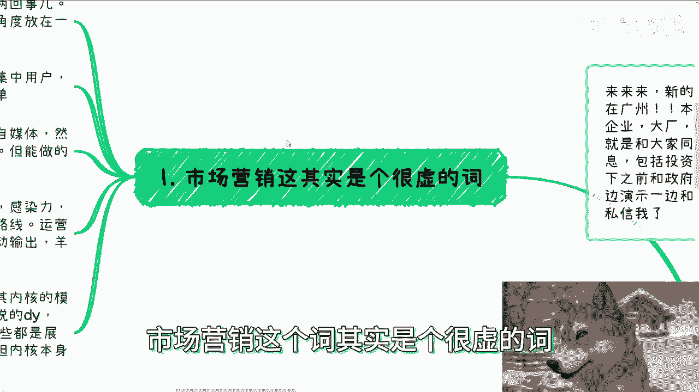

从宏观角度讲，市场营销和运营是两回事。
*   **营销（Marketing）** 的核心目标是 **吸引用户**。它关注如何将用户吸引过来，如何进行集中式的用户吸引与裂变。
*   **运营（Operation）** 的核心目标是 **留住用户并实现转化**。它关注如何留住用户，并促使他们为产品或服务买单。

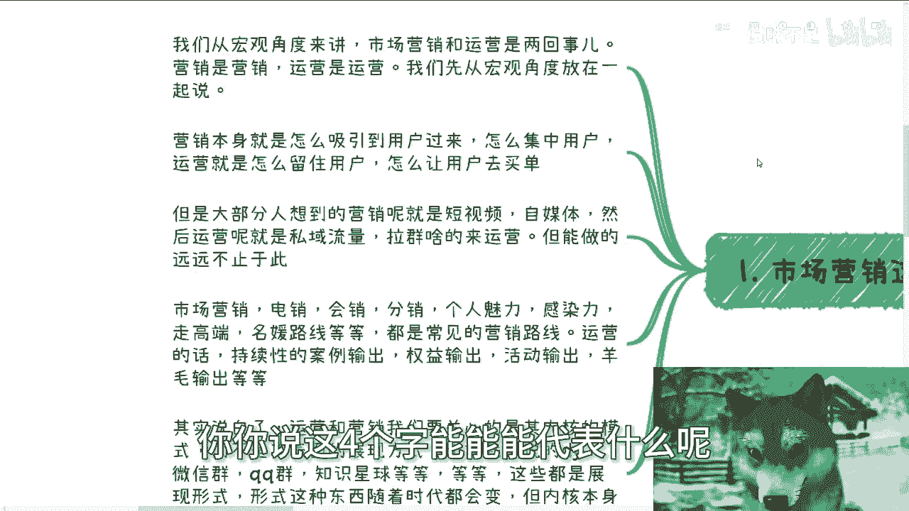

然而，大部分人对这两者的理解停留在表面形式。

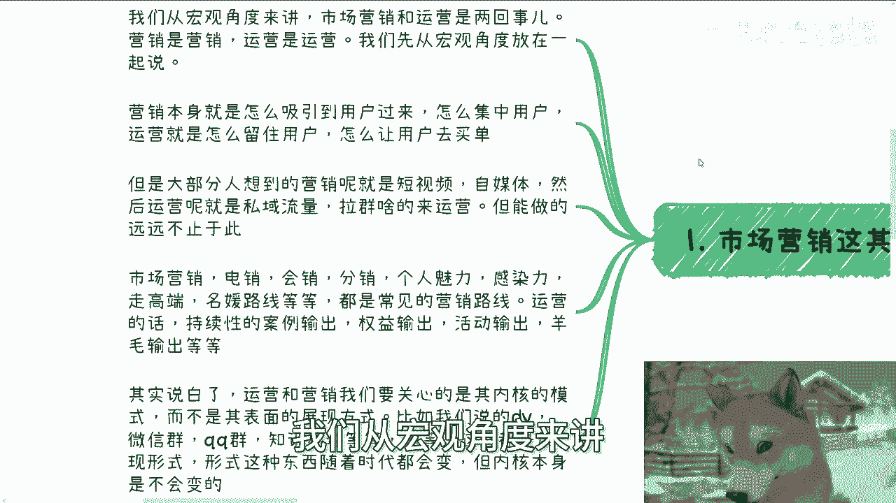

## 内核模式 vs. 展现形式

理解了基本概念后，我们需要区分内核模式与表面形式。

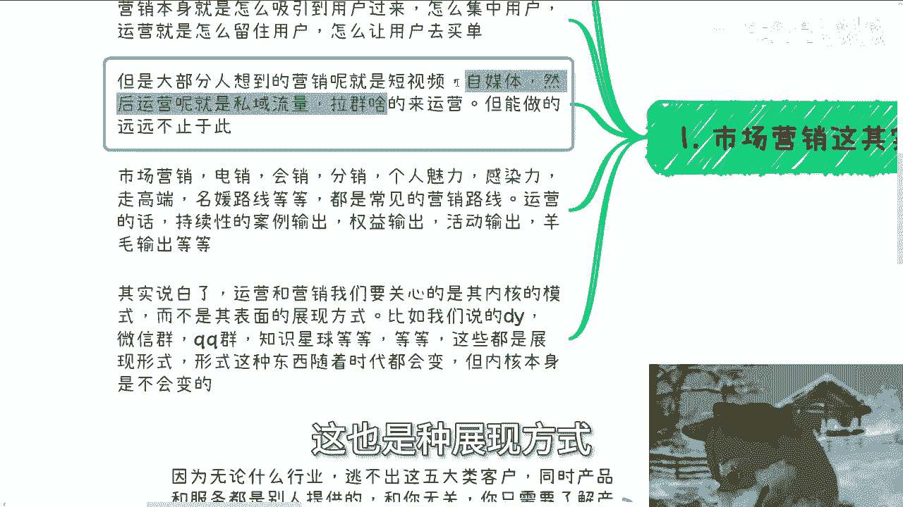

大部分人想到营销，只联想到短视频、自媒体；想到运营，只联想到私域流量、拉群。但这些都只是 **展现形式**。

展现形式是随着时代变化的。例如，抖音、微信群、知识星球等都是不同时期的展现载体。

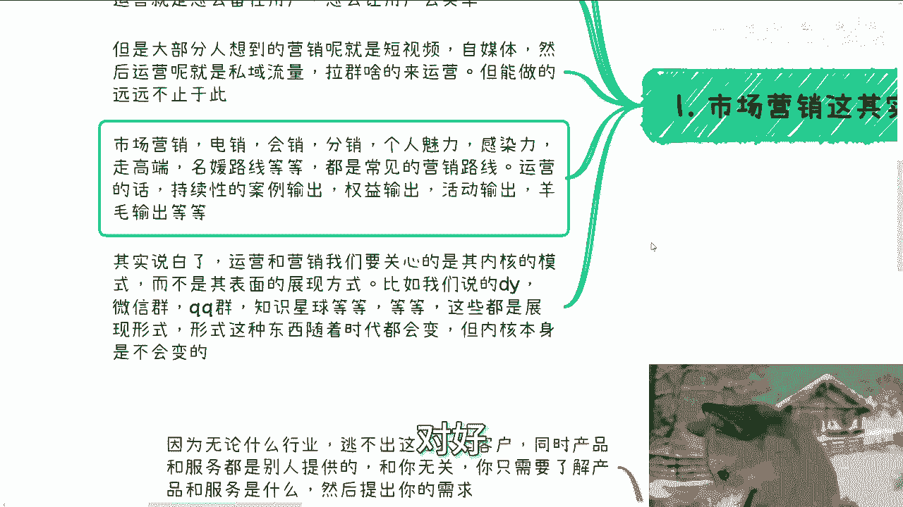

真正的核心在于 **内核模式**。内核模式是吸引和留住用户的根本方法，它相对稳定，不随载体变化而轻易改变。

以下是几种内核模式的例子：
*   电话销售（电销）
*   会议营销（会销）
*   分销代理
*   个人魅力与感染力
*   高端路线或名媛路线

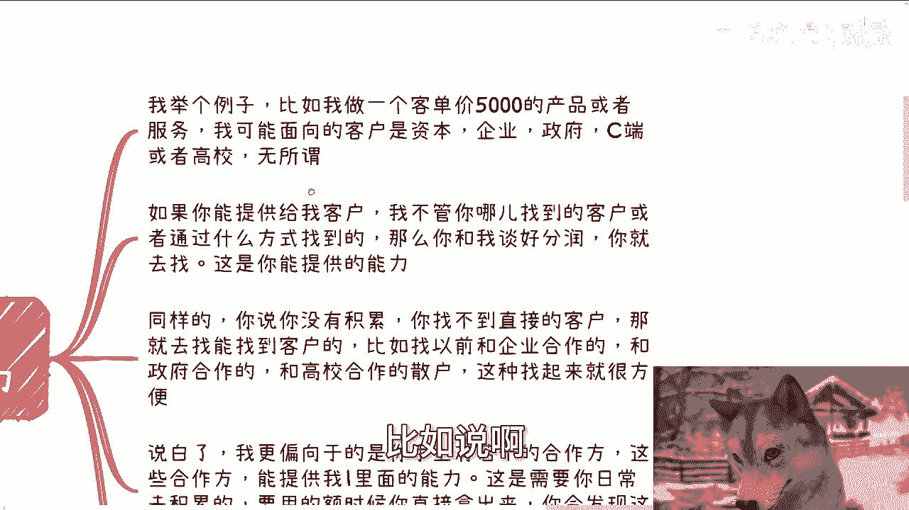

以董宇辉为例，他的成功在于其独特的知识分享与情感共鸣的内核逻辑，至于这个逻辑是通过短视频还是其他平台展现，并不重要。

运营的内核同样在于持续的价值输出，例如：
*   持续性案例输出
*   会员权益输出
*   营销活动输出
*   优惠福利输出

因此，我们应当关心的是营销与运营的 **内核模式**，而非其表面的 **展现形式**。

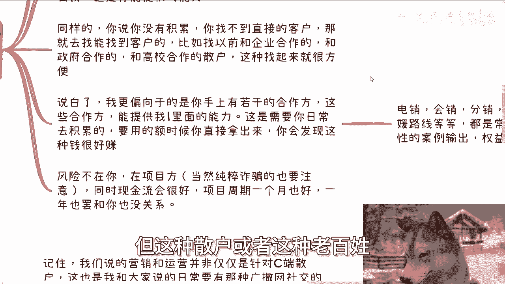

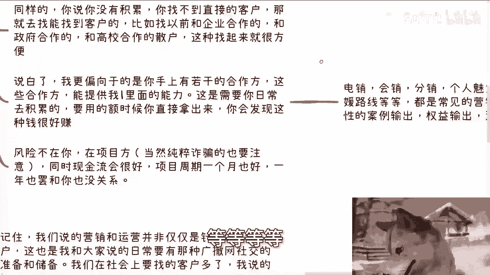

## 能力的本质：提供与整合

明确了内核的重要性后，我们来看看如何获取和运用这些能力。

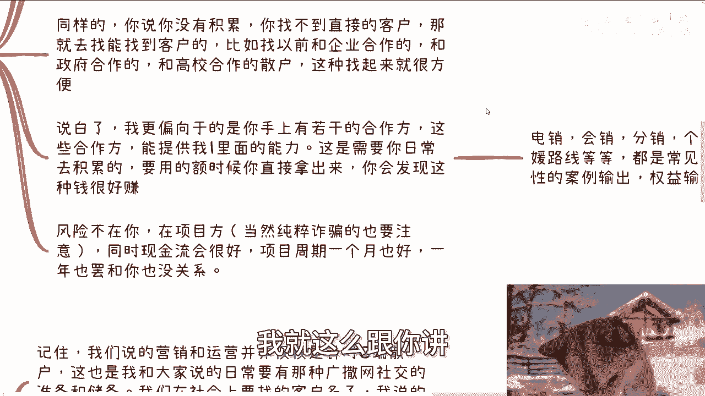

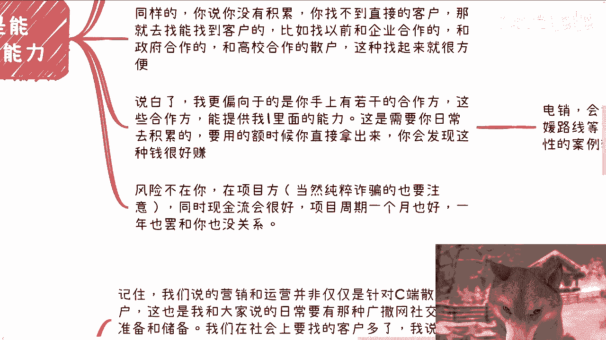

你能提供的是能力，你能整合他人来提供的也是能力。

**公式：你的价值 = 你能直接提供的能力 + 你能整合到的他人能力**

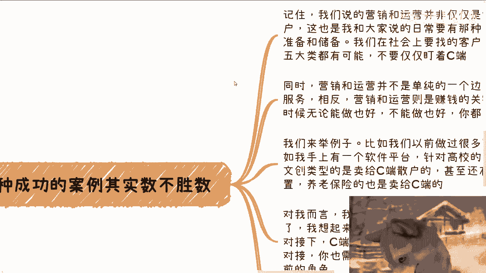

例如，你有一个客单价5000元的产品。如果你能直接找到客户（无论通过何种方式），这就是你提供的能力。对方只关心结果（客户和分润），不关心过程。

如果你没有直接积累，你可以去整合那些拥有特定内核能力（如电销、会销、高端客户资源）的个人或机构。从零学习这些内核能力耗时很长，不如直接整合已有的专家。

关键在于，这种资源整合需要 **日常积累**，而非项目临头才去寻找。当需要时，你可以直接调用这些积累的能力。

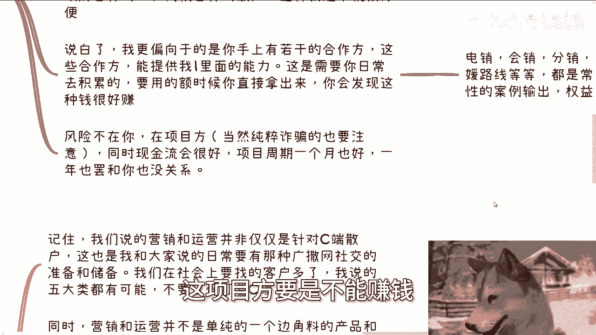

## 营销运营服务的优势与案例

那么，提供或整合营销运营能力具体有哪些好处呢？

这种服务模式有几个显著优势：
1.  **风险较低**：主要风险在于项目方（如项目失败、收款问题）。只要不涉及非法业务，执行方的风险相对较小。
2.  **现金流好**：收入主要来自销售分润，只要有成交，就有现金流。
3.  **项目周期灵活**：无论项目周期长短，分润模式使你与项目长期绑定收益，而不必深度参与项目管理。

成功案例数不胜数。例如，在数字文创火热时期，有广告公司自身不执行，而是转介给合作的运营公司，仅靠中间介绍，三个月就获得了300多万的转介费。即使最终项目方可能因高昂的IP授权费、开发成本而亏损，但作为营销运营服务的提供方或整合方，依然能获得分润。

## 超越C端：广泛的客户群体与实施要点

接下来，我们要打破一个固有认知。

营销与运营 **并非仅仅针对C端（个人）散户**。客户群体广泛，主要包括五大类：**个人（C端）、企业（B端）、资本方、高校、政府**。

同时，营销与运营并非边角料服务，而是 **非常赚钱的关键环节**。

在实施时，有以下几个要点：
1.  **不受行业限制**：任何行业的产品或服务，其客户都逃不出上述五大类。
2.  **聚焦需求，整合资源**：你无需创造产品，只需理解它，并向产品方提出清晰的营销支持需求（如需要政府背书、成功案例）。对方能满足，则合作；不能满足，则无需继续。
3.  **展示核心数据，而非表面数据**：向合作伙伴介绍时，应展示 **转化率、成功案例、历史合作成果** 等核心数据，而非空洞的“有多少粉丝”、“有多少账号”。对方关心的是最终能带来多少付费用户，而非表面的流量数字。

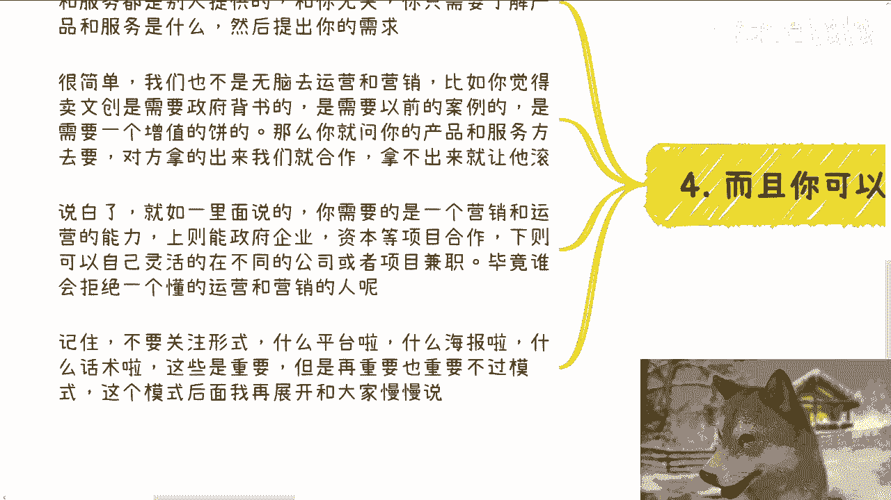

## 总结与最终提醒

本节课中，我们一起学习了市场营销能力的多元化本质。

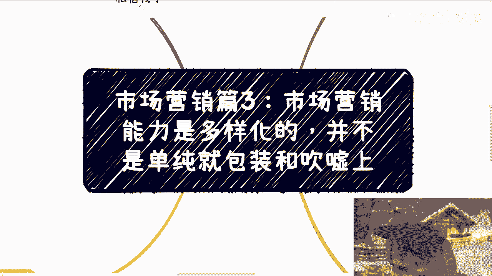

我们首先区分了营销（吸引用户）与运营（留住并转化用户）的核心目标。接着，我们强调了 **内核模式**（如电销、个人魅力）远比 **展现形式**（如抖音、微信群）更重要。我们探讨了通过直接提供或整合资源来获取这些能力的方式，并分析了这种模式的优势。最后，我们明确了营销运营适用于广泛的客户群体，并指出了实践中的关键要点。

**最后再次强调**：请将注意力从“用什么平台、做什么海报”等表面形式，转移到对“内核商业模式与转化逻辑”的思考和积累上。当大家都掌握相似的工具技能时，真正的竞争力在于对内核模式的深刻理解和资源整合能力。

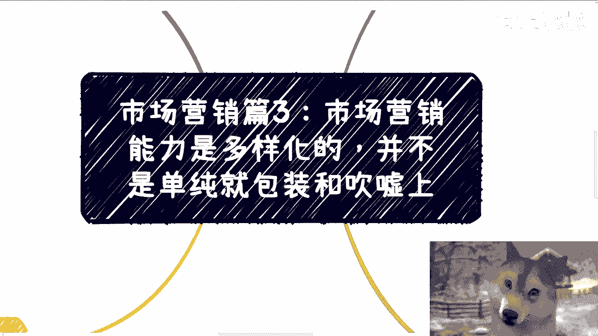

---
**课程预告**：10月19日于广州有线下活动，将分享面向不同性质企业的职业选择、当前市场最新信息，并解析过往与政府、高校合作的实际方案。如需报名或了解职业规划、商业合作等一对一咨询，可私信联系。请提前整理好个人背景与具体问题。