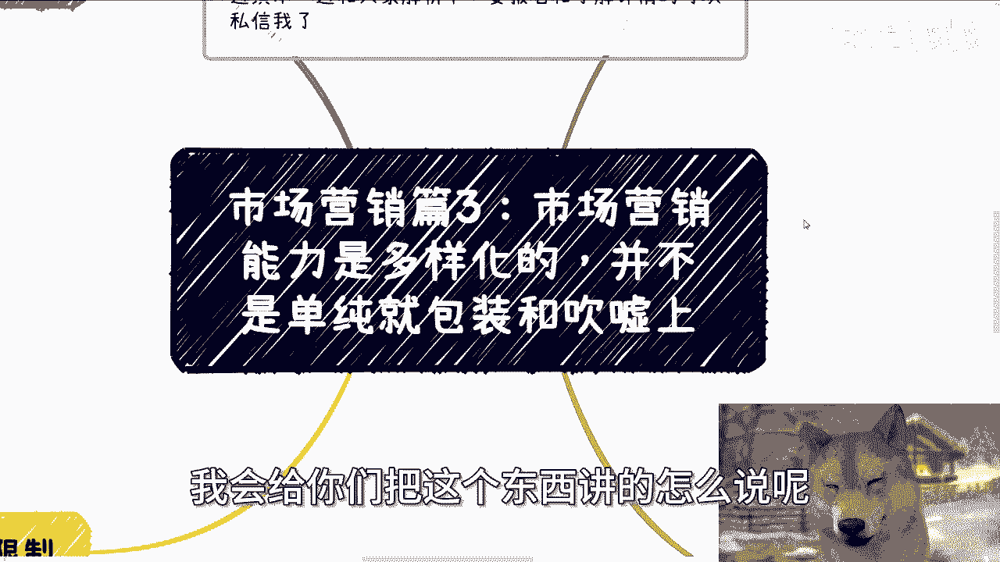
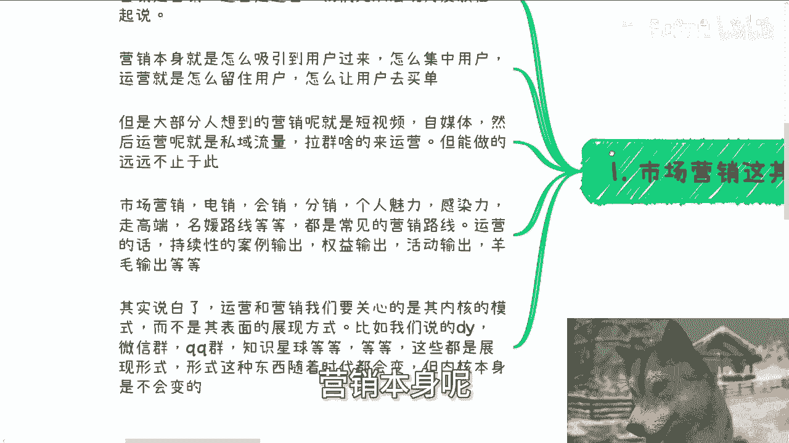
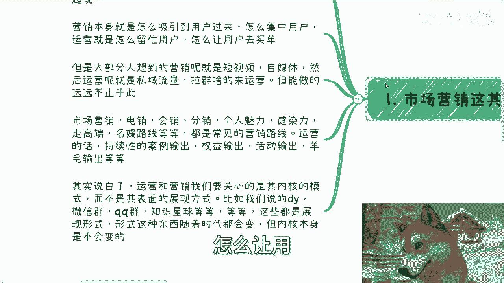
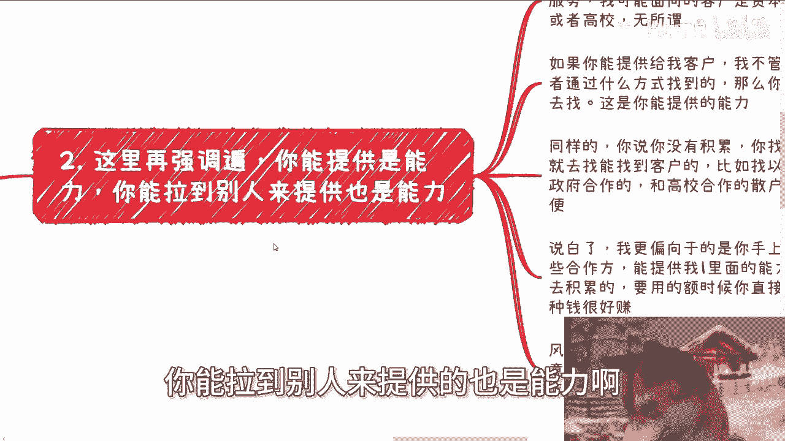
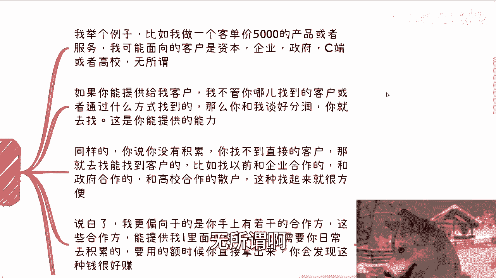
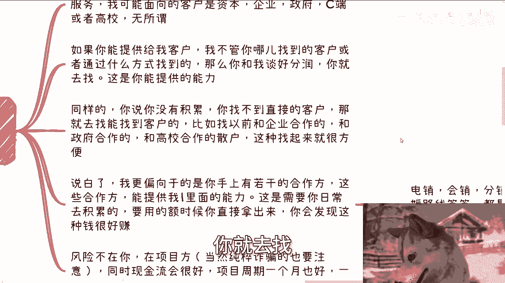
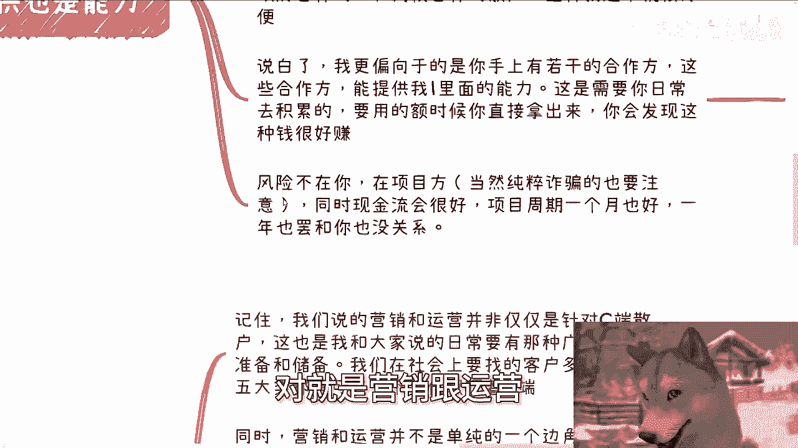
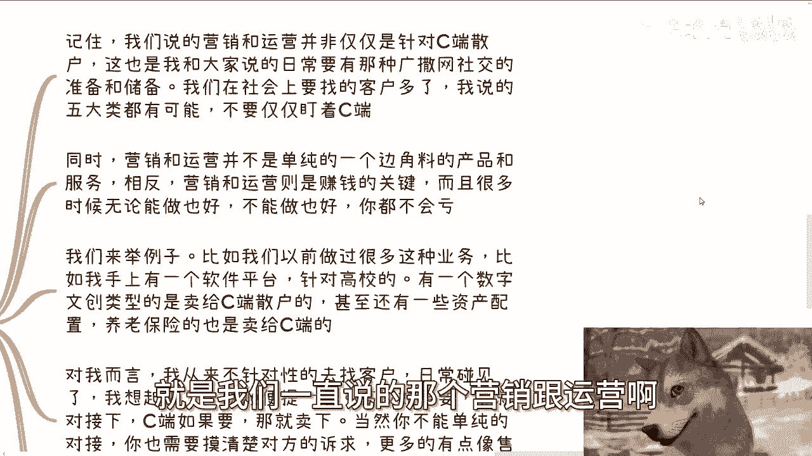
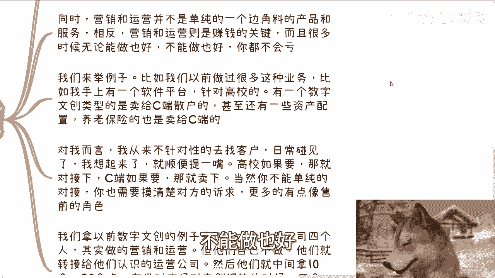
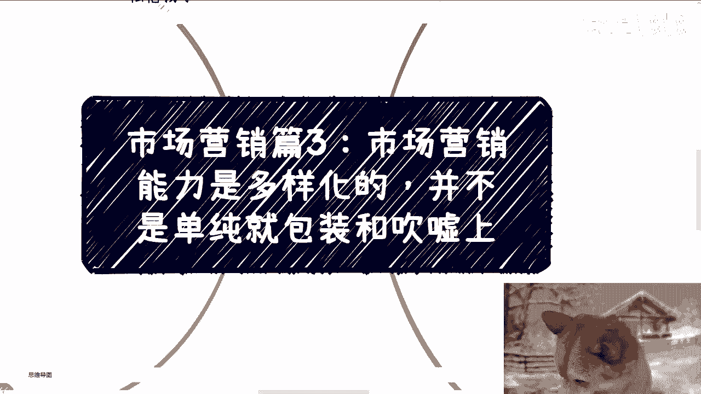

# 市场营销篇3：市场营销能力是多样化的，并不是单纯的包装和吹嘘 - P1 - 赏味不足 - BV1142WYvEiQ

好大家好啊，今天我们来讲市场营销篇三啊，就是市场营销的能力是多元化的啊，并不是单纯的包装跟吹嘘啊。

嗯这个事情呢可能很多人也是怎么说呢。

也不叫误解吧，就是理解可能有些片面性，然后今天呢我会给你们把这个东西讲的。

怎么说呢，就往下讲一层，那你们可能自己也就就我相信就听完。

你们肯定会明白啊，额首先新的活动我已经定了啊，本月就10月19号在广州啊，在广州广州我也很久没去了，额几方面啊，本次活动呢一方面我会跟大家说一下呃，面向不同的企业。

大厂创业公司国央企业offer的一些选择，那另外一个呢就是跟大家同步一下，最近沟通下来的一些最新的信息，你包括今天我还特地跑了趟杭州嘛对吧，就是去找了那个一级市场和二级市场的这个，投资人。

了解一下现在市场最新的一些情况，那最后就是我跟我会，我会给大家看一下，就是之前就21年二二年的时候，和政府和高校合作的PPT，还有word啊，到时候我一边演示，一边跟大家解析一下好吧。

然后要报名和了解详情的，可以私信我好，那么首先啊，第一个市场营销这个词其实是个很虚的词。

就是你说大家都在说市场营销，我也跟你们讲市场营销，但是市场营销到底是个什么东西，你们知道吗，就很多人不知道你，你说这四个字能能能能代表什么呢。

对不对，那我们从宏观角度来讲啊，就是市场营销和运营是两回事儿。

营销是营销，运营是运营啊，但是呢我们从宏观角度来讲。

我们先放在一起，我们先不拆啊，后面我们再来拆，营销本身呢就是吸引用户。

怎么把用户吸引过来，怎么集中式的用户额，这个吸引用户对吧，怎么裂变运营就是怎么留住用户，怎么用让用让用户去买单对吧。

就是宏观角度就这么个逻辑，但是大部分人想到营销呢，就是他只想到什么短视频啊，自媒体啊，然后呢呃运营呢就是什么私域流量啊，公益流量拉群对吧，怎么样怎么样啊，但是你仔细想想看啊，短视频自媒体啊。

私域流量拉群这种东西叫做什么，叫做形式化的内容，叫做表面的内容，叫做展现形式，什么意思呢，也就是说自媒体只是你展现给别人的一种方式，短视频也是这种方式，私域流量，公域流量拉群，这也是一种展现方式。

核心点不在这个地方，核心点在哪，核心点是在于，比如说诶你是通过电销的方式咳，裂变的方式，会销的方式，分销的方式，还是你个人魅力，还是你的感染力对吧，还是你走高端路线，名媛路线。

这些是所谓的所谓的内核方法，对不对，哎我们打比方，你说最近那个董宇辉对吧，你说他妈的翻车，翻的妈家都不认识了嘛对吧，但是我们就拿他打比方啊，董宇辉它有它的内核逻辑对吧，他他是怎么营销的，有它的内核逻辑。

但是你说他逻那个那个营销是用短视频呢，用自媒体呢还是用什么乱七八糟，别的平台呢对他来讲重要吗，不重要，对不对，那么运营的话也是一样的，持续它会拥有持续性的案例输出，有权益输出，活动输出，羊毛输出。

对吧好。

这些东西我们以后再说，那不在我们今天这个范围里面啊，那么说白了运营跟营销，我们要关心的是其内核模式，而不是其表面的展现形式，就像我们刚刚说的，你说抖音啊，微信群啊，QQ群啊，知识星球啊等等等等等等等。

这些都是展现形式，展现形式这种东西随着时代变化会变化的。

但是内核本身的逻辑是不会变的好，那么第二这里再强调一遍啊，你能提供的是能力，你能拉到别人来提供的也是能力啊。

我举个例子啊，比如说比如说啊。

我做了一个客单价5000块钱的产品和服务，我可能面向的客户是资本，可能是企业，可能是政府，可能是C端，可能是高校，无所谓啊。

如果你能提供给我客户，我不管你是哪儿找到的客户，或者通过什么方式找到的，我并不关心，也没人关心，那么你只要跟我谈好分润，你就去找。

这就是你提供我的给我的能力，我我我从来不会来关心你怎么提供的，别人也不会关心啊，那么同样呢你说你没有积累，你找不到直接的客户，那你就去找客，能找到直接客户的，比如说他以前跟企业合作过。

比如说他以前跟政府合作过，比如说他以前跟高校合作过，但这种散户或者这种老百姓。

你找起来就会相对来讲比较方便，对不对，那么说白了，我更偏向于的是你手上有若干个合作方，因为这种合作方能提供，我在一里面所说的这些能力，比如说电销啊，会销啊，分销啊，个人魅力啊，感染力啊，高端路线啊。

名媛啊，对吧等等等等等。

就是你要从零去学这些东西，你想想你得花多久，你还不如找一些TMD已经得心应手的，若干个人或机构来提供给你这个能力，对不对，但是这个事情啊，不是说今天你碰到了项目，你再去找你来不及的。

你都是需要日常去积累的，嗯等到要用的时候，你直接拿出来，所以说你这你你你你我就这么跟你讲。

你到时候会发现运营额叫什么，就是呃那个叫什么。

哎我看看我写的是什么啊，对就是营销跟运营这种服务。

他赚钱是很好赚，非常好赚哦，那么你会发现为什么一风险不在你在项目方，当然你你你你你你要是纯粹诈骗或者黄赌毒的，那你肯定也不能接嘛对吧，那么呃一般来讲正常业务，比如说未来不付款啦对吧。

比如说啊这个这个这个服务不好啦，或者怎么样子，那风险不在你啊，在项目方啊对吧，这一方面同时呢对你而言现金流会比较好，因为你你走要你主要走的是分润，他只要有人付钱，你就会有一笔入账啊。

那么项目周期你管他一个月也好，一年也好，跟你没关系，反正就是只要有人付钱了。

你就分润，你管他他妈几年跟你没什么关系，因为你又不是项目方。

对吧啊，那么第三呢这种成功案例其实数不胜数啊，呃然后有一点啊，我还要跟你们强调一点，就是我们一直说的那个营销跟运营啊。

并非仅仅针对C端散户啊，你们不要听到营销运营就感觉噢，就是针针对普罗大众的，不是的，就是我们在社会上要找的客户很多，我说的那五大类个人企业资本，高校政府都算客户，对你不能仅仅说啊，我们今天做啊。

陈老师说运营嗯叫什么，就是营运营跟那个营销啊，这C端不是的哦，同时呢营销跟运营并不是单纯的一个边角料的，产品跟服务相反，营销跟运营啊就是是是一个非常赚钱的关键，而且很多时候无论你能做也好，不能做也好。

你都不能亏，你都不会亏，你知道吗，就是你就拿我们刚刚说的那个你跟项目方合作，这项目方向能赚钱，你就分润，这项目方要是不能赚钱。

你其实也会分润，为什么，你想想看啊，我们来举个例子，比如说我们以前做过很多这种业务啊，比如说我手上有个软件平台，针对高校的，有一个数字文创类的，它是卖给C端散户的，甚至还有些资产配置养老保险。

也是卖给C端散户散户的，对不对好，那么对我而言，我从来不针对性的去找客户，什么什么意思啊，就是说我手上可能有若干个产品，但是我不会有意的去找他们，就是在我日常社交过程当中，我碰到了，我想起来了。

比如说我今天碰到个院长，碰到个校长，哎我顺便提一点，我说哎哎我我我这边有个软件平台啊，就之前已经给高校已经合作过了，你看你要不要对吧，或者怎么样子啊，那就对接一下，如果要，那就卖对吧。

那当然啊你不能单纯的对接，你也得先摸清楚对方的诉求，更多的就有点像这种售前的角色，你你不能无脑做啊，我他妈的，最近发现很多小伙伴做事情，真的就是唉他妈没脑子啊，我们再拿以前数字文创的角度来讲了。

一个广告公司四个人咳，其实做的都是营销跟运营的内容啊，但他们自己不做，他们都是转接给别人认识的运营公司做啊，然后他们就中间拿个十个点，20个点，在当时啊，就20222年吧，那个对文创文创很热的时候。

我就跟你们这么讲，三个月转介绍费300多万，但你说真正卖文创那些项目方赚钱吗，卧槽有可能不赚钱，你知道为什么吗，很简单啊，比如说啊他一单就是这个中介房，一单赚50万，对不对，如果是十个点的话。

那么整个流水是500万，对不对，好那么500万产品开发要钱吧，营销要钱吧，打广告要钱吧，IP授权要钱吧，请别人吃饭，政府打关系要钱吧，你想想看到最后说不定他还真会亏啊，卧槽你们去了解了解。

有呃那个中国也好，海外也好，只要有名的IP，他一个授权费就要70%，你想想看什么概念，对不对，但是你从你做营销跟运营的角度，我就那句话，关你事，关我事，对不对，项目方亏你都不会亏啊，好第四。

而且你可以不受行业限制，因为无论什么行业，逃不出我说的这五大类客户，同时产品跟服务也都是别人提供的，和你没吊关系，你只需要了解清楚产品跟服务是什么，然后提出你的需求啊，很简单。

我们也不是无脑去运营跟销售的，比如说啊你觉得卖文创，你今天这个项目，比如说啊你觉得这个项目呃，面向的客户是需要政府背书啊，是需要以前的案例的才能做的啊，是需要有一个未来的一个怎么说呢。

一个一个一个一个一个增值的一个丙才能做的，那你就去问你的产品跟服务方，要所谓的政府背书，要所谓的案例，要所谓的增值的丙跟你没关系，你就他妈的伸手要对吧，对方拿得出来，我们就合作，拿不出来让他滚啊。

那么说白了就如一里面说的，你需要的是一个运营销跟运营的能力上，能通政府企业资本等项目合作下，能通，可以给自己灵活的在不同的公司或者项目兼职，对吧，毕竟我还是那句话，会运营会营销的人代表流量。

谁会拒绝一个拉流量的人，对吧啊，那么在这个地方，我我就得我就得他妈又说了那句话，就是什么，就是你们千万不要跟别人介绍的时候说，哎你就比如说你们跟别人说啊，我能提供什么什么啊，我这边有多少人对吧。

我这边那那个那那个呃呃呃呃做了多少账号，然后对吧，合作方有多少粉丝，这种都没用，你明白吗，不要讲这些虚的，你要讲的是什么，你要讲的是我以前比如说有什么案例，我以前合作过大概有多少转化率，对不对。

这就好像我跟你们说，比如说我做个活动，我说我能拉1万个人，谁他妈关心我能拉1万个人啊，所对方只关心这1万人当中有多少人买单，对不对，你跟我说，你说哎我这边有个有个合作方案对吧，有多少粉丝。

我他妈关心你有多少粉丝啊，对不对，所以说你们跟别人介绍的时候，不要再去说这种空话，没有用的。

能明白吧，好那么最后呢就是这个地方又是那个强调一遍，就是记住啊，不要再去关心形势了，就是说到运营跟营销就在那边想啊，我到底什么平台，什么海报，什么话术这些你问我重要吗，重要的，但是再重要也重要。

不过内内内核逻辑内核模式，你知道吧，就是模式才是最重要的，怎么展现他们并不重要啊，那咱咱对于外部来讲哦，你觉得我们今天用用抖音，用快手用小红书，你说有，你怎么说呢，里面有逻辑吗。

里面有研值得研究的东西吗，当然有，但是能他妈升到哪里去呢，我相信你做个半你你你做个三个月，做个半年，也大差不差啦对吧。

但是如果来说大家都做个半年，一年都大差不差钱，有这么好赚吗，来。

对吧啊好，那么活动我最后说一下啊，19号啊，19号在广州好吧，就下午半天，然后呢就是说呃呃这个要了解的或者聊报名的，你们可以私信我，然后就是职业规划工作上面，然后就是商业规划呃，呃这个副业啊赚钱啊对吧。

或者跟别人合作啊，业务逻辑啊，包括你未来的规划啊对吧，包括你现在有什么哪些长板啊，短板啊，优势啊，劣势啊，你希望通过跟我的沟通，我根据你们的情况给你们一些更直接的啊，或者更接地气的建议的话。

你们可以呃整理好对应的个人问题跟个人背景。

