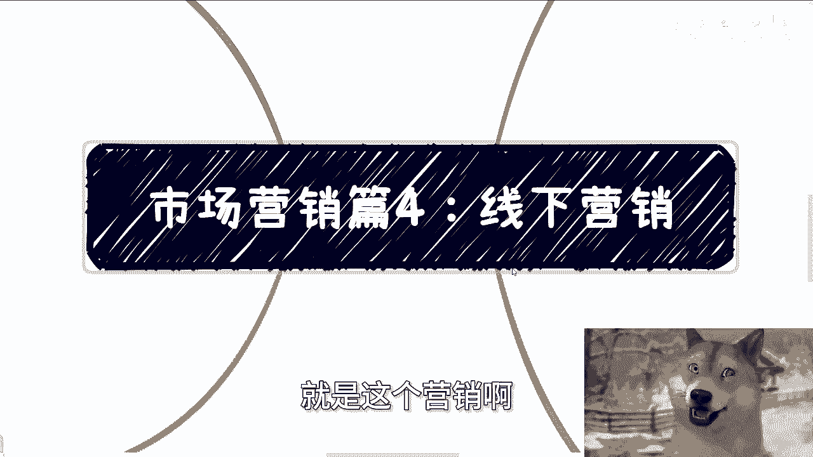
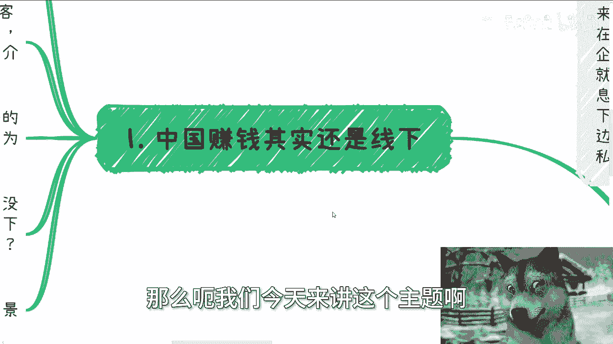
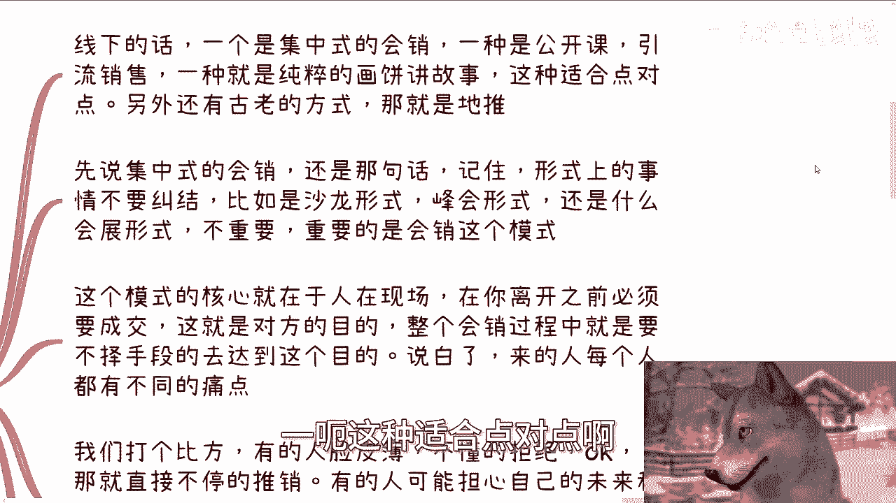
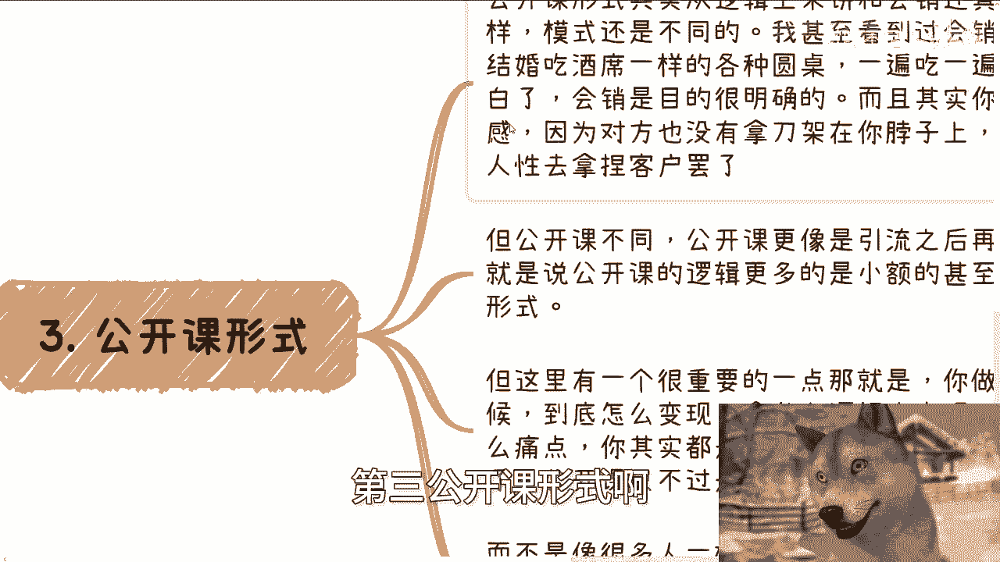
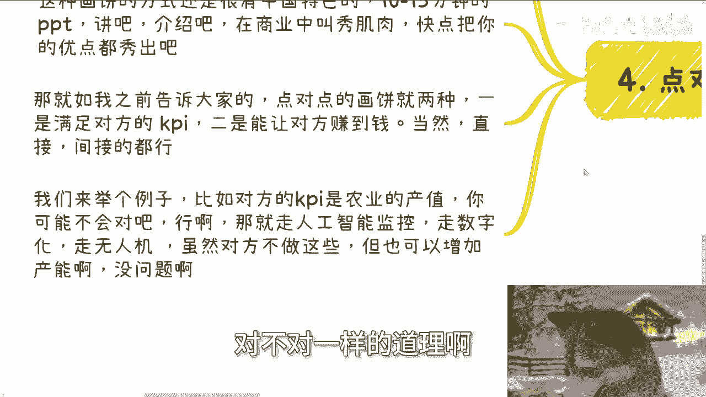
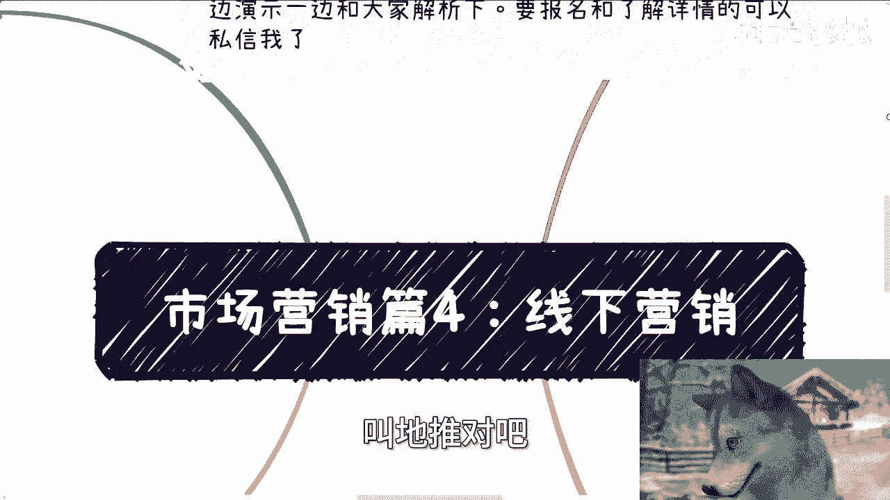
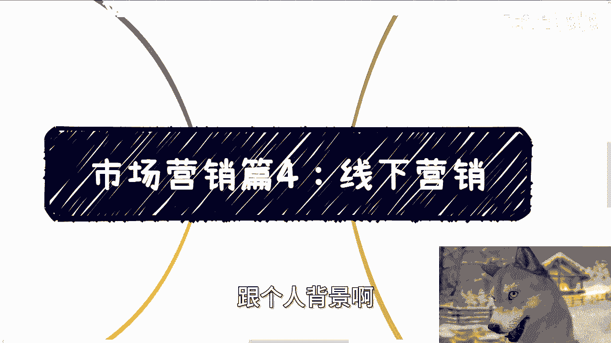

# 市场营销篇4：线下营销的盈利内核 - P1 - 赏味不足 - BV13P2KYbEgp

好我们来讲第二个视频啊，就是这个营销啊。

现今天就单独拎出来讲这个线下营销啊，那么呃同样的啊。

那个本次活动啊定了在下周六啊，19号在广州啊，在广州，那么本次活动呢一方面我会跟大家讲，这个面向不同企业，大厂创业公司，国央企业offer的一些选择，另外一方面呢就跟大家同步一下。

最近沟通下来的一些最新的一些信息，包括投资啊啊避避呃，避险啊，大方向上面的，最后就是说我会给大家看一下之前呃，2021年跟政府高校合作的一些PPT和word，反正到时候一边演示一边给你们解析一下啊。

反正到时候就是那个要报名和了解详情的，可以私信我啊，那么呃我们今天来讲这个主题啊。

第一啊中国赚钱的其实还是线下啊，当然啊这话是不是乍听上去啊，非常反直觉或者反现在互联网对不对啊。

但其实真的只要做过生意赚到过钱的，他都会明白中国现象，它是刻在赚钱基因里面的啊，首先啊就是你的对象，如果不是C端老百姓啊，但凡是一个客户或者来说呃大客户端啊，机构啊，政府政府啊，企业啊对吧，相关的啊。

无论你合作什么，线下一定都要见面的啊，我就这么说，今天主要是弊端对吧，就是政府端，高校端，企业端这种机构端的，你不见面绝对不可能合作的啊，绝对不可能合作的，绝对都绝绝对没有这种可能性的，哪怕你是二代。

也不可能啊，那么这是第一个，第二个，你说这个见面合作开始前见面，那叫礼貌，那叫有诚意，那叫建立信任的过程对吧，如果来说你之前没有见过面，那么好合作结束之后对吧，那你说这个界面可能比如说复盘啊。

为了信任啊，为了更好的合作对吧，当然啊就是就像我们刚刚说的，并不是说啊，就像我们刚刚说的，就是说合作所有的合作，他肯定是要线下见面对吧，对吧好，但是你要明白一点啊，合作的人是很多。

不可能在整个合作当中所有的人都见面对吧，见面的往往是核心的人啊，那么你我不能保证你在所有合呃合作里面，就一定是个核心人，所以说并不代表在所有合作里面，你都会跟合作方一定见过面。

但是你要你虽然你没有见过面，但是你要明白见面这个流程，在建立这个合作过程当中，它是必不可缺的，只不过是不是你的问题啊，当然你说现在这么多线上的变现逻辑，对不对，对没有错。

但你有没有想过这些平台怎么发展到今天的，这些平台怎么跟上下游合作的，包括这些平台到今天是怎么做这么大的，它是通过一次一次线下见面，一次一次应酬来的，他妈的怎么可能通过纯线上走的。

绝对不可能的啊，所以本身线下是个很重要的场景啊。

那么第二线下常见的这个营销有这么几种啊，第一线下的话，一个是集中式的会销啊，一个是公开课啊，引流销售，一个是纯粹的画饼讲故事，一呃这种适合点对点的啊。

然后呢就是古老那个古老的方式就递推啊，那么我们先说集中式的混淆啊，还是那句话，记住啊，形式上的主义你们不要去纠结啊，你就比如说很多人很搞笑的，他也还在那边纠结，说哎陈老师这个这个内容啊，这个形式啊。

就是说沙龙啊，峰会啊，怎么会展啊，展览啊对吧，还是说有个展厅啊，怎么样子，这些都是形式上的东西，你可以随便选择，这不重要，你懂吗，重要的是会销这个模式，这个模式的核心是在于人必须在现场。

在所有的客户离开之前必须要成交，这就是对方的目的，整个会销过程当中，就是要不择手段的达到这种目的，说白了来的每一个人都有不同的痛点，你得想办法集中每一个人的痛点对吧，好我们打个比方，有的人脸皮薄。

不懂得拒绝，对不对，OK那就直接就往的硬推，推到他付钱对吧，有的人可能担心自己的未来和发展好，那就不停的说对这个人的好处，对这个人未来发展的好处，有的人担心自己的孩子父母好。

那就从他的孩子父母身上找切入点对吧，线下来的人必须直击痛点好，那么有的人要说了，哎楚老师这个听上去卧槽，这他妈的好像啊，就是是不是让你们觉得有点怎么说呢，有点有点有点有点走歪路对吧，有点走怎么样子。

但是问题是什么，问题是你们有没有想过所有的商业，它只要铺大了。

不都是对人性的拿捏吗，有什么区别呢，没有区别，只不过说我把这些东西的表面给你们扒开，跟你们用直白的语言跟你们讲而已，而你们听到这些直白语言，内心可能会有抵触，但是他妈的现实就这个样子啊。

就好像以前有很多国学组织啊，线下活动离开之前，家长纷纷掏钱，为什么，因为组织的人直击了这些人痛点，那就是这些人希望孩子好好的，希望孩子德智体美劳发展，不要沉迷于网络，巴拉巴拉巴拉巴拉巴拉，对不对。

这就是在现场的人，要他妈的不停的宣传的，至于你说孩子能不能真的在这些国学机构里面，学到东西，是不是真的能够有好的正向的影响，我他妈还是那句话，家长懂个屁。

对不对啊，也就是说这些家长付了几万甚至十几万，看似为了孩子好，不是的，只不过是满足自己内心的那部分，怎么说呢，自我感动的那部分的情感，孩子好不好，他知道吗，他懂个屁啊，第三公开课形式啊。

咳咳咳，公开的形式其实从逻辑上来讲，跟会销还真的不太一样，模式是不同的，而且我甚至看到过，比如说会笑啊，还有一种啊就是跟结婚吃酒席一样的，就各比如说一个一个现场，比如说40个圆桌，一边吃一边销售啊。

甚至还有拍卖对吧，说白了会销的目的很明确，而且呢其实你也不用反感，为什么你也没什么好反感，你有什么你有什么立足点反感，因为对方也没拿着刀架你脖子上面，无非就像我刚刚说的。

他无非是通过对人性的拿捏去让大家付钱，你有什么能反感他的，对不对，好，但是公开课不一样，公开课更像是引流之后再去做变现，也就是说，公开课的逻辑更多的是，一开始要有小额甚至免费的活动。

但这里有一个很重要的一点，那就是你做公开课的时候，后续到底怎么变现，拿什么逻辑去变现，拿什么东西去打动对方，那打打动了对方是什么痛点，你在一开始就得完整地整理好，你在一开始。

整个公开课就应该是有一套完整的变现逻辑哦，公开课只不过是你线下营销的第一步，而不是像很多人一样，在那边傻乎乎的做什么小额啊或者免费的，其实很他就没有后招，他就没想好后面怎么走，那么这样的话我跟你讲。

你就算辛辛苦苦招来的流量也会流失掉，这就是很多人做公开课做不起来的原因啊，第四点对点的画笔啊，点对点画饼呢是这样子的啊，往往适用于大客户，比如说政府啊，企业啊，协会啊，各种组织啊，联盟啊。

反正就是感觉有主体的那一类啊，十到15分钟PPT，你讲吧啊，介绍吧啊，然后在商业当中我们叫什么叫秀肌肉对吧，就是把你所有的长板优点给我秀出来啊，那正如我之前告诉大家的，点对点的画饼就两种。

一种是满足对方的KPI，第二种就是让对方赚到钱啊，当然直接的间接的都行，你记住一点，你要能让对方满足KPI，那最好你要能让对方赚到钱，那也最好，同样的，如果你不能满足对方KPI。

你让对方感觉你能满足他KPI也行啊，你不能给对方端赚到钱，你让对方感觉你能给他赚到钱也行，能明白吗啊，我们来举个例子，比如说对方的KPI是农业的增值啊，产量的增值啊，那么你可能不会对吧，行啊，没问题啊。

那你非要去硬切它KPM，你切不动怎么办呢，你可以走人工智能监控啊，你可以走数字化啊，走无人机啊，走低空经济啊，虽然对方不做这些东西，但是这些东西同样能增加产产能啊，没问题啊，有什么问题呢，对不对好。

那后面我就懒得写，我直接跟你们讲啊，我们懒得写，就是你再打个比方要赚钱，对不对，好打个比方额，我们跟以前跟那个苏州城投啊聊的时候一样的，他们的KPI他们的这个赚那个那个需求是什么，就是增加GDP啊。

那么同样的就是说在增加GGDP这个东西上面，你会发现增加GDP这件事情，他是一个很虚的东西对吧，那么你说我们要让更多的人去消费，我们要增加整个金融的流通，那么这其实是个非常综合性系统性的东西，对不对。

那么好，那么我们就得给他去画饼啊，这个饼就是要告诉他，比如说啊这个文旅这个旅游景区对吧，我们帮你做做做智能化，然后那个交通做智能化，城市做智慧化对吧，然后比如说啊我们也有现成的解决方案对吧。

能够帮助你们更好的这个呃解决征信问题对吧，各种各样的东西啊，反正就是让他们觉得哎我的，我们不但能够降本，还能增效对吧，但是其实本质上就是要告诉他，就是我是能帮你赚到钱的，一方面我能帮你赚到钱。

我还能增加你，整个比如说苏州这边城市或者某些商业区，商业城区的这个GDP对吧，但是你说还是那句话啊，我们去落这件事情，最终真的能增加GDP吗，哦卧槽他妈是你，你你谁敢打保票，让哆啦A哆啦A梦穿越过来。

他妈打保票，对不对，一样的道理呀。

你能明白吗，哦所以说你会发现就是说线下营销。

他通俗点来讲一种就是一对多啊。

一种就是一对一，还有啊，就是我们刚刚在这里面还提到一个东西叫递推，对吧。

递推呢是一个非常古老的啊一种方式，当然现在其实还有很多地方用这种方式呃，它既不是一个一对一的，也不是一个一对多的，其实他算是一种叫做无脑多对多的方式，递推嘛对吧，顾名思义就是我准备好一个东西。

可能是一个单折页，可能是一个宣传海报啊，可能是一个啊IPAD就跟人家卖保险一样的，我就那个呀就是比如说找兼职啊，找大学生啊，找谁啊，反正就是铺量对吧，但是你不得不说一点递推是一个非常有效。

也是一个非常就是立竿见影的方式，就是相比递推来讲，说实话网络的推那个营销，或者我们刚刚呃说的那种线下的很多营销，而线上的很多营销，他就他妈有点虚啊，有点虚，所以说呢就是说嗯这么来讲。

就是大部分情况下面啊，你去做一个项目，如果你要赚钱的话啊，你要这么想，假设你的付钱的客户都是线上的，就是比如说你要赚C端老百姓的钱，你说好，我的付费用户都是线上的，就像李佳，李佳琦这种直播对吧好。

虽然啊你我们打个比方，比如说他一场直播额流水是一个亿，对吧好，你说这一个亿的贡献值，都是线上的用户贡献来的，对不对，对，没有错，但是你会发现整个商业链路里面，线上的这个贡献值重要吗，不重要。

重要的是他线下的营销如何能够把这单拿下来，如何能够拿到更低的成本，你明白吧，哦所以他的比重是不一样的，他虽然线下这个这个这个合作，他没有带来一分钱的收入，他甚至还有很多的应酬啊，或者很多的这个支出。

但是你要明白它的比重是很大，因为没有线下，哪来的线上后面的营销啊对吧，但是很多人不看了，他只看表面，他觉得卧槽牛逼牛逼什么东西啊，牛逼不是不是靠线上吹出来吹出来的啊，好吧行，那就这么着吧啊。

然后下周六好吧，活动在广州啊，要参加的或者那个了解详情的，你们继续私信我，那剩下的话就职业规划，商业规划啊，职业上面就是那个啊工作啊，商业上面的话就是你们啊自己有些什么业务啊，副业啊，赚钱啊。

或者其他各相关的东西，你们觉得需要啊通这个自己拿不准的，拿捏不清楚的，或者觉得有什么风险的，你们可以整理好对应的个人问题跟个人背景啊。

然后我们再来做咨询。