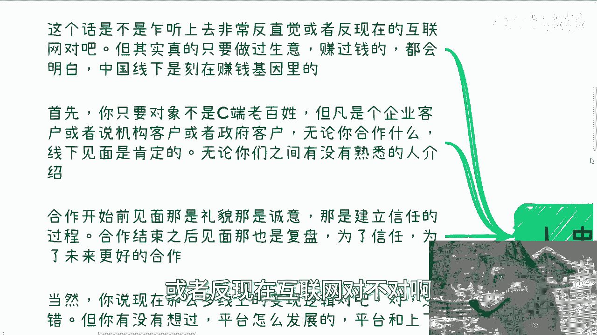

# 市场营销篇4-线下营销的盈利内核---P1---赏味不足---BV13P2KYbEgp

在本节课中，我们将要学习线下营销的核心盈利模式。我们将探讨为什么线下场景在中国商业中至关重要，并分析几种常见的线下营销策略及其运作逻辑。

---

## 概述：线下营销为何是盈利核心

上一节我们介绍了营销的基本概念，本节中我们来看看线下营销的独特价值。在中国，真正能赚到钱的生意很大程度上依然依赖于线下场景。这听起来可能有些反直觉，尤其是在互联网高度发达的今天。但任何真正做过生意并赚到钱的人都会明白，线下见面与合作是刻在中国商业基因里的关键环节。

---

## 一、线下见面的必要性 🤝

对于B端（企业端）、G端（政府端）等机构客户而言，线下见面是建立合作不可或缺的环节。

1.  **建立信任与诚意**：在合作开始前见面，是一种礼貌和诚意的体现，是建立初步信任的必要过程。
2.  **推动合作进程**：无论是合作前的洽谈，还是合作后的复盘与深化，面对面的交流都远比线上沟通更为有效。
3.  **核心人员参与**：并非合作链条上的每个人都需要见面，但核心决策者之间的线下会面通常是促成交易的关键。你可能不是那个见面的人，但必须理解“见面”这个流程在商业合作中的核心地位。

即使是今天庞大的线上平台，其发展壮大也离不开一次次线下见面、应酬所搭建的上下游合作关系。纯粹的线上模式无法支撑起复杂的商业生态。

---

## 二、常见的线下营销模式

以下是几种主流的线下营销方式，每种方式都有其特定的应用场景和目标。

### 1. 集中式会销 🎤

会销的核心模式是：人必须在现场，并且在所有客户离开之前必须促成交易。形式可以是沙龙、峰会、会展或酒席等，但形式不重要，核心是“现场成交”的目的。

会销的策略在于精准打击不同客户的痛点，以下是一些针对不同心理的销售策略：

*   **针对脸皮薄、不懂拒绝的人**：采用强势推销，直接推动其付款。
*   **针对关心未来发展的人**：不断强调产品或个人成长能带来的好处。
*   **针对担忧家庭（孩子/父母）的人**：从其家庭成员的角度寻找切入点和解决方案。

**核心逻辑**：所有成功的商业扩张，本质上都是对人性的精准把握。会销只是将这种把握集中在一个场景内，用直白的策略实现转化。例如，一些国学机构通过渲染家长对子女教育的焦虑，在现场促成高价课程销售，满足的往往是家长的“自我感动”而非孩子的实际需求。

### 2. 公开课引流 📚

公开课模式与会销不同，其逻辑更侧重于“引流-变现”的两步走。

公开课通常是低价甚至免费的活动，旨在吸引潜在客户。但关键在于，**在策划公开课之初，就必须设计好完整的后续变现路径**。你需要明确：
*   用什么产品/服务变现？
*   打动客户的痛点是什么？
*   转化的逻辑是什么？

如果只有引流而没有想好后招，辛苦吸引来的流量最终也会流失。公开课只是线下营销的第一步，而非终点。

### 3. 点对点画饼（针对大客户） 🎯

这种方式适用于政府、大型企业、协会等组织客户。通常通过一份简短的PPT（如10-15分钟）进行演示，在商业中常被称为“秀肌肉”，即展示自身全部优势。

点对点画饼的核心目标只有两个：
1.  **满足对方的KPI（关键绩效指标）**。
2.  **让对方赚到钱**（直接或间接均可）。

更进一步的策略是：即使你无法实际满足对方KPI或让其赚钱，也要**让对方感觉你能做到**。

**举例说明**：
*   **针对KPI**：如果客户的KPI是农业增产，而你不懂农业，可以转向提供人工智能监控、数字化、无人机（低空经济）等解决方案，这些同样能提升产能和效率。
*   **针对赚钱/增效**：例如与地方城投公司合作，其核心需求是提升当地GDP。你可以为其规划智慧文旅、智能交通、智慧城市等综合性方案，描绘一幅能够“降本增效”并拉动消费与经济增长的蓝图。关键在于让对方相信你能帮他达成目标，而非100%保证结果。

### 4. 地推 📄

地推是一种非常古老但至今仍有效的线下营销方式。它不属于严格的一对一或一对多，而是一种“无脑多对多”的铺量方式。

地推通常准备单页、海报或iPad等物料，雇佣兼职或销售人员在街头、商圈等人流密集处进行推广。尽管方式看似原始，但其效果往往立竿见影，相比一些线上营销更为实在和直接。

---

## 三、线上与线下的权重关系 ⚖️

我们以一个线上直播带货的案例来分析。假设一场直播流水高达一亿元，这笔收入完全由线上用户贡献。

然而，在整个商业链路中，线上用户的直接付费**并非最重要的环节**。更关键的是，团队如何通过**线下的营销和应酬**，拿到更低成本的货源、争取到平台支持、打通供应链关系。这些线下活动可能不直接产生收入，甚至需要大量支出，但其战略比重极大。**没有线下关系的夯实，就没有线上成功的营销**。许多人只看到表面的线上风光，却忽略了背后支撑这一切的线下根基。

---

## 总结

本节课中我们一起学习了线下营销的盈利内核。

1.  **线下见面**是建立深度信任、推动B/G端合作的必要基础。
2.  **集中式会销**的核心是“现场成交”，通过对人性痛点的集中攻击实现销售目标。
3.  **公开课引流**的关键在于提前设计好完整的“引流-变现”闭环。
4.  **点对点画饼**针对大客户，核心是满足其KPI或让其感知到盈利可能。
5.  **地推**作为一种古老的铺量方式，依然具有直接有效的特点。
6.  在商业中，**线下关系搭建**的战略权重大于线上直接变现，它是线上业务能够蓬勃发展的底层支撑。

理解并善用这些线下营销模式，是构建扎实盈利能力的核心。