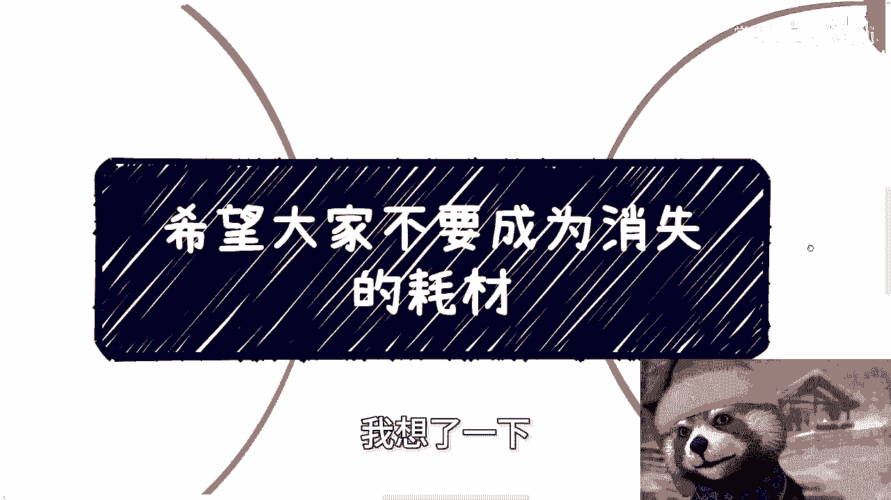
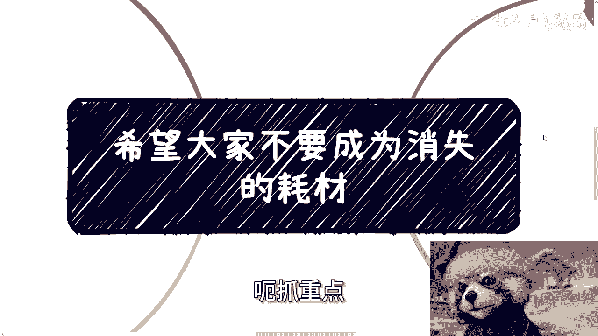
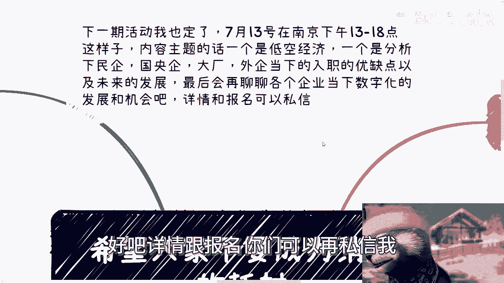
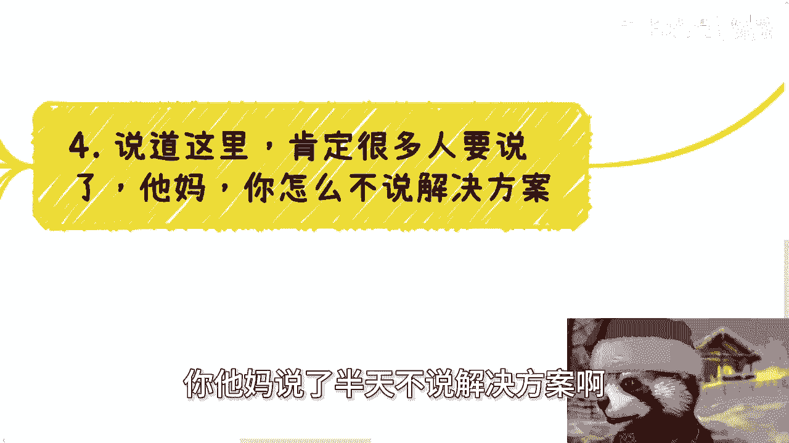
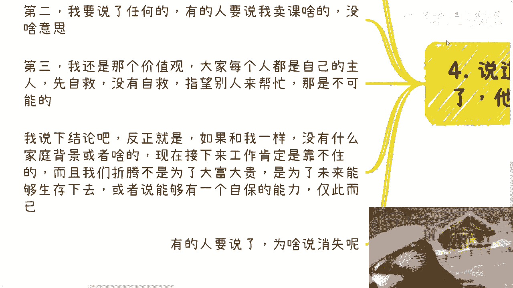

# 希望大家不要成为消失的耗材 - P1 - 赏味不足 - BV1aH4y1w7si

嗯好啊，这个刚刚那个视频已经录完了对吧，我们来录第二个啊，首先今天这个主题呢也比较特殊啊，我想了一下也可以啊。

我就讲的稍微表面一点，不讲生路啊，免得被人举报，嗯首先今天这个主题呢叫做，呃抓重点两个词儿。

呃，首先呢本周六的活动好吧，一点到六点啊，在南京啊，在南京在南京南站附近啊，然后主题的话一个是低空经济，一个是会帮大家分析一下民企广阳企，大企大厂额外企当下的这个入职的优缺点，以及未来的发展啊。

最后再聊聊各个企业当下数字化的发展跟机会，好吧，详情跟报名，你们可以再私信我好。

那我们来讲这个主题啊，首先先说说最近聊下来的结论啊，先说大前提啊，愿意信的就信，不愿意信的拉倒啊，就当听个笑话啊，一年半到两年左右会有大的变化，至于是好是坏不知道啊，但肯定会有些变动啊。

呃否则现在这个情况不可能一直这样僵下去啊，而且我就这么说，明年后年开始有大批量的以前呃，本科出来想想继续混啊，想继续当鸵鸟的啊，然后硕士也也都得得慢慢出来了啊，不可能说是这个出来再这个读博的啊。

而且我就明确跟进跟你们讲，本科出来找不到工作，大部分人硕士出来也找不到工作，这就是当下的情况啊，那么另外就是现在的确呢不是最差的，差不多可能两年左右甚至3年会到底，但是之后什么时候能上来，不知道啊。

我我个人以及我身边聊下来的所有情况，好的话，乙现在往后数10年一个周期啊，那么今天说的这个主题呢是要不要是不要啊，主要是两个点，那么说白了就是当下这个情况，一切都是有可能发生的，让自己成长起来。

或者拥有更强的能力，苟着才是王道，你看到没有，我不是跟你们讲赚钱，我是想苟着啊，别的都是扯淡，所以很多不切实际的想法大家要抛掉啊，现在没有这个土壤给大家啊，好第一方面啊，没有任何的红利期，就是行业。

产业，公司等各领域，现在可见范围内都是没有太多机会的啊，包括政府，那另外一方面，每年将近1200万应届生，以及其他30岁到40岁被优化出来的人，池子里面的人太多太多，其次整体经济不行。

也就是说我们能赚到钱的难度，以及我们能开出来的单价都有可能会往下压，而且从我看来，现在的学历价值，那我我说的直白一点，我认为学历已经崩了1/3甚至1/2了，为什么，因为现在学历价值跟以前相差太大。

说白了，现在我们得到一个学历，其投入跟产出完全是不成正比的，我不敢说成反比，但是完全不成正比，所以说现在的对于大众来讲啊，我相信你们如果已经有了一定的实习，或者工作经验，你们就会明白。

学历已经不能带来相对稳定的工作，和比较高的收入了啊，无非这个学历能干嘛，能给你们带来一些更好的攻击同伴，或者说把同伴卷掉的一些手段而已，没了啊，没了好，第三也就是最重点的螺旋下降啊，就是现在的内卷。

无论各个地方，不管你们是商业工作，职场对吧，还是说是学校，还是说是别的地方啊，就是整个的内卷已经成了一个恶性循，恶性竞争跟螺旋下降的趋势，你我们随便打个比方说啊，比如说新能源电动车，比如说软件外包。

比如说同事之间，比如说大家去应聘找工作，其实都是螺旋下降，螺旋下降的结果你知道是什么，就是大家是一起输，没有赢家啊，没有赢家，当然嗯赢家你说有没有呢，有是那些资本家根基的利益者啊。

或者说是那些唉怎么说呢，就是你们你们认为那些这个这个，某些不可描述的主导者吧对吧，但是你要明白，就真正卷的我们啊，我们相互之间你不要看大家是竞争关系，其实没有赢家的啊，我们举个例子。

你比如说现在的新能源电动车，其实供应商供应链上下游或者品牌方都在卷，卷的结果是什么，是拼销售，拼商务，拼价格，拼各种有的没的，比如说宴请啊对吧，收礼呀对吧，拼各种各样的东西，但是你会发现有个什么结果。

就是没卷赢的，自然是没有钱赚，因为他没有得到客户，对不对，好卷赢的又如何呢，因为他等于在赔本不赚吆喝，因为他最后会发现，他客户给他的钱还远远覆盖不了他的成本，那么这个时候就有人会说了，他说有的人会说。

那那这样老百姓开心啊对吧，大家都在往下卷啊，你把价格越越往下卷越低，大家就越开心啊，但其实从经济循环体角度来讲，你有没有发现，你我们上一个充电视频讲的很清楚，就是我们什么叫八二开，就是两成的赢家，赢家。

八成的输家，而现在八成的输家不赚钱，钱浪费了两成的赢家属于倒贴，赔本赚吆喝，那我就问你，不管是输家里面的钱还是赢家里面的倒贴的钱，这些钱哪里来的，不还是老百姓身上榨出来的吗，你跟我说到最后哪里来赢家啊。

哪里来赢家，你越是这种循就是叫做叫做螺旋下降的循环，那个经济体往下走的话，我跟你讲，大家只有同归于尽，真的就同归于尽，只有这一个结果啊，第四说到这里，那么很多人肯定要说了，说了半天不说解决方案啊。

我跟你们讲，第一我没有解决方案，我不觉得我对每个人有解决方案，我觉得每个人都有都只有自保的解决方案，我让你们来找我咨询也是一个道理，因为我不知道你们个人情况，我也不知道你们在什么城市。

我也不知道你们到底做什么的，我给你们什么解决方案，对不对，第二我要说了任何的解决方案，有的人要说了，我要卖课，我觉得没啥意思啊，这没啥意思，本来我也不卖，第三我还是那个价值观，在当下这种经济情况。

大家每个人能看得懂全局的，你们现在就可以开始自救了，你现在自己都不自救，你指望别人来救，怎么可能呢，对吧，我说一下最终结论啊，反正就是如果和我一样，没有什么家庭背景或者什么都没有的。

现在接下来工作肯定是靠不住的，而且我们折腾不是为了大富大贵，只是为了在未来你们30岁，我估计你们到30岁差不多了，你知道吧，就你们30岁到35岁的时候，能够有自主的能力生存下来。

或者来说能够有一个自保的能力，而不至于说因为到时候找不到工作，或者来说薪资太低，或者说背着贷款，然后奔波，仅此而已，对吧好，那么最后我们来说，有的人要说了，为啥说消失，因为你们想想看。

现在整个大船要渡过经济的低谷，或者说我们甚至还没有到低谷，那怎么办呢，就会螺旋下降，螺旋下降的里面就会有各种各样的劳动力，而且是越来越廉价的劳动力，而这些劳动力是谁，就是你们很简单啊。

你们正好处于这么一个时间段，怎么办呢，对不对好，那为什么会说消失，是因为这个时间段本身，如果就像我以前说过，如果来说，越那个整个未来能够往好的方向发展的话，那么你们既拼不过老一辈的人。

你们也拼不过未来的那些年轻人，未来的甚至1200万，1300万的应届生，你不要来跟我说现在什么好像呃，出生率很低或者怎么样子，不好意思，你们等不到那个时候啊，不是你们这一代能等到的啊。

那么这第一如果来说整个局势继续恶化，那你们更没机会。

听懂吗啊所以我一直觉得这个就是怎么说呢，你这个这是一个时代跟土壤造成的问题，我们能做的不是想着去赚大钱，我们能做的是为了让自己能够有更多的主导权，去苟着你，不要到最后连苟的机会都没有，我还是那句话。

你凭什么觉得你脑袋上长角了呢，对不对，好吧行啊，那就这么着吧啊，然后这个本周六南京的活动要报名继续报名，然后剩下的话就是说职业规划，商业规划啊，股权期权，商业计划书白皮书，额分红分润啊。

合同包括呃你们希望通过跟我的沟通，让我能够结合你们个人的情况，能够给予你们一些更具体的，或者更接地气的一些啊规划或者建议的话，那么你们在可以整理好个人的问题，跟呃具体的背景，我们再来走咨询啊，随缘啊。

随缘啊。

