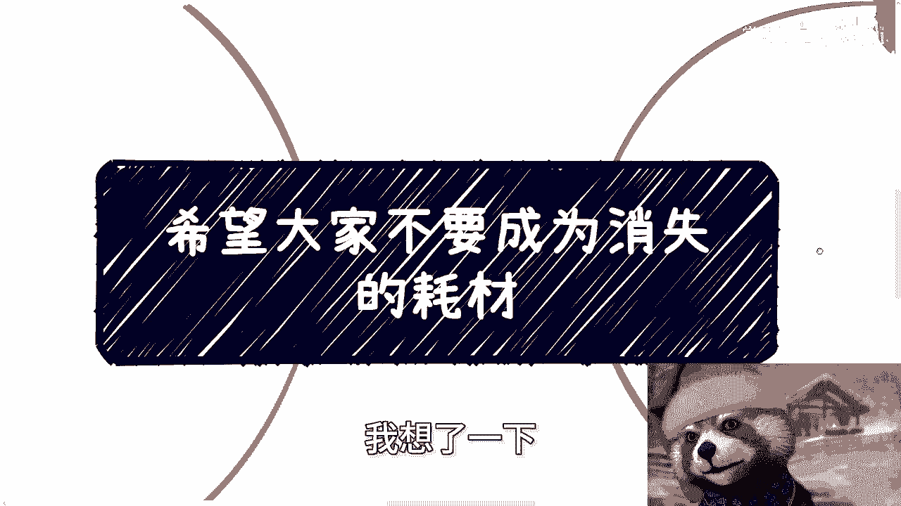
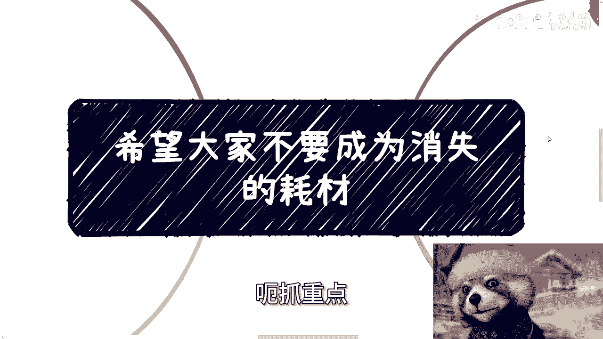
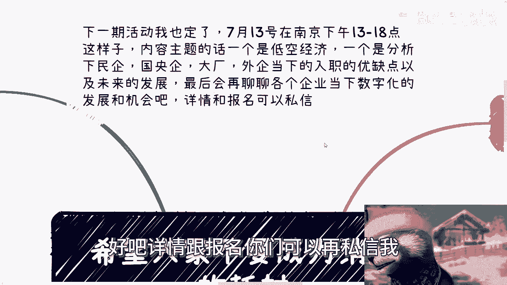
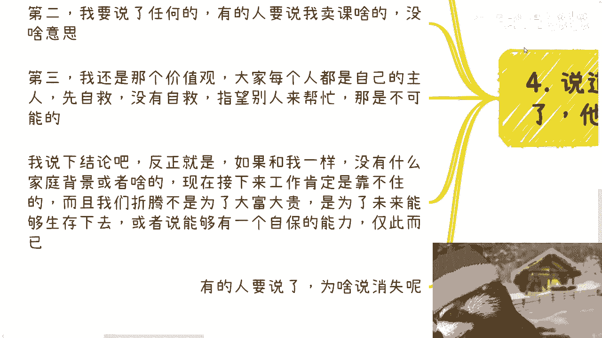
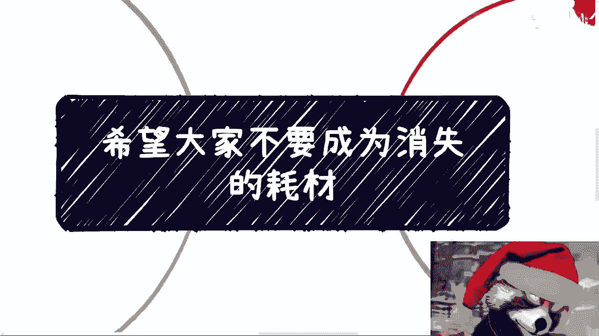

# 课程：职场生存与个人发展 - P1 🛡️

在本节课中，我们将要学习如何理解当前严峻的就业与经济环境，并探讨个人在这种“螺旋下降”趋势下的自保策略。课程将分析几个核心困境，并引导你思考务实的个人发展路径。

---

## 概述：我们面临的现实

首先，我们来谈谈最近观察到的整体结论。一个大前提是：未来一年半到两年左右，社会可能会有大的变动。至于是好是坏尚不确定，但现状不可能一直僵持下去。

从明年或后年开始，将有大批本科毕业生，以及那些原本想继续深造“混日子”的硕士毕业生进入就业市场。需要明确的是，**当下，本科毕业找不到工作的人，大部分硕士毕业同样找不到工作**。

目前可能还不是最差的时刻，低谷或许在两年甚至三年后到来。但低谷之后何时复苏，无人知晓。根据我与身边人的交流，乐观估计，一个新的周期可能需要**从现在往后数十年**。

---

## 核心困境分析

上一节我们介绍了宏观的时间框架，本节中我们来看看构成当前困境的几个具体方面。

### 1. 红利消失与机会匮乏

第一方面，是红利的全面消失。在行业、产业、公司乃至政府等各个领域，可见范围内都没有太多机会。

与此同时，就业市场供给严重过剩。每年有近**1200万应届生**，还有大量30到40岁被优化的人员涌入。池子里的人太多，而整体经济下行，导致我们赚钱的难度增加，能获得的报酬单价也被压低。

### 2. 学历价值的崩塌

我认为，当前的学历价值已经崩塌了**1/3甚至1/2**。如今获得一个学历的投入与产出完全不成正比。

对于大众而言，学历已经不能带来相对稳定的工作和较高的收入。它剩下的作用，可能只是为你提供更优质的竞争同伴，或者作为在竞争中卷掉他人的一种手段。

### 3. 螺旋下降的内卷

第三点，也是最核心的一点：**螺旋下降**。当前的内卷，无论是在商业、职场还是学校，都已形成一种恶性竞争和螺旋下降的趋势。

以下是几个螺旋下降的例子：
*   **新能源电动车行业**：供应商、品牌方都在卷价格、拼销售、搞商务宴请。结果是，没卷赢的赚不到钱，卷赢的也可能在赔本赚吆喝，收入无法覆盖成本。
*   **软件外包行业**：同样陷入价格战与过度服务的竞争。
*   **个人求职**：应聘者不断压低薪资期望，增加工作时长，导致整体劳动条件恶化。

螺旋下降的结果是**没有赢家**。八成的人失败，两成看似“赢”的人却在倒贴。整个经济循环中的资金，最终都是从普通大众身上榨取而来。这种趋势持续下去，只会导致**大家一起输**。

### 4. 个体的脆弱性：“消失的耗材”

很多人会问，我们这些个体在其中扮演什么角色？在整体经济需要渡过难关，甚至尚未见底时，螺旋下降的过程需要大量、且越来越廉价的劳动力。

你们——当下的年轻求职者——正好处于这个时间段。如果未来形势好转，你们可能拼不过有积累的前辈，也拼不过未来更年轻、数量依然庞大的应届生（不要指望低出生率能快速改善你们的竞争环境）。如果形势恶化，你们的处境将更加艰难。

因此，所谓“消失”，指的是在这个结构性困境中，个体很容易沦为无声消耗掉的、廉价的“耗材”。

---

## 应对策略：从自救到自保

上一节我们剖析了困境，本节中我们来看看可能的应对思路。首先声明，我没有适用于每个人的通用解决方案。

第一，每个人的城市、行业、个人情况都不同，不存在“一刀切”的解法。我提供的咨询也是基于个性化分析。
第二，我的目的不是卖课。
第三，我的核心价值观是：在当下，**能看清全局的人，应该立即开始自救**。指望他人拯救是不现实的。

最终的结论是：对于没有特殊家庭背景的普通人，未来的工作很可能靠不住。我们努力的目的不是为了大富大贵，而是为了在**30到35岁**时，能拥有自主生存或自保的能力，避免因失业、低收入或债务而陷入困境。

我们能做的，不是幻想逆袭赚大钱，而是尽一切努力**增强自身主导权，先“苟住”**。不要等到连“苟”的机会都失去。

---

## 总结与行动建议

本节课中我们一起学习了当前就业市场的结构性困境，包括红利消失、学历贬值、螺旋下降的内卷以及个体沦为“耗材”的风险。

核心在于认识到：**在系统性风险面前，个体间的“内卷”没有赢家**。公式可以概括为：
**恶性竞争 → 价格/条件恶化 → 整体收益下降 → 个体生存空间被挤压**

我们的应对策略应转向**个人能力的实质性成长**和**风险抵御能力的构建**，目标是获得长期的自保能力，而非短期竞争中的惨胜。

如果你希望结合自身具体情况（如职业规划、商业规划、合同股权等问题）进行更深入的探讨，可以整理好个人背景与问题，通过咨询寻求更具针对性的建议。

---
**本周六（1点到6点）在南京南站附近有线下活动**，主题涵盖低空经济、各类企业（民企/国企/大厂/外企）就业分析以及企业数字化机会。详情可私信了解。