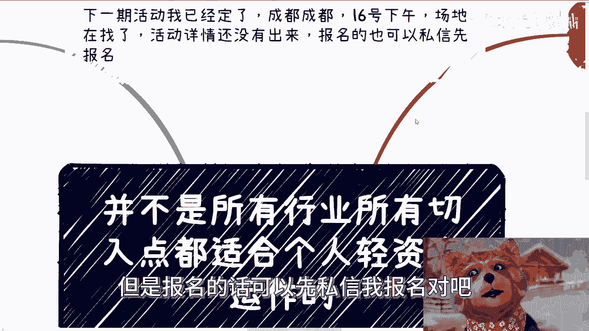
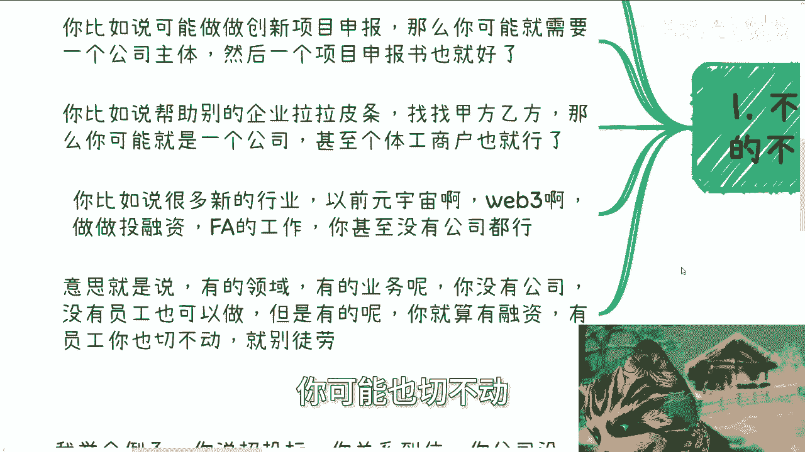
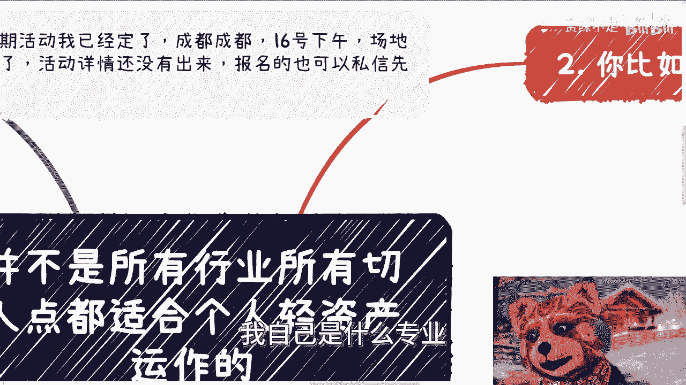
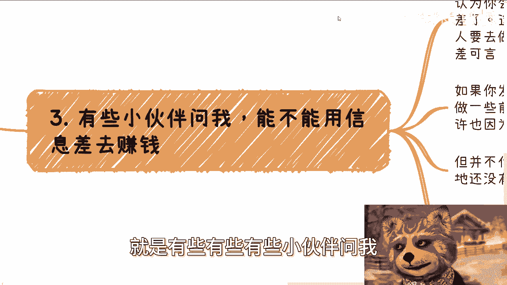

# 并不是所有切入点都适合轻资产的运作 - P1 - 赏味不足 - BV18Z421p79P

好大家好啊，那个首先我先说一下啊，就下一期活动我已经定了，好在成都好吧，16号下午呃，场地已经在找了，基本上明天肯定我就定了好吧，然后活动详情还没有出来，但是报名的话可以先私信我报名对吧。

因为成都之前就是呼声也比较高嘛，啊，额然后今天我们来讲的呢。

是并不是所有的行业或者所有的切入点，都适合个人的这个轻资产运作啊，为什么，因为嗯这两天聊呢也聊了一些人，就是其实也这个对于正好聊到这个问题上面，我就正好公开出来，可以说一下啊，就是第一个点啊。

就不同的上下文，不同的领域真的不是所有人都切的啊，首先啊你做不同的事，其实需要准备的是不一样的，你比如说啊你说你可以做，你想做一些这个政府的项目申报对吧，给协会去做一些什么什么什么什么活动对吧。

或者做一些做一些什么打下手的事情，那么你可能这个时候需要一个公司主体，然后就是需要一个项目的申报书对吧，或者说有一些小伙伴对吧，兼职的对吧，跟你一起给学给这个协会打打工对吧，也就是也就了了嘛，这个事啊。

那么你比如说帮助别的企业拉拉皮条对吧，找找甲方乙方，那么你可能就是一个公司，甚至你不用公司，个体工商户也行啊，那么你比如说很多新的行业，比如说元宇宙啊，web3啊对吧，做做投融资FA的工作，我跟你讲。

你甚至没有公司都行，就是意思就是说什么意思呢，意思就是说有的领域有的业务你没有公司，没有员工也可以做，但有的呢你就算融了资，有了员工，你可能一年比如说流水几千万，你可能也切不动。

就是你不要这么死板的去想着说，我自己是什么专业。

我就切什么领域，你也不要死板的想着说我就一定要有公司，或者一定要有全职员工，他不是这么一回事啊，就道理做事情不是这么一个做事情的方式啊，那么第二点，你比如说这些领域，我给你们举个例子啊，比如说医疗建筑。

土木设计，殡葬眼镜养老对吧，这些东西你轻资产运作很难运作，为什么，因为这些东西在社会上面，你要如果想以项目的方式去做，他会对你的资质，对你的关系要求极高，因为这些东西都是就说的好听点。

叫做他护城河很高对吧，说呃就是他的整个的这个这个怎么这么积累，很长时间对吧，他的这个历史很悠久，你说的不好听点，他妈的都是类垄断行业，有什么好做的，你怎么做对吧，哦就是你如果真的要做。

就比如说你说我他妈就是一一死死了心，铁了心我就去干啊，那你要干什么，你不要想着自己什么在这里面，什么拉个皮条怎么样子，你拉不了，你没这能力，你懂吗，哦你要真要做，你就做做卖卖水卖卖铲子啊。

就是比如说啊卖卖卖卖卖卖培训啊，卖卖什么什么AI结合啊，卖卖这种虚的东西，你可以的啊，你要说赚到钱也可能赚得到，但是你千万不要想着说我要去做服务啊，你按我的想法这些东西啊，我说实话能不碰就别去碰。

因为包括所有的传统行业，实体行业我都不建议去碰，因为你要这么想啊，现在是2024年，不是2004年，因为你们也好，我也好，我们都是在这种东西里面没有积累的，这些东西没有积累，不是我们想切就切得动的。

里面的水很深，里面的问题坑坑也很多，你非要自己跟自己过不去干嘛呢，对吧，而且最主要的是这些领域，不管是重业务还是轻业务，其实你会发现它都有很强的规范性门槛，要求比如说你要有什么资质啊，有什么东西啊对吧。

你没有啊，你不是注册一个皮包公司就能搞定的啊，而且主要这些地方都很多年了，都很固化，你千万别天真想着说啊，我去改变一下或者怎么样子，大哥你你就算今天是个superman，你也改变不了，你明白吧。

你别说你就是个普通人了啊，真能改变也轮不到我们来改变，你明白吗，就这些领域不是并不是说不能做，你比如说也有特殊情况，比如说你说你父母是嘿，我写错了啊，或者你你家里面有家族产业，你家里面有矿啊。

或者你家里面有从三代前就做这个东西的对吧，或者你家里面在小城市是地头蛇，那都没问题，但但凡你跟我说，你是个普通人，你你别碰啊，喷不动啊，然后第三就是有些有些有些小伙伴问我。

他说能不能用信息差去赚钱，大哥啊，首先啊在中国信息差只有一个东西，那就是关系，除了关系都不叫信息差啊，你别认为你会AI会数字化，会数字经济就是信息差了，这不叫信息差。

因为这种东西但凡有关系的人真的要去做，他无非就是花钱到市场上去找工具人而已，他有啥信息差可言呢，啊有啥可言呢，难道这些我们所谓的AI，所谓的数字化，所谓的数字经济，所谓的这个什么什么人人呃。

那个区块链只有你会做吗，那总不是吧对吧，所以你发现一些产业，一些领域啊，没有数字化，或者没有一些前沿的东西结合，也许因为不懂怎么做，也许也会因为他们没有找到合适的这个工具人，工具团队怎么做。

但无论因为什么原因，它并不代表你你就切的进去啊，你明白吗，就更多的原因是，因为当地可能还没有这些KPI和，没有这些政治要求而已，这跟哼这跟他们有没有找到合适的，不可没有关系的，我的花钱总能找到合适的。

有什么找不到的啊，卧槽这些都是正规业务，又不是黄赌毒对吧哦，我今天咨询的时候也跟个小伙伴说了，我说别来谈，不要尽可能就是比如说啊，大家好像一下子反应就是心理反射，也条件反射。

就是说啊好像啊弹这个事情很功利对吧，你怎么弹这个声音这么功利对吧，我你知道我今天怎么说的，我说我也不想功利，我也不想谈钱啊，你明白吗，你去谈功利，谈钱都很累啊，但是这个社会就如此，你怎么办呢对吧。

我们我们没有办法，你去找别人合作，但凡别人赚不到钱，或者说你满足别人，满足不了别人的KPI，那谁来合租啊，你不给对方赚到钱，谁来合作啊对吧，我今天还给他提了，就呃就是举了个例子。

我说我说人都有生老病死啊，我说未来如果真的比如说我们自己有些病，或者我们呃父母可能比如说有些小毛小病，怎么样的对吧，你到时候怎么地啊，你跟医院说，卧槽你们这帮啊，你你们作为医院，你们怎么能这么功利呢。

要命嘞，你去说说，看你看有没有人理你，对不对，你不真不是我们想谈钱，你说怎么办，你没办法呀，对不对啊，然后很多时候呢就是就我今天说的，很多时候呢真的不是这么死板的，就我举个例子啊，你比如说你说招投标。

你关系到位了，你公司没人，你哪怕壳子公司，大家都可以找办法，找个别的有资质的公司套在你公司上面去中标，那又怎么样呢，对吧，你比如说专利跟软出，我就这么讲，做过的都知道对吧，正常你比如说你说两三个月对吧。

有的一两个月，有的两三个月，但但凡你有关系，或者你愿意给钱，可以啊，一个礼拜就可以给你做出来，怎么了呢，对吧啊，大家不要拘泥于真的，不要去很死板的拘泥于说哈，我有我非要有公司，我没有公司。

然后我非要这公司养多少员工对吧，要不要发工资，没有意义的呀，你你你的目标是为了赚钱，你你所有东西都可以合作的方式去承接业务，去承担，有什么不行呢，我再说句不好听的话，就当下这种情况，普通人别想着去融资。

别想着想员工，因为你没有这能力，你今天真的就算是叫什么，就是呃命特别好，天时地利人和，如果真的给你融到资了，养了员工了，我跟你讲，这他妈对你都是DEBUFF，生不如死，真的哦，大概率你就会被拖死啊。

所以说如果有些人啊觉得没有这些东西，根本谈不动客户，或者谈不了业务的啊，我跟你讲，核心根本就不是你有没有员工，根本就不是你有没有公司，根本也不是你有没有业务，而是核心。

就是你根本就还不了解对方的KPI跟痛点，你就没摸准，你懂吗，你但凡摸准了，你就能弹得动，你但凡摸不准你有什么东西你都弹不动啊。

一因为当下就是这个市场，你怎么办呢，明白吧啊好吧行啊，那就这么着吧，然后就这个事我算给你们讲明白了，讲清楚了啊，好吧啊，呃叫什么，就是职业规划好吧，商业规划，然后合同呢，合同啊对吧，然后分润啊，分红啊。

商业计划书啊，白皮书啊对吧，呃包括其他各个东西啊，包括就是说你们手上有什么牌，你们手上没有牌，你们希望通过啊跟我的沟通啊，通过我的一些视角，通过我的一些视野，能够给你们一些更好的一些规划的。

那么你们可以整理好问题啊，再来走咨询啊，然后同样的就是说，如果你们想单纯的通过咨询啊，不劳而获啊，或者说自己不实践啊，或者说自己就是说啊不愿意去思考，纯粹的伸手党，那你们就别来找我了啊。

我我我不接这种单子啊。

