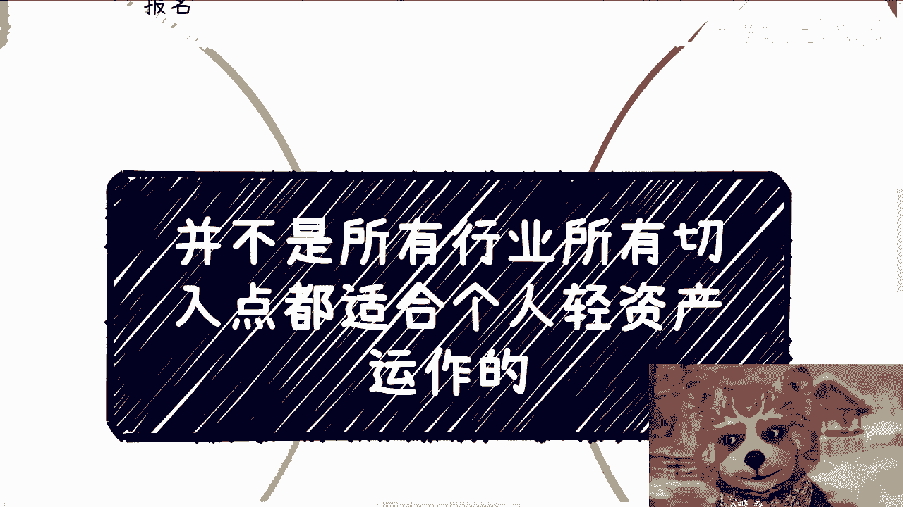
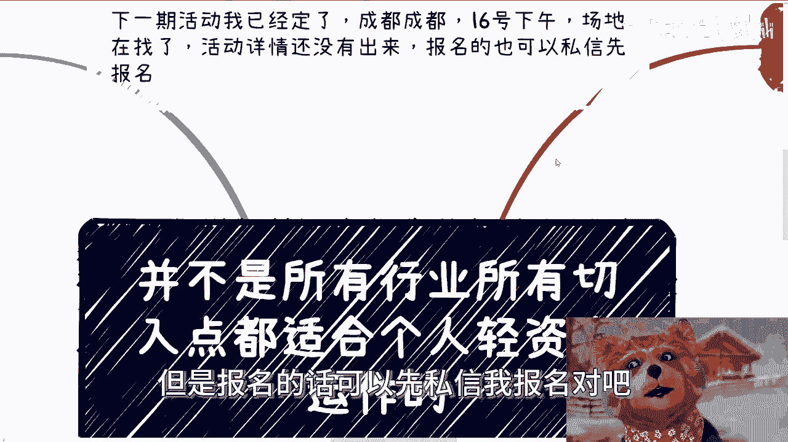
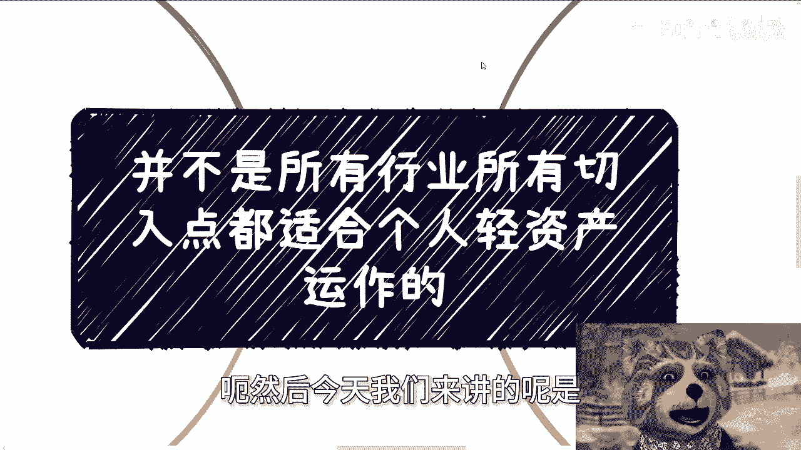
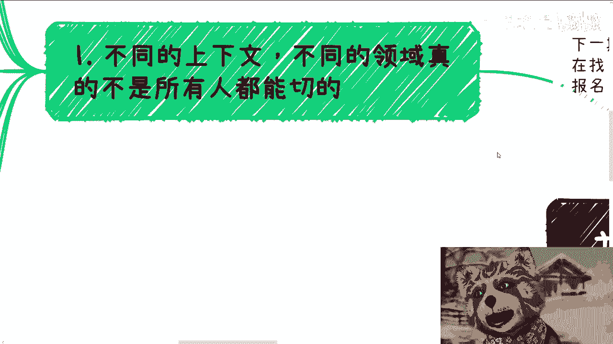
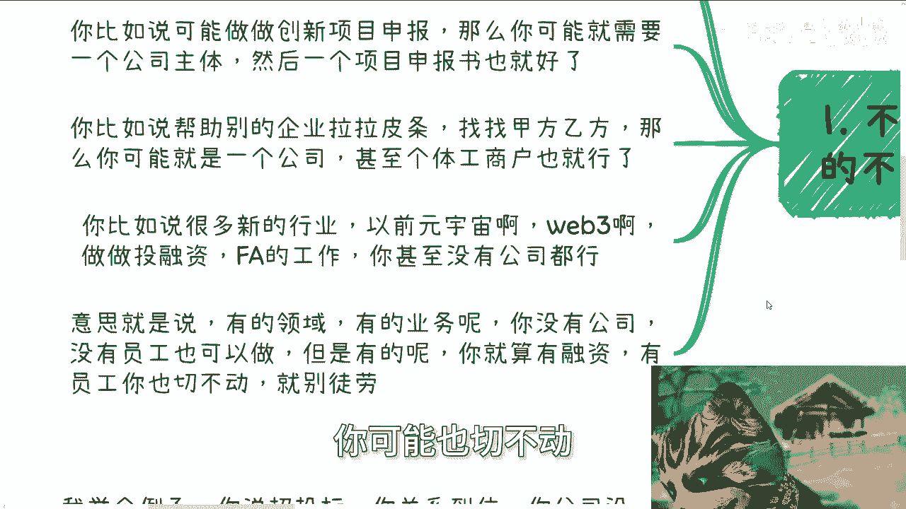
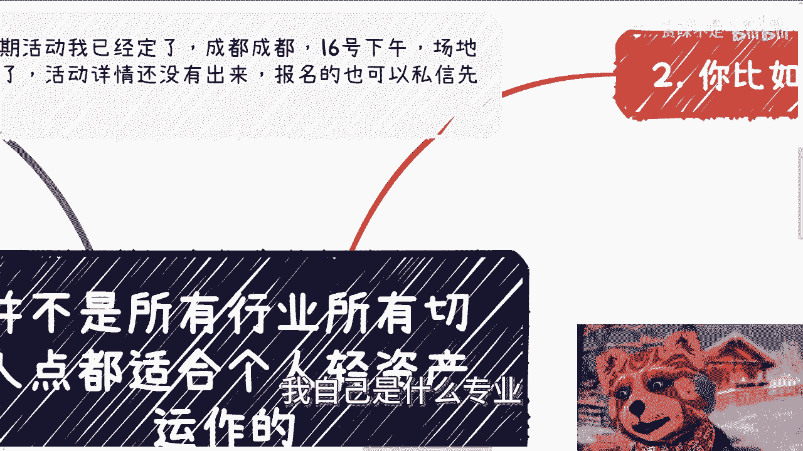
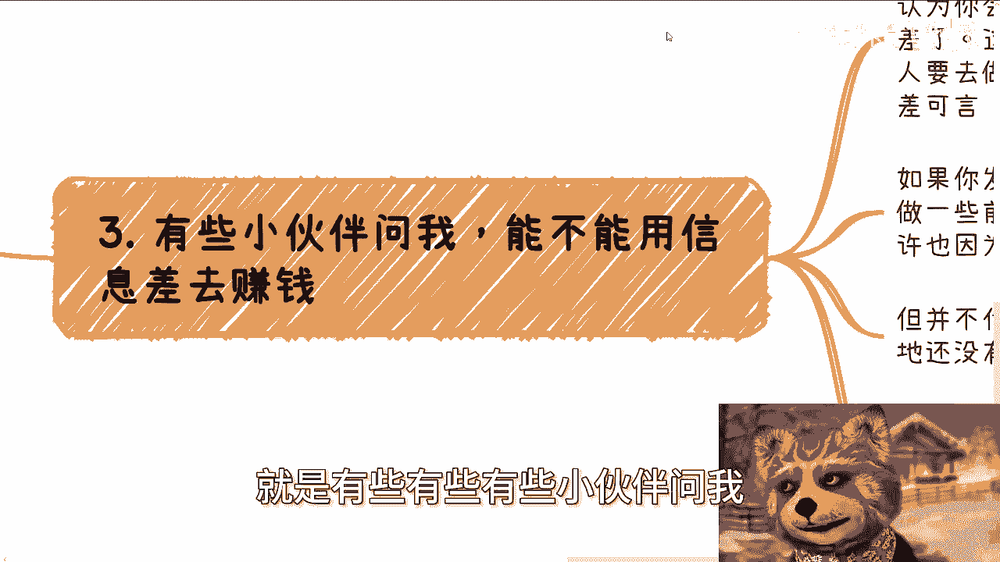
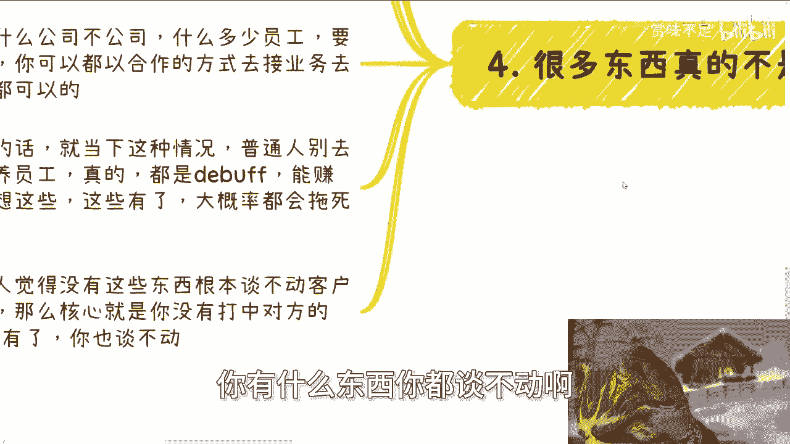
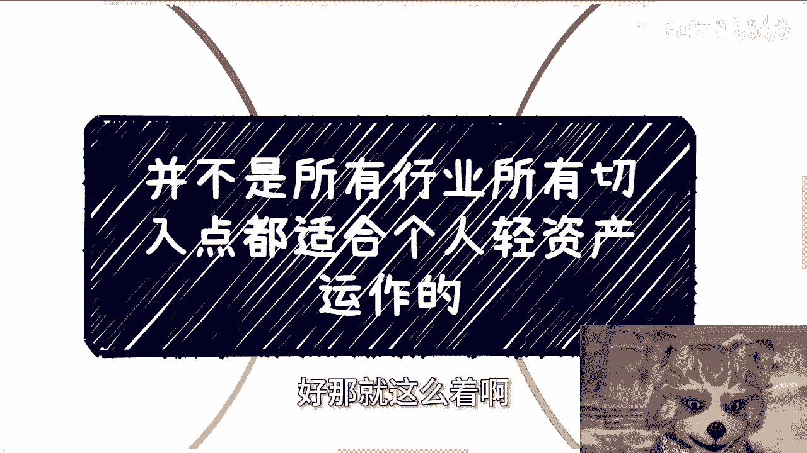

# 课程 P1：并非所有切入点都适合轻资产运作 💡

在本节课中，我们将探讨一个核心观点：并非所有行业或业务切入点都适合个人以轻资产模式运作。我们将分析其原因，并通过具体例子说明哪些领域门槛较高，以及普通人应如何调整策略。

---

## 活动通知

下一期活动已确定在成都举办，时间是16号下午。场地正在寻找中，预计明天可以确定。活动详情尚未公布，但有意报名者可先私信我进行预报名。

成都地区的呼声此前较高。

---

## 核心观点阐述

今天我们讨论的主题是：并非所有的行业或所有的切入点，都适合个人的轻资产运作。

这个观点的产生，源于近期与一些人的交流，正好涉及此问题，因此公开分享一下。

---

## 第一点：业务模式取决于具体领域

不同的上下文和领域，并非所有人都能切入。首先，做不同的事情，需要做的准备是不同的。

以下是几个例子：

*   **政府项目申报或协会活动**：这类业务可能需要一个公司主体，并准备项目申报书。也可能需要一些兼职伙伴协助。
*   **企业中介服务（拉皮条）**：这类业务可能只需要一个公司，甚至个体工商户即可。
*   **新兴行业（如元宇宙、Web3）的投融资顾问（FA）工作**：这类业务甚至可能不需要公司。

核心在于，有的领域或业务，没有公司、没有员工也可以操作。但有的领域，即使你融了资、有了员工，一年流水几千万，也可能无法切入。

因此，不要死板地认为自己的专业决定了切入的领域，也不要死板地认为必须要有公司或全职员工。做事情不是这种方式。

---

## 第二点：高门槛领域的案例分析

上一节我们介绍了业务模式的多样性，本节中我们来看看哪些领域轻资产运作难度极高。

例如：医疗、建筑、土木设计、殡葬、眼镜、养老等领域。这些领域轻资产运作很难，因为若以项目制方式参与，社会对其资质和关系要求极高。

说得正面些，这些领域护城河很高，历史积累深厚。说得直接些，它们近乎垄断行业。

如果你决心进入这些领域，不应想着自己去“拉皮条”做服务，因为这需要你不具备的能力。真正可行的方向是“卖水卖铲子”，例如提供培训、销售与AI结合等虚拟产品或服务，或许能赚到钱。但提供实体服务则非常困难。

我的建议是，包括所有传统行业、实体行业，如无必要，尽量不要触碰。现在是2024年，不是2004年。我们大多数人在这些领域没有积累，其中的水很深，坑很多。这些领域通常有很强的规范性门槛，如特定资质，这不是注册一个皮包公司就能解决的。行业格局多年固化，改变极其困难。

当然也有特殊情况，例如家族有相关产业或资源。但如果你是普通人，建议不要碰。

---

## 第三点：关于“信息差”与业务本质的思考

有些伙伴会问，能否利用信息差赚钱？首先，在中国，真正的信息差通常只指向“关系”，除此之外很难称得上信息差。

不要认为你会AI、数字化、数字经济就是信息差。这不算信息差，因为有关系的人若真想做，无非是花钱到市场上寻找合适的执行者（工具人）。难道这些技术只有你会吗？显然不是。

一些产业没有与前沿技术结合，可能因为他们不懂，也可能因为他们没找到合适的执行团队。但无论原因如何，这并不代表你就能切入。更可能的原因是当地尚未形成相关的KPI或政治要求。只要肯花钱，总能找到合适的执行方，这些都是正规业务。

今天咨询时我也提到，谈论合作时似乎很功利。但社会现实如此，我们别无选择。寻求合作时，若对方无法获利或满足其KPI，合作如何达成？这就像生病时去医院，指责医院功利并无意义。

很多时候，事情并非那么死板。例如招投标，若关系到位，即使公司是空壳，也可以想办法借用有资质的公司去中标。又例如专利或软著申请，正常情况下需要一两个月，但若有关系或愿意支付额外费用，一周也能办成。

不要拘泥于形式。你的目标是赚钱，所有业务都可以通过合作方式承接。在当下环境中，普通人别总想着融资、养员工。即使侥幸做到，也可能成为拖累你的负担（DEBUFF），大概率会被拖垮。

如果有人认为没有公司或员工就谈不动业务，那么问题的核心通常不在于你是否有这些，而在于你是否真正了解对方的KPI和痛点。只要摸准了，就能谈得动；摸不准，拥有再多资源也谈不动。

这就是当下的市场现实。

---

## 总结与咨询服务说明

本节课中我们一起学习了轻资产运作的适用边界。核心在于理解不同领域的门槛差异，放弃死板的思维模式，并认识到真正的业务突破口在于洞察对方需求（KPI与痛点），而非拘泥于自身的形式条件。

关于职业规划、商业规划、合同、分润、商业计划书、白皮书等问题，或者你手上有一些资源（牌），希望通过沟通获得新的视角和规划建议，可以整理好问题后前来咨询。

但请注意，如果只想通过咨询不劳而获、不愿实践、不愿思考，纯粹做伸手党，那么请不要来找我，我不接此类咨询。

---