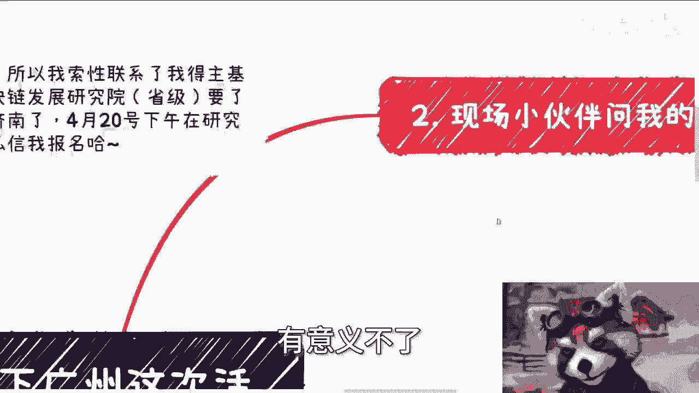
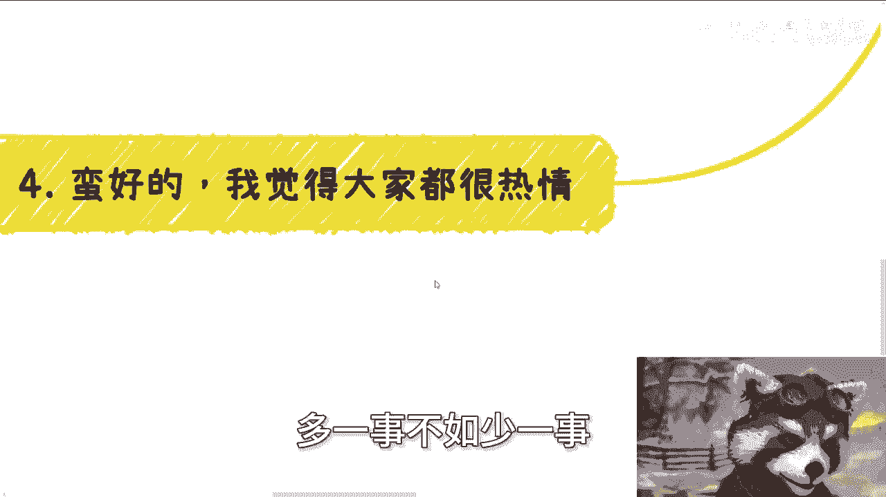

# 广州活动现场一些优质问题的扩展 - P1 - 赏味不足 - BV1Zt42177pR

哈喽大家好，我哼我，我这两天在广州浪啊。

在广州浪，所以这么没更新啊，呃首先那个再说一下啊，就是本就下一期那个活动啊，在济南4月20号好吧，就这周五呃，不是这周六啊，在那个这个发展研究院，就是省级的这个研究院啊。

然后在济南的小伙伴可以报名来参加，我顺便带大家参观一下研究院好吧。

然后呢我来总结一下广州这次活动啊，为什么要总结呢。

就是的确还是有些内容啊，也可以分享给大家啊。

呃首先关于数字人民币的这个问题啊，首先我先说一下，会上面有一个错误的一个点啊，就是数字人民币跟区块链没什么关系啊，没什么关系，那么这个是目前公开信息说的很清楚的啊，而且呢就是说呃你要说硬要说有吧也有。

但有的是什么呢，有的只是它的存储方式，用的是链式的存储方式啊，但是你要说跟区块链有什么关系啊，本质上没什么关系啊，首先第一点，第二点是说支付宝跟微信啊，这个人民币的关系，用互联网的话来讲呢。

微信跟支付宝呢和或者第三方的机构呃，或者所有的这些合作方就是所谓的二层架构，也就是所谓的应用层啊，你可以理解为一个是底层，一个是应用层，那么宏观来讲呢，就是说是核心啊，监管也是一样的。

那么剩下的呢其实都是为了来拓展生态的啊，就是这么一个关系啊，不是大家想的，就是说啊好像这两者是一个冲突的关系，或者替换的关系，不存在的啊，不存在的，那么还有呢关于这个发行啊。

呃发行就是我们刚刚说的第二层架构上的，应用方会提供百分之百的储备金啊，并不存就是并不是直接就存在说哦，我们今天就是说跟纸币一样，就是说啊我们今天发行或不发行这个逻辑，当然这个也是只是当当下的问题。

以后怎么样不知道啊，那么现场还有小伙伴提到了关于5B3，比如说USDT跟数字人民币的对手牌的是，首先这么说啊，首先USTT本身并没有被国家承认过，不管中国美国都没有承认过啊，那么甚至到今天为止。

还有非常多的机构或者金融的这些专家啊，说早晚要暴雷啊，首先这第一个前提，第二个前提就是说中美本身在全球的层面上，大家都是公认的大国对吧，那么中美两方各个层面都有合作或者对手盘啊。

不是说今天有了数字人民币，或者没有数字人民币怎么样怎么样怎么样，它不存在吗对吧，你说有和没有有多大差别吧，我不觉得有多大差别啊，但是你必须得有啊，因为大势所趋啊，你数字化都说你比如说未来的这个战争。

数字战争，你数字化你你不做你你可能吗，你想想看对不对啊，那么关于美国监管呢也是这么一个道理啊，现场也有小伙伴说美国就说呃呃呃SEC对吧，在监管或者怎么样，我跟你这么说啊，监管并不代表领先。

而且监管本身也是有显性和隐性的，他不是单纯的去看监不监管，而且说不好听点，你从一个老百姓角度，你看到的监管，这他妈对吧，有有卵用啊，啊那么在我看来呢，加密货币其实是每个国家或者说多个主体啊。

留给自己的一个后路啊，那么你在退1万步来讲，就是你觉得一个国家，一个主体，一个政府会这么幼稚的去看啊，这个东西有用这个啊，这个东西好或者不好，或者说对或者不对，谁会这么来看。

它只有利用价值跟没有利用价值，你只要有利用价值肯定会留，就这么简单，对不对，这有意义了。

没有意义的呀，啊那么第二现场小伙伴问我这么几个问题啊，呃首先最好玩的是一个小伙伴，他说他说现在房子是消耗品，而且呢性价比不高啊，问我为什么要买，我说因为我买的早好了，现现场笑死对吧，你就自取其辱啊哈哈。

因为我买的早，那怎么办呢，然后说到国央企呢，传统行业做数字化的问题啊，其实我跟你讲很多逻辑呢，大家想呢，其实我就这么跟你讲，你想的时候你都想得通了，但做的时候真的不是那么回事，我举个例子。

比如说啊大家都知道做事啊，做一些东西找外包对吧，这逻辑对吗，对的啊，但如果今天有个事真的就找你，你真的要去找外包了，我就问你，你知道找谁吗，你不知道你知道找谁能保证质量吗，你也不知道，你知道去哪找吗。

你也不知道对吧，也就是说这个逻辑在你脑子里面走得通吗，走得通的，但真的要走，你走得通吗，走不通，所以你真的到时候去找的时候，你会怎么办，你肯定会说哎，要么找陈老师，要么找其他人，你觉得就是说你信得过的。

或者你觉得你熟悉的，你看看有没有转介绍的对吧，你比如说你问我哎，我这边有没有合作方案或者怎么样子，所以说一样的人类都是一样的，你怎么想，高校政府机构也是这么想的呀，对对对，就是就是很多人就说啊。

那个国央企为什么自己不去不去做或者不去找，就很简单啊，他们知道怎么找吗，一样的呀，怎么滴了啊，你今天两条腿两只手对吧，他们他妈三条三头六臂也没有啊对吧，这是一样的呀，所以还有小伙伴问我。

他说找那个供应商不靠谱怎么办，比如说交付了一坨屎，或者说做了一半跑路怎么办，我跟你讲，这事简单，正常做事都是找N个供应商的，你先白嫖方案啊，甚至你可以让大家一起做，然后你选个优秀的不就好了。

大哥你是甲方，大哥你明白吗，你是甲方，你说了算啊，真的我跟你讲，很多时候哎呀怎么说呢，就是我回头会单独再看一集，我在那跟你们讲这个问题啊，就是很多时候既要又要使不得啊，就是你我早就跟你们讲了。

你要么就赚钱，你要么就被割结束了，你不要想着说我今天要赚钱，你还有良心唉，这就不是有没有良心的事儿，我跟你说啊，你你我只能说你的道德道德道德感太高，那么第三还有几个事呢就特别有趣啊。

首先我昨天在分享的时候呢，我说到过关于场地的事啊，其实你看啊，我办活动办到现在呃，若干个活动的场地呢的确是免费提供的，或者说是合作方，我也帮助合作方，合作方满足KPI的，然后呢你就会发现很多小伙伴说。

哎呀我没有场地，哎呀我找不到合适的，哎呀，我也想白嫖，我跟你讲，我那我昨天在广州现场就说的很清楚，我说我说但很奇怪的一点，我说说呢都这么说的，但是我说我从来到今天为止。

我都没有见到过一个人在线下来跟我说，哎陈老师啊，你这个场景怎么找的啊，你要不介绍一下啊，对吧，没有呀，我也很奇怪呀，就你们要是想白嫖，你倒是让我转介绍呢，对不对，我也没见一个人来找我呀，妈奇了怪了对吧。

首先这是第一点，第二个就是昨天有人问我拉群的事啊，我跟你讲其实很简单，我早就跟你们说过啊，这句话我一直这么说，就是如果哪天我来拉群，我做群主了，我就是准备割你们就这么简单，否则我就问嘛，我作为一个商人。

我他妈我做拉群干嘛，我不割，我拉群干什么哦，我做群主本身有风险，我脑子有毛病，其次我拉了我还得运营，我还得给你们去回答问题，我还得给你们分享问题，我他妈脑子有毛病吗，对不对。

就是就是这个逻辑一定是这样子的，就是如果哪天我就直接说，如果哪天我拉群了，我又不来割你们，那我就是，对不对，就这么简单啊，第三也是最好的一个问题，就是我线下分享的数字经济，一些赚钱方式，关于关于高校。

政府，企业个人等相关方式都有啊，然后昨天前天那个小伙伴就问我，他说是不是当下C端，因为我我我在里面可能着重的说了，高校政府企业嘛，他就问我是不是说陈老师，你C端没有说就不好做，我说事实上并不是这样子。

而且是相反的，就我说现在当下整个经济环境，企业端，政府端，高校端都没钱，现在对于大家来讲，高校企业政府适合打关系，但不适合赚钱，真的赚钱的还是C端，相对啊，记住啊是相对啊，不是说C端就一定好赚啊。

C端相对好赚一点好，那么接下来我就得回答他那个问题，我说我为什么不在PPT上公开讲，很简单啊，因为线下是一个相对比较正式的一个场所，你让我怎么说呢，对吧，我就告诉你们，老百姓95%都是，你让我怎么讲。

我今天去讲，他懂的人是说嗯程老师说的对，不懂的人好像要作妖了吧，就说了拍张照，然后说你看陈老师教大家怎么传销，你怎么办呢，你面对，你有什么好说的，你告诉我对不对，没有办法的呀，你不如多一事呃。

呃少多一事不如少一事。

对不对，好第四个，我觉得呢大家都很热情啊，就是我跟你这么说啊，大家都很有想法，但是呢我觉得你们重点都要把握住，就是说如果你手上的资源靠不靠谱，你不知道，或者说这个资源好不好，熟不熟，你也不知道。

你就尽量只花十百%分之20的精力去做，不要投钱，千万不要投钱，然后呢你就看看结果，看看发展，就那句话叫什么叫做让子弹飞，一会儿你别着急，你知道吗，就他是骡子是马，基本上半个月一个月六六，大家都懂。

对不对啊，但是我觉得就是说就是说很多人思想啊，你们千万不要就是说哎我今天逮着个方向，我觉得好，或者我觉得怎么样，我就是属于那种all in了这种状态，那不行了，就是商业上记住啊。

商业上你寻找你要不停的寻找新的方向，你千千千千万万不要，就是说你看自己手上有什么，因为你跟我都是尘埃，你跟我都是垃圾，你明白吗，就是你不要去死磕，你手上有的东西，你手上有东西有价值，那叫你的名。

那个运比较好，没有价值，这是常态对吧，因为我们永远要去跟着趋势，跟着市场，所谓趋势跟市场是什么，就是整个的就是说啊我们要去接触，就我们一直说我们要去接触人啊，接触活动啊，对接触各种东西啊。

我们要去接地气，就是我只因为我们只能顺势而为，我们不可能让这个地区来顺着我们而为吧对吧，因为如果我们不是顺势而为，就不可能，因为说我们今天得到了一个正确的方法论，然后我们就能够把我们手上的一个。

莫名其妙的东西做大做好，这个逻辑永远不成立的，你知道吗，哦就是因为我发现很多人问我的时候呢，就是他比较关心他有的东西，这个逻辑没有错，但是你关心你有东西，你千万不要去想，就说我有。

我就一定硬要找到一个解决方案，我告诉你们正常就没有解决方案，你懂吗，正常就是说今天你能赚到钱，能顺势而为的赚到钱，那么这个逻辑就是走得通的啊，这个可能就是一个对你来讲是一个解决方案。

每一个人他都有自己的一个经历，或者有一个天时地利人和，你不可能说把一个正确的方法让他搬过来好，你说你说他能做，我也能做，不存在的，你懂吗，所以说我们就说啊，你在赚钱这件事情上面。

你一定要同步的多棵树上面去吊吊死，你知道吗，你千万不要说我今天非要一棵树上吊死，我妈走，我得死磕，没没有用的，绝对没有用的，你你这样的话对，如果你是个老百姓，你没有呃那个比较好的资源。

或者没有没有太厚的家底的话，你等于就在浪费自己的事情，就是你看似你在试错，你看似你在做事情，这个事情对不对对，但是你做的方法不对啊对吧，你你20多岁到30岁就那么几年，你一个case1试错好了。

半年一年过去了，你怎么能试几次啊，对不对啊。

行好吧，然后这个活动就是有我挑了一些重点啊，因为现场我讲了蛮多蛮多的，反正来的人都知道对吧，就是挑了一些重点好吧，然后就是济南这边活动呃，顺便吧，顺便大家反正要有机会来嘛，就来好吧。

呃然后剩下的话就直接发展商业发展啊，然后什么股权啊，合同啊啊然后什么比如说你们手上有哪些牌啊，有哪些技能啊啊然后有哪些路要去选啊，你们觉得自己吃不准啊，啊，你们希望就是我通过我的视角来帮你们看一下。

这个方向怎么选啊，或者怎么做可能比较好一点的，那么你们可以整理好好吧，然后私信我，我们再做咨询行。

