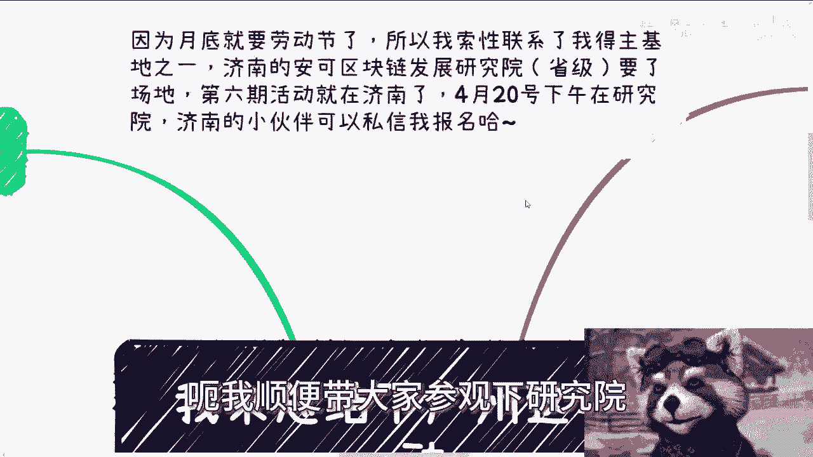

# 课程名称：数字经济与商业实践问答解析 - 第1课 🧠

在本节课中，我们将梳理并解析一次线下活动中讨论的多个核心问题，内容涵盖数字人民币、企业数字化、资源对接、商业策略等多个方面。我们将以简单直白的方式，帮助初学者理解这些复杂概念背后的逻辑。

## 概述 📋

本次课程内容源自一次广州线下活动的问答环节。我们将对活动中提出的优质问题进行扩展和总结，删除所有口语化语气词，提炼核心观点，并以结构化的教程形式呈现。课程将分为几个主要部分，每部分聚焦一个主题。

## 数字人民币的本质与生态 🏦

上一节我们概述了课程内容，本节中我们来看看关于数字人民币的几个关键澄清。

首先，数字人民币与区块链技术**本质上没有直接关系**。根据公开信息，数字人民币仅在存储方式上采用了链式结构，但其核心架构和运行逻辑与典型的区块链项目不同。

其次，支付宝、微信支付等第三方支付机构与数字人民币的关系，可以类比为互联网的**应用层**与**底层协议**。用公式表示即：
**数字人民币生态 = 底层核心（央行发行与监管） + 应用层（支付宝、微信等合作方）**
它们之间是协作与拓展生态的关系，而非替代或冲突关系。

关于发行机制，当前模式下，作为应用层的合作方需要提供**100%的储备金**。这并非像传统纸币那样由央行直接决定发行量。

对于数字人民币与USDT等加密货币的关系，需要明确两点前提：
1.  USDT等加密货币未得到中美等主要国家的官方承认，其稳定性存疑。
2.  数字人民币的推出是国家数字化战略的必然步骤，是“大势所趋”。中美在数字货币领域的互动，是全球格局下合作与竞争的一部分，并非简单的“对手盘”关系。

关于监管，需要理解：**监管 ≠ 领先**。监管有显性和隐性之分，且从国家战略视角看，加密货币更多被视为一种具有潜在利用价值的“后路”，其存在价值取决于能否服务于主体利益。

## 企业数字化与资源对接的实践困境 💼

理解了宏观的数字货币概念后，我们将视角转向微观的企业实践。许多想法在理论上成立，但执行时会遇到具体障碍。

以下是关于企业（特别是国企、央企）推进数字化时常见的实践困境：

*   **寻找可靠外包商的难题**：逻辑上知道“专业的事找专业的人”，但实际中面临“找谁？”、“谁能保证质量？”、“去哪找？”这三个具体问题。最终往往依赖于信任背书或熟人转介绍。
*   **应对供应商不靠谱的策略**：作为甲方，有效策略是同时对接**N个供应商**。可以先通过方案征集（“白嫖方案”）进行初步筛选，甚至让多家并行开发原型，最终选择最优者。核心是掌握主动权。
*   **“既要又要”的思维误区**：在商业实践中，往往需要在“追求利润”和“承担风险/道德成本”之间做出权衡。试图同时达成多个冲突目标（既要赚钱又要绝对安全且有良心）通常是不可行的。

## 活动组织与社群运营的底层逻辑 🎤

从企业实践回到个人行动，许多人有组织活动或社群的想法，但缺乏有效方法。本节探讨其中的关键逻辑。

关于活动场地，免费或合作场地是存在的，但需要主动寻找和对接资源。一个普遍现象是：很多人抱怨没有资源，却极少有人主动向已有资源方请教或寻求转介绍。

关于组建社群，有一个清晰的商业逻辑：
**如果组织者拉群并亲自运营，却声明不以此盈利，这在商业上不符合常理。**
因为运营社群伴随风险、时间与精力成本。因此，当有人免费建群并投入运营时，参与者需要理性思考其可持续性与潜在目的。

## 数字经济下的赚钱策略与资源观 💡

最后，我们来探讨最受关注的赚钱策略。在不同经济周期，机会点有所不同。

当前经济环境下，**To B（企业）、To G（政府）、To U（高校）端预算普遍收紧，更适合用于建立关系和长期布局，而非快速变现。相对而言，To C（消费者）端仍是现金流更活跃的领域。**

为什么有些有效的C端策略不在公开场合详细宣讲？主要原因是语境与风险。线下正式场合的听众构成复杂，某些直白的策略描述容易被断章取义或误解，从而带来不必要的风险。因此，“多一事不如少一事”。

对于个人实践，至关重要的原则是管理好你的资源和精力：

以下是给初学者的行动建议：

*   **测试原则**：对于不熟悉或不确定靠谱的资源/方向，初期只投入**≤20%** 的精力进行测试，**切勿盲目投入大量资金**。让项目自然发展一段时间（如1-3个月），观察其效果，“让子弹飞一会儿”。
*   **避免All-in**：商业上忌讳看到一个方向就全身心“All-in”。尤其是资源有限的个体，更应保持灵活性，同步尝试多个可能性，“多棵树吊死”。
*   **顺势而为**：个人的成功往往依赖特定的天时、地利、人和。不要执着于将自己已有的某项资源“硬做大”。正确的逻辑是：**发现市场趋势 → 用自身资源去匹配和顺应趋势 → 获得收益**。我们无法让市场适应我们，只能主动去接地气、接触人、捕捉趋势。
*   **珍惜试错成本**：20-30岁的黄金时间有限，一个项目试错半年或一年，代价巨大。因此，必须提高试错效率，采用低成本、多并行的测试策略。

## 总结 🎯

本节课中我们一起学习了从宏观政策到微观实践的多个知识点：
1.  明确了数字人民币的技术本质与生态角色，理解了其与加密货币及第三方支付的关系。
2.  剖析了企业（包括国央企）在数字化过程中遇到的实际执行难题及应对策略。
3.  揭示了活动资源对接与社群运营背后的现实逻辑。
4.  重点讨论了在当前经济环境下，针对不同客群（B/G/U/C）的策略选择，并给出了个人在探索商业机会时至关重要的行动原则：**轻投入测试、避免All-in、顺势而为、高效利用试错周期**。

商业实践是复杂且动态的，核心在于保持理性判断、主动获取信息，并在行动中不断验证和调整。