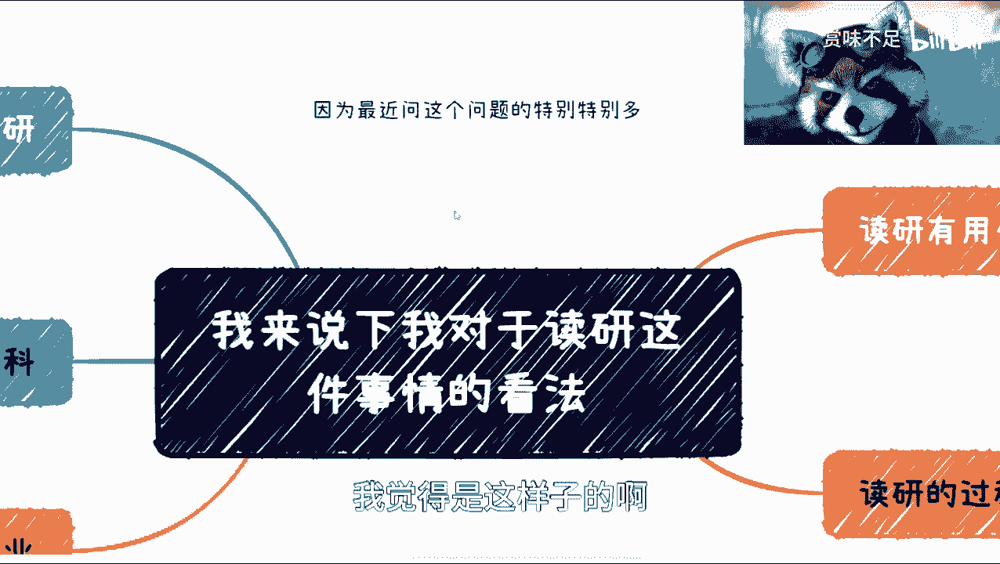
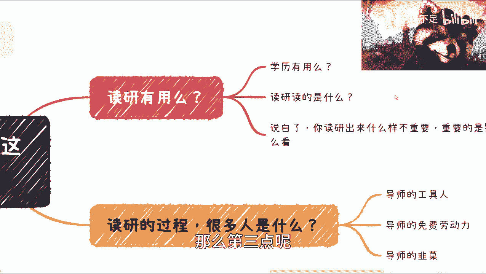
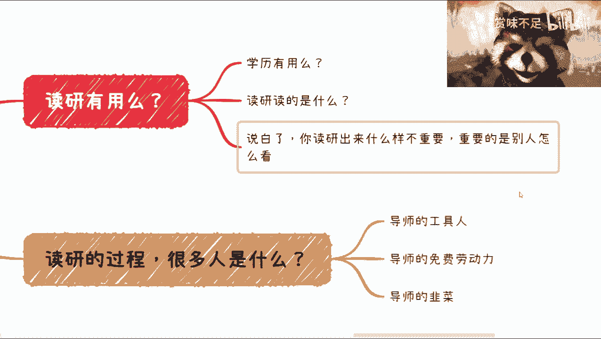
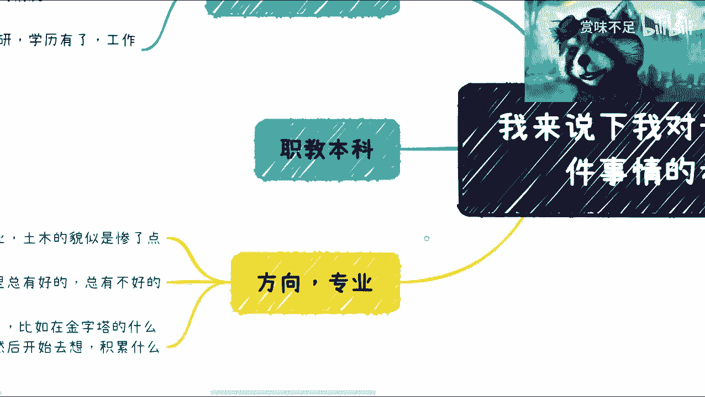
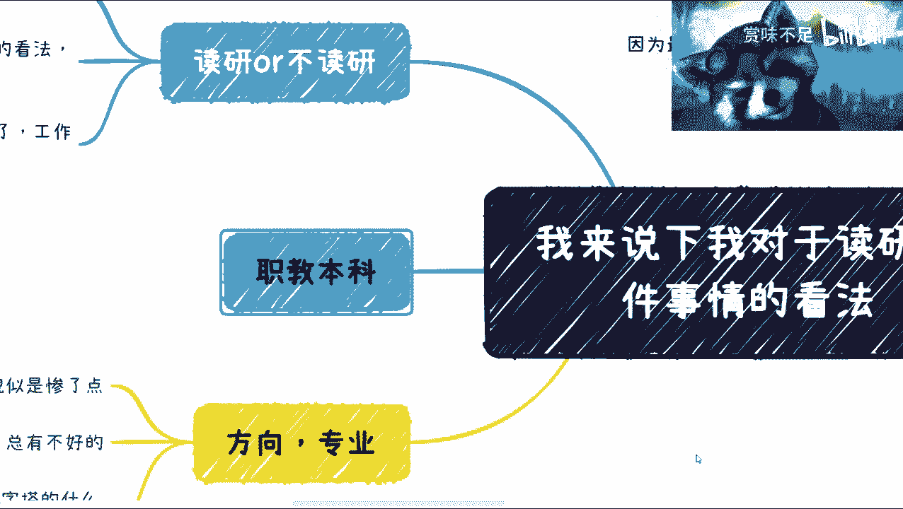
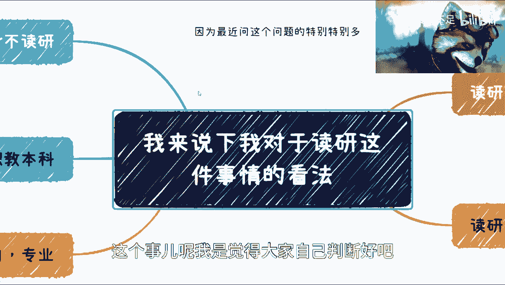
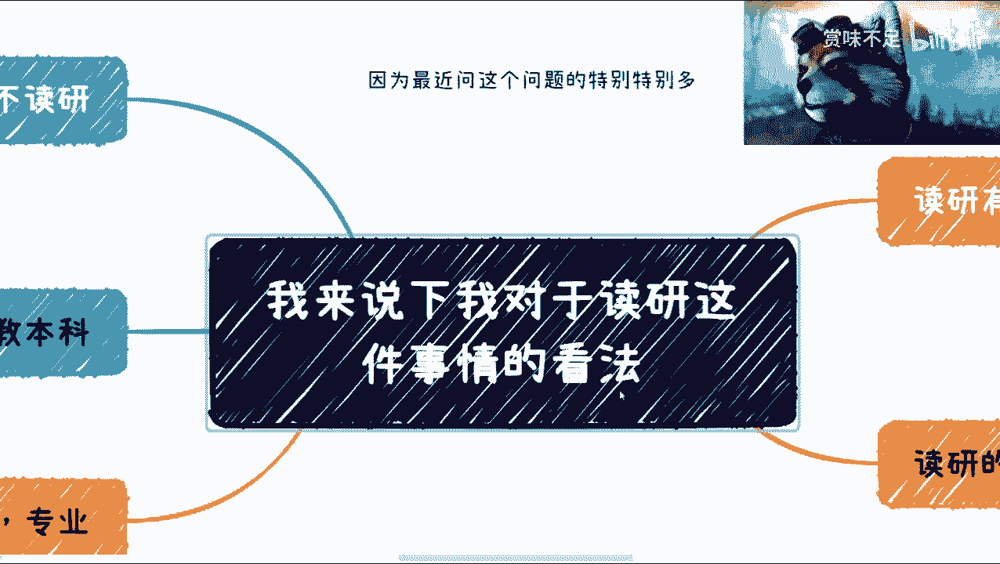

# 应大家要求，我总结下关于读研的看法 - P1 - 赏味不足 - BV1Y84y1A7LR

好大家好啊，又是我，我来卷了啊。

然后还有一个多小时我就要出发去成都了啊，不是重庆。

我觉得啊因为最近聊的人特别多对吧，然后我大概总结一下，我觉得说实话啊，我觉得大家问题并不在于这个找工作，还也不在于什么专业，也不在于这个这个叫什么，就是这个这个是什么地方对吧，或者说找找什么的公司啊。

我我觉得这个大家问题是在于，这个价值观和整个的这个思想上面啊，需要需要更进一步啊，就需要去寻找这个世界的bug回头，反正我觉得我昨天晚上想了一想，我觉得我可以单独开一期跟大家讲一下，我是怎么去。

嗯看待很多问题啊，以及思考这个方式的这个，反正也不是说大家一定要这么做啊。

大家可以参考，然后呢这个先说吧，先说还是说言归正传啊，先说到读研这件事情，因为最近呢有很多朋友纠结在读研啊，然后纠结在读研的这个专业啊。

纠结在读研要不要读对吧，然后什么方向啊。

我觉得是这样子的啊，捏了几个一个呢，你说读研有用吗，我说我的结论啊，我个人的结论是不能一刀切，但是久诚没有用啊，久诚没有用，那么这个时候呢我们就会面临一个问题，就是说读研读出来到底是个什么东西对吧。

你跟我说考公考出来啊，他他至少是一个身份对吧，或者是一个就是说编制对吧，这个我是可以认可的，你说读研读出来对吧，首先学历有什么用啊，这个东西呢后面我们会来说一件事情啊，但是一开始来讲呢。

我觉得这个东西呢是随着时间的推移，越来越来越没有用，这个概念怎么理解啊，两点第一点是所谓的这个长时间长时间周期，就是整个年代周期，比如说2000年，你一个研究生有用吗，那必然有用啊。

你2023年你再过来，你再读个3年，2026年，我问你有没有用，你自己想想就知道有没有用了对吧，你跑出来是这样子的对吧，你跑出来是这个学历啊，先写在那好，你人气摆在那，你说有多大用呢，对不对啊。

这是第一个，第二个呢，我觉得读研这个大家关心读的是什么，呃，我我和很多人聊过啊，包括我之前给一些学校的这个叫什么研究生，当时去开一些公开课的时候，我也发现你读研，我说的直白一点啊。

就大家读研很大概率是浪费时间啊，然后呢很大概率就是说把这个时间耗过去对吧，那我觉得是这样子的啊，就是你要说我们说这个呃接下来困难的时间啊，你要说接下来困难时间就那么3年啊。

你说我这3年就躲在一个山洞里面，可不可以可以啊，我觉得没什么毛病，但问题是3年之后又不是不困难是吧，我现在没法去预知3年之后到底怎么样，但是我只知道这个好也好不好也好，它不是一个开关啊。

它是一个周期性的，就大家不要觉得我好像是逃避某些事情好吧，这是第二点，那么第三点呢。

我觉得重要的是什么呢，就是说你读出来了怎么样，其实不重要，重要的是用人单位，以及市场对你是怎么看待的啊，很简单嘛，因为现在是一个就是就是我在评论区我也说过，就是现在是一个3年河东3年，河西三个月。

河东三个月，河西三天，河东三天河西的时代对吧，什么意思呢，就是说别人更看重的是利益导向，别人更看重更看重的是你能给我带来什么呃，你给我拿出一堆虚头巴脑的也没卵用啊，那你就拿我现在来讲的话啊。

我觉得比如说我要去找合伙人，或者我要去找一些合作方对吧，你说左边一个人啪拿出个地摊对吧，上面跟我说好，我清华北大某某某对吧，m i t啊，这个疙瘩对吧，各种各样的，然后我就问我就问他一句。

我就问他一句话，能不能给我赚钱，你的所擅长的东西，你的长处能不能给我带来利益，不能稳，对不对，我care你那些证书吗，其实一样的道理，你知道吗，就是咱不是说资本家不好啊，你所有的东西都是以钱为导向的。

或者来我们叫做以为以利益为导向的，对你利益不为导向，大家如何信任，如何合作，我可以没，我可以明确跟你们讲，所有没有利益关系的合作都是扯淡啊，你们未来就会知道的，就是没有所谓的人与人之间是没有信任的啊。

就是信任是怎么建立的，建立在大家一起赚过钱，大家一起去打过仗啊，这个叫信任啊，不是说我今天看你啊，我觉得你长得帅对吧，你面相好是吧，没卵用啊，没卵用啊，这个对对对，我说这个事情啊，那最近还有人跟我。

那个还有人跟我提这个这个找对象的事情啊，回头我再跟你们讲找对象的事情哎，是不是不是我。

我发现我都可以，那个那个半夜作为做这个万峰节目，哎是不是有些年代了。

很多人不知道万峰是谁是吧，哎呀那个接下来就是来说你要读研的过程，我觉得呢读研的过程啊，就是也直白点说对吧，导师的工具人，导师的免费劳动力，导师的韭菜啊，那么当然导师其实也是别人的韭菜啊。

只不过呢导师能比你们更少隔一一点啊，能比你们被少割一点啊，他可能还有些利益输送啊，你们是纯劳动力啊，所以说呢我觉得本质上呢就说不在于，不在于读研啊，读什么方向啊，也不在于读什么内容，唉就只能说吧。

只能说就是说学校里面其实都大差不差。

啊然后呢我们再来看啊，读研哦，不读研对吧，其实我觉得本质上就是从我来讲啊，久诚我还是觉得本质上工作经验比较重要啊，本状工作经验还是重要的，那么呃但是这个事情，你你你你也不能一刀切对吧，因为你说工作经验。

所谓工作经验这四个字太广对吧，你要真的能够去，你说有的人工作1年可以抵人家工作10年，对有的人工作工作工作10年，其实就等于一成不变对吧，那你说什么东西重要，他没法去比啊。

主要还是说大家怎么去提炼自己啊，怎么去总结，但是呢我就说了嘛，从宏观上来讲，我是不赞同主演的啊，因为就我刚才已经说了嘛对吧，而且尤其是当下这种大环境上面，我更不赞同啊，当然这只是我的看法。

大家只是尽仅供参考啊，然后呢，我觉得呢，这个人与人差别肯定是比人与猪差别还是大的，对吧，我不是侮辱猪啊对吧，那有的人呢很努力对吧，我也见过啊，然后呢这个读完研学历也有了，工作经验也有了。

当然这个工作经验我不是说泛泛的，他他会去选对吧，比如说好的项目啊，好的工作啊，哎呀我跟你们讲，你们别来问什么呢，就是哎呀我我也想有好的经验，我也想好的工作啊，我找不到，我跟你讲没什么找得到找不到的对吧。

我跟你们说，我毕业时候对吧，这个两手一摊什么都没有啊，这我我还是个单亲家庭是吧，我家里没钱对吧，我毛都没有是吧，你你所有东西没有到，有，这是个过程，这个过程怎么来，那只能靠你自己啊，对吧啊。

回头我跟你们说，我会再单独开一期给你们讲一下怎么去对吧，这个鉴别一些这个这个靠谱的人啊，靠谱的项目啊对吧，其实跟你们鉴别一些靠谱的对象，其实是一样的啊，这个哎呀我跟你们说啊，就是很有一类人啊。

我觉得我没有映射影魔，有一类人是什么呢，就是他会跟你说，我找不到对象，但是呢他也不找诶，他也不找，然后呢他就不停给你说。

我找不到对象，唉就就无解，你知道吧，我放弃了，我已经啊。

然后那个啊继续来说这个方向和专业啊，我觉得呢呃其实都大差不差的，没什么很大差别，因为一样的吧，你放一个差的方向里面，差的专业里面也有多好的一个好的方向，一个好的专业里面也有混的差的，这个你怎么去说呢。

对吧，然后喝口咖啡啊，对吧，当然了，从这两天沟通下来呢，我觉得土木好像是有点惨，我也不知道为什么，因为我之前的确对这块不太了解啊，那我发现真的这个转行的，然后说自己惨的都是土木的，我也不知道为什么啊。

这么惨嘛，是吧嗯然后呢，本质上呢我觉得你要明白你能做什么啊，一个方向上总有好和不好，哎呀这个事情是这样子的，我跟你们说，我面试到现在我起码不说几千人，几百人总共是有的对吧，我跟你们讲，我面试别人说。

我就发现妈的，我就不想骂他们，因为我周围的面试官，我还得有一些这个基本的修养是吧，就是我跟你们说啊，就是他们拿出来这种简历，拿出来这种经验，哎呦真的是绝了，就是就好像是什么，我给你举个例子。

这就好像有个人在流浪地球二里面打工，然后拿出文简历说我我参与了流浪地球的拍摄，你知道吧，我跟你们说企业用人单位，你的mentor，你的manager或者说你的合作伙伴只关心什么，我不关心流浪地球二。

我关心的是你做了什么，你知道吗，就是很多人这个简历拿出来啊，就是他跟你描述问题，他给你简历拿出来从来没有重点，就跟你说半天这个项目很牛逼啊，这个这个项目什么百度里面top问的对吧，然后我就问他。

那你做了什么，你只要问他，你但凡往细了问哎呀，100个里面99个人说不出为什么为什么，这是因为他们压根就没在里面没做过啥东西啊，拿着狐假虎威嗯，你知道吧，所以说我觉得呢读研也是一样的，你知道吧。

你要今天跟我讲直白一点，你要今天跟我讲，我读研就是为了学历好，没问题，我屁都不放，说随便你爱咋地咋地对吧，你但凡跟我说哎呀我有点焦虑了对吧，我也想这个这个选这个怕方向选的不好的，专业选的不好的。

那我就跟你讲，好不好不重要，重要的是你学到了什么，你积累了什么，你认识了谁，你那个结束之后，除了张学历，别人只有学历，你还有什么对吧，我觉得这是关键啊，这个这个别的不重要，我跟你们讲真的不重要啊。

一晃就晃过去了3年对吧，啊然后呢这个再来说啊，我觉得呢这个本质上呢就是说先审视自己啊，什么叫审视审视自己呢，就是说呃金字塔对吧，你看看你属于金字塔的上层呢，中层呢，而偏上层呢还偏下层呢，还底层呢。

当然我相信没有人愿意承认自己是底层，但是你不承认不重要啊，你自己审视客观的审视就可以了，对吧啊，那你比如说我我毕业的时候，我就是个垃圾啊，我可以明确跟大家，我我跟我跟很多人说过的。

我说我毕业时候实习对吧，我是2011年毕业的嘛对吧，就这么垃圾啊，那怎么办呢，哎呀然后那个那个你适合做什么事情对吧，你适合做什么事情，你要去想你的长处是什么对吧，你就拿我来讲。

我明显知道我自己不适合写代码对吧，所以我写了7年7年代码之后我就不写了，你要我写到现在，我卷卷你卷死我，你把我弄到棺材板里面，我都写不出来，没办法的，对对对，就是你说我找份工作可以吗，可以没问题的。

哎呀这找份工作不是分分钟的事情吗，但问题是这工作是我想要的嘛，对吧啊，你哎这不一样的对吧，所以说呢就是说我建议大家就是说啊，你们就应该现在是考虑了，因为如果不读研的呢，我觉得本科呢你们还小，那读半年呢。

你你你们年纪也不小了对吧，我跟你们说，我跟你们说本质是什么，本质就是你们但凡想赚点钱，我所踩过的坑你们都会踩对吧，那我为什么会去说这些视频，就是希望大家少少再点开，没必要啊，你说是吧，这个人类是进步的。

这个所有人类都他妈踩一样的，可能那人类还怎么进步啊，你说是不是啊，那最后再来讲一个哎呀。

我要去赶飞机了，是不是啊，来得及啊。

最后再讲一个哎呀，我跟你们讲这事情我正老生常谈，我都不想说，就是你们会发现我所有视频里面很多地方，我都谈的是什么，要去看政策，你知道吗，但是呢我跟你们讲，有很多人呢就是那种不以为然啊。

就跟我说我就不看啊，垃圾啊，这都是骗人的啊，怎么样，我跟你们讲啊，你们要么就走啊，你们但凡没能力走的啊，落在这片土地上的对吧，那你要尊重这个政策，我跟你们说，不尊重政策，你们是赚不到钱的啊。

我就就这个结论扔在这了，知道吧，真的是啊，我跟你们讲啊，这个前两天我在跟我朋友聊她生孩子的事情，哎我跟你们讲，回头我再跟你们说生孩子的事情，哎呀真的管天管地，那个你们去看一下职教本科，我之前说过了。

你们去看一下职教本科，我为什么会在今天读研这个话题里面，讲讲这个东西呢，是因为职教本科在第一个阶段里面，是一个10年规划啊，10年规划，那么执教本科顾名思义对吧，其实本质上来讲。

是更注重职业教育的一个本科体系，当然现在叫职教本科，未来可以叫执教这个这个研究生或者职教硕士，或者直叫什么，我不知道啊，但这个要看政策对吧，但是呢整个这个方向为什么我要提出来，是因为我想告诉大家的是。

整个中国未来职业教育是大的方向，整个中国未来就业才是大的方向，而不是唯学历论啊，这个时代已经过去了，这个就跟互联网是一样的，好吧，就是就是你们千万不要产生这种错觉，是什么呢，就是说今天找不到工作。

我今天赚不到钱，是因为我学历不够，no啊，我可以明确告诉你们，no点在哪里，是你们能力不够，是你们给出来的价值不够，不是你的学历不够，你明白吗，你一定要明白商业的，就你一定要明白你找工作和去呃。

怎么说呢，就去去去赚钱的本质，你找工作跟赚钱的本质是在于，你能给对方带来多大价值，而不是你这张学历能给你带来，为对方带来多大价值，哎呀是不是我个人建议啊。

就是你们也可以把这个视频呢，或者这个观点呢跟你们爸妈分享一下，因为我觉得你们的爸妈呢，应该是比较开明一点的，毕竟年纪还轻一点对吧，就是就是当然了，这个每一个时代都有，每个时代都固有思维啊。

回头我再开一个新的专题，就是说我会跟大家去分享一下，我去看一些事物的一些一些态度，当然啊我也不是一开始就这样的啊，我一开始跟你们一模一样啊，但是我后来是没有办法。

就是就是我可能比如说我我只有两个选择对吧，一个是盖棺材板，一个就继续活下去，那我我变成现在这样，我就被被迫无奈啊。

那那要么就盖棺材板是吧，哎呀没办法行吧好吧。

然后那个这个事就这样子了，这个事儿呢我是觉得大家自己判断好吧。

自己判断自己去想，我最后再提一点。

就是说你们有任何呃比如说要投资啊对吧，或者说当然是让我找投资啊。

不是让你们给我投资啊，别到时候有人他妈说我骗钱。

对吧，因为但凡呢有些什么东西，比如说是需要嗯这个资源帮忙的，你们反正可以找我，有资源吗，我就帮对吧，有钱一起赚啊。

没有资源吗，我也可以给点建议吧，反正就这么回事行吧。

就这么着吧。