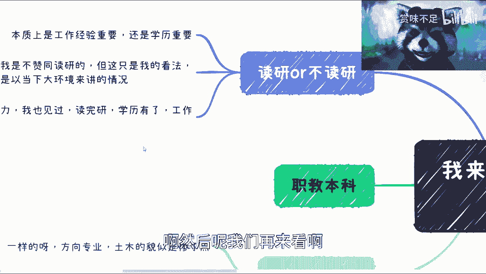

# 课程一：关于读研的思考与决策指南 🎓

在本节课中，我们将探讨关于是否读研的核心问题。我们将分析读研的价值、市场需求的本质，并提供决策框架，帮助你基于自身情况做出更明智的选择。

## 概述：问题的核心

最近与许多人交流后，我发现大家的核心问题不在于找工作、专业或公司选择。问题的核心在于**价值观和思维方式**需要提升，需要学会寻找世界的运行逻辑。

上一节我们明确了问题的本质，本节中我们来看看具体到“读研”这件事，我们应该如何思考。

## 读研的价值：长期与短期视角

首先，读研有用吗？我的结论是：**不能一刀切，但长期来看用处有限**。

这引出一个问题：读研的产出到底是什么？考公获得的是编制身份，这个价值明确。但研究生学历本身的价值，正随着时间的推移而递减。

可以从两个时间维度理解：

1.  **长年代周期**：在2000年，研究生学历非常有用。但到2023年再读3年，2026年毕业时，其效用已大打折扣。学历只是一张纸，其附加价值正在降低。
2.  **个人时间周期**：许多人读研，很大程度上是在**浪费时间**，只是为了把三年时间“耗过去”。但需要明白，困难时期不是只有这三年，三年后挑战依然存在。逃避不是解决办法，经济周期有起有伏，并非一个简单的开关。

## 市场的逻辑：利益导向

第三点，也是至关重要的一点：你读研后怎么样并不重要，重要的是**用人单位和市场如何看待你**。

当前时代变化极快，可以概括为“三年河东，三年河西；三个月河东，三个月河西；三天河东，三天河西”。在这种环境下，市场是纯粹的**利益导向**。

**核心公式：合作信任 = 共同创造的利益**

无论是寻找合伙人还是工作，对方最关心的是：**你能带来什么实际利益？** 你的长处能否转化为收益？华丽的学历证书若不能解决这个问题，则意义不大。

人与人之间的信任，建立在**一起赚过钱、一起打过仗**的基础上，而非虚无的感觉。所有没有利益关系的合作都难以持久。

## 读研过程的本质

那么，读研的过程是什么？直白地说，研究生常常是**导师的工具人、免费劳动力和被收割的对象**。当然，导师也可能处于更大的系统链条中，只是被收割的程度相对轻一些，可能还有些利益输送，而学生往往是纯粹的劳动力。

因此，问题的关键不在于读什么方向或内容。本质上，学校里的情况都**大同小异**。

## 工作经验 vs. 学历

从宏观和个人角度，我倾向于认为**工作经验比学历更重要**。

当然，“工作经验”四个字范围很广。有人工作一年抵别人十年，有人工作十年却一成不变。关键在于**如何提炼和总结**。但总体上，尤其在当前大环境下，我不赞同盲目读研。

人与人之间的差异，远大于人与猪的差异。确实有人通过努力，在获得学历的同时也积累了有价值的经验。但这里说的“工作经验”不是泛泛而谈，而是指有意识选择的、参与**好项目**的实战经历。

## 方向与专业的选择

关于读研的方向和专业，我认为**差别不大**。

差的专业里也有优秀的人，好的专业里也有混得差的。关键在于个人。当然，从近期沟通看，土木工程专业的朋友似乎处境比较艰难，转行和诉苦的较多，这可能是个特例。

本质上，你需要明白**你能做什么**。一个方向上总有好与不好，你需要找到自己的位置。

## 关键：审视自己与创造价值

以下是做出决策前需要进行的核心思考：

1.  **审视自身定位**：客观评估自己在金字塔中的位置（上层、中层、底层）。例如，我毕业时自认是“垃圾”，但这是改变的起点。
2.  **发现自身长处**：思考你适合做什么。例如，我写了七年代码后，明确知道自己不适合，于是果断转型。找份工作容易，但找到想要的工作需要自我认知。
3.  **聚焦价值创造**：无论是求职还是合作，本质在于**你能为对方提供多大价值**。简历和经历的重点应是“你具体做了什么”，而非“项目有多牛”。很多人简历华而不实，经不起细节追问，因为他们并未创造核心价值。
4.  **关注政策导向**：这是一个老生常谈但至关重要的点。如果你生活在这片土地上，必须**尊重并理解政策**。不关注政策，很难把握趋势和机会。例如，“职教本科”被纳入十年规划，这预示着未来**职业教育**和**就业能力**是大的发展方向，而非唯学历论。

**核心结论：你今天找不到工作或赚不到钱，主要原因不是学历不够，而是你提供的能力和价值不够。**

## 总结与建议

本节课中我们一起学习了关于是否读研的决策思路。

我们来总结一下核心观点：**研究生学历的长期效用正在递减；市场永远遵循利益导向；读研过程可能伴随价值损耗；相比学历，能创造价值的实战经验更为重要；选择专业不如聚焦自身能力建设；务必关注宏观政策导向。**

最后，请将你的决策建立在**客观的自我审视**和**清晰的价值创造逻辑**之上，并与家人理性沟通。每个时代都有其固有思维，但我们需要保持开放和学习的态度，以适应变化的世界。

---
**注**：以上内容仅为个人观点与分析框架，仅供参考。请结合自身实际情况，独立做出判断。若有具体项目或资源需要探讨，欢迎交流。