# 应大家要求，详细谈下什么是商业价值 - P1 - 赏味不足 - BV1Es4y1D7Rg

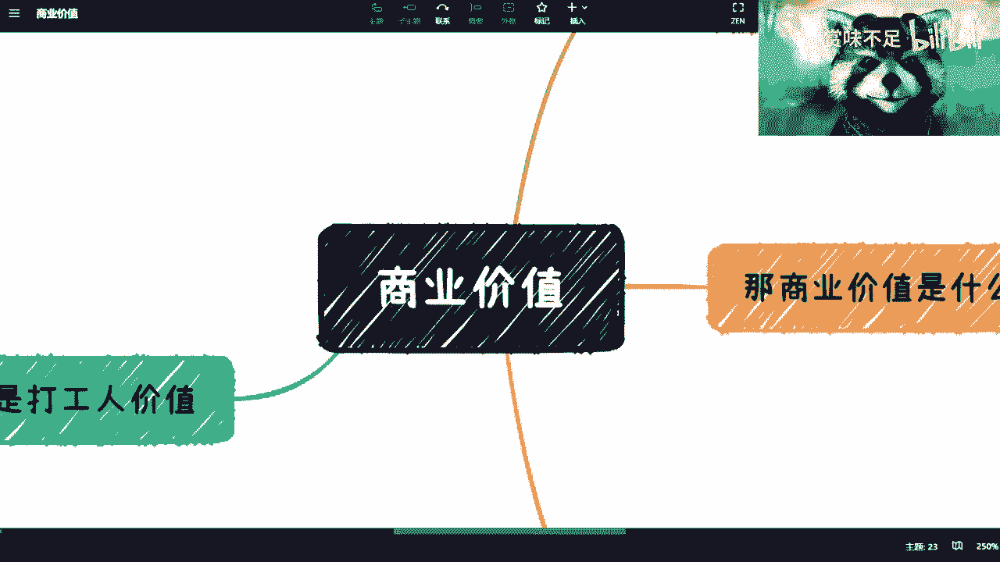

好了好了，你们的驴老师出现了，驴老师忙成驴了，已经，昨天在华师大嘛，然后也线下跟那个这个研一研二的同学们，聊了一下，然后这个私信呢，其实我我所有应该都回了对吧，评论我也都回了啊。

然后商业价值呢确实有很多人问我，因为一直我提到这个词，而且大家也都跟我提到，他们要学技术，你知道吗，那我觉得索性吧，就还是要说一下这个商业价值啊，就是因为很多人都问我。

那既然同一个问题，我就还是要出一下对吧，我觉得这个东西也没什么不能说的啊。

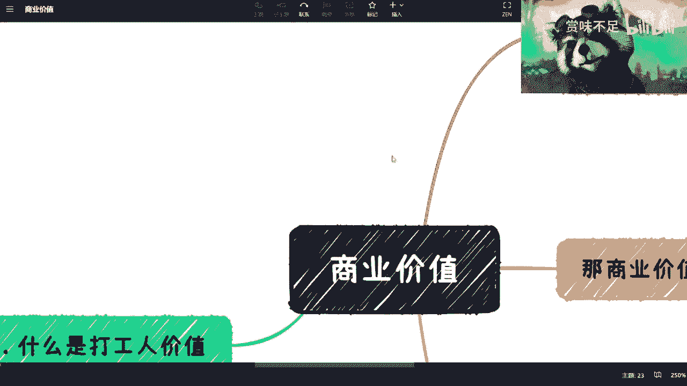

也不是说一定要大家付钱才能讲是吧，首先是这样子的啊，你既然要说商业价值，那我们就要来提什么呢，就是打工价值对吧，你你每一个价值肯定都有对应的，这么一个东西吗。

那我把这个放大一点啊，好啊，打工价值对吧。

那打工价值，首先啊这个地方我写这些就感觉东西蛮多的，首先呢大前提啊还是那个观点价值，这个东西呢不是我们自己定的，是别人给我们定的，你明白吗，就是说就是说客观的说，我之前不是也跟大家说嘛对吧。

就客观的评估自己是一个非常大的能力对吧，不要妄自菲薄，也不要这个这个叫什么，就是天马行空是吧啊，呃也也就也不要眼高手眼高手低啊，所以说呢一定要明白，就你觉得多么牛逼没有卵用啊，要我觉得你多牛逼。

或者你的这个甲方觉得你多牛逼对吧，你自己觉得牛逼没冉冰卵啊，这是第一点，第二点呢就是说既然是别人定的，那么问题来了对吧，你我们打工的时候。

我们的价值是什么，对吧好，首先我一个个来看啊，第一个学历价值对不对，好，那学历价值这件事情呢，我这个地方在这个地方公开再说一下啊，学历价值随着时间的推移，它只会越来越小啊，除非你是一个MIT对吧。

或者说哥大怎么样对吧，清华你可以一直挂在嘴上，无所谓，剩下的在我看来，你过了几几几年甚就现在来看，可能一到也不用，120到两到3年，3年左右，你这个学历价值就是零啊，没有E的一点意义都没有，因为为什么。

因为已经卷的不行了，学历已经没有卷不出水了，没有任何水分来卷了啊，而且本质上来讲，你从打工人的角度而言，就是所谓什么叫打工人，打工人就是你能做事情对吧，你执行力强对吧，你你听话我们说啊。

就是说客观的说啊，就是你听话对吧，你这个能能能压榨对吧，你能加班对吧好，那么你会发现这些所有的能干嘛干嘛，里面没有一个跟你学历是挂钩的对吧，你明白这个道理吗，就是说就是说我们看这个社会。

一定是一个看本质，透过表象的对吧，那表象是什么，表象就是企业希望学通过学历来做筛选，但是本质是什么，本质是他们要求驴，而且是听话的人，对不对。

好，那么你既然明白了这个本质，你自己想想看啊，你自己想想看，你说好，我要为了这个学历去卷N年对吧，然后还要出国出国回来再卷，你不是脑子瓦特了吗，对不对啊，但是呢也有很多人说他说驴老师，你这个说法不对啊。

我这个学历不行，我连敲门砖都没有好可以啊，你这句话说的对啊，那我来跟你再继续分析一下，在我的认知里面啊，是这样子的，你最低是个本科啊，专科别来跟我讲专科，我觉得你还是要去读的对吧，你最低是个本科。

那么你作为一个本科来讲，你往后走对吧，好稍微降低你的预期，稍微积极一点，包装一下，我觉得你们是找不到工作的，你们不是找不到工作，但是问题是什么，问题是随着时间的推移，可能你们工作三到5年之后。

你们就真的找不到工作了，你明白这个意思吧，也就是说可能过了一段时间之后，你们再包装再怎么样，你们可能就真的找不到工作了，因为你们卷不动对吧，那这个时候我就问嘛，你们前期所付出的时间跟金钱。

你们是图啥图这张纸啊，再加上在中国整个大战略大战略上面，是职业教育的未来，你跟我说你图这张纸你们自己想是吧。

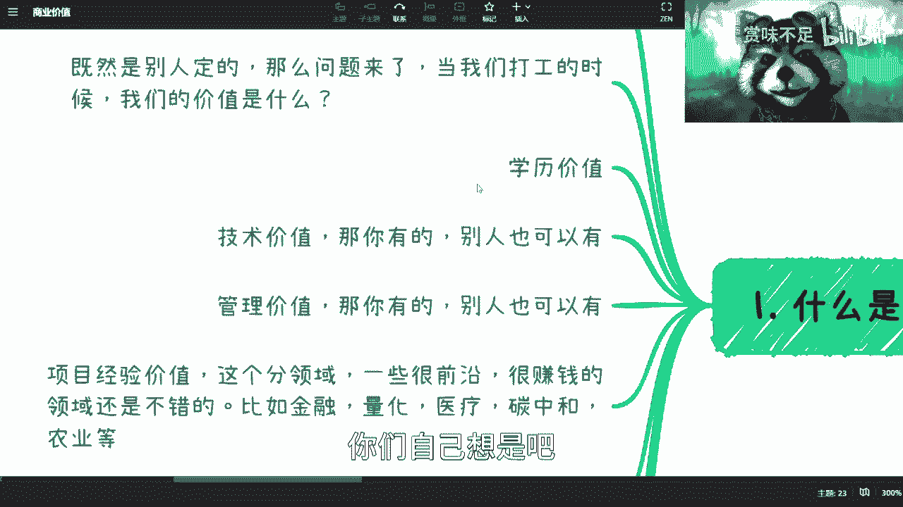

真的我跟你们说，你们现在大部分人我觉得是不明白我说的点呢，因为我没法说透对吧，那说透我人都没了对吧。

但是你们未来一定会明白的，我跟你们讲啊，首先是第一点，第二点呢基数价值对吧，好技术价值呢是大部分人拥有的东西对吧，不管你做开发，做项目经理，做产品经理啊，对对对，我还补补，我还补个产品经理对吧。

我靠他妈忘了，稍等啊，哼让让我让让我记一下，记在我的小本本上，我靠他妈不行不行不行，最近最近最近脑子不行，最近最近吃不太行，稍等让我记一下，不借我就真的忘记了，产品经，好对吧好，那你记住价值对吧好。

那么我们说基础价值这个东西退1万步来说，去头去尾，也就是去掉所有所有的顶端top精英对吧，去掉下面的什么都不会来哈哈，我是的，网友要跟我说了，陈老师驴老师，我就什么都不会的，别这样好吗，别这样啊。

这个聊天聊不下去了，技术价值，那你有的对吧，我认为在金字塔中层的大部分的人技术价值，你有的别人也有，那么毫无疑问嘛对吧，谁卷不来呢，谁谁谁卷这点东西谁不会啊是吧。

我报个平民班，我都能卷死你是吧啊，管理价值，那么这个是比技术价值稍微另外一条线的，这也是，为什么有非常多的人在职业规划时候说嘛，我一开始做技术，后面做管理对吧，都这样，是的，我跟你们讲啊。

这个很多人有一个固有的思维，这是不对的，就觉得管理比技术牛逼啊，牛逼个屁，你不都是驴吗，有什么区别呢，对吧啊，管理价值，你那你有的别人也可以有，而且我跟你讲管理价值这个东西很虚啊。

你说你有management，我也说我management，那他妈的怎么弄啊，我们现场打一架还怎么说啊。

是吧，唉这个东西很虚啊，这一点那当然还有什么呢，你的打工价值还有什么呢，就是这个项目经验价值诶，这个东西呢是有道理的啊，比如说呢你以前遇那个狗屎运不错对吧，接触一些很前沿的东西啊，很赚钱的领域。

比如说金融量化啊，医疗嘿嘿换换位置啊，无所谓对吧，这个碳中和对吧，然后农业对吧，或者我就不能全部列出来了，对吧等等等等等等等啊，那比如说你们以前在什么中国联通，中国移动啊，做了一些很牛逼的项目对吧。

那这些其实就是一个很有用的啊。

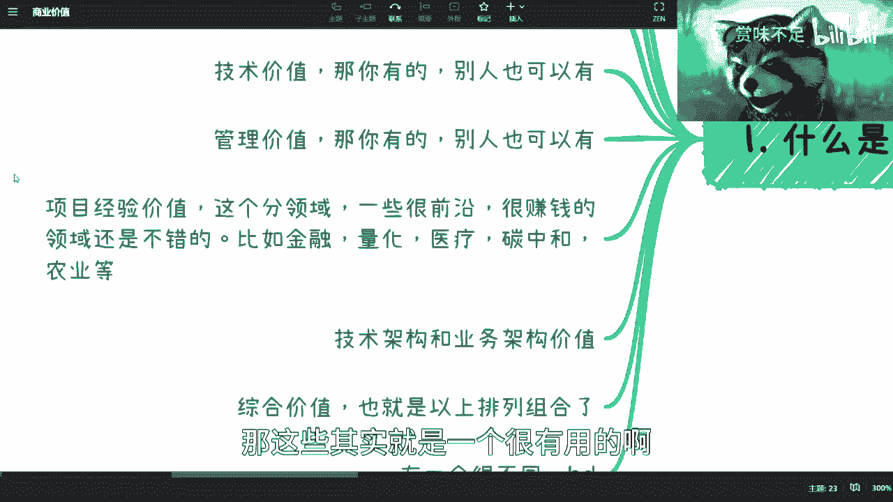

很有用的，那么在网上呢就是技术架构和业务架构啊，因为这个呢就有点就是在总监，或者在一个综合股管理岗之前的，最终的一个岗位了，就是技术架构和业务架构，那这个呢相对来讲是说呃。

你别看这里的技术架构跟业务架构是分开来的，但是往往技术架构跟业务架构呢，它只是一个呃名字啊，但是他的这个精通的地方它是一个互通的，比如说技术架构八成是技术，二成药对业务很了解。

那业务架构同样的八成是业务，你二成也得对技术技术很了解，你不能说你只做技术架构，你这业务毫无了解对吧，或者了解就是一个junior的，那他妈没卵用啊对吧，哎我太粗俗了，你看我昨天在华师大。

我还是很很很很很很收敛的，是的啊，然后然后这个综合价值对吧。

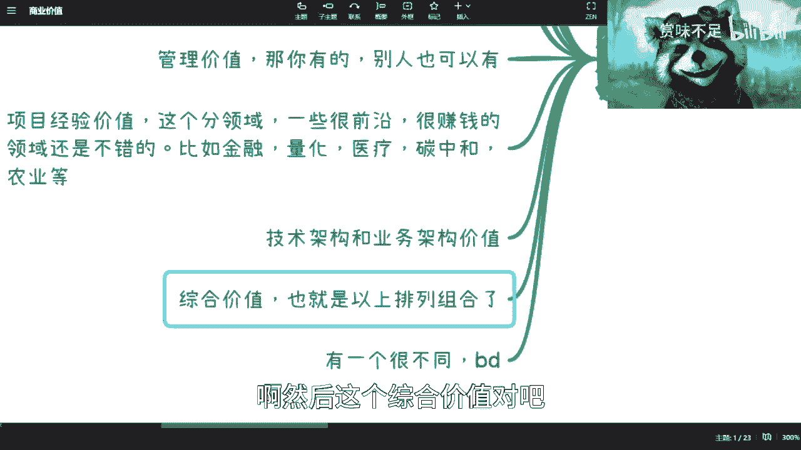

就是以上排列组合，那综合价值呢就是并不是说你要所有的东西。

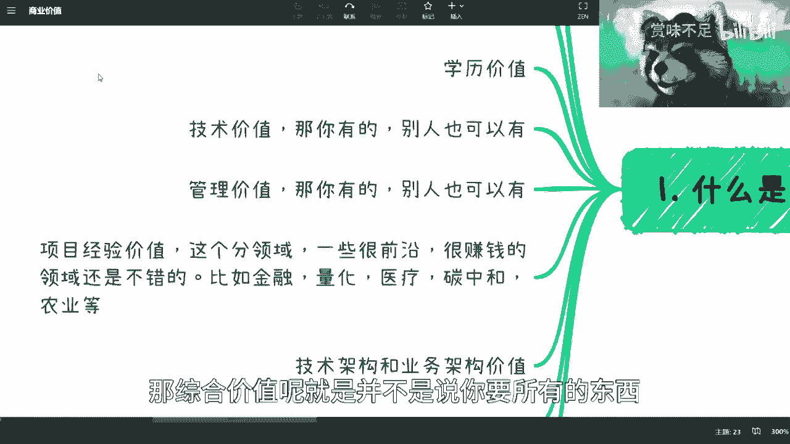

而是说你可能又这其中的一两样对吧，三四样啊，那么你就可以综合排列的，那综合排列呢，其实就是说一个比如说总监啊对吧，或者说一个一个一个一个一个CONFOUNDER，下面的一个岗位啊，叫什么并不重要对吧。

那这么一个角色啊。

那么这种的话其实也属于打工范畴的，但是在这里面只有一个岗位啊，它被称之为岗位，但它价值不同是什么，就是BD啊，因为BD他就是销售嘛对吧。

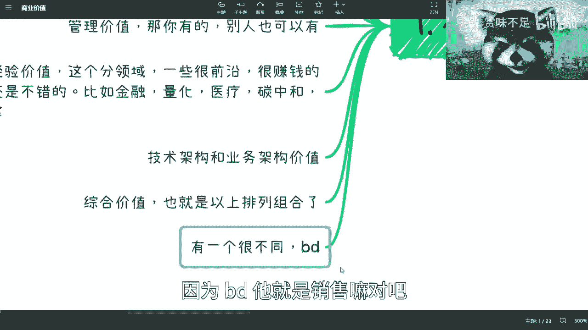

销售确实卖的是什么，他就以上这些东西卖的是你这个人啊。

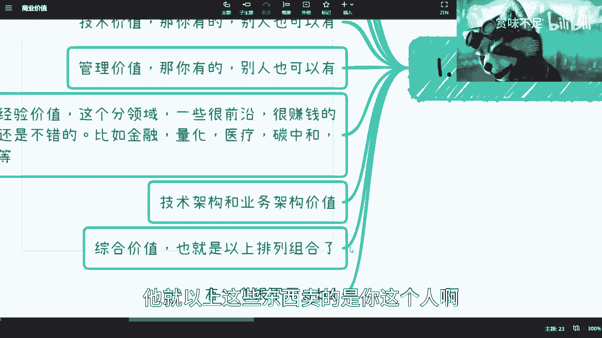

但销售不一样，销售卖的是什么呢，其实销售本质上卖的是他的陈丹，就他的什么呢，叫做把资源能够转换成收入的这么一个能力，但是最终的价值判断是怎么判断，是看你有没有承担啊。

那么这个时候呢就是如果你是一个经验丰富，因为我们说实话啊，BD这个岗位呢我没有看到或不会聊的啊，个个都比我会聊对吧，但是的BD这个岗位有个很大的点在哪里呢，就是他真的得要有所谓的。

就是说啊背靠背的那种关系啊，因为很多BD对于甲方和对于乙方，他都是个工具人，而一旦他从甲方或乙方跳槽了之后，别人是只认甲方和乙方的，他是不认你这个BD的，那这个时候你这个BD有卵用对吧啊。

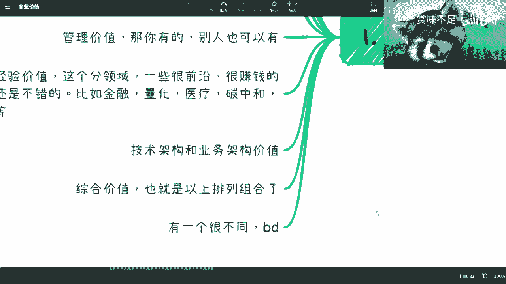

那所以说呢就是说这个时候啊，我们说这个是假打工人价值，你们可以自己这个这个对号入座一下。

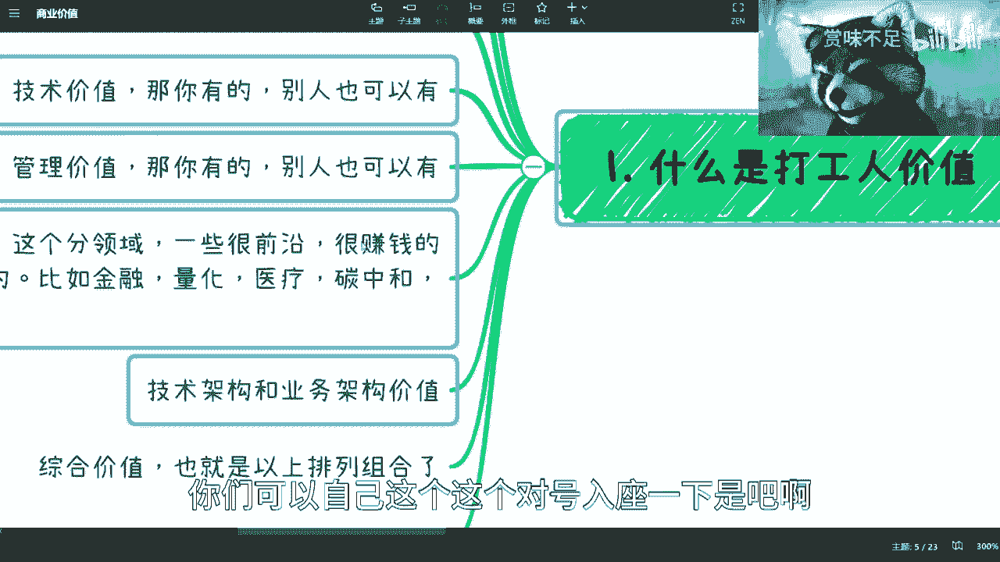

是的啊，那这是第一点，第二点是什么呢，那么问题来了对吧，他说我就问你们啊，你能打几年工，那你有自信跟我说，你未来能打几年工，你自信能跟我说，你未来能稳定打几年工。

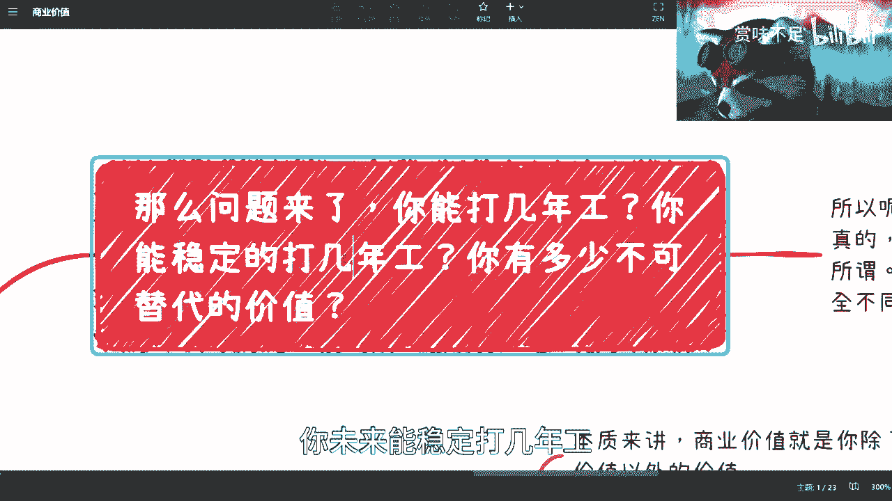

你自信能跟我说，你有多少不可替代的价值，你们对比一下这边哎，哎对比一下这边你们觉得有吗。

有吗啊，就随着去年1100万应届生，明年今年1200万应届生，明年可能1300万应届生，再加上各个公司的裁员下来的人，请问你们有吗，哼我觉得没有啊，我反正是没用啊，我承认我我跟你们说。

我私信回很多人的时候，我都跟他们讲，我说为什么我卷我不想卷，是因为我承认我卷不动。

我卷不过人家啊，我要卷的过人家，我早就去卷了，对不对啊，然后呢在这个里面啊。

打工人啊这个价值啊，这价值里面有一点是这个啊，有很多人就说了，他说驴老师啊，诶那我要是有这个呢对吧，那我不是就卷的过人家吗，从这些东西来看诶，这个东西是很的，对不对，就这项目经验哎，对我跟你讲。

你说的对，但是我就问你，我就问你啊，好这件事情所谓你能转动是什么概念，是你得碰到一个用工，就是一个公司，又同时他是做你对应的这个项目的经验，又同时他能看中你，又同时他又能够让你去面试等等。

所有巧合碰到一起，你才可能发挥这个长处，那请问你有多大概率。

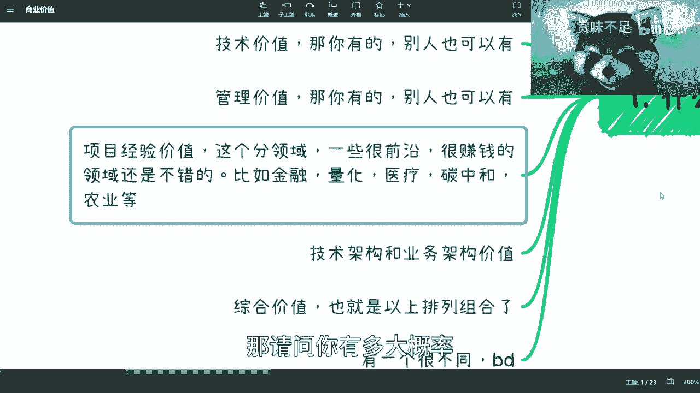

或者说你有多大的信心能跟我保证，你能碰得到对吧，这就是我为什么说，以前人家就说是心字都会发光的，是是非是会发光的，那请问发光前你是不是已经饿死对吧，所以我就说这个是你们要去考虑的点，对吧啊。

而不是说你们就一直在跟我说啊，我今我现在有一个offer，我要不要去对吧，我明年有个offer要不要去，你去可以啊，去了对吧，你可能过两年也不用，过两年过半年你又来找我，那驴老师我被裁了对吧。

那接下来我应该怎么办。

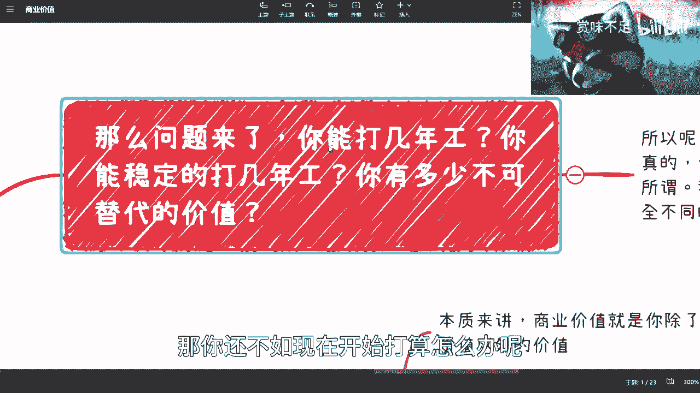

那你还不如现在开始打算怎么办呢，你说是不是啊啊对吧，然后这是一个，那所以呢我跟你们讲啊，我最近在跟很多本科同学同学聊下来呢，我就觉得是这样子的，你不能啊，你不能不看现在就看现在不看未来。

当然你要不看也行，也无所谓，我只能说接下来发展跟以前20，互联网20年是完全不同的，什么意思呢，就是你们不要去看以前的互联网的历史，不要去看以前的，就整个很多前辈的这种叫做职业发展方向，也不要去看。

为什么呢，因为不是说他们的东西没有参考价值，而是他们以前相比，我们现在环境其实已经很安逸了，因为我们现在环境非常恶劣，但是你们可能还没有了解到多么恶劣，但我可以告诉你，非常的恶劣啊，非常的恶劣。

非常非常的恶劣啊，所以啊所以就说你们现在不看，在我看来是没有区别的，你们未来早晚都要看，但你们早晚要看的时候，你会发现当时到时候还比现在要卷，可能几几何倍数的卷啊。

那这是一个，那么我们说说了半天对吧。

你说商业价值啊，那么商业价值是什么呢，啊是这样子的。

有几点，第一本质来讲，商业价值就是除了你打工，我刚刚在里面列的这些价值以外的价值。

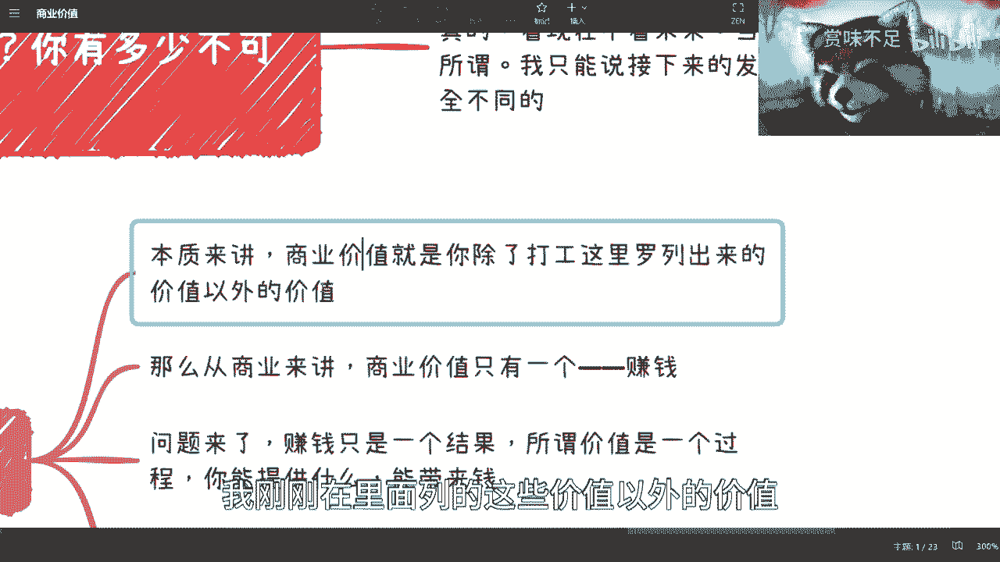

那么我们列的这些以外价值是什么呢，商业价值的评定只有一个点，就是赚钱，当然这个点我得扩充一下，这个赚钱并不是说你一定能赚到钱，而是你的资源或你这个人身上的某些东西，能让对方觉得他能够利用你来赚钱。

你明白吗，那么打工为什么没有这个属性，是因为打工你过去对他来讲，你就是个打工的，所有赚钱，这些这个商业逻辑路线当中跟你没半毛钱关系，为什么没有半毛钱关系，是因为今天这个打工的岗位是你也好，是别人也好。

对他来讲不重要，对他来讲，他只要一个岗位能打工就可以了对吧，所以这就好像我为什么跟很多人私信的时候，我会说我说比如说我现在创业了对吧，我要一个加班的工程师，那这加班的工程师是今天。

只是你呢张三呢是李四呢，我我care吗，who care对不对，who care啊，我只要一个弄假发的，我靠我他妈全世界找不到一个做假发的嘛，对不对啊，所以说呢就是说在这个我们不叫，我们不一定说资本家。

从资本家创业者的角度来讲，你能给我带来赚钱的，你能给我带来价值，赚钱的价值是什么，就是你要让我觉得能直接带来利益啊，而不是让我觉得我要一个打工的人，因为今天我要一个夹包工程师，对我来讲。

这个商业利益是谁弄来的，是我争取来的，是我的单子，是我的渠道，是我去做商业谈判，而你就是个工具人，你不做，OK我随便找谁做，是不是这个道理，就这样子对吧好。

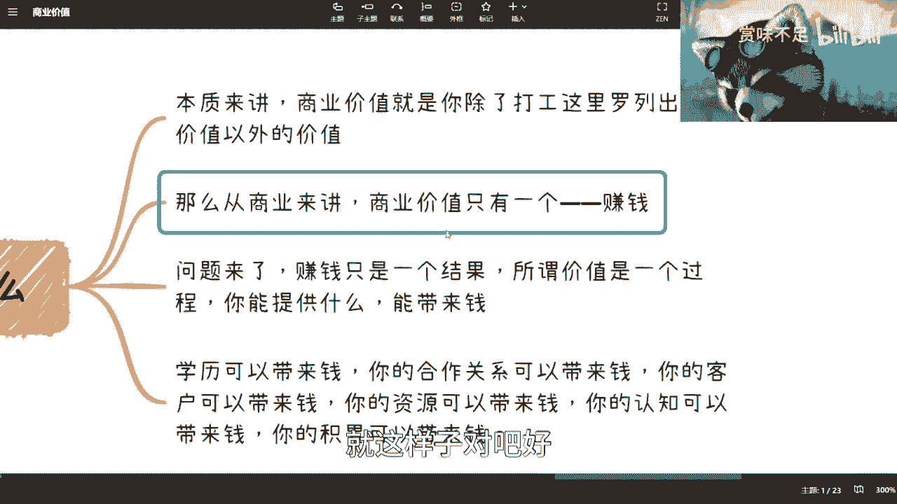

那么问题来了，赚钱既然只是一个结果，那么所谓价值是一个诶，有谁加我吗，啊没有，那所谓价值是一个过程。

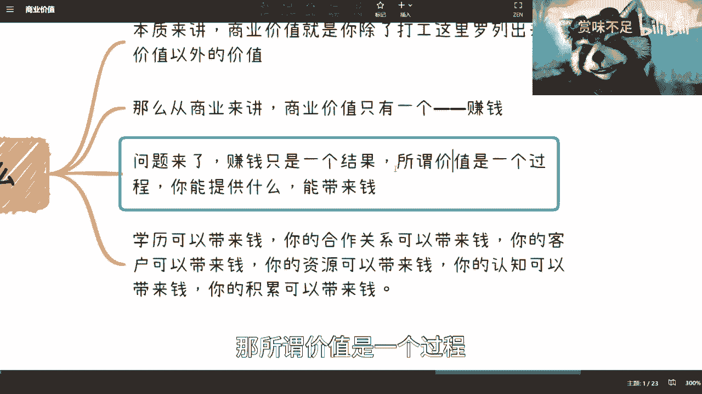

那请问你是提供什么能带来钱对吧，这就是我们刚刚说的啊，好那么我们来看这边，我列了一下，但是并不是全部，你们可以思考一下啊，第一学历是可以带来钱的啊，那刚才又要说了，驴老师。

你刚刚说的学历是他妈的没卵用的对吧好，我跟你讲哪些什么时候学历是可以带来钱的啊，当这个创业者，当这个资本家是专门做学历生意的，什么叫学历生意呢，就比如说他是专门去招了，有高学历的人可以来拿政府补贴的啊。

我跟你们说，每个地方每个区政府，每个地区甚至每个街道都是有的啊，他去薅这个羊毛也好，或者他去正轨去拿这个补贴也好，我不无所谓，但是这个时候你的学历就会给他带来钱的，比如说你的博博士。

硕士都是可以给他带来钱的，那这就是你的价值，但是你们一定要明白一点，这种培训的啊，不是这种学历带来的钱，它是一次性的，也就是说你价值有吗，有一次性的啊，明白啊，这第一点，第二点是你的合作关系可以带来钱。

就比如说你说哎驴老师，我们可以合作一下好那我就问你，你以前合作过哪些合作方，哪些合作方跟你这个签过战略合作，哪些合作方跟跟你一起赚钱，你告诉我对吧，那这个时候你说哎这个驴老师对吧。

我比如说某些这个政府对吧，合作过的啊，虽然合作很浅啊，无所谓啊，某些协会协会合作过的好啊，这个大厂合作过的好，可以的，那然后呢我就会来跟你谈什么呢，哎你的职业合作关系啊，有没有对接人。

对接人的level是什么，我们看看从这上面能不能赚到钱，对吧好，那这个时候你的价值就不在你了，你的价值是你的合作关系，对吧好，那这一点，当然你说这个时候，这个合作关系有没有可能跳单，什么叫跳单。

就是哎你把你的合作关系介绍出来之后，跟你没有关系了对吧，驴老师说他妈的，你给我滚，哼你我就知道直接找你合作关系合作了，我跟你讲，市场上面都他妈的这种人啊，都他妈这种人，你们擦亮眼睛，我跟你们说啊。

但是呢我跟你我又我又反过来跟你说啊，这个事情如果但凡你你会被跳单意味着什么呢，意味着这个合作关系跟你也不是什么合作关系，你们只不过就是一个就相互利用的关系，这不能叫合作关系啊。

就是说这个关系你根本就不到位啊，你要到位你就不会担心这件事情啊，这个咱就是双方这个说说开了来讲，我靠我讲到这他妈已经16分钟了，要命啊，然后呃那个那个那个继续啊，你说你的客户可以带来钱对吧。

好那一样的跟这个一样啊，你们可以去思考一下你的资源可以带来钱，那这个资源呢就很多了对吧，那比如说我比如说啊，你这个我跟你讲，你这个时候这个资源是怎么理解，你这个资源就可以是跟你可以，不是很密切的关系。

就是双双方利用的关系没问题的，但是呢你在这个时候啊，你在这个时候这个资源往往他不是一个重资，重资产，它就是个轻资产，这个轻资产什么理解呢，我给你们举个例子啊，比如说比如说啊你。

那么这个资源呢我刚刚被一个电话打断了哈，就这个资源呢确实是这样子的啊，就是说你可以是一些弱软弱关系，那我给你举个例子，就比如说啊就比如说你今天是做什么电商对吧，或者做这种中介的，其实我们觉得就是中介。

你知道吧，就是你要做的就是撮合双方做承上启下，到底做什么业务并不重要啊，你做相亲也可以啊，但是呢就说是你的资源是可以带来钱的对吧，其实就是这么回事，因为因为你就比如说相亲一样了嘛。

你说你有非常多的这个年轻的高学历的对吧，或者说年轻的这个找不到对象的对吧，那你这个资源可以啊，你就你可能某一天碰到某一个人对吧，他就专门说哎我就需要这种资源，那大家碰一下不就是有了嘛，对不对。

那么这个时候呢就是说还有就是你的认知，那你的认知这一点呢，我觉得就是就就还是很重要的，因为因为你就像我说的，因为我跟你们说，我说这个轻资产这边我到时候会单独出一期，我会跟你们讲啊。

就是就轻资产这边到底有哪些可以做的，那你的认知可能更多的是什么呢，别人愿意找你做合伙人啊，或者是别人愿意找你做顾问啊，或者别人愿意来听你去啊，这个做一些咨询对吧，那这个就是认知，那你的认知带来钱。

还是那句话，我们上面所说的就是说你的认知，你的资源，你的客户和你的合作关系对吧，那这些确实是你说你有别人也有，但是这个东西呢别人有的概率就不会那么的高，相比打工来讲会低得多得多得，多得多得多得多对吧。

然后再加上再加上你如果在一些前沿的行业，新兴行业，那其实你的竞争力就会非常大。

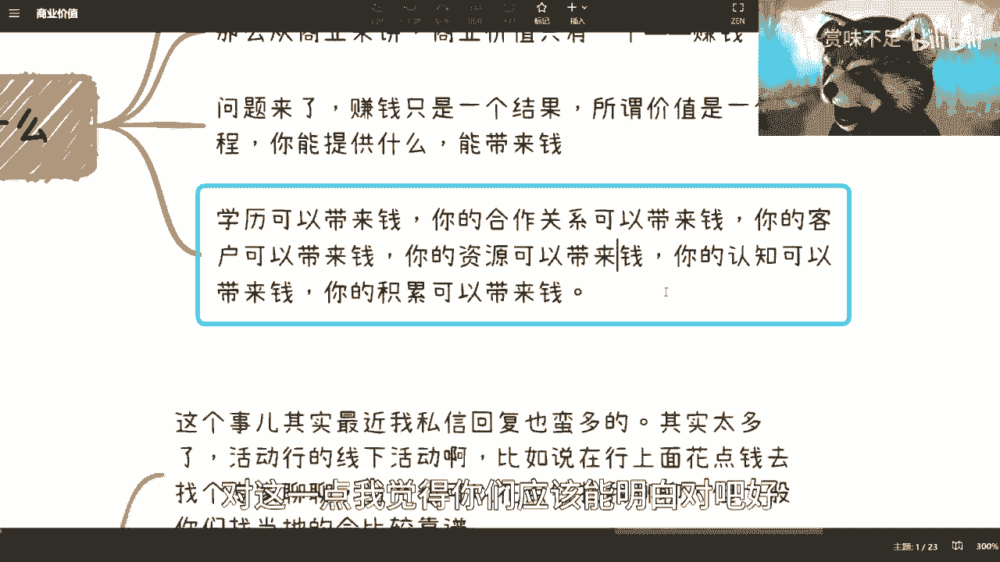

对这一点我觉得你们应该能明白对吧好，那么我们再往下看啊，商业价值怎么来对吧。

那你也有很多人说，那陈老师，我这个普通人对吧，这个两手一摊啊。

我什么都没有啊，好那我跟你讲这个事呢，我我回复也很多对吧，就是说呃其实非常多的方式，但是你要明白一点，就是所有东西都是从零开始的，你不能指望说你就是你不能在那边想的，是说啊，我今天就在那边想啊。

晚上睡觉不睡啊，我就在那边想啊，我明天到底做什么，我就有这个商业价值呢对吧，这不可能啊，你需要有一个过程，这个过程是你去寻找，你去认识对吧，你去聊，你去沟通，因为商业的本质是什么，就是人与人嘛。

那人与人的本质是什么，你要聊啊对吧，那那你有很多人说你说吃饭也好，喝酒也好，那吃饭喝酒前边也不得了嘛对吧，你你什么都没聊过来，上来就喝酒，没有的，哪里有啊，不存在的对吧啊，那那有也有对吧，动机不纯啊。

那你说啊你说啊这个活动型对吧，包括我说在在行在行，这是个应用啊对吧，在行上面你花点钱啊，这个五六百块钱，七八百块钱怎么了，你买不了吃亏，我跟你们说真的，你有时候免费的东西，我跟你们讲，有很多时候。

免费的东西就是在浪费你们时间对吧，当然什么23万34万的，也他妈在薅你们羊毛呸，再跟你们韭菜对吧，那你花点小钱，我觉得不会有什么太大问题的对吧，你找个专家聊一聊对吧，当然也可以花点钱找我聊对吧。

当然我跟你们讲为什么花钱比较好对吧，不是我有很多人要喷我了对吧，我跟你讲为什么是因为你们花了这点钱，那你们当地那个专家对吧，我那我们就可能不太好意思，你要你要但凡这个找我吧，找我聊完对吧。

后面还有什么是的，你再找我，我也不好意思拒绝你，你说是吧，那大家至少是一个有过经济关系呢，你说是吧，唉稍等。

哦然后呢啊这是第一个对吧，第二个呢就是说这个商业价值未必是对公司的，你一定明白啊，就是说我们所谓的商业价值，其实很有可能是对合作方的，或者来说是一个跟你一样想要做副业的人，他不一定是对公司的。

因为很多时候是什么呢，是你手上有块拼图，你的擅长点，但是你无法变现，对方也有张拼图，然后他也无法变现，但是很有可能是他跟你两个拼图拼在一起，你们两个人就能变现了，对不对。

那好那这个时候就是说你不用太去单，就是在乎的说哎我这个自身积累商业价值，是不是对公司有有帮助啊，无所谓的，公司跟你没有关系，有帮助，那也是公司的事情，我说不好听点，公司赚钱的是公司股东的事情。

跟你有他妈蛋关系。

对不对啊，那我觉得这个也是一方面，第三方面呢，其实我跟你们说，你们但凡只要假以时日去做一些事情，你就会发现无论什么圈子，圈子不大的，就那么点人啊，你不要觉得就是说哎呀，好像这个圈子里面的人很多很多。

是这个圈子里面人很多，但这个圈子里面折腾的人就那么一些，什么叫折腾的人，就是你去参加某些活动，或者你想去找的资源，可能二度关系，五度关系，六度关系，你绕了一圈还是他对吧，我就我跟你们说，就这么来讲。

比如说你们回头想要去做元宇宙，或者你们回头想要去做一些区块链对吧，或者做些别的东西，你很有可能哪怕你不在上海对吧，你很有可能绕绕绕绕半天，你还是会找到我这边，你知道吗，这就这就是这个样子的啊。

因为背后其实能找的人，能找的公司不多，然后这真的能去做的人也不多，你虽然不直接找到我，但是你很可能有可能找到某个协会，某个公司或者某个商会，但是呢某个协会，某个公司，某个商会去做落地的时候，他还是找我。

你知道吧，就没有区别的，所以说就就那当然啊你不要理解错啊，我的意思不是说你们你们有事情直接找我，我的意思是你们去到选择一个行业的时候，你假以时日其实是能把这个行业吃透的，不是吃不透哦。

你对很多东西不了解是对的，但是你也要你知道去了解也不是那么的困难啊，最多也就是说你会发现哦，很多人我见不到，但这个人呢我已经知道了，反正就这么个人对吧啊，那最后呢我觉得就是说你们要明白。

就是说其实寻找的呢就是相互缺的那一块啊，这就很很简单，但是呢你前提就是你先积累。

当然啊这个大的方向大的前提是什么，就是你得先选好方向，但是呢你不要太去纠结这方向，对不对，你也不要太去纠结这方向好不好，就是你你有你得有一个自己的判断，我今天跟你说好也不代表好。

我今天跟你说不好也不代表不好，对不对，你得有个自己的判断，那当然你可以说啊，这个陈老师你说的不对对吧好，但是呢你说我说的不对，你得有一个依据，或者你得自己先去判断，比如说我今天跟你说。

新能源这个行业不错，但是电动车是他妈行业对吧，然后呢你啪进去对吧，这个这个实践了三个月，然后呢给我呃积通过你的积累和接触，你跟我说哎，我可能觉得你说的不对对吧，电动车是个很好的创业对吧。

那个怎么样怎么样，那那新能源可能不太行对吧，怎么样怎么样，那也可以大家辩论嘛对吧，我觉得没有问题对吧，但是前提是你你们所有的人得要自己先去做。

对吧，先去迈出这一步对吧，我一直说这个问题，你你你你晚上在那边想你。

你想得出啥商业价值是不是啊，所以就说本质上呢就是说一定要明白啊。

就是哪怕商业价值呢也是一样的，就是价值这个东西还是别人给我们定的。

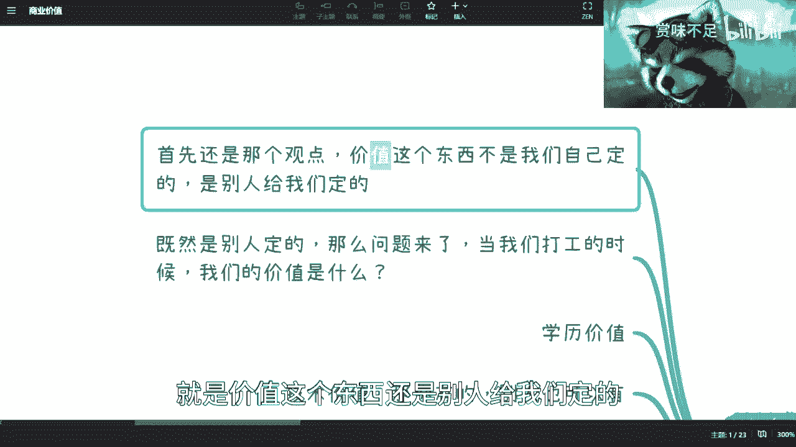

不是我们自己给我们定的啊，所以这就是我跟你们讲的。

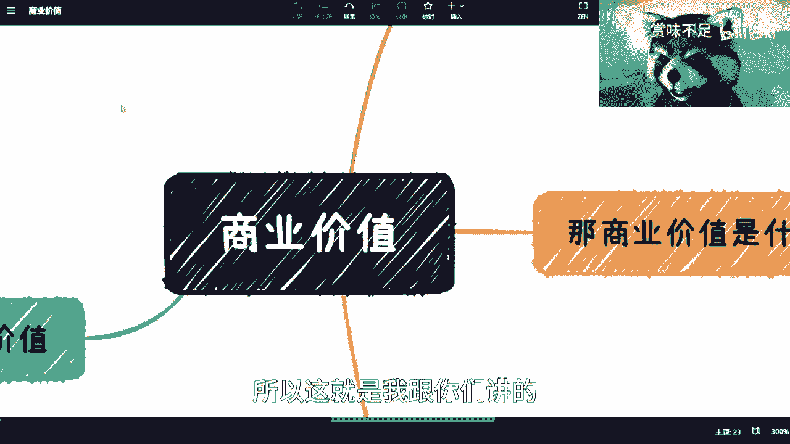

就是说哪怕我今天在朋友圈，在任何地方，我我在那边呐喊啊。

我说我很有相应价值，没用的，对不对，谁来听我的。

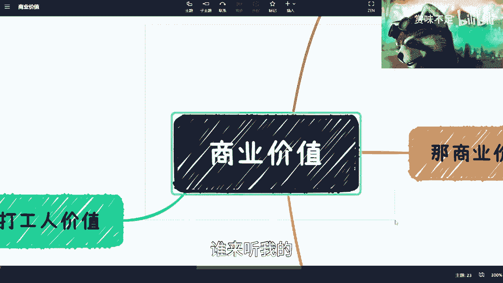

你说是不是啊，好吧行吧，你就这么着吧啊，我这个我这个视频做的时候当中，那个人被电话打断了，所以你们可能会有些这个这个断断档啊啊好。

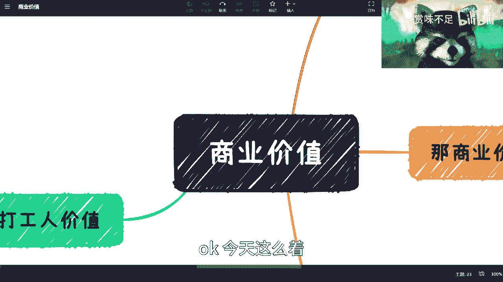