# 应大家要求，蹭下GPT4的热度 - P1 - 赏味不足 - BV1ix4y1P7Bo

好哦那个最近网上就我们那个评论区啊。

私私信里面其实蛮多人跟我说，就是让我蹭一下热点，其实我本来也想讲啊，我真不是蹭啊。

你们别骂我，哈哈是吧，然后那个我想把它先放到数字经济里面啊。

先放到数字经济里面呃今天看到这个图，我给你们看一下。

我也真的是绝了，你看gp替代钱对吧，给这个人安排一个电脑来替代火。

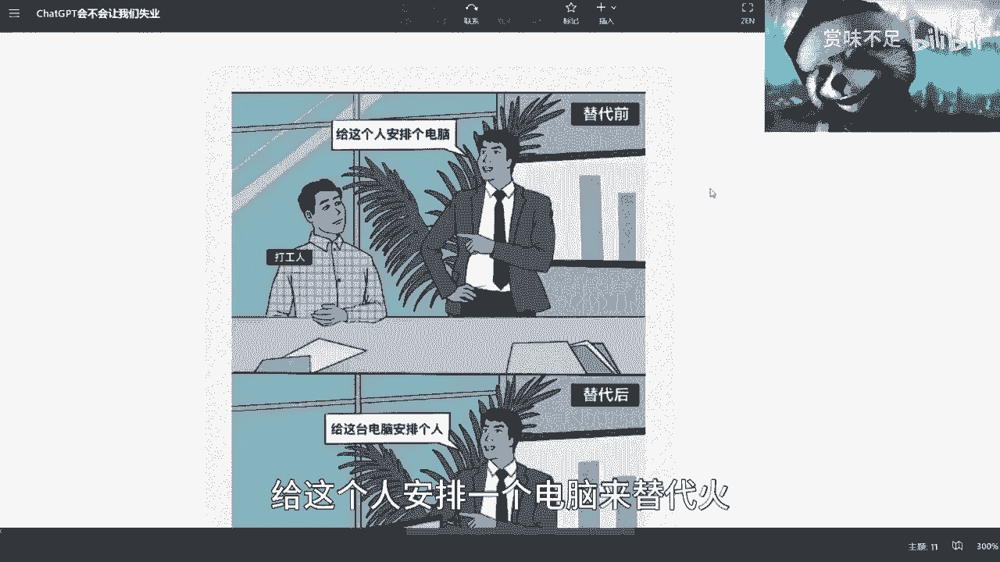

来给这台电脑安排个人是吧，就给这个人安排个脑子，给这个脑子安排个人啊。

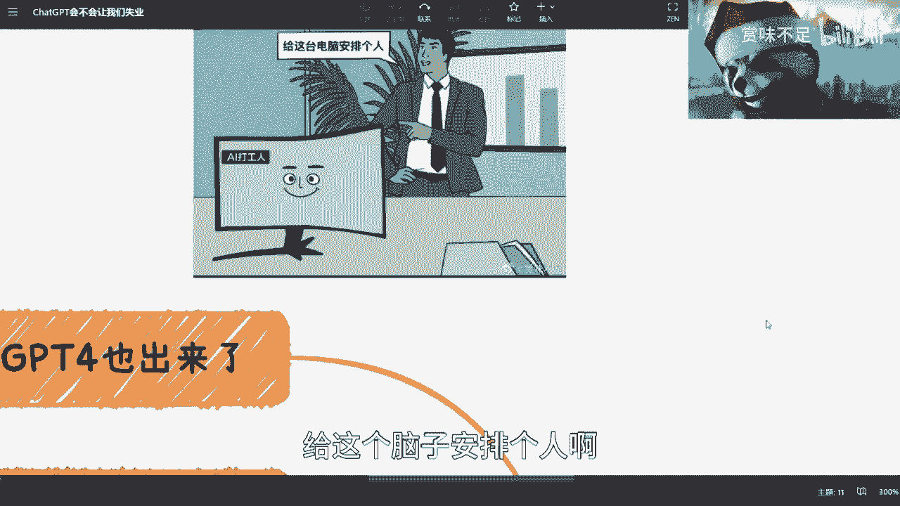

我给大家简单讲一下，我觉得首先先说结论啊，呃gbt会不会给大家带来影响，可什么叫影响啊，就是说肯定会有呃，会给大部分的人带来非常多的便利啊，但是你要说有没有什么负面影响。

以及说什么会不会让我们失业这种我觉得对吧，本质上是没有的。

没有这个道理的，为什么啊，因为是哎我们一个个来讲吧，好吧是首先是这样子的。

你看啊最近gp d4 出来了对吧。

呃我看了一下对应的很多应用周边也出来了，嗯等一下我看看啊，周边出来翻译啊对吧，作图啊，ppt啊，不不不很多对吧，然后呢，我觉得这个东西呢，绝对是给现在的很多的这种领域呢，是带来了非常多的便利啊。

但是你们前提啊，大家有一个前提一定要明白，从cheat gb t到gb t的api，他从头到尾就没有开放给中国过啊，而且中国也在屏蔽啊，这个g p t的a p i啊，所以说呢就是你说是不是会让大家失业。

或者说搞得人心惶惶，我觉得实在没必要，因为一个服务啊是双向屏蔽的，你说哎呀，我就怕这视频都发不出来。

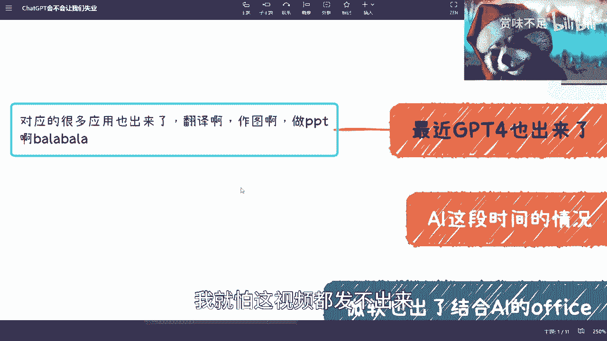

你说是吧啊，这第一个第二个呢，我说一下ai从以前到现在这个情况啊，其实大家去看一下，就ai以前情况，其实也就知道整个ai从发展到现在，它其实历史当中已经有两个波峰了哦，有两个波峰了。

后面就马上又到谷底了，当然我不是说gbt这一次也会这样，但是呢就是说gb t其实是给人类啊，就是工工作效率啊，或者各个其他的方面带来了非常大的一个，不叫不叫不叫升级吧，这个是对的。

但是你说这个东西影响有非常大嘛，就它是一个好好就正向的影响啊，他不是说好像出来之后嗯，很多人失业了是吧，这个真不至于啊，真不至于呃，然后一群你知道吗，就是就是微微微信还有很多人来问我，他说陈老师啊。

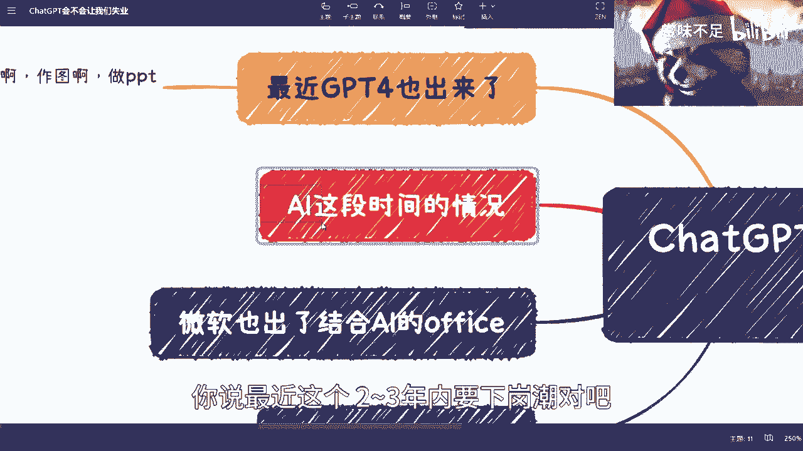

然后就问我哎是不是因为这个玩意儿啊对吧。

我说真没关系啊，真没有关系，我说有关系的是什么，我说有关系的是你们关注一下全球的经济对吧，有关系的是你们关注一下每1年的。

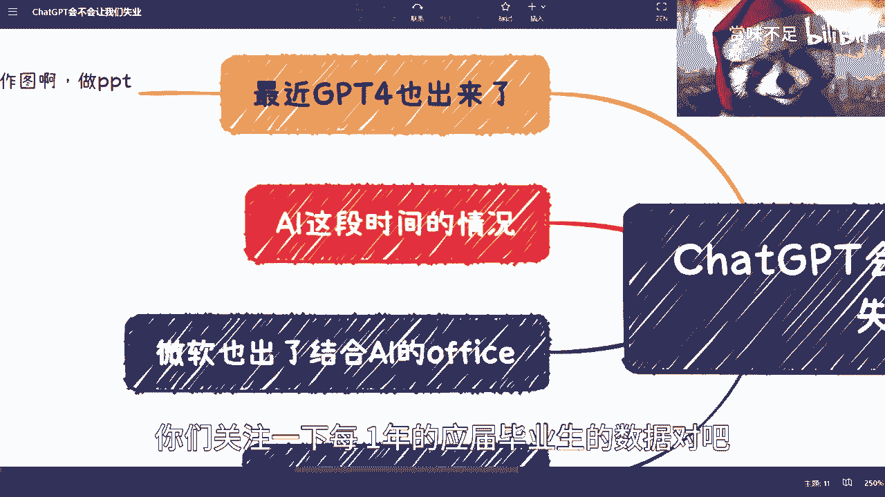

应届毕业生的数据对吧，有关系的是你们再去关注一下，整个就是说啊这个这个这2年，比如说企业的一些一些倒也不叫倒闭吧，就是破产的情况对吧，这个企业的裁员情况，外企的这种迁移情况对吧，你我说你就看看这种数据。

你别老gbt。

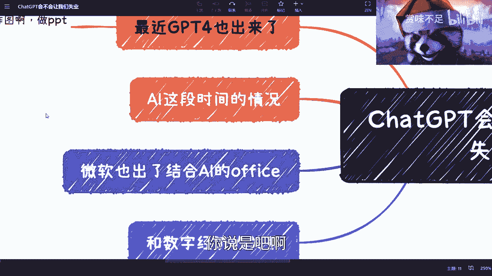

你说是吧啊，然后这是一个，然后呢微软这两件给了一个结合ai的office对吧，其实所以说呢你会发现什么呢，你包括那个嗯包括那个new病对吧。

new be啊。

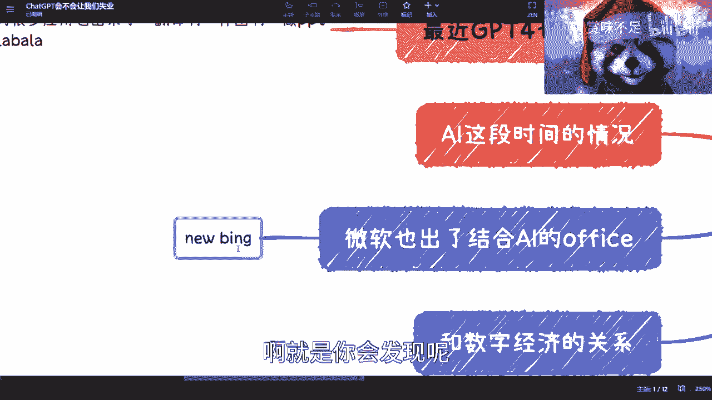

就是你会发现呢，就是说呃这个龙头老大们是自己革自己的命啊，也不叫革命吧，就自己在这个升级啊，净化啊这个产品，但是呢就是说这个东西呢，还是给大众这个这个叫什么带来福利的啊，就作为这么一个升级。

或者说一个增加效率的这么一个工具啊。

我觉得和数字经济关系还是有的，所以我会把它放到数字经济这个，这个嗯合集里面。

为什么呢，因为呃g p t也好，或者不叫g p t也好，无所谓啊。

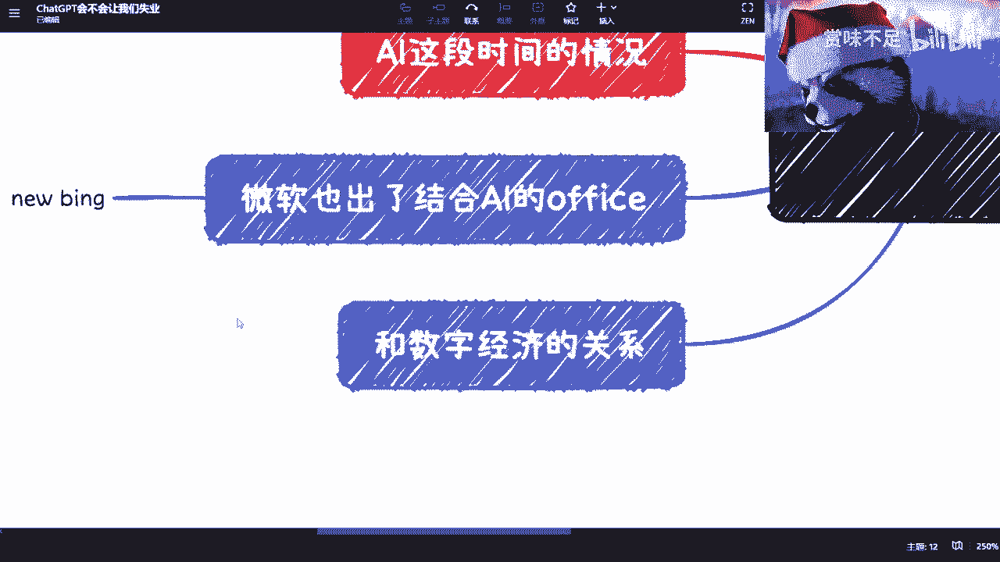

就ai在目前的整个发展上面，无论是对于这个翻译啊，对于作图啊，ppt啊，包括以后就这对于客服啊，数字人啊对吧等等各种各样的这个影响上面。

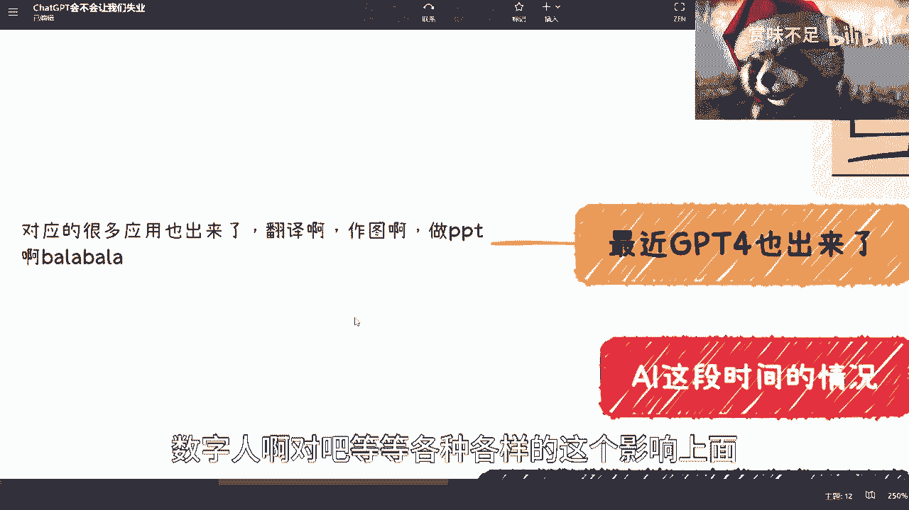

他一定会影响到各行各业，那么影响到各行各业呢，其实呃本质上其实也是就是我就相当于什么呢，相当于是对于整个数字经济做了一个加速，做了一个催化啊，是这么一个东西，那当然了就是说呃我们这么说吧。

有一些比如说数字化覆盖度比较高的领域，那么它的这个可能a i的这种渗透率就会很高，那有一些呢它可能比如说数字化比较低的，你比如说像现在农业啊对吧，这个这个这两这两天。

这个整个中国都在谈那个叫什么乡村振兴对吧，你比如说农业啊对吧，然后我想想还有一些就是就可能制造业啊，传统更更传统的一些行业，他们就是说互联网覆盖率或者数字化，可能没那么高对吧，但是呢他们就有可能诶。

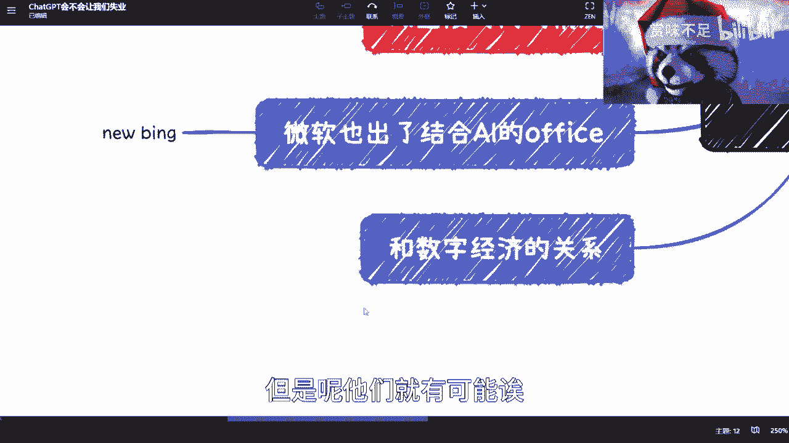

就直接跳过了原本，数字化和互联网化的这么一个过程。

直接由于因为gb t已经出圈了嘛对吧，就gbt并不是一个ai领域的。

所有领域的人都知道了嘛，对不对，那么他们很有可能是因为gb t出圈的原因唉，间接的用了g p t或者想用g p t，然后带动了整个产业的数字化，和这个这个叫什么，就是互联网化啊。

然后呢哎它就会产生他的数字经济，所以我觉得可能是这么个东西啊。

所以说你说有关系吧，我觉得关系还是蛮大的。

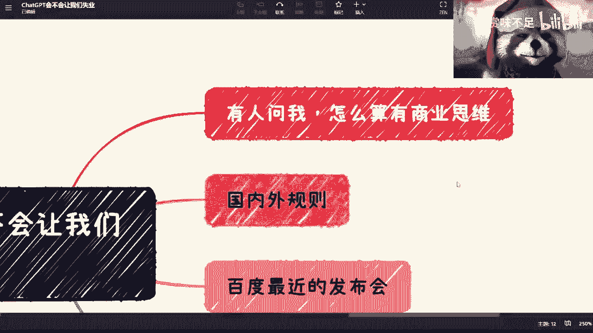

啊然后这里呢就是我写的时候呢，就就突然想到这个问题，因为这两天问我人人也比较多，他说他说我一直在谈这个叫什么商业逻辑。

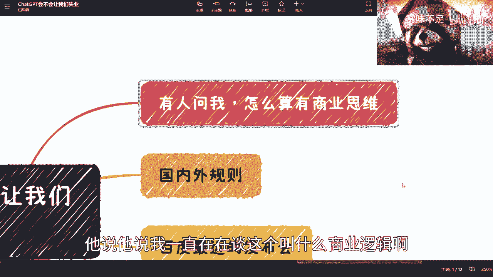

商业思维，他说怎么算商业思维啊，好我给你们举个例子呃，现在gp这个词我相信大家都知道了，对不对，包括啊我们说元宇宙这个词也知道对。

区块链这个词也知道，5b3 这个词也知道对吧，都知道啊，都知道好。

那我就问你啊，你今天听到cheat gbt之后，你的脑子里面是产生怎么样的一些想法，你产生什么样的想法去，就是会决定你到底有没有商业思维，对吧好，那我举个例子啊，比如说我现在群里面有好多人对吧。

就是什么包装包装好gbt的对吧，然后问企业收费对吧，什么1年4999对吧，然后有什么打折4500对吧，那我觉得人家既有行动力，也有商业思维，对不对，那虽然在我看来，这个可能不叫一个完善的商业思维。

这更像一个投机的商业思维，但是这个ok啊，也可以归类到商业思维里面，对不对，那这是一个，那还有一些是什么呢，哎也有人自己做了个网站对吧，做了个网站告诉大家，这个网站是一个啊很智能的对吧。

这个什么什么什么图片生成器对吧，或者这个翻译软件对吧，他也不告诉大家背后是gb t，但无所谓啊对吧，他说哎你们看啊，前面20次是免费的啊，第21次或者第第第31次就收费了，每次两块钱。

哎我觉得这也叫商业思维啊对吧，你跟我说，你说好，我看有几部电啊，我们要失业了，那那那那我能怎么说呢，对吧啊，所以你说怎么算商业思维，商业思维就是说你得有一个，不管是就是有个闭环对吧。

这个闭环就是说你得搞清楚对吧，就是我说的诶啊付钱的是谁对吧，为什么付钱啊，怎么怎么就付钱了啊对吧，解决解决什么痛点，对吧啊，这这你你得有一个有一个叫做就整个闭环啊。

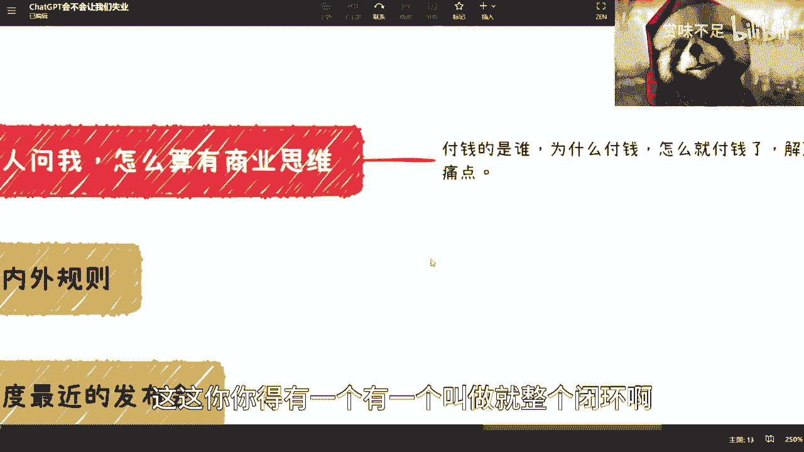

你的脑回路要有这个回路啊，对不对。

然后呢我觉得这个说失不失业的问题呢，这个规规则我给你们讲一下啊，首先现在gb t所有的数据都是在microsoft cloud的对吧，就微软云上面啊，那么我请问在一个微软云上面的产品啊。

它会让中国的人失业吗，你们觉得现实吗，对不对啊，你想想想看对吧，就国家会让数据落到microsoft cloud上面嘛，这不可能的嘛。

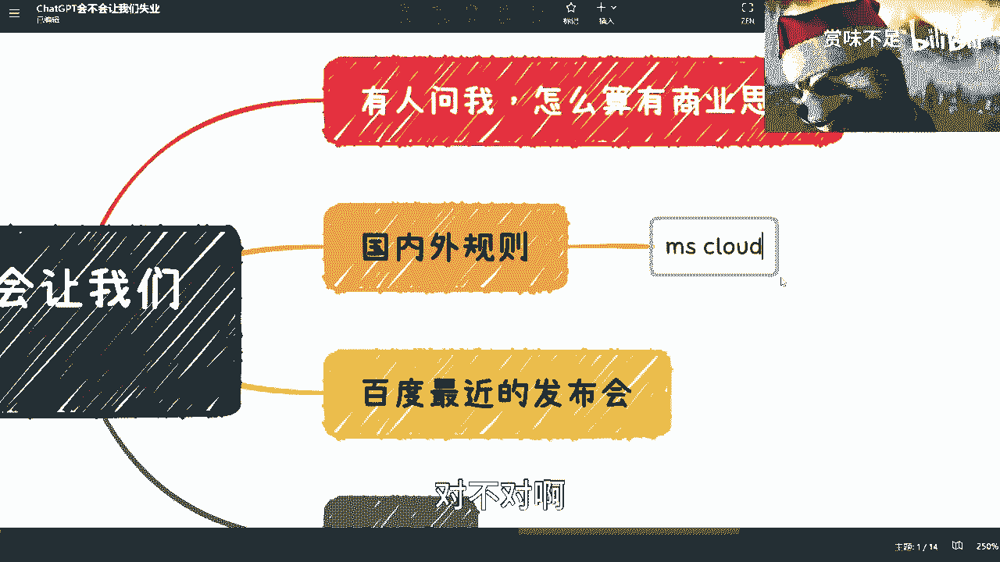

对不对啊，好就既然都已经这样了，那你们担心啥呢。

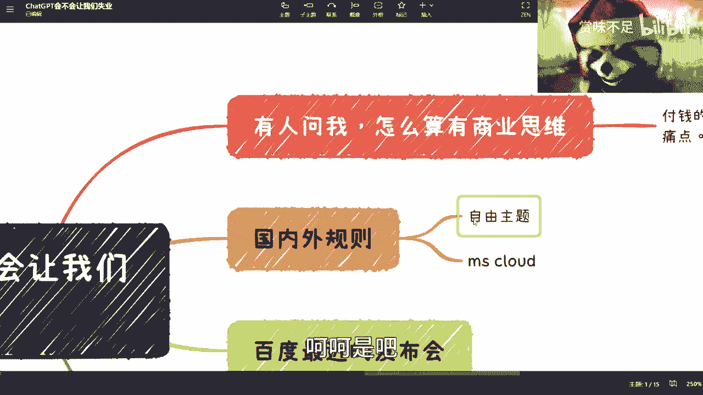

呵呵是吧，你们你们担心啥嘞，啊好吧呃。

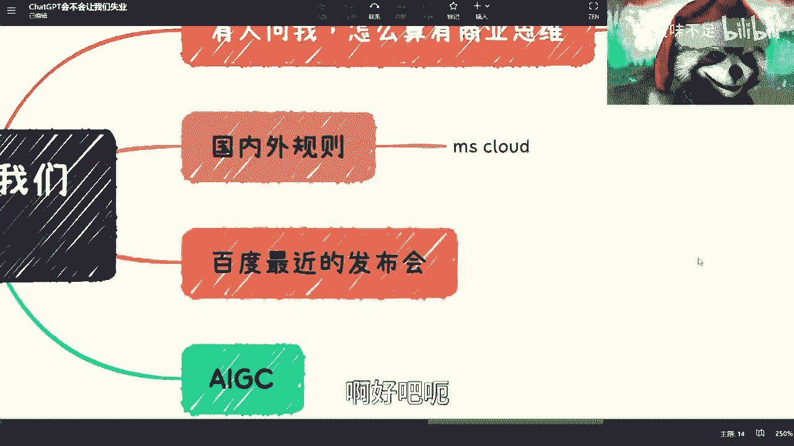

然后呢那个百度最近发布会对吧，直接跌了跌了-10%以上，我跟你们讲啊，这个也是个好事情啊，为什么呢。

因为哎呀，因为就是说gp t这个东西，它真的就是需要资金的沉淀，需要呃叫做预训练模型的沉淀啊，需要数据的沉淀，简单来讲什么意思呢，就是说呃比如说我们举个例子，简单来讲就是说海外，比如说领先我们1年啊。

就算我们踏踏实实投入同样的资金，投入同样的数据量，我们要去赶上，也至少得1年，就说的再直白点去，就是他所采购的坑我们都会踩一遍啊，那么这个好处是什么呢，这个好处就是说哎至少这一次啊。

国内的这些企业不单单是百度，别的也是一样的啊，这个人热点是真的蹭不了了，就不是你今天什么曲线救国对吧，晚上什么什么什么什么投入，多投点钱对吧，别人投一个亿，我投十个亿对吧。

今天晚上呃呃就像我们以前说的对吧，你10月怀胎对吧，我今天晚上叫十个人来一个月就能怀出来，不好意思，不行啊。

我觉得这件事情真的是还是蛮好的，还是蛮好的啊，希望这个以后啊多出点这种技术对吧。

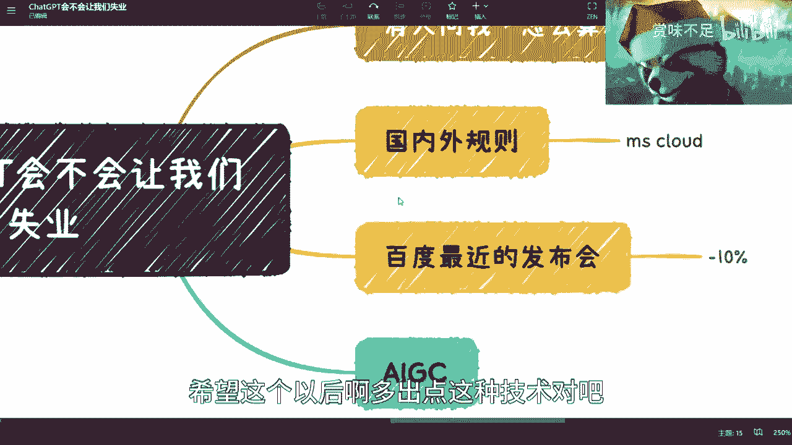

就多出点那种让让让让很多对吧。

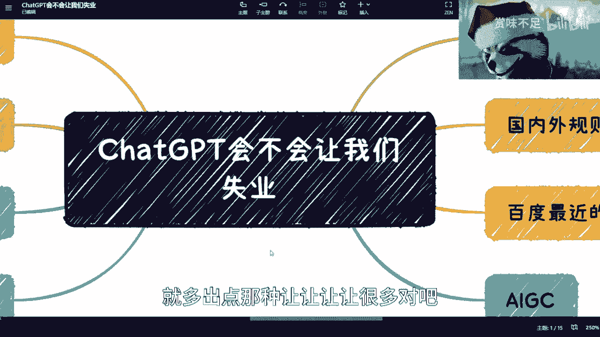

类似于这种投机取巧的企业对吧，不要这个呃，不能够短期内啊投机取巧出来，同时忽悠老百姓的东西对吧，那我觉得就很好啊。

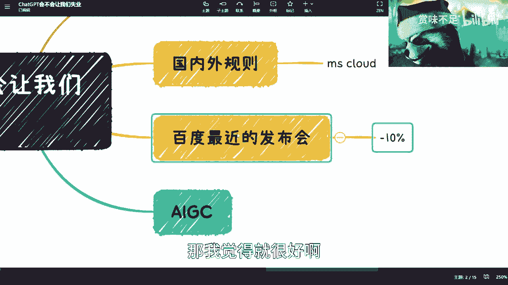

呃然后就是还有一个叫a g c啊，那ai gc这边呢我觉得可能也会改变很多，就是那个图片这边哦，图片这边因为gb t4 这两天出来之后，图片这边的叫什么精准度，跟它的渲染程度已经高了很多了。

我已经看到它的一些效果了，就高比g b d3 当时高了很多了，呃，所以说呢就是说至少在很多这种图片创造领域，已经说可以是颠覆性的存在了啊。

但是呢我觉得就是这个我们小伙伴私信让我讲。

g p t的核心目的还是在于说呃，他们觉得很多视频讲的太怎么说呢，太太深奥对吧，那这个我我我比较粗俗对吧，讲的就就要通俗一点，那通俗一点是什么呢，就是说好未来不久的未来啊。

就是大家的这种我这边写一下吧。

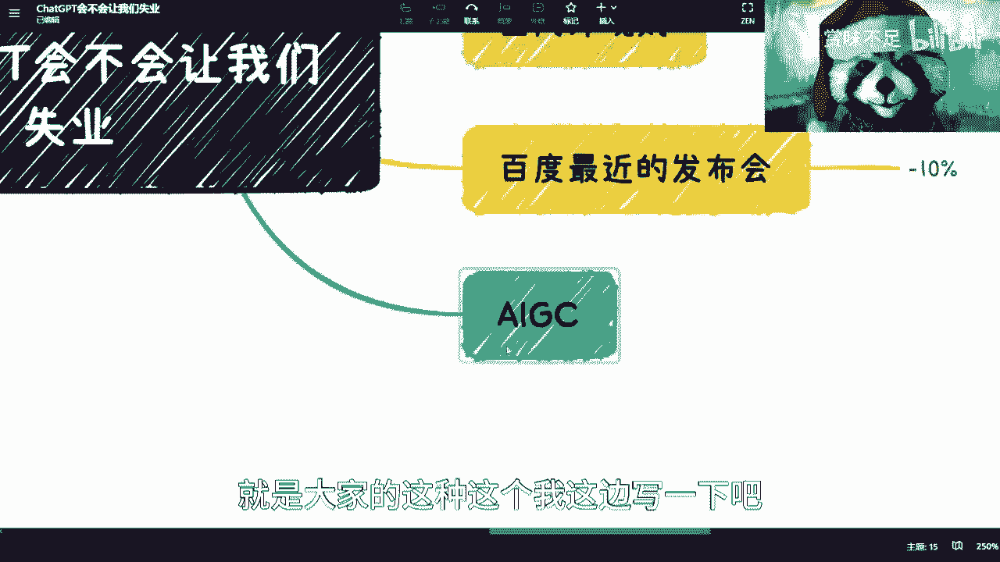

啊就是不久的未来啊，大家的这个搜索习惯啊，包括这个office习惯对吧啊，包括就是说这个这个这个这个怎么说呢，就是啊写论文啊啊论文啊，或者说嗯创作图片啊，啊创作视频啊对吧，就简单来讲。

就是说所有的这种这这这种创作领域啊对吧，或者搜索搜索过程啊，这种模式你们所有的习惯都会被颠覆掉，当然你们可能没有感觉啊，就像你们现在就是用用用百度啊，用google啊对吧，这种搜索没有感觉一样。

但是你放到20年前，你说大家有搜索这个习惯吗，没有的，因为都没有这个东西，你知道吗，你就回不了，回不到现在了啊，那么呃我给你们举个例子啊。

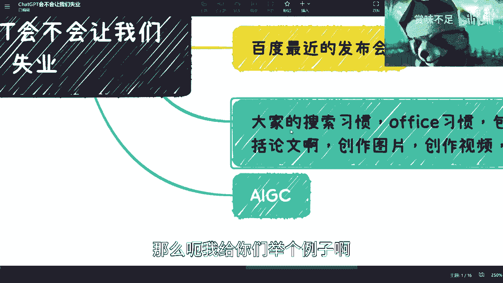

举个例子，这就好像我今天嗯我举个例子，比如说我想知道数字经济是什么对吧，那么你怎么办呢，你可能会打开并啊。

然后搜索好数字经济是什么，对不对，好，然后呢你看啊，第一页比如说有20个结果对吧好，你会一个个点进去看，虽然你可能看的都是一些垃圾信息，但是呢你脑子里面会自动会帮你过滤啊，这个这个第一个网站里面。

有那么10%是有用的对吧，第二个网站里面有那么20%是有用的，对吧好，然后你就开始翻，你差不多翻到个大概五六页对吧，你觉得我差不多懂了啊，这个也不是懂了吧，我差不多明白了啊，然后呢那么你就会去写啊。

数字经济啊，我理解下来是个什么什么东西对吧好，其实这个就跟我们看论文参考文献是一样的啊，然后以后的搜索呢，我觉得其实大家就呃，就是相当于是他搜索本身已经帮你做掉了，我们刚刚说的这个过程。

那么他不但大大大大节省了你的时间，大大提升了你的效率啊，而且就是说呃，就是就是隔了整个目前搜索这种命啊，因为以就是就是不会帮你自动做整理，不会帮你自动做过滤，不会帮你自动这个这个这个这个叫什么。

就总结出来结果的搜索就是垃圾对吧，那么他只会被这个叫什么时代淘汰啊，所以说呢就是就就这么个东西啊，我觉得就这么东西好吧，就是呃反正大家以后就是越来越多的吧，就是会看到就是说啊这个东西用gp做的对吧。

或者我参考了gb t对吧，或者说就是说我可能没有灵感对吧，这个东西是gbt给我的这个提提醒，对吧啊等等等啊，包括就是有些网络剧。

网络小说可能都g b d写的对吧，哎我觉得这个都不重要啊，重要的是什么呢，我们在这里面就一点。

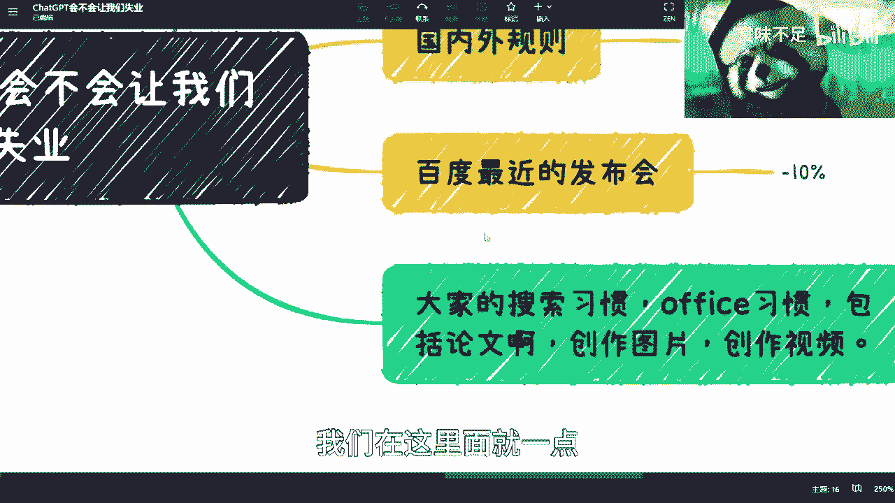

他不会让我们失业啊，不要太紧张啊。

就至少中国不会啊，别的国家会不会我不知道啊，好吧，反正反正就是就这么个东西呃，五大家反正想了解下。

你也可以评论啊对吧，反正我至少还是用过g pg的啊，行吧。

