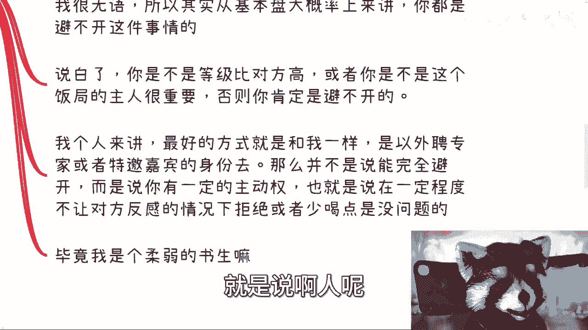

# 应届生商业专题：酒文化是不是商业中避无可避的 - P1 🍷

在本节课中，我们将要学习商业环境中“酒文化”的现实情况。我们将探讨应届生是否必须面对酒局、如何应对不能喝酒的情况，以及不同酒局的特点。课程内容基于对一线到五线城市商业实践的观察总结。

---

## 课程背景与前言

最近有两件事值得讨论。

第一件事是关于几个月前发布的“酒文化”视频，其下的评论讨论非常热烈。我查看了大家的评论，并会根据这些说法进行总结。

第二件事是最近B站上出现了越来越多与我风格类似的视频。这现象很好，因为它向大众证明了一种可能性：即使不投入大量资源制作特效或动画，也能做好视频。不过，评论区有小伙伴说得对，其他人做什么与我无关。

但凡想找我合作或蹭热度的，至少应该给我充电。如果连六块钱都不愿意支持，很难相信能成大事。有些人在评论区留言让我评价其视频，但一看连电都没充过。我的态度很明确：你可以白嫖，但别让我知道；如果让我知道，我就会拉黑。

接下来我们进入今天的主题。

---

## 核心问题探讨

最近关于酒文化的讨论非常激烈，主要集中在以下几点：
1.  在当下的中国商业环境中，喝酒这件事是否无法避开？
2.  如果因为过敏等原因确实不能喝，该怎么办？
3.  如果实在避无可避，又该如何应对？
4.  酒局中还有哪些不同类型和讲究？

首先需要明确一点：在商业层面的酒局和饭桌上，没有“男女”之分。这里撇开一些无关的联想，剩下的问题只关乎喝多少、怎么喝，是蜻蜓点水还是豪迈畅饮。这与性别没有直接关系。

接下来，我们正式展开今天的“酒文化”之旅。

---

## 问题一：商业中喝酒是否避无可避？✅

最重要的问题是：商业中喝酒这件事是否无法避开？

我的明确答案是：**是的**。

我如此肯定的原因有两点：
1.  我从一线到五线城市都去过。
2.  中国的商业风气呈现从一线城市向下层市场辐射的状态。

这意味着，你们未来在一线城市会遇到的情况，在下层市场一定也存在。反之则不一定。一线城市有时反而不够“接地气”，到了下层市场，你才会发现玩法更加多样和“花哨”。

这就好比在《星际争霸》或《守望先锋》中与高手对战，你能学到标准战术。但当你与民间高手对战时，才会见识到什么叫“民间的技术与智慧”，两者完全不同。

如果你认为自己可以避开酒局，那很可能是一种**幸存者偏差和错觉**。例如：
*   如果你对接的都是年轻的、后起之秀，也许可以避开。
*   如果你背后有靠山（例如家庭背景强大），本质上也可以避开。

但必须记住：**避开一次不代表次次都能避开**。即使有靠山，避开一次也是一种幸存者偏差。人总要往高处走，并且并非所有年轻人都能避开。

现在很多年轻人能力、认知、境界都未到，却喜欢模仿一些不良风气。他们会觉得“进了体制或某些圈子就必须喝酒，不喝酒谈不成生意”。这种想法具有传染性，一层层烂下去，导致基本盘上大概率避不开这件事。

从个人经验判断，最好的方式是像我一样：**以外聘专家或特邀嘉宾的身份参与**。这意味着你不是以纯粹销售或项目负责人的身份去谈生意。虽然这种身份也不能完全避开酒局，但你拥有一定的主动权，可以在一定程度上少喝甚至不喝，且不易引起对方反感。因为专家身份自带一定的尊重和距离感。

---

## 问题二：如果确实不能喝怎么办？🤒

如果因为身体原因（如过敏）确实不能喝酒，该怎么办？

这件事说简单也简单，说难也难。因为在商业上，除了生死，其他都不是大事。

难点在于：
1.  **除非你不可替代**。你不行，但总有人行。你需要思考自己是否可以被替代。
2.  **团队分工**。你可以招聘全职的商务人员来应付酒局（男女都有，且女性商务在某些场合非常吃香）。等级低的是“挡酒”，等级高的则能既少喝又能让对方尽兴，最终促成合作。这里指的是正规手段。
3.  **信任问题**。难就难在你招聘的商务人员，你不一定完全信任。万一他跳单、带走你的客户或缺乏职业操守（就像模仿我模式却不充电的人），你将毫无办法。

这和我们之前谈过的“个人包装”道理相通。大家必须明白：**喝酒本身绝对不是目的**。没有“酒喝了单子才能成，不喝就不能成”这种绝对因果关系，那是电视剧看多了。

但有一说一，喝酒是一个过程，其目标是让对方高兴。对方是因你喝得多而高兴，还是因氛围开心而高兴，因人而异。很多时候，你的行为（包括喝酒）是为了让对方感受到你的诚意和格局。虽然我认为喝酒本身并无格局可言，但现实往往如此。

就像很多小伙伴私信我说自己性格内向，但又想达成某些商业目标。我的回答通常是：要么改变，要么躺平。作为一个普通老百姓，你没有那么多ABCD的选项，路往往只有那么几条。

---

## 问题三：如果实在避无可避怎么办？⚡️

很多时候，酒局就是日常发生、避无可避的，无论男女。

面对这种情况，选择很简单：**要么做，要么不做**。没有中间状态。一旦你踏出这一步就会明白，这一天早晚会来，逃不掉。

你不能有“既要……又要……”的想法。因为当你选择走上商业合作这条路时，就必须面对这个现实。

---

## 酒的类型与酒局特点 🥂

接下来，说点有趣的——喝什么酒。

根据我的经验：
*   **北方**：清一色白酒，处于酒局金字塔的顶层。通常配置是：四五瓶白酒，开心的话再加一瓶红酒和两箱啤酒。正常用小杯喝，开心时用分酒器。很多时候，即使你不想喝，但对方（有时甚至是客户方的年轻女性）拿着分酒器来敬酒，作为客人或受邀专家，很难拒绝，否则会显得失礼。
*   **红酒**：常见于某些场合，尤其是对年纪较轻或女性参与者。但红酒喝起来可能更“猛”，因为用的是大号高脚杯，而且经常直接干杯。所谓“迟到罚三杯”，三杯红酒的量基本超过一瓶，非常考验人。
*   **啤酒**：白酒和红酒至少能看到“尽头”，而啤酒局则是“没有尽头”的。我曾经历过“混合局”，格局大开。例如所谓的“五湖四海”，在一个桶里混合啤酒、奶啤、果啤、米酒甚至二锅头。也有在店里点六种不同的酒依次喝的场面，非常考验酒量和意志。

---

## 总结与建议 📝

对于应届生，关于酒文化，我有以下几点总结与建议：

1.  **不要抱有幻想**。喝酒与最终能否成交没有直接的因果关系，但只要你参与商业洽谈，在过程中大概率避不开酒局。喝酒与成交有间接的因果关系。
2.  **不会喝不代表不能做**。但你需要明白，如果只想赚快钱、收割C端用户，或许可以避开。但但凡涉及正规的B2B、B2G（对企业、对政府）生意，与高校、协会、政府、企业签合同，酒局是避不开的。
3.  **关于职业发展**。做C端生意或底层生意可以赚快钱，但不可持续，缺乏积累和个人核心竞争力。随着年龄增长，你需要有背书。中国有14亿人，别人为什么找你合作？很多时候，建立关系需要靠背书。因此，虽然喝酒不是必须技能，但如果你想往上走，打入更高层面的关系网，这就是一个无法回避的现实。

---

本节课中，我们一起学习了商业酒文化的现实与应对策略。核心在于理解其无法完全避免的性质，并根据自身情况（如身份定位、身体条件）找到合适的应对方法。关键在于认清目标：喝酒是过程与手段，促成合作与建立关系才是目的。

如果你手上有牌不知如何打，或需要职业规划建议，可以私信我进行点对点咨询。请总结好你的背景和问题清单。