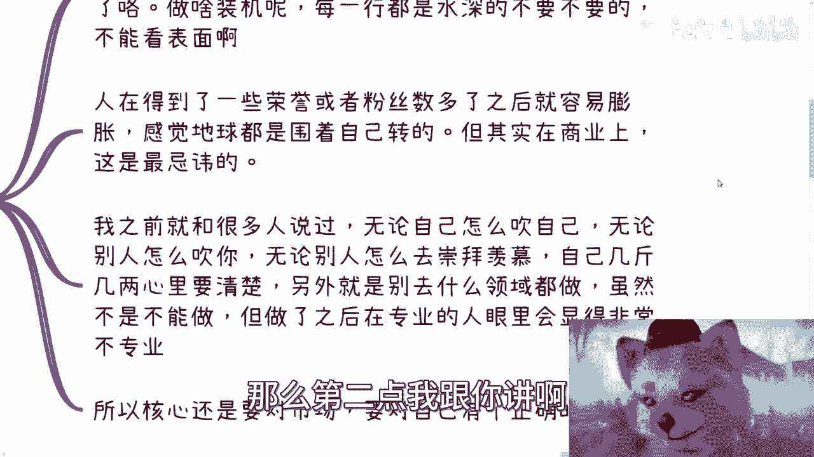

# 应届生商业专题-不做奸商-能不能活得下去---P1---赏味不足---BV1m841197tQ_no

在本节课中，我们将要学习如何理解商业环境中的基本规则与个人定位。我们将通过分析一个具体案例，探讨“不做奸商能否生存”这一常见商业迷思，并梳理出几个关键的商业认知误区。

---

## 概述：一个常见的商业迷思

今天的话题源于一个网络事件。一位UP主发布视频，探讨“不做奸商能否活下去”这一主题。这引发了许多关于商业模式和商业道德的讨论。我们将以此为例，总结其中反映出的常见商业心态和误解。

## 核心误区分析

上一节我们介绍了本次讨论的背景，本节中我们来看看人们在商业实践中常陷入的几个核心误区。

以下是三种常见的、但不切实际的商业心态：

1.  **“别人都不要脸，但我要脸”**：认为行业中普遍行为不端，而自己可以独善其身。
2.  **“我想改变这个垃圾行业”**：在未深入了解行业全貌时，便立志要颠覆现有规则。
3.  **“我觉得某件事我能行，别的事我也能行”**：将在一个领域的成功，简单复制到另一个完全不同的领域。

## 误区一：专业领域的边界与膨胀心态

我们分析了常见的商业心态误区，现在来深入探讨第一个具体问题：专业边界与个人膨胀。

人在取得一定成绩或获得粉丝拥戴后，容易产生膨胀心理，感觉“地球都围着自己转”。这在商业上是危险的。商业成功需要客观的自我评估和市场定位。

一个关键原则是：**隔行如隔山**。每个行业都有其深厚的专业壁垒和运行规则。例如，一个游戏博主擅长制作游戏内容，但这并不意味着他同样精通电脑硬件的供应链、品控和销售。盲目跨界，在不专业的领域以个人品牌背书，极易失败。

商业的基本逻辑要求我们对自己有清晰的认知：`自身能力 ∩ 市场需求 = 可行商业机会`。忽略任何一边，项目都难以持续。

## 误区二：对“奸商”与行业生态的片面理解

理解了专业边界的重要性后，我们来看看另一个关键问题：如何理解所谓的“奸商”与复杂的行业生态。

“不做奸商”这个命题本身，建立在对行业生态的片面理解上。许多人将商业描述得“过于黑暗”，并希望完全避开这些“黑暗面”，做“正规”的生意。

这需要**敬畏之心**。敬畏之心意味着先深入了解行业的全貌和现行规则，然后再做出选择和判断。任何一个行业都像一个复杂的机器：

*   **健全的齿轮**：提供核心价值的正规商家。
*   **生锈的齿轮**：效率低下但仍在运作的环节。
*   **蛀虫**：利用规则漏洞牟利的不良商家。

这三者共同构成了行业得以运转的生态。幻想剔除所有“蛀虫”或“生锈齿轮”就能让行业变得完美，是不现实的。商业的敬畏之心在于理解并学会在这个复杂的生态中，找到自己的定位和生存方式，而不是简单地以“好坏”二元论进行批判。

## 误区三：过度关注他人与缺乏核心定力

认识到行业生态的复杂性后，我们需要把目光收回到自身，这是避免迷失的第三个要点。

在商业乃至个人发展中，一个重要的原则是：**做好自己，别过度关注和评价他人**。别人的成败是别人的事，过度关注会分散你的精力，并可能反映出自身的不自信或心虚。

你需要培养过滤噪音并听取有效建议的能力。避免陷入“二极管”思维——要么全盘接受外界信息，要么彻底封闭、一言堂。真正的核心定力在于：`保持开放心态 + 聚焦自身目标 + 理性筛选信息`。

将精力放在打磨自己的产品、服务或内容上，远比评论行业里谁是“奸商”更有价值。

## 案例复盘：问题出在哪里？

前面我们探讨了三个认知误区，现在让我们回到开头的案例，应用这些观点进行复盘。

该UP主的商业模式本质是“流量变现”：他作为关键意见领袖（KOL）为电脑装机店引流。模式本身常见，但问题出在执行层面：

1.  **品牌与责任错位**：他以个人品牌为产品背书，却未承担相应的**品控**责任。在商业中，`使用个人品牌 = 承担全部品质责任`。
2.  **专业能力缺失**：涉足了自己不专业的硬件领域，无法识别供应链风险。

其道歉视频未能触及这些核心问题：既未说明行业合作中品控缺失的关键漏洞，也未反思自身盲目跨界的决策失误。这反映出对商业运作缺乏深度理解。

## 商业操守：直接比模棱两可更可贵

从案例中我们看到，模糊地带最容易引发问题。因此，我们最后探讨一个关于商业操守的务实观点。

真正的商业操守有时体现在“直接”上。与其打着“改变行业”、“良心商家”的旗号却无法兑现承诺，不如明确自己的商业定位。

例如，在投机属性强的领域（如曾热门的Web3），一种更直接的做法是：“我就是在做波段/流量生意，风险自担，看谁跑得快。” 这虽然直白，但规则清晰。最糟糕的情况是：操盘者自己既想获利又不懂规则，畏首畏尾，导致合作方受损，自己也没赚到钱，最终两败俱伤。

商业的本质是价值交换和风险管理。`清晰的规则 + 对应的价值/风险 = 可持续的交易`。模棱两可的承诺和对行业的天真幻想，往往是小则道歉赔钱、大则引发严重法律风险的根源。

---

## 总结

本节课中我们一起学习了如何理性看待商业环境。

1.  **认清边界**：敬畏专业，不盲目跨界，对自己有清醒认知。
2.  **理解生态**：商业世界是复杂的有机体，避免非黑即白的道德评判，重在找到自身在生态中的位置。
3.  **聚焦自身**：减少对同行的无效关注和评论，将精力用于提升自身核心价值。
4.  **直接负责**：商业承诺贵在清晰明确。若以个人品牌担保，就必须承担相应责任；若参与高风险交易，则需规则透明。

商业生存的关键不在于“做不做奸商”的道德抉择，而在于是否具备**清晰的自我认知、对行业的敬畏之心以及为自己选择负责的勇气**。