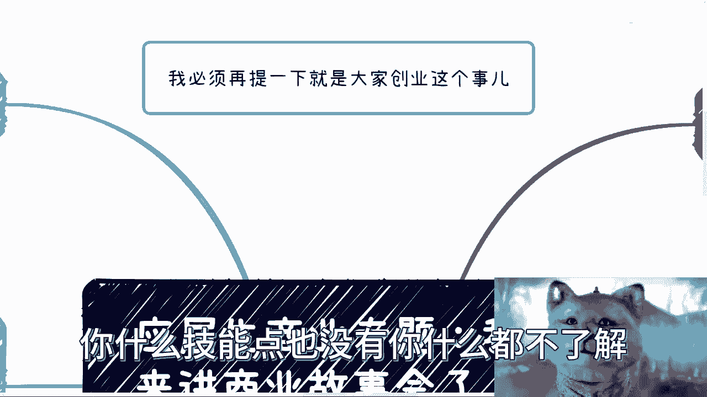
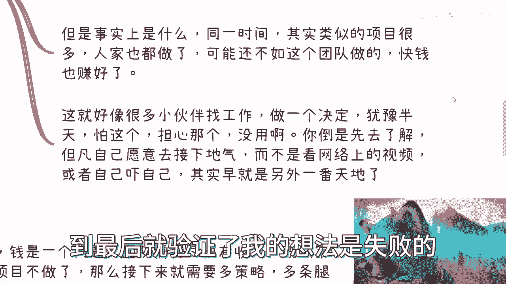
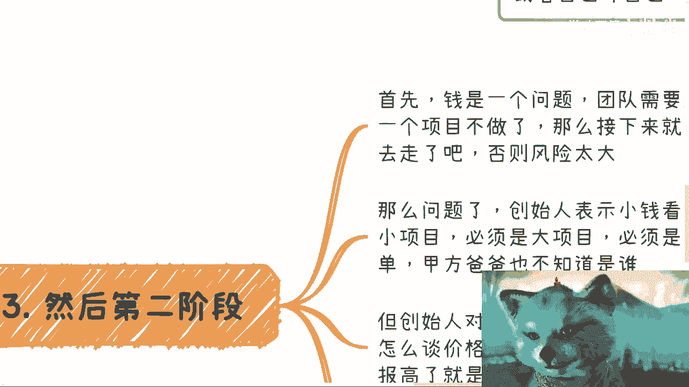
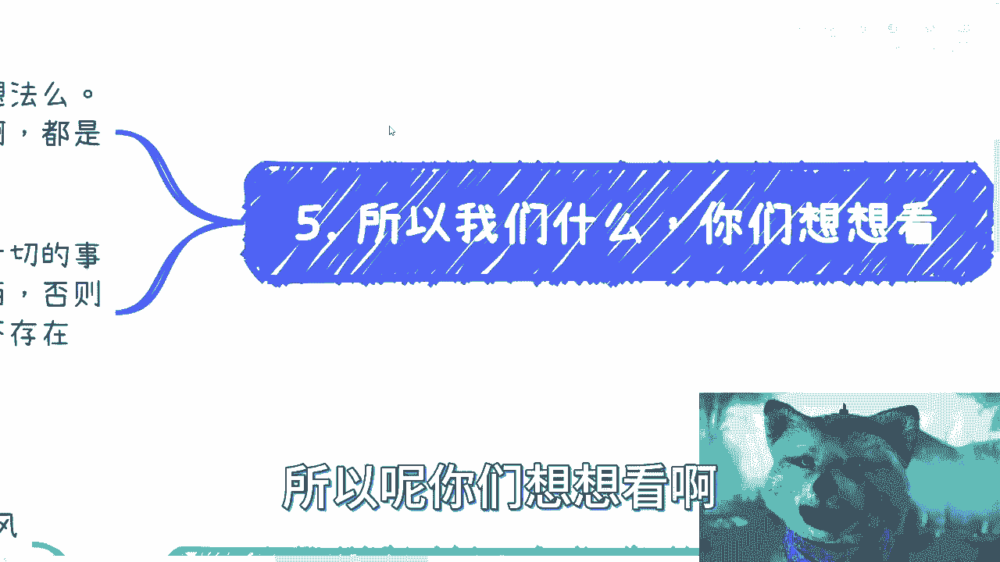

# 应届生商业专题：今天来讲个完整的商业故事 - P1 - 赏味不足 - BV1k94y167kx

哈喽大家好啊对吧，这个白嫖呢并没有结束是吧，我也没说我这个视频就不更新免费的哈，但是昨天那的确啊这个我了解了一下啊，竟然有这个充电视频这个东西，而且我还没有这功能啊，我就很不开心啊。

所以呢我就去了解了一下啊，开通了这么一个东西，我觉得也还行吧对吧，30块钱啊，你就当一个月请我喝杯奶茶，是不是啊，呃那么上一次呢这个有小伙伴也在跟我说，他说这个陈老师啊，这个商业上面你可以多聊一些对吧。

然后呢我今天就找一个项目啊，找个项目给你们讲一下啊，这个过程呃你们会发现呢，其实这个事呢你们做不做商业啊，都一样啊，因为过程当中有很多东西都是相通的啊，呃首先我必须提一下啊。

大家创业这个事儿啊，就是说呃创不创啊，在我先不去管它啊，但是呢最近呢有很多小伙伴私信我，就说这个idea啊，说啊陈老师，我这有个想法啊，这想法怎么样怎么样怎么样怎样说半天，然后我其实就很尴尬，为什么呢。

因为我其实基本上所有的跟我说的，这种有想法的人，我只想说一句话，就是过于幼稚啊，没有可能性，但是呢我又觉得好像哎我不能这么直接对吧，这个伤人家心，所以呢我就说还是委婉一点，但是我也不懂怎么委婉对吧。

那就很尴尬啊，呃所以呢在这个地方呢我得说一句啊，就是说你们要这么想啊，呃大部分人啊这个20多年30多年啊，以前呃对这个世界是没有认知的啊，你要明白啊，你读了书，你一个本科硕士博士出来，你对行业哦。

你对行业规则啊，你对商业，你对商业规则，你对大家怎么赚钱呢，你一窍不通，你知道吗，你就是个零碎的婴儿，你明白吧，哦不要老是感觉到卧槽他妈的五环，今天想到一个什么东西，哎这个东西能解决什么痛点，别了啊。

别了好吧，而且这种呢以后就就也别来跟我讲好吧，你没什么好讲的，有什么好讲的呢，对吧，就说白了你什么技能点也没有，你什么都不了解。

你就想要做一个东西，这不是扯淡吗，嗯嗯好吧。

然后今天呢我来跟你们讲啊，一个商业的这个故事会啊，一个完整的一个商业项目啊，搞笑也蛮搞笑的，呃。

好我们来说啊，第一你会发现商业很多时候跟你去读书啊，跟你日常做很多事情其实大差不差。

为什么嗯，你后面就会我后面会跟你们慢慢说啊，第一呢我们先来说一下这个项目的背景啊，项目背景呢就几个人啊，想蹭风口赚快钱啊，大家一起组织个团队对吧好，那么这个团队里面呢，差不多就是两到三个开发啊。

一个销售，一个运营啊，当然这个两个合伙人，两个合伙人呢其实也算销售，也就是说是三个销售，其实啊然后呢融资融资的话呢也拿了拿了，是那种土老板的100万啊，100万呃其实呢就是小打小闹。

但是呢为了员工的五险一金呢，还是需要正常的这个注册公司来做的，那么在这个当中呢，你看啊大家可以得到这么几个信息啊，第一呢就是说啊这个呢只算一个创业项目啊，创一个创业项目。

第二呢就是说呃人呢这个配置呢也比较齐全啊，啊第三呢就是说呃这个交五险一金，意味着它还是有一些额外的啊，这个金钱上的这个付出的好。

那么我们接下来就开始干了对吧，开始干了好，那么第一个阶段呢问题是什么呢，你会发现啊，第一个阶段啊，这个钱呢可能还不是问题啊，大家用的蛮开心啊，这个发发工资啊，什么东西啊，这个问题不大。

啊那么最开始发现问题呢就是想太多想太多，优柔寡断啊，你们可以对比一下你们平时找工作啊，你们平时读书啊，你们平时做些别的东西其实都一样啊，优柔寡断，这个优柔寡断体现在什么地方呢，啊创始人呢是想赚快钱的。

但是呢又感觉这里面的问题呢，这个有这里有问题啊，那里有问题，说白了呢都是自己的幻想。

我跟你讲，这就跟你们日常做很多事情是一样的，你知道吧，就是跟我说啊，刘老师，我到底是做公务员呢，还是做这个东西啊，我到底是选这个东西呢，还是选那个东西，我感觉这个东西怎么样怎么样，你感觉没有用啊。

你感觉有他妈蛋用啊，啊哈你你你你啥都不了解，你就感觉你凭啥感觉呀啊就道听途说，网上看视频，那你这种感觉就我跟你讲啊，就这种格局，那以后也做不成啥事啊，那首先第一点呢，我觉得这个问题大家都有啊。

这个就是属于自己吓自己啊，啥事都啥事都不知道啊，就自己在那边幻想幻想半天啊，那么接下来呢我跟你们讲啊，产品呢做完了啊，也就是说呢开发的工作已经结束了啊，这个接下来呢就准备投入到市场运营阶段了，对不对。

但是呢唉你会发现哎，这就跟很多人这句话，和很多人做什么事情一样的，就是说哎我做一个事儿啊，我已经做了，我已经想好要做什么，但是呢我也没我就是是不是不落地啊，然后呢这不落地的原因呢。

就是我在想这个想那个啊，包括就是有很多人说我要不要读个NBA啊，啊读个这个非非全日制的研呐对吧等等等，就是他迟迟不做，你知道吧，还怕这个怕那个怕风险，怕人家投诉对吧，怕什么东西。

怕巴拉巴拉巴拉巴拉巴拉怕一大堆，其实所有怕的东西它根本就不存在，哪存在了，有问题解决问题吗，有问了没有呀，那你跟我说，你幻想的，你幻想吧，你幻想你到底要不要做吗，不要做，拉倒解散哎，绝不了，就这么简单。

对不了，那结果就是没有推出去，那开始的这个做项目的几个月呢，肯定工资也等于白发了，因为你穿品，你产品不推万推，你咋知道成功不成功呢，对不对啊，你产品不断要听，你怎么知道赚不赚钱呢，对吧哦。

你很你们会发现很多行为，真的你们个人做的时候也是一样的，就是你事儿不做对吧，不往前走，你怎么知道呢，对吧啊，而且这个是一方面，第二方面是你往前走的前提是什么，你得对这个世界上有了解啊对吧。

就像我们刚刚说的哦，你对市场毫无认知，你对商业毫无认知，你对大家怎么赚钱毫无认知，你对背后的规则毫无认知，你说好，我就冲了，那那那你冲啥呀，那不跟宋茜有什么区别，对不对，那但是呢你会发现啊。

从这个项目来讲呢，事实上事实上是什么呢，就同一个时间其实类似的项目很多啊，就大家都想赚快钱啊，那么人家呢也做了，而且人家也把这个项目放出去了啊，那么你会发现做出来这个产品呢，他可能还不如这个团队做的啊。

但是人家快艇也转好了对吧，那这就好像我跟你们讲，很多小伙伴找工作啊，做个决定犹豫半天啊，怕这个担心那个没用的对吧，你我跟你讲，你倒是先去了解啊，啊你但凡自己愿意去接一下地气，自己去愿意了解。

而不是只看网络上的视频，而不是只听那些有的没的意见，或者自己下自己，你早就成长了，对不对啊，那你要这么想啊，你要真的对吧，愿意去了解，那我觉得你已经很牛逼了对吧，你要不愿意去了解你，哪怕就往前冲。

你哪怕往前撞对撞的，你说好，我我这个产品弄出做出去，或者说啊到最后就验证了我的想法是失败的。

那也算成长啊，对吧哦，你所有聊嘛也不了解的啊，做梦也不做的，然后永远握在自己手上，那这算啥呢，对不对啊，然后我们来看第二阶段。

我们来看第二阶段，首先钱呢在第二阶段就变成一个问题了对吧，比如说你账上本来有100万，你像现在还剩50万的时候，你觉得就考虑了吗，对不对，那团队需要尽快有收入吧对吧，既然第一个项目就不做了。

那你不做肯定没收入啊，你不做哪来收入啊，对不对啊，那么接下来就需要更多的策略，什么叫更多策略呢，就是说呃多条腿走路，什么叫多的多条腿走路呢，就是你该这个短期短平快，有钱的就去做。

你你也可以同时的去准备一个长期的对吧，比如说几个月，但是呢他可能能赚笔大钱的对吧，你就接着做嘛对吧，你否则就是说不管是呃只做大的或只做小的，你的风险都太大，对不对好，那么我跟你讲问题来了。

那这个问题就唉呀，问题来创创始人表示小钱看不上对吧，就不愿意去做小项目对吧，必然必须是大项目，必是大钱啊，但问题是谁买单呢，甲方爸爸也不知道是谁，那谁买单呢对吧，你你说我想要要要去做一个亿的啊。

一个小目标的项目无所谓啊，你说呗，但是你说的前提是你得有人买单啊，你在那边吹没有用呢对吧，这就是很多很多人眼高手低也是一样的啊，我就不要做，我就要做什么什么什么，那你做呀，你有本事你先做呗，对不对啊。

但创始人呢对外去谈项目呢又没有成功的落地，你知道吧，就也不知道谈价格羞于谈价格，羞于报价对吧，总感觉不是报高了就暴跌了，你知道为什么，因为很多时候啊，就是你去做商业，就像我们以前说的，你打工。

你吹牛皮对吧，那随便啊，因为这件事情你不是最终一个说要去谈钱的，也不是最终一个要去想办法赚钱的人，但如果你真的自己去干了，我不管你是纯创业，还是像我现在这样轻资产的这种做法，就是你自己要去找钱的时候。

你一定要去把所有东西谈清楚啊，聊清楚啊，包括你定清楚啊对吧，你就像我以前说过呀，我说我要跟你们合作，我就问你们报价对吧，你总不能跟着我说哦，陈老师，我我我我也不知道呀，但你看着你看着办，我看着办。

我看着慢慢白嫖呀，对不对不，你你主动权，尤其是商业，你主动权不能让放到别人身上的，对你放到我身上，我就跟你说，你这种人我要么白嫖，要么拉黑，对不对，你你自己都不知道你有什么价值，你跟我谈啥呢对吧。

那我跟你讲，眼高手低也是常态，就大家打工或者做一些别的事情的时候，眼高手低比比比皆是对吧，你多条腿走路是必然的结果，因为你你你你但凡一直给你自己的说法是什么，说哎某某某东西我也永远没做过对吧，我不行。

我也不知道怎么做，那你永远就是这个想法呀，你你目前眼前对吧，大部分人只有一个读完书打工对吧，那你一条打工的路走到黑，你风险就是拉到满就结束了呀，就事实就这样子，那怎么办呢，对吧啊，那你最终自然是不了。

就这个项目最终肯定是不了了之的对吧，钱用完了，团队也解散了对吧，但是在这其中得到了什么呢，你们想想看，如果你们是这个团队的员工或者创始人，你得到了什么呢，你什么都没得到对吧，就虽然对外说卧槽牛逼啊对吧。

老子在创业对吧，怎么样怎么样怎么样，但是你你也许maybe你的表面看上去还是风光的，对不对，但其实你你从头做完，从头到底你你你都把这个项目做死了，团队做解散了，你其实还是不了解行业。

你还是不了解别人在做什么，你还是不了解大家怎么赚钱呢，你还是一无所知啊对吧，然后自己就PUA自己，卧槽我创过业了，我老牛逼了，有啥用啊，对不对，那你在反观这就像很多人我跟你讲，都是浮于表面。

就是哎我今天一个本科对吧，985211，我我牛逼的对吧，我一个硕士，我牛逼的，那又怎么样呢，你了解啥，你啥都不了解，你最终还是个工具人，你了解啥对吧，而且而且什么都不了解情况，下面还想自己做点什么。

这简直就是痴人说梦啊，对吧啊，那么同时对吧，你还会失去很多的朋友和合作方，就本来大家没有合作过，可能对你有一定的路径啊，一旦通过这次合作好了，基本上所有人都知道了，哎你还有这个团队人，反正不靠谱啊。

以后就不合作了对吧，因为你要明白一点啊，就是这个人以群分，物以类聚对吧，就说你做什么样的事情，你会吸引到什么样的人，而你要如果自己想往上走，你就必须把你事情做正规了，而什么叫做正规了，就是说你赚不赚钱。

这个是其次，但是你要明白这当中什么叫止损对吧，什么叫多条腿走路，什么叫商业策略，什么叫了解行业，什么叫就是说知道大家在做什么，什么叫格局高对吧。

你不知道，那你做啥呀对吧，你就像我最近我一开始说的，我说这个这个最近很多私信我的人，就明显就是要么还没毕业，要么就毕业没多久的，你就什么都不知道，你知道吗，什么都不知道，就说哎我有个id，你有个屁id。

对不对啊，所以呢你们想想看啊对吧。

你说我们做什么，你想想看啊，就是说无论啊你是自己吓自己还是恐惧对吧，你其实不都是自己在吓自己，就都是你自己的想法对吧，就那个观点是很对的，就除了生老病死，其他的情绪其实本来就不存在的。

就其他的情绪其实都不存在，这个世界上面都是人类所创造出来，自己幻想出来的，而或者说是自己吓唬自己，或者自己去PUA，别人都是这么个情况，没有意义的，你知道吗，所有事情想太多，你只会一年一年一年一年过去。

然后毫无改变啊。

然后我在这地方还要说一点啊，就是我还是那句话，我所有的观点是告诉你们是5年后，10年后的样子，我从来不是拿历史上的东西来讲哦，你们不要拿任何的什么2000年到2020年，中国发生了什么东西对吧。

比如说这个创业怎么成功了，那个人那个人学历高了怎么样子，不关我不关心的，因为什么，因为一去不复返，好吧，我觉得这句话不存在的啊，不要拿这些东西去幻想自己，也不要也不要被别人拿这些东西去PV自己。

没有意义的啊，整个土地上面所有的政策，所有的方向早就变了，就这句话啊，所以你别想自己去做什么。

也别去想解决什么痛点，你想不出来的，因为你认知不够，你格局不够，你知道吗，一件事情都是有背后运作规律的哦，你要去了解背后的东西对吧哦，否则你想出来的东西有用吗，没有用的，那凭什么他能够赚钱，你不能赚呢。

凭什么他能够花花20万赚赚2000万，你花20万好扔在水里，为什么呢，那不就是因为他掌握了背后的规则，你不知道呀，对不对啊，你总是看到表面上啊，我跟你们讲，就像最近有个人跟我说，我做一个应用。

我想解决什么痛点，哎，哥哥们姐姐们，爷爷们姥姥们对吧，解决痛点是问题吗，不是问题啊，一个产品能做好，一定是他背后的资本运作，一定是他背后的推手，一定是他最背后的媒体矩阵。

一定是他背后有更多的就是流量的支持，而不是他解决痛点了，有个屁用啊，这些都是pr出来的，都是宣传出来的，都是包装出来的，这也是为什么，都是为了那个以后方方便新闻媒体来告诉大家，PUA大家去创业的。

有意义的没有意义的呀，对不对哦，人家那是创业嘛，人家那叫利用商业规则，利用背后的资本规则，只不过去用一部分的小钱套了一部分大钱，或者说利用那个风口去套了一波钱出来，你呢哦傻乎乎的说啊，我要解决这个痛点。

拉倒吧啊啊，别觉得自己很聪明，不存在的啊。

我们想的东西别人都想过的好吧，一定要明白啊，别来问问，别别别你们，我跟你们讲啊，你们要问问别人啊，你们想要被割这个韭菜，被别人割，你们不要来找我啊，这种问题我不接的好吧啊对吧，我跟你们讲啊。

所有所有的私信我都会回答，我当然不回，说明什么，说明我不想回啊，这回的没有价值，你知道吗啊这跟给不给钱没有关系，就感觉回到我他妈我都觉得我low啊，好吧行吧啊，这个呃那个叫什么。

就是专属的视频我还会出的哦，我再想想后面往什么方面切啊，然后呢同样的我也希望啊，就是能不白嫖的就不白嫖好吧，就是没必要啊，这个这个那个视频专属也就30块钱对吧，你你比如说这个包月就六块钱。

卧槽有必要这么抠嘛，对吧啊，我真的我跟你们讲，真的就是给你们讲东西对吧，六块钱抠抠搜搜，你们回头被割韭菜，几万块钱，大大方方哎呀，真的是我这不好意思，讲行了，就这么着吧啊。

有什么职业规划或者有什么东西的，反正你们整理好好吧，再私信我，我们你要觉得有价值啊。