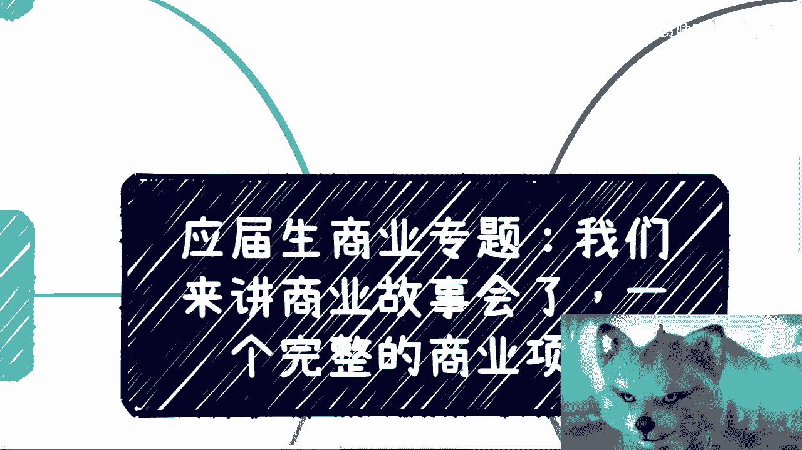
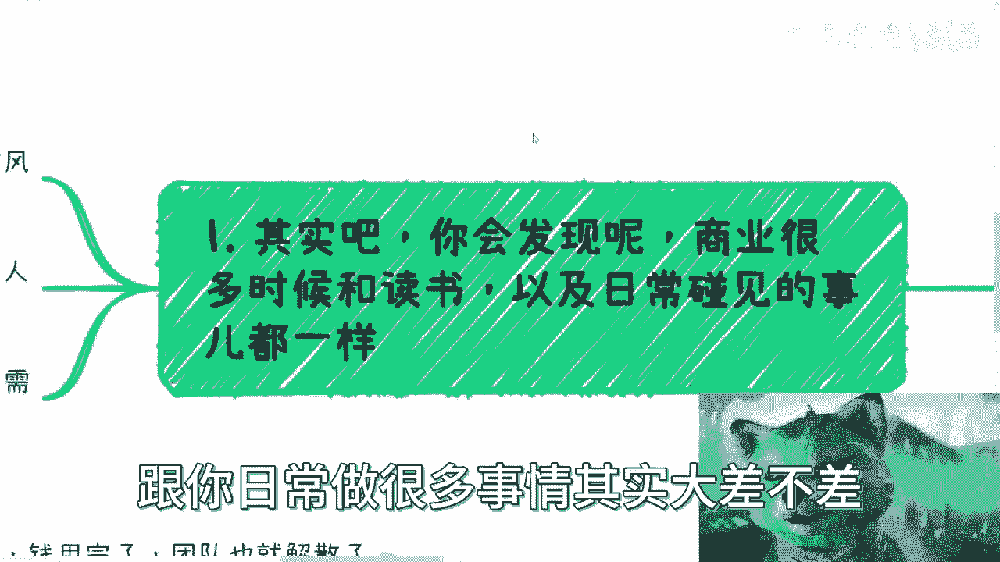

# 应届生商业专题-今天来讲个完整的商业故事---P1---赏味不足---BV1k94y167kx_no


在本节课中，我们将通过剖析一个真实的创业项目案例，来理解商业运作中的常见陷阱与核心逻辑。这个故事将揭示，许多商业失败的原因与个人在学业、求职中犯的错误本质上是相通的。

## 创业想法的普遍误区 🚫

上一节我们提到了商业认知的重要性，本节中我们来看看一个常见的起点误区。许多应届生或年轻人常有一个误解：认为自己想到了一个绝妙的“商业点子”。


必须明确指出，大部分人在20到30岁之前，对真实世界的商业规则、行业运作和盈利模式缺乏基本认知。仅凭读书获得的学历，并不等同于掌握了商业技能。认为自己突然想到一个能解决“痛点”的想法就能创业成功，这种想法过于幼稚，缺乏现实可能性。







核心问题在于：**在没有任何技能、行业了解和资源的情况下，幻想做出一个产品，这是不现实的。** 这就像公式：
`商业成功 ≠ 一个突然的灵感想法`


## 案例项目背景 📋

接下来，我们进入今天要分析的完整商业项目。这个故事颇具启发性，也反映了许多团队的共性。


首先，商业活动的底层逻辑与你读书、处理日常事务的思维模式有很大相似之处。理解这一点，有助于我们拆解案例。


以下是该项目的背景信息：
*   **动机**：团队想蹭风口赚快钱。
*   **团队构成**：2-3名开发，1名运营，3名销售（含两位合伙人）。
*   **资金**：获得土老板投资100万，属于小规模启动。
*   **公司化**：为给员工缴纳五险一金，正规注册了公司。

从以上信息可以得出：这是一个配置相对齐全的正规创业项目，并且有基本的资金支持。

## 第一阶段：优柔寡断与“幻想式”障碍 🧠

项目启动后，第一个阶段暴露出的问题并非资金，而是团队的心态和决策模式。


最初，资金充裕，团队运作顺畅。但核心问题很快浮现：**想得太多，优柔寡断**。创始人虽然想赚快钱，却不断幻想出各种不存在的潜在问题，导致行动停滞。


这种行为模式非常普遍。例如，很多人在选择职业道路时，不断纠结“如果……怎么办”，这种基于无知和道听途说的“感觉”毫无用处。在项目中，产品开发完成后，本应进入市场运营，却因害怕风险、担心投诉等幻想出来的困难而迟迟不落地。

这导致的直接结果是：
1.  产品无法接受市场检验，无法验证能否盈利。
2.  前期投入的几个月工资等同于白费。

关键在于：**不对市场、商业规则和盈利方式有基本了解，任何行动都如同盲人摸象。** 与此同时，市场上同类项目快速推出，即便产品更粗糙，却因行动迅速而获得了收益。这就像求职，犹豫不决只会错过机会，而主动了解、快速试错才能带来成长。即便失败，`验证失败也是一种成长`，远胜于空想不动。

## 第二阶段：眼高手低与策略失误 💸

当项目进入第二阶段，资金开始紧张，团队面临生存压力时，新的问题出现了。


此时，账上资金消耗过半，团队急需收入。合理的策略应该是“多条腿走路”：
*   执行一些短平快、能快速带来现金的小项目。
*   同时规划可能带来更大收益的长期项目。

这样能有效分散风险。用代码逻辑表示，理想策略是：
```python
if 急需现金流:
    执行(短平快小项目)
elif 有长期机会:
    规划(长期大项目)
else:
    # 不应只执着于单一类型项目
    pass
```

然而，现实中的问题是：**创始人眼高手低，看不上小钱，只执着于追逐“大项目”**。但“大项目”缺乏明确的买单方（客户），一切只是空谈。对外洽谈项目时，又因不熟悉市场而羞于报价，无法成功落地。


这种“眼高手低”在个人发展中也比比皆是。例如，只盯着一条看似光鲜的路径（如单纯打工），而不愿尝试其他可能创造收入的途径，会将个人风险拉满。最终，项目因资金耗尽、团队解散而告终。


## 项目教训与核心总结 📝

回顾整个项目，无论是团队成员还是创始人，最终得到了什么？


表面上，有一段“创业”经历可以吹嘘。但本质上，**他们对行业、盈利模式、商业规则依然一无所知**。同时，这次不靠谱的合作经历会损害个人信誉，让潜在的合作伙伴远离。商业世界讲究“物以类聚”，做事正规、懂得止损、具备策略思维，比单纯“有个想法”重要得多。


这个案例揭示了几个核心教训：
1.  **恐惧源于想象**：大部分阻碍行动的情绪（恐惧、犹豫）都是自我构建的，而非真实存在的困难。
2.  **认知决定边界**：在不了解行业底层规则和运作规律前，所谓的“解决痛点”的想法价值有限。成功项目背后是资本、流量、媒体矩阵等综合运作，而非一个简单的点子。
3.  **行动优于空想**：历史经验不可简单套用，市场环境已变。与其幻想，不如主动了解、快速试错。`成长 = 主动了解 + 快速试错`


**本节课中我们一起学习了**：通过一个完整创业故事的拆解，我们看到了从“空想点子”到“团队解散”的全过程。关键不在于是否创业，而在于是否具备**基础的商业认知、果断的执行力、务实的态度以及“多条腿走路”的风险意识**。避免自我幻想和眼高手低，脚踏实地地去了解真实世界的运行规则，是任何领域取得进展的第一步。